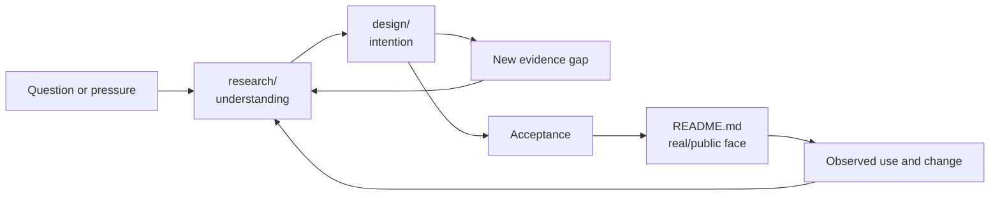

<a id="doc-constitution-hierarchy"></a>
# Topic-First Documentation Hierarchy

This is a provisional hierarchy revision to the
[Self-Explaining Documentation Constitution](/constitution/README.md). It does
not yet modify the canonical constitution or authorize moving existing files.

The revision responds to a recurring tension:

- `doc/` is intended to be a reasonably public, trustworthy surface;
- research and design generate many useful but noisy model drafts, competing
  alternatives, partial syntheses, experiments, and superseded positions;
- a top-level `design/` separates the noise but separates it from the topic that
  gives it meaning;
- promoting by moving files upward loses the stable identity and history of the
  working artifact.

The proposed answer is **topic first, posture second**.

```text
doc/<topic>/
  README.md                 public and canonical topic face
  SKILL.md -> README.md     optional exact on-demand exposure
  GLOBAL.md                 optional ambient projection
  <stable support docs>     public reference, guides, contracts, examples
  research/                 noisy work aimed at understanding
  design/                   noisy work aimed at intended change
  log.md / index.md         when history or artifact count earns them
```

The topic root is the **real space**: what a human or agent should trust and
navigate first. `research/` and `design/` are **working spaces** inside that
topic. Their contents remain durable and citable, but their location and status
say they are inputs to understanding or intention rather than the maintained
public account.

<a id="doc-constitution-hierarchy-principles"></a>
## Governing Principles

1. **Topic identity outranks document posture.** Constitution research belongs
   with constitution; skillification design belongs with skillification.
2. **The root is a promise.** `doc/<topic>/README.md` is the supported public
   entrypoint even when it selects an immutable model artifact.
3. **Noise is contained, not erased.** Research/design artifacts remain exact
   evidence beneath the topic.
4. **Promotion changes reach, not history.** A symlink or maintained README
   exposes accepted meaning without rewriting the source wave.
5. **Research and design are different claims.** What appears true and what we
   intend to make true remain distinguishable even when they inform each other.
6. **Process stays proportional.** Small topics may need only README; large
   programs may grow both workspaces, indexes, waves, and validators.

<a id="doc-constitution-hierarchy-research"></a>
# Research And Design Postures

<a id="doc-constitution-hierarchy-research-space"></a>
## `research/`: Understanding What Is

Research work builds understanding. Typical contents include:

- situation and system-state inventories;
- source-grounded observations;
- derived consequences and measurements;
- comparisons and surveys;
- hypotheses and experiments;
- terminology and anti-conflation work;
- independent investigations and research syntheses;
- unresolved questions whose answer changes later design.

Research may recommend an experiment or identify a promising direction, but it
must not present intended architecture as observed reality. Claim maturity and
source identity matter more than a fixed document template.

`research` is the preferred successor to the historical term of art
`discovery`. This revision does not claim that other near-synonyms were active
workspace conventions.

<a id="doc-constitution-hierarchy-design-space"></a>
## `design/`: Intending What Should Be

Design work describes desired change. Typical contents include:

- proposals and alternatives;
- plans and sequencing;
- target architecture and interfaces;
- constraints, invariants, and stop boundaries;
- migration and compatibility policy;
- decisions and rejected directions;
- prototypes intended to answer a design question;
- independent design drafts, adversarial reviews, and syntheses.

Design must distinguish inherited evidence from proposed behavior. A design can
and often should cite research rather than embedding a second copy of it.

<a id="doc-constitution-hierarchy-crossflow"></a>
## Cross-Flow Is Expected

The spaces are not a one-way phase pipeline:



A design effort may reveal a research question. A stable README may trigger new
research when reality changes. A small topic may begin directly with a
maintained README. The directories state posture; they do not mandate phases.

<a id="doc-constitution-hierarchy-naming"></a>
# Naming Within A Topic

The posture directory normally carries the classification, so filenames can
continue to express wave role and model identity:

```text
doc/skillify/
  research/
    activation0.sol56x.md
    activation0.glm53m.md
    activation0-syn.sol56x.md
  design/
    draft0.sol56x.md
    draft0.glm53m.md
    draft0-syn.sol56x.md
```

When an artifact must live outside its posture directory, use an explicit
prefix:

```text
research-<topic-or-question>.<model>.md
design-<topic-or-proposal>.<model>.md
```

Prefixes are therefore semantic fallbacks, not mandatory repetition. Do not
require `research/research-foo.md` merely to restate the parent directory.

Every independently authored wave file still ends in its actual concise model
suffix. Wave roles such as `init`, `draft`, `syn`, `adversarial`, and revision
numbers remain orthogonal to research/design posture.

<a id="doc-constitution-hierarchy-promotion"></a>
# Promotion Into The Real Space

Two promotion modes are valid. A topic chooses the mode that matches how its
canonical account should evolve.

<a id="doc-constitution-hierarchy-promotion-winner"></a>
## Winner-Symlink Mode

Most model-wave topics select an exact accepted artifact:

```text
doc/<topic>/
  README.md -> design/draft1-syn.sol56x.md
  SKILL.md -> README.md
  design/
    draft0.sol56x.md
    draft0.glm53m.md
    draft0-syn.sol56x.md
    draft1-syn.sol56x.md
```

The winner remains immutable, model-attributed evidence. `README.md` supplies
the stable public route. A later accepted revision creates a new artifact and
repoints the README symlink in a deliberate commit; old exact links continue to
mean what they meant.

The winner may come from `research/` when the maintained topic is principally a
reference or explanatory synthesis. Promotion does not imply that design is
always the final posture.

<a id="doc-constitution-hierarchy-promotion-maintained"></a>
## Maintained-README Mode

Some topics are understood well enough to maintain one coherent current body:

```text
doc/<topic>/
  README.md                 real maintained file
  SKILL.md -> README.md
  research/                 exact evidence and earlier findings
  design/                   proposals for consequential future changes
```

Accepted corrections and ordinary maintenance integrate directly into README.
Research, design, tickets, logs, and version history preserve why consequential
changes occurred. This mode avoids forcing every mature guide through a winner
selection ritual.

<a id="doc-constitution-hierarchy-promotion-choice"></a>
## Choosing And Changing Modes

Use winner-symlink mode when independent authorship, competing proposals, or
exact artifact identity remains important. Use maintained-README mode when a
topic has a clear owner and benefits from continuous coherent editing.

Changing mode is deliberate:

- symlink to maintained file: synthesize the selected artifact and later
  amendments into a real README with honest sources;
- maintained file to winner symlink: preserve the old README as a cited
  historical artifact before selecting the new winner.

`SKILL.md` remains a relative symlink to README in both modes. A symlink chain
is acceptable when the host follows it; packaging/installation tooling must
validate that behavior.

<a id="doc-constitution-hierarchy-public"></a>
# Public Surface And Noise

Putting noisy work beneath `doc/<topic>/` does not make every descendant a
supported public document. The topic root defines the reader contract:

- README is the first account to trust;
- stable support docs are linked and described from README;
- research/design children carry draft/evidence status and exact authorship;
- indexes distinguish current, historical, superseded, and open material;
- no working artifact becomes canonical merely because it is committed.

Topic-first containment improves browsing because noise has an obvious owner
and an obvious boundary. It also makes an entire topic easy to filter, carry,
archive, or inspect without reconstructing relationships across top-level
storage classes.

<a id="doc-constitution-hierarchy-mapping"></a>
# Historical Mapping

Keep this table near the convention so older prompts and repositories remain
easy to interpret:

| Historical form | New preferred home | Meaning retained |
|---|---|---|
| `doc/discovery/<topic>.md` or `doc/discovery/<topic>/` | `doc/<topic>/research/` | `discovery` was the earlier term of art for source-grounded understanding work. |
| `design/<topic>/` | `doc/<topic>/design/` | Committed working space for proposals, plans, architecture, and synthesis. |
| `.design/<topic>/` | Grandfather in existing projects; new local work uses topic-first hierarchy when adopted. | Earlier hidden design-root convention; no mass migration implied. |
| `doc/plan/<topic>.md` | `doc/<topic>/design/` | Plans and intended sequencing are design artifacts. |
| Stable `doc/<topic>.md` | `doc/<topic>/README.md` or a stable support doc | Maintained public knowledge moves behind a topic landing page. |
| Model-suffixed waves under any older root | Same exact artifact under `research/` or `design/` when deliberately migrated | Model identity, anchors, and historical interpretation remain unchanged. |
| `.test-agent/<topic>/` | Unchanged | Disposable pre-history remains outside the committed hierarchy. |

This mapping is for navigation and prospective naming. It does not authorize
bulk movement, link rewriting, or automatic cleanup.

<a id="doc-constitution-hierarchy-examples"></a>
# Worked Topic Shapes

<a id="doc-constitution-hierarchy-example-constitution"></a>
## Constitution

```text
doc/constitution/
  README.md
  SKILL.md -> README.md
  GLOBAL.md
  agents-assembly.md
  research/
    lineage0.sol56x.md
    lineage0.glm53m.md
  design/
    hierarchy0.sol56x.md
    adoption0.sol56x.md
    adoption0.glm53fm.md
    adoption0-syn.sol56x.md
```

The constitution may use maintained-README mode while exact lineage and policy
proposals remain underneath it.

<a id="doc-constitution-hierarchy-example-skillify"></a>
## Skillify

```text
doc/skillify/
  README.md -> design/README1.sol56x.md
  SKILL.md -> README.md
  research/
    activation-economics0.<model>.md
  design/
    skillify0.glm53m.md
    README.sol56x.md
    README1.sol56x.md
```

Winner-symlink mode makes the selected design public without erasing the peer
and prior revision.

<a id="doc-constitution-hierarchy-example-rekon"></a>
## Rekon

```text
doc/rekon/
  README.md
  SKILL.md -> README.md
  design/
    agents-modularization0.sol56x.md
  research/
    current-guidance-inventory0.<model>.md
```

The public README explains how to use this repository; migration plans and
inventories remain topic-local working material.

<a id="doc-constitution-hierarchy-adoption"></a>
# Prospective Adoption

This hierarchy remains a proposal until accepted into the canonical
constitution. Even after acceptance:

- new topics SHOULD prefer the topic-first shape;
- existing roots remain valid until a topic is materially reorganized;
- `doc/discovery/` is historical, not an error requiring immediate movement;
- current `design/` material is migrated only with a topic-by-topic path and
  link review;
- upstream-bound work still follows upstream-native documentation conventions;
- no migration prunes stale or undeclared artifacts;
- winner selection and README mode are human decisions.

For a migration, inventory exact inbound links, anchors, symlinks, frontmatter
resources, ticket forward anchors, and assembler source paths before moving a
topic. Preserve compatibility stubs or symlinks where old paths have durable
consumers.

<a id="doc-constitution-hierarchy-tensions"></a>
# Tensions To Test

1. **Public root with noisy descendants.** Is README-led navigation sufficient,
   or do forges/search tools still present research/design noise as canonical?
2. **Symlink portability.** Do every forge, package, and skill loader follow the
   README -> winner and SKILL -> README chain correctly?
3. **Artifact resource identity.** Should a promoted winner's OKF `resource`
   remain its exact model path or name the README route as an alternate?
4. **Stable support placement.** Which public documents belong beside README,
   and when do they earn another domain submodule?
5. **Mixed posture.** When research is tightly coupled to one design branch,
   does cross-linking sibling spaces remain clearer than co-location?
6. **Topic granularity.** Overly broad topics recreate a noisy doc root one
   level down; overly narrow topics create landing-page sprawl.
7. **Promotion review.** Which topics require independent winner selection and
   which can trust maintained-README editing from the outset?

<a id="doc-constitution-hierarchy-amendment"></a>
# Proposed Canonical Amendment

If accepted, replace the canonical constitution's `design/` versus `doc/`
storage-class model with this rule:

> Documentation is topic-first. A maintained public topic lives at
> `doc/<topic>/`, whose README is its canonical face. Understanding-oriented
> work lives under `research/`; intention-oriented work lives under `design/`.
> Most model-wave topics promote an accepted artifact by pointing README at the
> exact winner; continuously maintained topics may use a real README. Research
> is the preferred successor to the historical `discovery` convention.

The module's README/SKILL/GLOBAL contract, durable anchor rules, evidence
discipline, ticket balance, parent AGENTS assembly, and prospective adoption
policy otherwise continue unchanged.

<a id="doc-constitution-hierarchy-cross-references"></a>
# Cross-References

- The [canonical constitution](/constitution/README.md) **is amended by** this
  proposal only after acceptance; its current design/doc tissue model remains
  authoritative meanwhile.
- The [historical discovery workflow](/prompt/.archive/workflows/discovery.md)
  **evidences** `discovery` as an actual workspace term of art and the old
  `doc/discovery/<topic>` direction that topic-first `research/` transposes.
- [`README1.sol56x.md`](/design/skillify/README1.sol56x.md) **demonstrates** a
  model-suffixed candidate that could be promoted through a topic README while
  preserving its independent peers.
- [`agents-modularization0.sol56x.md`](/design/rekon/agents-modularization0.sol56x.md)
  **motivates** a topic-local design workspace for one-time migration material
  that should not define the public rekon README.
