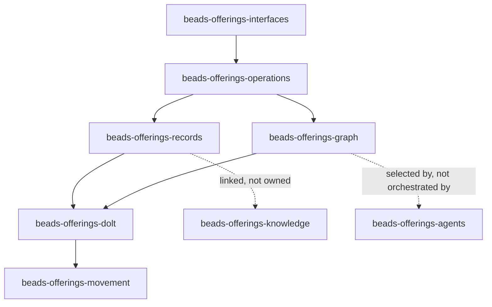

<a id="beads-offerings"></a>

# Beads System Offerings For Rekon's Naming Core

This report answers the narrow question behind
[`naming-beads-offerings`](/constitution/naming/exploration/proposal2.glm53m.md#swirl-actors):
what does Beads actually provide that Rekon's proposed named system can use,
what does the Rekon workspace use today, and where would treating Beads as the
whole system exceed its evidence or its intended scope?

The answer is not "Beads is only a ticket list," and it is not "Beads is the
new core." Beads is a local-first, versioned **work graph**. Its durable unit is
an issue with a stable ID; its principal computation is the ready frontier over
typed dependencies; its operational contribution is guarded lifecycle mutation.
That is a substantial substrate for named tickets, actionable findings, named
workflows, and links to knowledge. It does not itself provide a general
knowledge graph, a document namespace, an actor registry, or an orchestration
runtime.

<a id="beads-offerings-claims"></a>

## Claim Key

Load-bearing statements use three maturity labels:

- **Observed** means directly present in inspected source, documentation,
  command output, or the Rekon data snapshot.
- **Derived** means a consequence drawn from multiple observed facts. It is
  intended as analysis, not an upstream promise.
- **Hypothesis** means a candidate use in Rekon that still needs a design
  decision or experiment.

"Archive-current" below means commit
[`9d6984801`](https://github.com/gastownhall/beads/commit/9d6984801f54e904396b5a2d5e7de86a307302c3),
not an assertion that every feature is in a published release. "Installed"
means the binary in this workspace, which reports `bd version 1.0.3 (dev)` at
commit
[`772a65688`](https://github.com/gastownhall/beads/commit/772a656888d35aedab5a8c070fc042205db17a97).

<a id="beads-offerings-answer"></a>

# Result In One Page

| Beads offers                                                                    | Strength for naming                                                                                                                                   | Boundary                                                                                                          |
| ------------------------------------------------------------------------------- | ----------------------------------------------------------------------------------------------------------------------------------------------------- | ----------------------------------------------------------------------------------------------------------------- |
| Stable issue IDs, including explicit human-readable IDs                         | A ticket can carry a meaningful canonical name such as `rekon-con-naming`; IDs survive title edits                                                    | Generated hash IDs are opaque by default; there is no workspace-wide alias service                                |
| Project prefix, hierarchical child IDs, and project UUID                        | Useful local namespace and wrong-database protection                                                                                                  | Prefixes are not a globally governed namespace; the UUID is storage identity, not a semantic name                 |
| Rich issue records                                                              | Native home for title, prose, acceptance, notes, status, priority, assignment, time fields, labels, comments, references, and arbitrary JSON metadata | Text-centric; no rich-media attachment store; not every knowledge entity should become an issue                   |
| Typed dependency graph                                                          | First-class relations, hierarchy, lineage, supersession, attribution, validation, and cross-project blockers                                          | Edge vocabulary and accepted CLI values differ by version; custom semantics do not automatically affect readiness |
| Ready/blocked computation and atomic claim                                      | Turns the graph into a safe work-selection surface for agents                                                                                         | Assignment is a string, not an actor registry; selection and retry policy remain outside core Beads               |
| Close, reopen, defer, pin, gates, and workflow packaging                        | Gives named work and waits an explicit lifecycle                                                                                                      | It is not a universal entity lifecycle or general event processor                                                 |
| Keyed persistent memories                                                       | Stores compact context under recallable names across sessions                                                                                         | Separate key/value plane without issue relations, citations, or lifecycle                                         |
| Per-issue audit, Dolt history, optional mutation journal, hooks, and provenance | Several ways to inspect or consume change                                                                                                             | "Event" names several different mechanisms; retention and replication differ among them                           |
| Dolt-native local storage, branching, merge, sync, federation, and backup       | Queryable, offline, versioned graph with cell-level merge                                                                                             | No real-time global consistency; server mode is required for concurrent local writers                             |
| JSON, JSONL, HTTP, MCP, and tracker bridges                                     | Machines can consume and project the work graph                                                                                                       | Availability is version-specific; JSONL is interchange, not canonical storage or a full backup                    |

**Derived.** The closest fit is to make Beads the named system's **work and
coordination plane**, while documents and semantic anchors remain its
**knowledge plane**. These planes can share semantic stems and explicit links
without pretending that a ticket and the knowledge it commissions are always
the same entity.

**Hypothesis.** A first Rekon integration should use existing Beads primitives
before adding any new store: explicit IDs, `spec_id`, arbitrary metadata,
typed edges, `bd ready`, and rename. The experiment should test the seams where
Beads deliberately stops, especially aliases, actors, named events, and
cross-project resolution.

<a id="beads-offerings-boundary"></a>

# Product Boundary

**Observed.** The upstream charter defines Beads as "a focused issue tracker
for AI-supervised development." Core owns issues and lifecycle, dependencies
and readiness, labels, comments, status, priority, assignment, metadata, local
CLI operations, data movement and recovery, and tracker translation. It places
agent routing, assignment strategy, model selection, retries, scheduling,
workflow policy, and cross-system coordination in an orchestration layer
([Project Charter, core and orchestration scope](https://github.com/gastownhall/beads/blob/9d6984801f54e904396b5a2d5e7de86a307302c3/engdocs/PROJECT_CHARTER.md#L3-L42)).

**Observed.** The same source explicitly rejects evolving into a general
platform or arbitrary storage engine and recommends metadata or integrations
for extra per-issue data
([schema and storage boundary](https://github.com/gastownhall/beads/blob/9d6984801f54e904396b5a2d5e7de86a307302c3/engdocs/PROJECT_CHARTER.md#L41-L79)).
Its architecture guide also calls out poor fit for real-time collaboration,
large high-frequency teams, non-CLI audiences, and rich media attachments
([trade-offs and non-goals](https://github.com/gastownhall/beads/blob/9d6984801f54e904396b5a2d5e7de86a307302c3/docs/architecture/index.md#L247-L266)).

**Derived.** Beads can be infrastructure under
[`naming-rekon-core`](/constitution/naming/exploration/proposal2.glm53m.md#swirl-frames),
but describing it as the new core itself would erase the proposal's larger
census: documents, knowledge, humans, agent instances, findings, research,
computations, and citable occurrences. The boundary is a feature. It gives the
larger design a deep module rather than one universal table.

<a id="beads-offerings-versions"></a>

# Evidence And Version Boundary

Research used three distinct evidence planes. They must not be collapsed.

| Plane              | Identity                                                                                                      | What it establishes                                                    |
| ------------------ | ------------------------------------------------------------------------------------------------------------- | ---------------------------------------------------------------------- |
| Archive source     | `9d6984801f54e904396b5a2d5e7de86a307302c3`; `git describe` = `v1.2.1-97-g9d6984801`; source version = `1.2.2` | Current checked-out implementation and docs, including unreleased work |
| Installed CLI      | Reports `1.0.3 (dev)`, source commit `772a656888d35aedab5a8c070fc042205db17a97`, schema version 1             | Commands Rekon can actually invoke now                                 |
| Rekon store/export | Embedded Dolt selected by `/.beads/metadata.json`; `/.beads/issues.jsonl` inspected as export                 | Capabilities and conventions actually exercised by this project        |

**Observed.** The installed binary rejects `bd serve`, `bd events`,
`bd daemon`, `bd heartbeat`, `bd reclaim`, and `bd unclaim` as unknown
commands. Archive-current source contains `serve`, the events journal CLI,
provenance operations, and lease/reclaim machinery. Claims about those newer
surfaces are therefore archive-current, not instructions that work in Rekon
today.

**Observed.** Even an advertised command can have backend-specific limits:
the installed `bd sql` help describes SQLite or Dolt access, while executing a
read-only SQL query in Rekon's embedded mode returns "not yet supported in
embedded mode." Capability detection needs a real invocation or version gate,
not command-name detection alone.

**Derived.** Any Rekon integration that depends on HTTP serving, the mutation
journal, provenance, or lease recovery needs either an upgrade decision or a
fallback design. Core issue, dependency, lifecycle, JSON, and Dolt operations
can be designed against the installed surface now.

<a id="beads-offerings-system"></a>

# What The System Offers



The diagram uses each system role's identifier as its only node name, following
the proposal's one-name discipline. Commands change across versions; the roles
are the durable offering.

<a id="beads-offerings-identity"></a>

## Identity And Names

**Observed.** Every issue has one string primary ID. Normal creation generates
`<prefix>-<base36 hash>` from title, description, creator, timestamp, and a
collision nonce
([`GenerateHashID`](https://github.com/gastownhall/beads/blob/9d6984801f54e904396b5a2d5e7de86a307302c3/internal/idgen/hash.go#L52-L68)).
Adaptive lengths reduce collisions as a database grows. Child creation can use
hierarchical IDs such as `bd-a3f8.1`, while `bd create --id` bypasses generation
and accepts an explicit ID subject to format and prefix validation.

**Observed.** Beads supports two broad rename operations:

- `bd rename <old> <new>` changes one issue ID while preserving database
  references.
- `bd rename-prefix <prefix>-` changes the namespace prefix across the store.

The documented operation updates dependency references and textual references
across issue fields
([advanced rename reference](https://github.com/gastownhall/beads/blob/9d6984801f54e904396b5a2d5e7de86a307302c3/docs/reference/advanced.md#L8-L36)).
This is materially stronger than editing an ID column by hand.

**Observed.** Workspace identity has two separate components:

- `issue_prefix` shapes issue names and, in shared-server mode, database names.
- `project_id` is a generated UUID used to refuse connection to the wrong
  project's database
  ([configuration model](https://github.com/gastownhall/beads/blob/9d6984801f54e904396b5a2d5e7de86a307302c3/internal/configfile/configfile.go#L49-L59)).

Shared-server projects must use distinct prefixes; a UUID mismatch catches an
accidental collision
([shared-server identity](https://github.com/gastownhall/beads/blob/9d6984801f54e904396b5a2d5e7de86a307302c3/docs/architecture/dolt.md#L680-L711)).

**Derived.** A prefix is a routing and storage namespace, while `project_id` is
a safety identity. Neither is a global semantic-name registry. Beads does not
reserve names across independent stores, govern aliases, or prove that
`project-a-foo` and `project-b-foo` denote the same or different concept.

**Derived.** Explicit IDs are the direct contribution to the
[`one-name` discipline](/constitution/naming/exploration/proposal2.glm53m.md#one-name).
Labels should not silently become aliases: they are many-valued categories,
not unique resolvable identities. Partial-ID lookup is command convenience,
not a durable name.

<a id="beads-offerings-record"></a>

## The Issue Record

**Observed.** Archive-current Beads models an issue as substantially more than
a title and status. Native groups include:

| Concern                   | Representative fields                                                                                |
| ------------------------- | ---------------------------------------------------------------------------------------------------- |
| Identity and prose        | `id`, `title`, `description`, `design`, `acceptance_criteria`, `notes`, `spec_id`                    |
| Lifecycle                 | `status`, `priority`, `issue_type`, persisted derived `is_blocked`                                   |
| Responsibility            | `assignee`, `owner`, `created_by`, `closed_by_session`                                               |
| Time                      | `created_at`, `updated_at`, `started_at`, `closed_at`, `due_at`, `defer_until`, `estimated_minutes`  |
| External linkage          | `external_ref`, `source_system`, `source_repo`                                                       |
| Workflow/template         | `ephemeral`, `no_history`, `is_template`, `mol_type`, `work_type`, source formula and bonding fields |
| Event/gate specialization | event kind, actor, target, payload, await type/ID, timeout, waiters                                  |
| Extension                 | arbitrary JSON `metadata`                                                                            |

The canonical struct is grouped and serialized explicitly
([issue model](https://github.com/gastownhall/beads/blob/9d6984801f54e904396b5a2d5e7de86a307302c3/internal/types/types.go#L17-L176)).
Labels, dependencies, comments, event history, and provenance are associated
records rather than columns embedded in the core row.

**Observed.** Native statuses are `open`, `in_progress`, `blocked`, `deferred`,
`closed`, `pinned`, and `hooked`. Native public work types in the installed CLI
are `task`, `bug`, `feature`, `chore`, `epic`, `decision`, `spike`, `story`, and
`milestone`. Beads also permits configured custom statuses and types; status
categories determine whether custom states are ready, in progress, done, or
frozen
([custom status/type configuration](https://github.com/gastownhall/beads/blob/9d6984801f54e904396b5a2d5e7de86a307302c3/docs/reference/configuration.md#L276-L311)).

**Observed.** Metadata accepts arbitrary JSON and is the upstream-recommended
extension point for integration and orchestration hints
([metadata contract](https://github.com/gastownhall/beads/blob/9d6984801f54e904396b5a2d5e7de86a307302c3/docs/core-concepts/metadata.md#L1-L38)).
`spec_id` and `external_ref` offer narrower first-class links. Comments are
appendable discussion records. Labels provide multi-dimensional filtering
without schema changes.

**Derived.** This record is a credible envelope for _actionable_ named
entities. It is a poor default envelope for every paragraph, claim, actor, or
document. Turning the entire census into issue rows would conflate identity
with work state and would make issue-specific fields meaningless on knowledge
objects.

<a id="beads-offerings-memory"></a>

## Persistent Memory

**Observed.** Beads also has a separate keyed memory plane. `bd remember`
stores content under an explicit key or one derived from the content; recall,
case-insensitive list/search, replacement, and forget operations share that
namespace. The operation contract preserves explicit keys and content verbatim
([persistent memory role](https://github.com/gastownhall/beads/blob/9d6984801f54e904396b5a2d5e7de86a307302c3/memoryops/memories.go#L5-L40),
[read/list semantics](https://github.com/gastownhall/beads/blob/9d6984801f54e904396b5a2d5e7de86a307302c3/memoryops/memories.go#L51-L134)).
The installed CLI exposes `remember`, `recall`, `memories`, and `forget`.

**Observed.** Memories are intended to persist context across sessions and to
be injected by `bd prime`. Export excludes them by default because they may
contain sensitive agent context, but `--include-memories` and import support an
explicit round trip
([remember reference](https://github.com/gastownhall/beads/blob/9d6984801f54e904396b5a2d5e7de86a307302c3/docs/cli-reference/remember.md#L10-L33),
[export handling](https://github.com/gastownhall/beads/blob/9d6984801f54e904396b5a2d5e7de86a307302c3/cmd/bd/export.go#L36-L48)).
Rekon's workspace policy still forbids running `bd prime`; the capability does
not override local operating rules.

**Derived.** A memory key is another real name-bearing primitive, but memories
are a compact context cache rather than the proposed wiki. They have no issue
lifecycle, dependency endpoints, claim-level citations, or semantic anchors.
They may hold operating facts that an agent should recall, while canonical
knowledge remains in documents and links.

<a id="beads-offerings-graph"></a>

## Typed Graph And Ready Frontier

**Observed.** Dependencies are directed records with source issue,
target, type, creation identity/time, and type-specific JSON metadata. At the
archive snapshot the well-known vocabulary is:

| Role                    | Types                                                                                |
| ----------------------- | ------------------------------------------------------------------------------------ |
| Readiness-affecting     | `blocks`, `parent-child`, `conditional-blocks`, `waits-for`                          |
| Association and lineage | `related`, `discovered-from`, `replies-to`, `relates-to`, `duplicates`, `supersedes` |
| Entity/attribution      | `authored-by`, `assigned-to`, `approved-by`, `attests`, `delegated-from`             |
| Tracking/reference      | `tracks`, `until`, `caused-by`, `validates`                                          |

The model distinguishes arbitrary valid dependency strings from the
well-known types that stricter user-facing commands accept
([dependency vocabulary and predicates](https://github.com/gastownhall/beads/blob/9d6984801f54e904396b5a2d5e7de86a307302c3/internal/types/types.go#L1101-L1322)).
The installed CLI's `bd dep add --help` advertises a narrower set:
`blocks`, `tracks`, `related`, `parent-child`, `discovered-from`, `until`,
`caused-by`, `validates`, `relates-to`, and `supersedes`.

**Observed.** `bd ready` computes the claimable frontier instead of merely
filtering `status=open`. It excludes active blockers and non-ready lifecycle
states. Archive-current blocked state is derived and persisted transactionally:
direct blockers, inherited parent blockage, and unsatisfied `waits-for` gates
participate
([`BlockedStateInvariant`](https://github.com/gastownhall/beads/blob/9d6984801f54e904396b5a2d5e7de86a307302c3/issueops/blockedstate.go#L3-L42)).
The graph also has cycle detection and explanation/traversal commands.

**Derived.** This is Beads' deepest offering. A relation is not decorative:
some edges alter which named work can proceed. Other types deliberately remain
annotations. Rekon should preserve that distinction rather than expecting
every semantic relation to become a scheduling rule.

**Derived.** The vocabulary already supports useful connections among the
proposal's entities: research can be `discovered-from` a ticket; a check can
`validate` a finding; a successor can `supersede` a prior issue; an artifact can
be `authored-by` an entity. But these edge names only acquire trustworthy
semantics if endpoint kinds and direction are specified. Beads does not supply
that Rekon-level ontology.

<a id="beads-offerings-lifecycle"></a>

## Lifecycle And Coordination

**Observed.** Beads supplies explicit operations for create, update, close,
reopen, defer, claim, assign, and delete. `--claim` is a compare-and-set
operation: on the installed source line it claims only an open issue that is
unassigned or already assigned to the same actor, sets assignee and
`in_progress`, preserves the initial start time, and makes same-actor retry
idempotent
([installed claim implementation](https://github.com/gastownhall/beads/blob/772a656888d35aedab5a8c070fc042205db17a97/internal/storage/issueops/claim.go)).

**Observed.** Archive-current adds claim pools and local lease machinery, but
claims visible on another replica can be stale and lease records do not
replicate. Upstream requires reclaim to happen on the granting replica
([federated lease boundary](https://github.com/gastownhall/beads/blob/9d6984801f54e904396b5a2d5e7de86a307302c3/docs/multi-agent/federation.md#L192-L221)).
Those commands are absent from Rekon's installed binary.

**Observed.** Assignees are plain strings; Beads has no agent registry
([agent discovery boundary](https://github.com/gastownhall/beads/blob/9d6984801f54e904396b5a2d5e7de86a307302c3/docs/multi-agent/coordination.md#L102-L109)).
Atomic claims prevent two local workers from taking the same row, but they do
not decide which model should run, how a failed attempt retries, or whether an
actor name is globally authentic.

**Derived.** The proposal's phrase "`--claim` as name-taking" is suggestive but
not literal. A claim binds an existing assignee string to a work item; it does
not mint the actor's canonical name. An actor-naming layer can feed a canonical
actor ID into Beads, while Beads enforces the work claim.

<a id="beads-offerings-workflows"></a>

## Hierarchy, Reusable Work, Wisps, And Gates

**Observed.** An epic plus child issues is both hierarchy and a runnable work
graph. Beads layers reusable workflow concepts on that graph:

```text
formula (TOML/JSON source) -> proto (template epic) -> molecule (persistent work graph)
                                                \-> wisp (ephemeral local work graph)
```

Formulas declare variables, steps, dependency order, gates, and composition;
molecules are ordinary persisted epic/child issues; wisps are ephemeral issues
excluded from ordinary export/federation and removable after use
([workflow overview](https://github.com/gastownhall/beads/blob/9d6984801f54e904396b5a2d5e7de86a307302c3/docs/workflows/index.md#L5-L38),
[wisp lifecycle](https://github.com/gastownhall/beads/blob/9d6984801f54e904396b5a2d5e7de86a307302c3/docs/workflows/wisps.md#L5-L49)).

**Observed.** Gates model asynchronous waits as blocking issues. Human,
timer, GitHub Actions run, pull request, and cross-rig bead conditions can keep
a step off the ready frontier until resolution
([gate model](https://github.com/gastownhall/beads/blob/9d6984801f54e904396b5a2d5e7de86a307302c3/docs/workflows/gates.md#L5-L40)).

**Derived.** These are workflow _representations and readiness mechanisms_, not
a general orchestrator. They can name and order intended work. Something else
still launches agents, chooses resources, polls external systems where needed,
handles retry policy, and interprets results.

<a id="beads-offerings-events"></a>

## History, Events, Hooks, And Provenance

"Event" is overloaded in Beads. A naming design must decide which referent it
means rather than treating them as one facility.

| Mechanism                 | Identity and contract                                                                                                                                       | Availability here                                                                                      |
| ------------------------- | ----------------------------------------------------------------------------------------------------------------------------------------------------------- | ------------------------------------------------------------------------------------------------------ |
| Event-type issue          | A system-internal issue form carrying event category, actor, target, and JSON payload; therefore addressable with an issue ID                               | Installed `bd create` exposes `--event-*` flags, though `event` is not in its public core-type listing |
| Per-issue audit events    | Append entries such as created, updated, claimed, status changed, commented, dependency/label changes, closed, and reopened; carry actor and old/new values | Core in installed and archive-current Beads                                                            |
| Dolt history              | Versioned database commits, branches, diffs, merge, and time travel over durable tables                                                                     | Core in installed and archive-current Beads                                                            |
| Events journal            | Optional workspace-wide, sequence-ordered, resumable post-state stream written in the mutation transaction                                                  | Archive-current; installed CLI has no `events` command                                                 |
| Script hooks              | Fire-and-forget `on_create`, `on_update`, and `on_close` side effects; output discarded, no write rollback or retry                                         | Archive-current documentation                                                                          |
| Interaction audit sidecar | Optional `.beads/interactions.jsonl` for LLM/tool interactions and append-only labels                                                                       | Installed `bd audit`; separate from issue history                                                      |
| Provenance events         | Append-only typed bindings from issues to external refs such as commits, PRs, work IDs, transcripts, or branches                                            | Archive-current source; not established in installed CLI                                               |

The upstream events reference explicitly separates script hooks, per-issue
audit history, and the mutation journal
([three event systems](https://github.com/gastownhall/beads/blob/9d6984801f54e904396b5a2d5e7de86a307302c3/docs/reference/events-journal.md#L22-L42)).
The issue model explicitly calls `event` system-internal and ties it to
`set-state` audit beads
([`TypeEvent`](https://github.com/gastownhall/beads/blob/9d6984801f54e904396b5a2d5e7de86a307302c3/internal/types/types.go#L704-L759)).
Journal records use a monotonic sequence and operations such as `create`,
`update`, `close`, `delete`, `dep_add`, and `dep_remove`; comments have their
own payload form
([journal record contract](https://github.com/gastownhall/beads/blob/9d6984801f54e904396b5a2d5e7de86a307302c3/docs/reference/events-journal.md#L229-L263)).

**Observed.** The journal is off by default, starts only when enabled, does not
backfill, is clone-local, and is retention-bounded. Per-issue audit rows and
Dolt commits have different storage and replication behavior. JSONL interaction
audit is yet another sidecar.

**Derived.** None of these mechanisms alone implements
[`naming-events`](/constitution/naming/exploration/proposal2.glm53m.md#swirl-census).
Audit rows and journal entries identify mutations, usually with UUIDs or
sequences, but do not give important domain occurrences semantic names. The
internal event-issue form proves that an occurrence can be issue-addressed, but
does not establish it as Rekon's public event model. Rekon needs an explicit
criterion for which occurrences earn first-class names and which remain audit
facts.

<a id="beads-offerings-storage"></a>

## Storage, Version Control, And Movement

**Observed.** Current Beads has one canonical storage engine: Dolt. Embedded
mode keeps a per-project local database; server mode supports concurrent
processes; shared-server mode hosts isolated project databases in one server.
Dolt supplies SQL querying, transactions, commit history, branching, cell-level
merge, remotes, and recovery. Beads can auto-commit each successful mutation or
batch commits by policy
([Dolt architecture](https://github.com/gastownhall/beads/blob/9d6984801f54e904396b5a2d5e7de86a307302c3/docs/architecture/dolt.md)).

**Observed.** `bd export` emits newline-delimited issue records with labels,
dependencies, and comments. Optional modes include memories and infrastructure
records. The command itself states that this is migration/interchange, not a
full backup: it omits Dolt branches, commit history, working-set state, and
non-issue tables
([export contract](https://github.com/gastownhall/beads/blob/9d6984801f54e904396b5a2d5e7de86a307302c3/cmd/bd/export.go#L22-L48)).
`bd import` upserts those records. Native backup preserves tables, branches,
history, and working sets
([backup contract](https://github.com/gastownhall/beads/blob/9d6984801f54e904396b5a2d5e7de86a307302c3/docs/cli-reference/backup.md#L10-L26)).

**Observed.** Multi-repository support has several different forms:

- shared-server databases isolate projects on one machine;
- repository hydration imports exported issues from additional repositories,
  preserving source prefix and `source_repo`;
- cross-project dependencies can target
  `external:<project>:<capability>`, resolved through configured projects and
  `export:`/`provides:` labels;
- Dolt remotes and federation exchange database state with explicit conflict
  handling;
- a special global shared-server database exists for project-agnostic issues.

Hydration is snapshot import, not shared identity resolution
([multi-repo routing](https://github.com/gastownhall/beads/blob/9d6984801f54e904396b5a2d5e7de86a307302c3/docs/multi-agent/routing.md#L175-L221)).
Federation is explicit synchronization, not a live bus
([federation synchronization](https://github.com/gastownhall/beads/blob/9d6984801f54e904396b5a2d5e7de86a307302c3/docs/multi-agent/federation.md#L121-L160)).

**Derived.** Beads makes separate project graphs composable, but not globally
canonical. Prefix collisions, stale replicas, imported copies, and external
capability names all require governance above the storage layer. This is useful
evidence for
[`naming-project-namespace`](/constitution/naming/exploration/proposal2.glm53m.md#swirl-grammar),
not a completed implementation of it.

<a id="beads-offerings-interfaces"></a>

## Machine And Human Interfaces

**Observed.** The durable interface families are:

- direct CLI commands with machine-oriented `--json` on most reads and writes;
- an opt-in JSON envelope (`schema_version` plus `data`) planned as a future
  default
  ([JSON schema migration](https://github.com/gastownhall/beads/blob/9d6984801f54e904396b5a2d5e7de86a307302c3/docs/reference/json-schema.md#L11-L64));
- JSONL export/import for interchange;
- a separate MCP server exposing issue and graph operations, while leaving sync
  on the CLI
  ([MCP tool boundary](https://github.com/gastownhall/beads/blob/9d6984801f54e904396b5a2d5e7de86a307302c3/docs/integrations/mcp-server.md#L111-L133));
- archive-current `bd serve`, a loopback HTTP API with optional bearer-token
  authentication and real database readiness probes
  ([HTTP server contract](https://github.com/gastownhall/beads/blob/9d6984801f54e904396b5a2d5e7de86a307302c3/cmd/bd/serve.go#L57-L105));
- polled bridges for external trackers and setup recipes for coding-agent tools.

**Derived.** Rekon should integrate through guarded commands or a versioned API,
not direct table writes. Direct SQL bypasses domain invariants, and the archive
source's public operation roles make transactional behavior part of the
contract. JSON output also needs schema-version awareness rather than assuming
one eternal response shape.

<a id="beads-offerings-local"></a>

# What Rekon Uses Today

The local inspection was read-only. No command in this research mutated
`/.beads/`.

**Observed.** At inspection time the JSONL export contained 22 issues and 19
dependency records:

- 13 issues were closed, 8 open, and 1 in progress;
- 7 were returned as ready and 1 as dependency-blocked;
- the graph used only `parent-child` and `blocks` edges;
- 13 issues had labels, 17 acceptance criteria, 11 notes, and none exported a
  comment;
- issue types in use were task, feature, epic, and decision;
- recent IDs are descriptive (`rekon-doc-constitution-hierarchy`,
  `rekon-agents-maintenance-skillify`) while older IDs include generated forms
  (`rekon-13x`, `rekon-4kh`, `rekon-ag7`).

**Derived.** Rekon already demonstrates the strongest naming proposition:
explicit issue IDs act as a readable topic and work index, while dependencies
carry execution order. It does not yet demonstrate the broader edge vocabulary,
comments, arbitrary metadata, cross-repository links, event entities, or
workflow templates. Those are available capabilities, not current practice.

**Observed.** `bd context --json` selected embedded Dolt database `rekon` with
project ID `c1bf363a-6b76-460e-b197-95ff9cd5d675`. The configured repository
hydration list had only the primary repository. Federation listed `origin`, but
that alone does not establish a synchronized multi-project namespace.

<a id="beads-offerings-artifacts"></a>

## Local Historical Artifacts

The workspace contains files from more than one Beads storage era. Their mere
presence must not be read as concurrent authorities.

**Observed.** `/.beads/metadata.json` selects embedded Dolt. The file
`/.beads/beads.db` is readable as SQLite, reports historical version `0.49.6`,
contains 52 issue rows and 282 event rows, and has a latest issue update in
February 2026. Current source describes SQLite as removed and treats
`beads.db` under an active Dolt workspace as a classic artifact, but deliberately
does not auto-delete the main database file because it needs manual review
([artifact detection](https://github.com/gastownhall/beads/blob/9d6984801f54e904396b5a2d5e7de86a307302c3/cmd/bd/doctor/artifacts.go#L254-L290),
[cleanup safeguard](https://github.com/gastownhall/beads/blob/9d6984801f54e904396b5a2d5e7de86a307302c3/cmd/bd/doctor/fix/artifacts.go#L185-L229)).

**Observed.** `beads.left.jsonl` and `beads.left.meta.json` match the old
three-way JSONL merge snapshot convention. The metadata says version `0.49.2`,
timestamp `2026-02-08T18:20:44.266775512-05:00`, and Git commit `50e8c61`.
In v0.49.2 the snapshot manager named `beads.left.jsonl` as the local side of a
base/left/right merge and paired it with version/timestamp/commit metadata
([historical snapshot manager](https://github.com/gastownhall/beads/blob/v0.49.2/cmd/bd/snapshot_manager.go)).

**Derived.** Dolt and `issues.jsonl` are not two writable databases. Dolt is
canonical; current JSONL is interchange; `beads.db` and the left snapshot are
historical evidence or recovery inputs pending human review. Nothing in this
report establishes that deleting them is safe, and cleanup is outside this
research.

<a id="beads-offerings-mapping"></a>

# Mapping Back To The Naming Proposal

This section connects the evidence to the proposal's own identifiers rather
than minting parallel names for its concepts.

<a id="beads-offerings-mapping-beads"></a>

## `naming-beads-offerings`

**Observed.** The proposal names stable human-readable IDs, epics, labels,
dependency edges, atomic claim, reference-preserving rename, and Dolt queries.
All are real, and the actual offering is wider: rich records, readiness,
comments, metadata, gates, reusable workflows, audit/history, multi-repo
movement, backup, JSON/API surfaces, and tracker bridges.

**Derived.** The load-bearing abstraction is not "tickets stored in Dolt." It
is "guarded operations over a versioned work graph." That phrasing preserves
the behavior Rekon would depend on: identity, graph invariants, readiness, and
auditable lifecycle.

<a id="beads-offerings-mapping-tickets"></a>

## `naming-tickets`

**Observed.** Tickets are Beads' native entity. They already have canonical
IDs, lifecycle, hierarchy, acceptance, ownership, and relations. Rekon's live
corpus shows descriptive IDs functioning as a navigable topic index, exactly as
[`naming-tickets`](/constitution/naming/exploration/proposal2.glm53m.md#swirl-census)
anticipates.

**Hypothesis.** New durable work should continue receiving explicit semantic
IDs. A ticket about a knowledge artifact should link the artifact through
`spec_id` or metadata and use a relation when needed. It should share the
artifact's semantic name only when both are intentionally one entity expressed
in two media. "Write document X" and "document X" are often different entities
and should not be forced into one ID merely to appear consistent.

<a id="beads-offerings-mapping-events"></a>

## `naming-events`

**Observed.** Beads records changes well and contains a system-internal event
issue form, but audit events, journal records, provenance bindings, and
event-type issues have different identities and lifetimes.

**Hypothesis.** Reserve first-class named event entities for occurrences that
need future reference, relationships, responsibility, or resolution. Whether
those entities are ordinary/custom beads or a separate knowledge kind remains
open; the system-internal `event` type should not be adopted as public API by
accident. Leave ordinary mutations in audit/journal history. The criterion
should be semantic durability, not whether a row can technically be created.

<a id="beads-offerings-mapping-findings"></a>

## `naming-findings`

**Observed.** Beads has no public native `finding` type in the installed type
list. It can express one with a custom type, a label, metadata, or an ordinary
issue. `discovered-from`, `caused-by`, `validates`, `attests`, and `supersedes`
can connect findings to their evidence or consequences, subject to version
support.

**Hypothesis.** An actionable finding that needs ownership, acceptance, or
closure is naturally a bead. A durable research conclusion that needs prose,
citation, and precise sub-document reference is naturally a semantic anchor in
a document. If both exist, link them; do not duplicate the conclusion into a
ticket merely to make it queryable.

<a id="beads-offerings-mapping-namespace"></a>

## `naming-project-namespace`

**Observed.** Prefixes, project UUIDs, explicit IDs, cross-prefix routing,
hydration, external capability refs, a global database, and federation provide
several pieces of project-aware addressing.

**Derived.** These pieces do not yet answer the proposal's global namespace
questions. There is no authoritative registry for project names, aliases,
actor names, or concept names; no cross-medium resolver; and no atomic rename
across Beads plus Markdown plus external repositories. `bd rename` only
controls the data Beads owns.

The [documentation constitution's shared namespace](/constitution/README.md#doc-constitution-namespace)
normatively calls the project prefix "registered." Beads supplies and validates
the local prefix, but the inspected surfaces do not supply that wider registry.
This is an implementation gap in the shared namespace, not evidence against its
grammar.

**Hypothesis.** Treat a Beads prefix as one resolver input, not the global name
authority. Rekon's name grammar can qualify an explicit Beads ID with project
context, while `project_id` guards storage connections behind the resolver.

<a id="beads-offerings-mapping-core"></a>

## `naming-rekon-core`

**Derived.** Beads fits a layered new core:

| Plane         | Owns                                                                        | Beads role                                                                               |
| ------------- | --------------------------------------------------------------------------- | ---------------------------------------------------------------------------------------- |
| Names         | canonical semantic names, qualification, aliases, resolution, rename policy | Supplies issue IDs and project identity; consumes the wider grammar                      |
| Knowledge     | documents, anchors, claims, findings, research, citations                   | Linked from issues; not stored wholesale as tickets                                      |
| Work          | intent, acceptance, status, priority, dependencies, readiness, assignment   | Beads is the primary implementation candidate                                            |
| Actors        | humans, agents, sessions, attestations, authority                           | Canonical actor names come from elsewhere; Beads stores assignee/actor strings and edges |
| Occurrences   | named domain events plus exhaustive mutation history                        | Beads supplies audit/history/journal; selected domain events may become issues           |
| Orchestration | dispatch, model choice, retries, scheduling, resource policy                | Reads and mutates Beads but remains outside it                                           |

This division agrees with the documentation constitution's existing rule that
"tickets coordinate; documents explain"
([balanced ticket coordination](/constitution/README.md#doc-constitution-tickets)).
It also lets Beads remain within its own charter while contributing a deep,
queryable center to the larger wiki-ish system.

<a id="beads-offerings-fit"></a>

# Fit, Gaps, And Risks

| Question                                          | Evidence-led answer                                                                                                 | Claim            |
| ------------------------------------------------- | ------------------------------------------------------------------------------------------------------------------- | ---------------- |
| Can a bead have a durable human-readable name?    | Yes, through explicit `--id`, with prefix validation and rename support                                             | Observed         |
| Can Beads resolve every named entity in Rekon?    | No; it resolves its issues and configured cross-repo forms, not document anchors or actors                          | Observed/Derived |
| Can relations be first class?                     | Yes for issue endpoints; many built-in edge types, metadata, traversal, and readiness semantics exist               | Observed         |
| Can custom edges define new scheduling semantics? | Not by name alone; readiness recognizes specific types and gate rules                                               | Observed         |
| Can Beads be the actor registry?                  | No native registry; assignees are strings                                                                           | Observed         |
| Can it preserve all event history?                | It provides several histories, but journals can be off, local, pruned, or version-dependent                         | Observed         |
| Can JSONL be the shared source of truth?          | No in current Beads; it is export/import interchange                                                                | Observed         |
| Does rename solve cross-medium ripple?            | Only inside Beads-owned references; Markdown and remote systems need a separate transaction or compatibility policy | Derived          |
| Does federation produce a global namespace?       | It moves/merges state; it does not govern semantic names or eliminate staleness                                     | Derived          |
| Should every finding/document/event be a bead?    | The data model permits much of this, but the issue lifecycle and charter argue against universalization             | Derived          |

Principal risks are version drift, overloaded event terminology, mistaking
labels for aliases, mistaking project prefixes for global identity, bypassing
guarded operations with SQL, and turning a focused work graph into the very
general platform upstream has chosen not to become.

<a id="beads-offerings-experiments"></a>

# Small Experiments That Would Resolve The Design

These are hypotheses to test, not a rollout plan.

1. **Cross-modal name round trip.** Create a scratch bead with an explicit
   semantic ID, link a scratch Markdown anchor through `spec_id` or metadata,
   query each direction, rename the bead, and record exactly what did and did
   not follow. Use a disposable `.test-agent/` workspace, not Rekon's live
   store.
2. **Relation contract.** Model one research finding, its source ticket, a
   validator, and a successor using only installed edge types. Determine which
   semantics need metadata or a future Beads version.
3. **Named-event threshold.** Compare one domain occurrence represented as a
   scratch explicit-ID bead with the same mutation represented only in audit
   history. Decide what future query justifies the first-class name and whether
   a custom issue type or separate knowledge kind owns it.
4. **Project qualification.** Create two disposable stores with the same local
   semantic stem and different prefixes/project UUIDs. Test hydration,
   cross-project capability refs, and the proposed fully qualified form without
   assuming a global registry.
5. **Interface floor.** Define the minimum installed version and probe set for
   any Rekon adapter. Include an operation test, because `bd sql` demonstrates
   that help visibility is insufficient.

<a id="beads-offerings-open"></a>

# Open Decisions

- Is an explicit Beads ID the canonical name of the work entity, or one
  scheme-specific address resolved from a canonical Rekon name?
- When do a ticket and its output represent one entity across media, and when
  are they two linked entities?
- Where is the alias registry, and how does it avoid turning labels, partial
  IDs, and old IDs into uncontrolled second names?
- Which dependency types receive Rekon-wide endpoint and direction contracts?
- Does a named finding require lifecycle, or can a document anchor remain the
  only entity until work is opened from it?
- What semantic threshold promotes an audit fact into a named event?
- What must a cross-system rename update atomically, and what compatibility
  stubs remain after it?
- Is Rekon's current installed Beads version the compatibility floor, or may
  the design require archive-current HTTP, journal, provenance, and lease
  capabilities?
- Which histories are required for trust: current issue state, per-issue audit,
  Dolt history, provenance, mutation journal, or some explicit subset?

<a id="beads-offerings-conclusion"></a>

# Conclusion

**Observed.** Beads already gives Rekon stable explicit ticket IDs, structured
records, hierarchy, typed relations, dependency-aware readiness, atomic claims,
lifecycle, audit, Dolt versioning, interchange, and several forms of
cross-repository composition. Rekon currently uses the core of that offering
and already favors descriptive IDs.

**Derived.** Beads is best understood as the work-graph module inside the
proposed named system. It is strong precisely where named intent becomes
actionable: what exists, what blocks it, who holds it, what changed, and what is
ready. Documents and anchors remain stronger where named knowledge must explain
itself. An actor layer remains necessary where names carry identity and trust.
An orchestration layer remains necessary where policy chooses and runs work.

**Hypothesis.** Rekon's path is not to replace Beads or to pour the whole wiki
into it. It is to let one semantic naming grammar cross the seam deliberately:
explicit Beads IDs for work, semantic anchors for knowledge, canonical actor
IDs supplied to assignment and audit, and typed links that state when those
entities motivate, implement, validate, supersede, or derive from one another.

<a id="beads-offerings-cross-references"></a>

# Cross-References

- [`proposal2.glm53m.md`](/constitution/naming/exploration/proposal2.glm53m.md)
  **motivates** this inventory through `naming-beads-offerings` and supplies
  the existing identifiers used in the mapping rather than duplicated here.
- [The one-name discipline](/constitution/naming/exploration/proposal2.glm53m.md#one-name)
  **constrains** the distinction among canonical issue IDs, labels, aliases,
  partial IDs, and scheme-qualified references.
- [The proposal's census](/constitution/naming/exploration/proposal2.glm53m.md#swirl-census)
  **is tested by** the separate mappings for tickets, events, and findings.
- [`naming-project-namespace`](/constitution/naming/exploration/proposal2.glm53m.md#swirl-grammar)
  **is informed but not implemented by** Beads prefixes, project UUIDs,
  hydration, external dependencies, and federation.
- [`naming-rekon-core`](/constitution/naming/exploration/proposal2.glm53m.md#swirl-frames)
  **is narrowed by** the upstream Beads charter: the work graph belongs in the
  core, while knowledge, actors, name resolution, and orchestration remain
  distinct responsibilities.
- [The documentation constitution](/constitution/README.md#doc-constitution-tickets)
  **supports** the resulting plane boundary: tickets coordinate and documents
  explain.
- [The shared ticket and anchor namespace](/constitution/README.md#doc-constitution-namespace)
  **specifies** the common qualified form and **exposes** the registry function
  that Beads' project-local prefix does not implement by itself.
