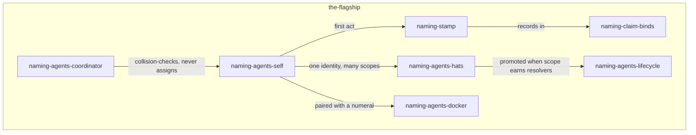

# Where This Stands

This is one of five independent drafts in the naming exploration wave
(beads ticket `rekon-con-naming`, slot FM). The brief forbids reading
sibling `draft0.*` files; independence is the evidence, so everything here
was built from the shared priming corpus — the wave proposal
[`proposal2.glm53m.md`](/constitution/naming/exploration/proposal2.glm53m.md),
the beads inventory
[`beads-offerings0.sol56x.md`](/constitution/naming/exploration/beads-offerings0.sol56x.md),
the [canonical constitution](/constitution/README.md), the
[hierarchy revision](/constitution/README-heirarchy1.glm53m.md),
[`AGENTS.md`](/AGENTS.md), the
[OKF SPEC](https://github.com/GoogleCloudPlatform/knowledge-catalog/blob/main/okf/SPEC.md),
and the beads corpus and CLI — plus my own research into Mark Burgess.

What I did with the freedom the brief grants: I kept the proposal's center
and its one-name discipline — they are the wave's common ground, and re-minting
them would violate the very discipline under test — and I spent my independent
budget on a *theory*. The claim of this draft: **naming reads cleanly, and
profitably, through Mark Burgess's promise theory.** The reading is not
decoration; it pays for itself in concrete commitments — why self-naming is
the only assignment scheme that does not violate autonomy, why the one-name
discipline is a fixed point rather than a preference, what a forward anchor
really is, and why the trust system cannot work without actor names. The
flagship (agents naming themselves) gets the top of the weighting, per the
brief; the grammar, census, actor systems, planes, and frames follow.

One meta-note up front: this document tries to *be* `naming-demonstration`
— every idea below carries one identifier, minted here or reused from the
corpus, and reused afterwards under that name only. Where a medium is
hostile (mermaid node ids, table cells), the identifier is contorted, never
replaced with a label.

# The Essence, Restated

The proposal's center — `naming-center` — is: enduring, self-describing
identity for every entity in the workspace, one name per entity, names that
imply their context, subdivide, and compose, within projects and implicitly
across projects. I accept it and add one reflexive turn.

Rekon is a workspace *about* agents that read and write. Its names are
addressed primarily to agents, and an agent cannot carry context between
sessions the way a human carries memory. What two agents can always share —
across sessions, models, projects, and years — is a string. **A name is the
cheapest durable thing two actors can hand each other without shipping the
referent.** That is why naming is the kernel of `naming-rekon-core`: the
new spiritual home is a wiki of named entities, and every other faculty the
core wants — trust, promotion, migration, supersession, coordination — is
expressed *over names*. Trust tiers attach to who verified a named thing.
Promotion integrates accepted claims into a named public presence. Migration
moves named paths with inventories of named inbound links. Supersession is
an edge between two names. Get names right and the rest has something
durable to stand on; get them wrong and every other mechanism inherits the
wrongness.

The deepest frame stays as the proposal framed it: `naming-rekon-core` is
an ambition about what rekon *is*, not a tool it ships. Naming is where
that ambition becomes buildable.

# A Name Is A Promise

Here is the theory. Burgess's promise theory begins from the failure of
deterministic control to describe distributed systems: a promise is "a
declaration of intent, within a certain scope," and — the axiom that matters
here — **no agent can make a promise on behalf of any other than itself.**
Voluntary cooperation is built only from promises agents make for
themselves.

Read naming through that lens and everything sharpens:

- `naming-name-as-promise` — **a name is a promise by its minter to its
  resolvers: this string will keep denoting this referent.** The promise has
  a scope (the project, the workspace, the medium) and a beneficiary
  (everyone who resolves). Minting a name is signing; renaming is
  re-promising; a broken reference is a broken promise.
- The one-name discipline (`naming-one-name`) is then not aesthetic
  preference — it is what makes the promise *keepable*. Two names for one
  entity are two promises about one future. They will drift apart, and when
  they do, the drift is unattributable: no one promised either form, so no
  one is accountable for the divergence.
- Every piece of existing rename machinery is a *convergence operator* — a
  repair that moves broken references back toward the promise. Beads'
  `bd rename` rewrites dependency and textual references; the hierarchy
  revision's compatibility stubs keep old paths landing on the new owner;
  glossary aliases keep abbreviated forms resolving to the one name. None
  of these create a new promise; each maintains an old one.

`naming-name-as-promise` also explains the corpus's own best evidence. The
beads export shows the shift from generated opaque IDs (`rekon-13x`,
`rekon-4kh`, `rekon-ag7`) to explicit descriptive ones
(`rekon-doc-constitution-hierarchy`, `rekon-con-naming`). What changed was
not lookup efficiency — partial-ID lookup handled the old forms. What
changed was *promise content*: a descriptive ID promises what the ticket is
about, every time it is read, to every reader, forever. That is why the
proposal is right that epic names read as the project's topic index: an
index is a book of promises.

# The Grammar Is A Contract

`naming-grammar-contract` — Burgess again: a contract is "a set of bilateral
promise proposals that is activated when agents promise to use them
collectively." The name grammar — `naming-implied-names`,
`naming-subdivision`, `naming-aliases`, `naming-model-qualified`,
`naming-cross-modal`, the role prefixes — is exactly that object. Nobody is
forced to follow it. Its force comes from mutual adoption: each actor who
follows the grammar makes every other actor's references resolvable. This
grounds, retroactively and firmly, the constitution's prospective-adoption
rule. You cannot conscript anyone into a contract — not even retroactively,
which is what grandfathering already says in practice. The grammar is not
law; it is a treaty that keeps winning signatures.

Three additions to the grammar, each earning its own name:

**`naming-resolution-scale`** — names resolve at scales, and the grammar is
a scale ladder rather than a single format. Burgess points at Nyquist: scale
limits how specific a meaning can be; you cannot read semantics off a signal
sampled at the wrong scale. So: the terminal anchor answers *where in this
document*; the local concept ID answers *what, near here*; the qualified ID
answers *where in the workspace*; the model-qualified form answers *exactly
which artifact, by whom*. Resolution failures are usually scale mismatches —
citing a bare anchor where a global question is being asked, or dragging a
fully-qualified form through prose that only needs the local tip.
Abbreviation (aliasing) is a downscaling operator; qualification is an
upscaling operator. Both are moves along one ladder, not two namespaces —
which is the strongest dissolving argument yet for the proposal's
`naming-plurality` worry.

**`naming-meaning-scarcity`** — Burgess: meaning attaches to signals that
stand out; "meaning/semantics are the inverse of information." A name earns
meaning by being the *minimal string that stands out in its context of
use*. That single criterion does a lot of work: it is why `rekon-con-naming`
reads as an index while `rekon-13x` reads as noise; why
`naming-weak-numerics` are exact and meaningless at once; why an alias must
remain an abbreviated resolution of the one name (the moment an alias
acquires independent content, it mints noise); and it gives the first
concrete answer to the proposal's proportionality tension — a name is
proportional when it is the shortest string that stands out, not shorter
(noise) and not longer (buried).

**`naming-resolver`** — what the system is missing is not more conventions
but one tool: a resolver that expands implied names from context,
abbreviates qualified ones, and looks up across media — files, anchors,
beads IDs, frontmatter actors. The beads inventory found the same gap from
the evidence side ("no cross-medium resolver"). The resolver is the
contract's enforcement mechanism; until it exists the treaty is kept by
discipline alone, which is exactly as fragile as it sounds.

The resolution operations, one table, each row one verb:

| Operation    | Moves along the ladder        | Example                                                                    |
| ------------ | ----------------------------- | -------------------------------------------------------------------------- |
| expand       | terminal anchor → qualified   | `promise` + this document ⇒ `constitution-naming-exploration-draft0-glm53fm-promise` |
| qualify      | local stem → global ID        | `naming-one-name` ⇒ `constitution-naming-one-name`                          |
| abbreviate   | qualified → alias             | `constitution-naming` ⇒ `con-naming`                                        |
| contort      | name → medium-viable spelling | mermaid node ids, YAML keys, filenames in this document                      |
| look up      | qualified ID → target         | `rekon-con-naming` ⇒ `bd show rekon-con-naming`                              |

# The Flagship: Agents Naming Themselves

The flagship idea — `naming-agents`, with `naming-agents-self` at its root —
gets the top of this draft's weight, and the promise lens turns out to be
its missing foundation.

**Attribution precedes verification.** Burgess: "any autonomous agent is a
single point of calibration, an arbiter of uncertainty from multiple
observations." Every trust mechanism this workspace runs — OKF's
`generated`/`verified` and its trust tiers (`naming-okf-actors`), beads'
`created_by`, `assignee`, audit rows — needs *who* before it can say *how
much to trust*. An unnamed actor's outputs are unverifiable in principle:
there is nothing to attach a verification event to. So naming agents is not
whimsy; it is the precondition for the trust system the workspace already
operates. Call that `naming-actor-calibration`: **a named actor is a point
of calibration; naming is what makes attribution, and therefore trust,
possible.**

**The stamp.** Today's practice half-names agents already: wave filenames
carry model suffixes (`naming-model-suffixes`) — but those name the *type*
of the actor, never the *instance*. The missing half is a per-actor,
per-session name, stamped into everything the actor produces. I mint
`naming-stamp`: **an agent's first output act is to state its name** —
`generated.by` in frontmatter, its wave-file suffix, its assignee string on
a beads claim. The stamp is the promise's signature; an unstamped artifact
is an unsigned promise. This document stamps itself: I am
`model:glm-5.3-flash-max`, slot FM of this wave.

**Why self-naming is correct, not just charming.** The coordinator-assigns
model (`naming-agents-coordinator`) has the coordinator hand names to
children at spawn. Under promise theory that is obligation, and Burgess is
explicit that it fails at scale: "control by obligation is not relativity
friendly; it quickly becomes inconsistent without global knowledge." The
coordinator cannot know what the child will find; the child does. A name is
a promise about intent, and only the promisor can sign it. So:
`naming-agents-self` — the root session names itself; children name
themselves within the grammar — is the only assignment scheme that does not
put words in another agent's mouth. The coordinator's legitimate role
shrinks to two things: collision-checking the chosen name against the
namespace it can see, and recording the result. The docker-style numeral
pair (`naming-agents-docker`) survives as the pairing of layers described
in [the census](#census): the numeral is the dynamic handle, the name is
the semantic handle, and they sit on one entity.

**Hats and lifecycle.** `naming-agents-hats` — one numerical identity
wearing several concern aliases — is promise-scoped: each hat is a promise
"within a certain scope." A hat is legitimate while its promises do not
conflict; it *earns promotion* to its own name (`naming-agents-lifecycle`)
when its scope acquires its own resolvers and citations — when other
documents start resolving the hat rather than the session behind it. The
lifecycle verbs are all promise verbs: rename is re-promise (same intent,
better string); retirement is deprecation with a compatibility stub (the
promise to old resolvers is kept even after the actor is gone); supersession
is a new promise that explicitly retires the old one — beads already carries
the edge (`supersedes`) and the inventory confirms it updates references.

The load-bearing edge is the last one: the coordinator constrains, it does
not christen.

**Where the claim fits.** `naming-claim-binds`: beads `--claim` binds an
actor *string* to a work item — compare-and-set, idempotent for the same
actor — but it does not mint the name; the inventory says this plainly. The
division of labor follows: the actor layer mints the canonical name and
stamps it; the work plane records it (`assignee`, `created_by`,
`closed_by_session`); the knowledge plane attests with it
(`generated.by`, `verified.by`). One name, three planes' worth of records,
no duplicates.

# The Census: What Earns A Name

The proposal lists the census — knowledge, agents, humans, events, findings,
research, tickets, computations — without a criterion for admission. Mint
`naming-census-proportion`: **an entity earns a name when it must be
resolved, cited, trusted, or superseded.** Everything else stays anonymous,
and that is correct: a name nobody ever resolves is noise by
`naming-meaning-scarcity`. Applying the criterion across the census:

- **Knowledge and documents** — named, already: anchors plus qualified IDs.
  They exist to be cited; the criterion is maximal.
- **Agents and humans** — named, per `naming-actor-calibration`: attribution
  precedes verification, and the trust stack already keys on actor strings.
- **Events** (`naming-events`) — named *selectively*: only occurrences that
  need future reference, relationships, responsibility, or resolution. The
  beads inventory reaches the same threshold from the evidence side and
  warns that beads' several "event" mechanisms are audit facts, not semantic
  names. Launches, acceptances, promotions, migrations: yes. Every mutation:
  no.
- **Findings** (`naming-findings`) — named when they need to be validated,
  owned, or acted on. An actionable finding that needs acceptance is
  naturally a bead; a durable research conclusion that needs prose and exact
  sub-document address is naturally a semantic anchor. If both exist, link
  them; do not duplicate the conclusion into a ticket to make it queryable.
- **Research** (`naming-research`) — named; waves already carry role,
  revision, and model, and this file is one.
- **Tickets** (`naming-tickets`) — named, maximally: the corpus proves
  descriptive explicit IDs functioning as a navigable topic index, and the
  epic tree reads as the project's table of contents.
- **Computations** — missing from the swirl's named clusters, and they
  should not be. Mint `naming-computations`: OKF's Attested Computation is
  a standalone *named* concept whose entire purpose is a checkable promise —
  the attester mechanically confirms that the computation which ran equals
  the sanctioned one bound with the declared parameters. Attestation is
  promise-keeping made mechanical, and it is only possible because the
  computation has a name to attest *about*. Executors and attesters are
  computer actors under `naming-okf-actors` and deserve stamps too.
- **Sources** — mint `naming-keyed-sources`: OKF §5.1 joins per-claim
  attribution through keyed `sources[].id` rather than positional citation,
  *because agents constantly rewrite these documents* and a positional index
  misattributes silently on reorder. That is the one-name discipline applied
  to citations: the key is a tiny name; the footnote label resolves it.

**`naming-numeral-layer`** — the census needs its counterweight. Numerals
are not failed names; they are the other layer. Burgess splits all system
description into dynamics (what changes and performs) and semantics (what is
meant and intended); jj change IDs, session handles, commit hashes, Dolt
commits, audit sequences, and beads' generated hash IDs live on the dynamic
side: exact, position-true, immune to interpretation, meaningless by
design. Keep them; never ask them to denote. The docker pairing is simply
both layers attached to one entity. When a numeral appears on a semantic
record — `closed_by_session` on a closed ticket — that is not a violation;
it is an attribution into the dynamic layer, which is exactly where session
handles live.

# The Seam Between Work And Knowledge

The beads inventory's central derived finding — beads is the work plane,
documents the knowledge plane, neither pretending to be the other — deserves
a name and a promise-theoretic reading. Mint `naming-seam`: **the work and
knowledge planes are deliberately distinct, and names are the seam's
crossing points.** The work plane records intent and its fulfillment —
readiness, claims, acceptance criteria, close reasons. The knowledge plane
records explanation and evidence — anchors, claims, citations. A ticket
promises work; a document promises explanation; they are two entities with
two names even when they are about the same thing, and the inventory is
right that "write document X" and "document X" must not be forced into one
ID.

What crosses the seam: `spec_id` and metadata fields, typed dependency
edges, and — the interesting one — forward anchors. Mint
`naming-forward-promise`: **a forward anchor is a promise proposal, not yet
a promise.** Burgess is precise about the difference — a promise proposal is
like a will not yet signed. A ticket reserving
`Forward anchor: /doc/example/README.md#example-recovery` has proposed a
name for a referent that does not exist; the acceptance criteria are the
signing; the day the document lands, the proposal becomes a promise kept.
This reading also explains the constitution's rule against empty placeholder
documents: writing the referent before the promise is signed fakes the
order and launders a draft into false stability.

# In Search Of Certainty

*In Search of Certainty: the science of our information infrastructure*
(Mark Burgess, 2013; second edition with a foreword by Adrian Cockcroft) is
the wave's assigned research movement, and it rewards the trip. Burgess —
physicist turned creator of CFEngine, author of promise theory and semantic
spacetime — argues that information infrastructure has outgrown human
steering: it can no longer be comprehended or controlled with certainty,
and the honest science of it is statistical, thermodynamic, and
scale-aware, not logical. Certainty, he says flatly, "is a point of view of
an observer; nothing in reality assures it" — the illusion of control
depends on choosing what to disregard.

`naming-referential-certainty` — the move this draft makes with the book is
to split the title's prize in two. **Certainty about outcomes is not
available to anyone**; Burgess spends the book dismantling the claim.
**Certainty about references is manufacturable**, and it is the only kind a
knowledge system actually needs: when this draft cites `rekon-con-naming`,
will you land where I landed? Burgess's own answer-shape — not control but
kept promises at scale — transfers directly: referential certainty is
produced by convergence machinery, small monotonic repairs (rename
rewrites, compatibility stubs, glossaries, eventually `naming-resolver`)
that keep every reference landing on its promise. A workspace with
excellent referential certainty and zero outcome certainty is a functioning
wiki; the reverse is a pile of accurate guesses nobody can find again.

`naming-fixed-point` — the book's deepest transferable idea for naming is
the fixed point. Absolute intent can be modeled as a mathematical fixed
point; fixed points "allow self-repairing equilibria, and get as close to a
dynamic definition of determinism as we can get in IT"; anchoring absolute
change to a fixed point beats relative change, which drifts. The one-name
discipline *is* a fixed point: every resolution of a name must land on its
referent, and every repair must move a broken reference back toward it —
never onward to fresh drift. And it must be *convergence*, not bare
idempotence — Burgess's own hard-won CFEngine lesson was that convergence
means the desired end state *plus* an error-correction operator that is
idempotent at that end state. A compatibility stub that merely fails to
crash is idempotent; one that lands you on the current canonical owner has
converged. Naming infrastructure should be built like configuration
infrastructure: converging operators over a desired state, not one-shot
edits.

`naming-uniqueness-redundancy` — Burgess names a tension that maps exactly
onto our planes: "the goal of unique semantics but redundant dynamics seem
to be in conflict." His resolution — emergent stability, attractors rather
than rigid control — translates: names are the unique semantic layer;
everything dynamic may duplicate freely (exports, federation replicas,
mermaid renders, frontmatter copies, mirrors, the JSONL interchange) as
long as the names survive the copying. This is why federation can move
beads state without governing names — and why the inventory's finding that
federation "does not govern semantic names" is a *feature boundary*, not a
defect: name governance is semantic work and belongs above the dynamic
layer. One name per entity is achievable precisely because one *copy* per
entity is not even attempted.

Finally, the coda that ties Burgess to this wave directly: his later
semantic-spacetime work includes a 2020 study titled — I am not making this
up — *"Establishing the Geometry of Invariant Concepts, Themes, and
Namespaces."* Its method derives invariants from multiscale analysis of
narrative, with "fragments of the input act[ing] as symbols in a hierarchy
of alphabets that define new effective languages at each scale." Read
against our grammar: the qualified name is a hierarchy of alphabets —
project, topic, entity, anchor — each scale an effective language, and
`naming-resolver` is the instrument that moves between scales. Burgess
reaches namespaces bottom-up from cognition; this wave builds one top-down
from collaboration; both arrive at the same definition — **names are the
invariants that survive resegmentation.**

One caution to carry with the admiration: Burgess's critique of
control-by-obligation is also a critique of over-built registries. The
registry this system needs is promise bookkeeping — who minted what, what
superseded what — not a gatekeeper that assigns. Keep it a ledger, not a
lord.

# Humans As Named Actors

Humans are already named actors in this workspace — `naming-human-actors`
was right — but the corpus shows the naming is *passive*: strings on
records (`owner: rektide+git@voodoowarez.com`, `created_by: rektide de la
faye`) rather than a curated actor identity, and no grammar for the acts
the human performs. Mint `naming-human-scarcity`: **the human's promise is
the scarcest resource in the system.** OKF's entire trust stack funnels
through the `human:` prefix — one human verification event outranks any
quantity of machine confirmation — and the beads close_reason on an
accepted ticket is a human promise about what happened that nothing else in
the corpus can substitute for. The system's certainty budget is set by how
often the human signs.

Three consequences worth the naming:

1. **Never fabricate the scarce act.** The hierarchy revision already says
   it: a model rereading its own draft must never write a `human:`
   verification event. Under the promise frame this is not etiquette but
   forgery — signing someone else's name to your promise.
2. **Make the human's naming acts legible as acts.** Acceptance, review,
   verification, and the torch-pass are already recorded (ticket closures,
   `verified:` entries); what would dignify them is treating the `human:`
   actor as a first-class named citizen — stable across projects, citable
   like any other qualified ID — rather than an ad-hoc string per tool.
3. **Spend it where it compounds.** A human verification event on a
   *constitution* outvalues one on a scratch note; the scarcity argument is
   also a prioritization argument for where human attention lands.

The reflexive point stands for this wave too: five agents drafted
independently, and none of it earns trust tier above unverified until
`human:rektide` signs. That is as it should be.

# The Constellation, Drawn

Every node is its identifier — minted here or reused from the corpus —
contorted only where mermaid demands it, never labeled with a duplicate.
Edge labels use the constitution's relationship vocabulary where one
applies.

```mermaid
flowchart TD
    subgraph the-promise-turn
        naming-name-as-promise -->|enforced by| naming-one-name
        naming-name-as-promise -->|manufactures| naming-referential-certainty
        naming-one-name -->|maintained as| naming-fixed-point
        naming-fixed-point -->|repaired via| naming-rename-ripple
        naming-grammar-contract -->|authorizes| naming-name-as-promise
        naming-grammar-contract -->|operates as| naming-resolution-scale
        naming-resolution-scale -->|demands standout strings| naming-meaning-scarcity
        naming-grammar-contract -->|awaits tool| naming-resolver
    end
    subgraph the-flagship
        naming-actor-calibration -->|precedes| naming-okf-actors
        naming-agents-self -->|first act| naming-stamp
        naming-stamp -->|records in| naming-claim-binds
        naming-agents-coordinator -->|constrains| naming-agents-self
        naming-agents-docker -->|exhibits| naming-numeral-layer
    end
    subgraph the-census
        naming-census-proportion -->|admits| naming-events
        naming-census-proportion -->|admits| naming-findings
        naming-census-proportion -->|admits| naming-computations
        naming-census-proportion -->|admits| naming-keyed-sources
        naming-census-proportion -->|admits| naming-tickets
    end
    subgraph the-planes
        naming-seam -->|crossed by| naming-forward-promise
        naming-beads-offerings -->|supplies work plane of| naming-seam
    end
    subgraph the-frames
        naming-burgess -->|grounds| naming-name-as-promise
        naming-burgess -->|resolves| naming-uniqueness-redundancy
        naming-human-actors -->|earns| naming-human-scarcity
        naming-human-scarcity -->|gates| naming-referential-certainty
    end
    naming-census-proportion -->|scopes| naming-center
    naming-center -->|kernels| naming-rekon-core
    naming-rekon-core -->|aims at| naming-successor
    naming-rekon-core -->|carries| naming-priming-docs
    naming-priming-docs -->|carries| naming-demonstration
```

And the nebula, deliberately unordered — things noticed on the way that did
not earn a full section, kept so the swirl survives the ordering: this file
is itself a bid for `naming-demonstration`; `bd find-duplicates` might
someday become the duplicate-*name* detector the namespace wants; mermaid
contortion has no standard (this draft drops nothing — its identifiers were
already viable); whether a *wave* itself deserves a name (it has one:
`rekon-con-naming` carries it); and the privacy question — which names
belong in a global namespace at all — was raised by the proposal and is
dodged here only honestly, not answered.

# Supersede: The Shape Of The New Home

Mint `naming-successor`: the wave's synthesis should not thread itself into
the existing documents — it should *become* one. Concretely: a naming
constitution, the module this directory is already shaped to host
(`constitution/naming/README.md`), owned by the naming epic the way the
documentation constitution is owned by `rekon-doc-constitution`. The
successor's table of contents, as this draft would write it:

1. **The promise frame** — `naming-name-as-promise`, the one-name
   discipline as fixed point (`naming-fixed-point`), referential certainty
   as the deliverable.
2. **The grammar as contract** — the proposal's grammar (implied names,
   subdivision, aliases, model qualification, cross-modal contortion) plus
   `naming-resolution-scale` and `naming-meaning-scarcity`, plus the
   resolution-operations table and the spec for `naming-resolver`.
3. **Actors** — `naming-okf-actors`, `naming-actor-calibration`,
   `naming-stamp`, the self-naming/coordinator division, hats and
   lifecycle, `naming-claim-binds`.
4. **The census** — `naming-census-proportion` and the named entity kinds,
   including `naming-computations` and `naming-keyed-sources`.
5. **Planes and seam** — the beads work plane and the document knowledge
   plane, `naming-seam`, `naming-forward-promise`, the numeral layer.
6. **Humans** — `naming-human-scarcity` and the human naming acts.
7. **Lineage** — this wave, its proposal chain, and the superseded law.

The absorption edges, stated so the predecessors can retire with honor: the
canonical constitution's namespace and referentiability sections are
absorbed (they become chapter 2's prior art); the hierarchy revision's wave
terms of art (wave, wave role, revision number, model suffix, posture
prefix) are absorbed into chapter 2; the naming conventions scattered
through `AGENTS.md` (model suffixes, one-name, never overwrite a peer, wave
isolation) are gathered into chapters 2 and 3; this draft's promise frame
becomes the successor's *why*; the beads inventory's plane split becomes
chapter 5's architecture. What the successor is *not*: a replacement for
the documentation constitution — it is the naming chapter of
`naming-rekon-core`, composed beside it. And the earning test stands: it
must be better at being the home — more resolvable, more keepable, more
honest about who promised what — not merely newer. If the synthesis cannot
beat the scattered status quo on those terms, decorating was the right
call.

# Tensions I Hold Open

Held, not solved — my own list, overlapping the proposal's where the
overlap is honest:

1. **The alias drift line.** If an alias is an abbreviated resolution, the
   line it must not cross is acquiring independent content
   (`naming-meaning-scarcity` gives the criterion; who judges remains
   open — glossary governance is my proposed answer's *shape*, undesigned).
2. **Self-naming collisions at global scale.** The grammar constrains form,
   not uniqueness; a coordinator can collision-check only what it can see.
   Cross-project uniqueness has no mechanism yet.
3. **Hat promotion.** "When the hat's scope earns its own resolvers" is a
   criterion sketch; what counts as a resolver for a concern, as opposed to
   a session, is undischarged.
4. **Numerals at the seam.** `closed_by_session` puts a dynamic-layer
   handle on a semantic record. I argue it is exactly right (attribution
   into the dynamic layer), but the case deserves an adversary.
5. **The grounding circle.** Names promise referents, but what pins a
   name to its *first* referent? Minting is recorded (frontmatter `sources`,
   beads `created_by`), yet the ostensive act — *this* string, *that* thing,
   now — leaves no record of its own. Every keepable promise rests on one
   unrecorded one.
6. **Ledger, not lord.** Burgess's caution against control-by-obligation
   applies to whatever registry the successor builds; the temptation to
   turn name bookkeeping into name assignment is the failure mode to
   design against.

# Cross-References

- [`proposal2.glm53m.md`](/constitution/naming/exploration/proposal2.glm53m.md)
  **motivates** this draft and **supplies** the reused identifiers
  (`naming-center`, `naming-one-name`, the swirl's names); this draft
  **refines** its center with the promise turn and **answers** its
  proportionality tension with `naming-census-proportion`.
- [`beads-offerings0.sol56x.md`](/constitution/naming/exploration/beads-offerings0.sol56x.md)
  **evidences** the plane split this draft names (`naming-seam`) and the
  claim/actor division (`naming-claim-binds`); its "no cross-medium
  resolver" gap **motivates** `naming-resolver`.
- The [canonical constitution](/constitution/README.md) **constrains** the
  anchors and relationship vocabulary used throughout, **supplies** the
  forward-anchor and alias rules this draft re-reads as promise machinery,
  and **is the primary absorption target** of `naming-successor`.
- [`README-heirarchy1.glm53m.md`](/constitution/README-heirarchy1.glm53m.md)
  **supplies** compatibility stubs and the wave terms of art the successor
  should absorb; its disposition-over-location move **parallels**
  names-over-numerals — both put meaning in frontmatter semantics, not
  storage dynamics.
- The [OKF v0.2 SPEC](https://github.com/GoogleCloudPlatform/knowledge-catalog/blob/main/okf/SPEC.md)
  **defines** the actor convention, trust tiers, keyed sources
  (`naming-keyed-sources`), and Attested Computation (`naming-computations`)
  that the actor and census chapters compose with.
- [`AGENTS.md`](/AGENTS.md) **coordinates** this wave's mechanics and
  **holds** the scattered naming conventions gathered by `naming-successor`.
- The beads corpus [`/.beads/issues.jsonl`](/.beads/issues.jsonl)
  **evidences** descriptive IDs working as topic index and the generated
  IDs surviving as the numeral layer; `bd --help` **supplies** the work-plane
  surface (`rename`, `supersede`, `--claim`) read throughout.
- [markburgess.org/certainty.html](https://markburgess.org/certainty.html)
  **grounds** the promise frame and the fixed-point, certainty, and
  uniqueness-versus-redundancy readings; the
  [author's page](https://en.wikipedia.org/wiki/Mark_Burgess_(computer_scientist))
  **supplies** the dynamics/semantics split and the convergence-not-idempotence
  lesson; [arXiv:2010.08125](https://arxiv.org/abs/2010.08125)
  **anticipates** namespaces as scale-laddered invariants.
