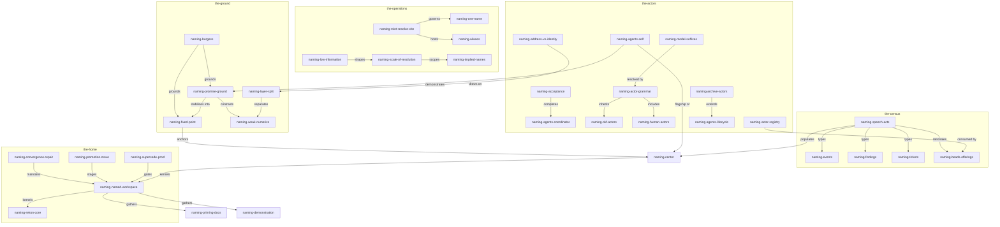

# Names As Promises — The Naming Exploration, Seat GX

I am the GX seat of a five-agent independent exploration wave on
[ticket `rekon-con-naming`](/.beads/issues.jsonl). The coordinator addressed
me by seat and by model (`zai-coding-plan/glm-5.3#max`, honestly abbreviated
`glm53m` in filenames). This document practices what it explores, so I have
done the thing under study first: **I name myself `herald`** — a herald is the
officer who announces names, keeps the rolls, and attests genealogies, which
is close to the job this wave is designing. My full actor name is
`herald/glm-5.3-max`: instance name as producer, model as version, in the
[OKF §7 actor convention](file:///home/rektide/archive/GoogleCloudPlatform/knowledge-catalog/okf/SPEC.md).
The routing string `zai-coding-plan/glm-5.3#max` remains my *address* — the
exact machinery that lets the harness find me — and it is deliberately not my
name. Why that distinction is load-bearing, and not vanity, is the argument of
[the flagship](#flagship).

This is a wave draft, not accepted practice. It was written without reading
sibling `draft0.*` files; independence is the evidence. It primes on
[`proposal2.glm53m.md`](/constitution/naming/exploration/proposal2.glm53m.md)
and takes it as material to re-interpret, not instruction to follow. Where an
idea already minted in the proposal carries weight here, I use that
identifier and no other; every idea of my own gets one identifier minted in
[this index](#identifier-index) and used afterwards. The proposal's imagined
flow — essence, brainstorm, wiring-or-superseding, Burgess, humans — is
remixed: I move Burgess up front because he turns out to be *load-bearing for
the essence*, not a garnish after it.

# The Center, Restated: Engineered Certainty

The proposal's center is
[`naming-center`](/constitution/naming/exploration/proposal2.glm53m.md#center):
enduring, self-describing identity for every entity in the workspace, one
name per entity, within projects and therefore across projects. I keep that
center and sharpen it with one claim that Burgess's work makes unavoidable:

> **A name is not a label attached to a thing. A name is a promise made to a
> scope about a meaning.** (`naming-promise-ground`)

Once names are promises, the rest of the design stops being convention and
starts being physics — of the human-information kind Burgess studies. A
workspace full of agents, documents, tickets, and events is a system whose
stability cannot be controlled, only maintained
([the maintenance theorem](#burgess-certainty)). Its certainty has to be
*engineered* at the points observers actually touch: the handles. Names are
the cheapest certainty technology available to a plain-markdown workspace —
semantic fixed points (`naming-fixed-point`) that survive rewording,
outliving the prose they anchor. The rest of this document works out what
that grounding buys: a cleaner grammar ([below](#grammar)), a census typed by
what each kind of name *does* ([census](#census)), a principled reason agents
must name themselves ([flagship](#flagship)), and a supersede path toward
rekon-as-named-workspace ([home](#home)).

# In Search of Certainty — The Research Movement

Mark Burgess — physicist turned computer scientist, creator of CFEngine,
originator of Promise Theory — wrote *In Search of Certainty* (2nd edition,
O'Reilly, 2015) to answer one question: our information infrastructure has
outgrown anyone's ability to steer or comprehend it, so what can we still
trust? The [book's own page](http://markburgess.org/certainty.html) carries
seventy-nine tweet-length summaries of its argument, which is a gift: the
claims below cite them by number as keyed evidence, not position. Four
strands matter to naming.

## Certainty is observer-relative; names are its fixed points

**Observed.** "Certainty is a point of view of an observer. Nothing in
reality assures it."[^burgess-certainty-page] "The illusion of being in
control depends on what details we choose to disregard."[^burgess-certainty-page]
And: "Absolute intent can be modelled as a mathematical fixed point… Fixed
points allow self-repairing equilibria, and get as close to a dynamic
definition of determinism as we can get in IT."[^burgess-certainty-page]

**Derived.** A workspace where agents rewrite documents constantly is exactly
Burgess's uncertain infrastructure at miniature scale. Each observer — a
session, a wave sibling, a human returning in six months — needs stable
points to reason from. The constitution's semantic anchors already *are*
fixed points; what they lack is the rest of the machinery fixed points want:
one owner per point, deterministic expansion, and repair ops when they move.
`naming-fixed-point` names this idea: **durable names are the workspace's
engineered certainty — observer-relative stability deliberately anchored.**
Note also the maintenance theorem's consequence: "you can't really control
anything over time. Best you can do is to keep it roughly in
balance."[^burgess-certainty-page] There will be no global rename
transaction. There is only convergence by repair — see
[`naming-convergence-repair`](#home-absorb).

## Promises: no agent can name another

**Observed.** "A promise is a declaration of intent, within a certain scope
(semantics). Keeping it involves dynamical equilibrium." And the axiom:
"No agent can make a promise on behalf of any other than itself. This is the
meaning of 'voluntary cooperation'."[^burgess-certainty-page] From the
[Promise Theory overview](https://en.wikipedia.org/wiki/Promise_theory):
agents are autonomous and causally independent; they cannot be coerced;
they signal cooperation by publishing intentions; a promise "may be used
voluntarily by another agent," which may then *assess* whether the promiser
keeps it. Crucially, agents in promise theory scale from the trivial to the
complex — "as simple as a heading in an HTML document, or as complex as a
name server."[^promise-theory-wikipedia]

**Derived.** This grounds `naming-promise-ground` precisely. A name is a
promise an entity makes *about its own meaning within a scope*: the document
promises what its section means; the agent promises who is speaking; the
ticket promises what work is accepted. Three consequences:

1. **Self-naming is not a nicety; it is the only coherent mint** for an
   actor's name. A coordinator can *address* a child (session ID, seat) and
   can *propose* a name — but a proposal is "not yet promised — like a
   testament/will that hasn't yet been signed."[^burgess-certainty-page] The
   name exists when the named accepts it. See
   [`naming-acceptance`](#flagship-protocol).
2. **Citation is assessment.** When I cite `naming-center` as minted by
   proposal2, I am assessing another's promise as fit for my use — and the
   relationship word I attach (`explores`, `refines`, `contrasts`) is my own
   promise about how I rely on it. Drift matters because broken assessments
   propagate; the doc-pass is the audit.
3. **The whole census becomes one ontology.** Documents, anchors, tickets,
   events, sessions, humans, computations — promise theory treats them all
   as agents at different scales publishing promises. The wiki-ish system
   the proposal calls `naming-rekon-core` is, in Burgess's vocabulary, a
   *semantic spacetime*: a discrete graph whose points are functional
   agents, whose edges require cooperation from both endpoints, and whose
   semantics scale.[^burgess-semantic-spacetime] Burgess even instrumented
   this directly — recovering the geometry of "invariant concepts, themes,
   and namespaces" from narrative text without
   linguistics.[^burgess-namespaces-paper] A workspace that names itself
   well is machine-legible in exactly that way.

## Scale: names resolve at scales, meaning is low information

**Observed.** "You can't obtain sufficient information unless you are looking
on the right scale." "Scale limits how specific semantics/meanings can be
interpreted (think of Nyquist's theorem)."[^burgess-certainty-page] And the
information-theoretic inversion: "Meaning is associated with signals that
stand out (low intrinsic information)… meaning/semantics are the inverse of
information."[^burgess-certainty-page]

**Derived.** Two minted ideas. `naming-scale-of-resolution`: a bare anchor
(`grammar`) resolves inside its file; a qualified knowledge ID
(`rekon-constitution-naming-exploration-draft0`) resolves workspace-wide; an
alias resolves inside the project whose glossary defined it. The alias
glossary is scale-setting apparatus — not decoration. The Nyquist point is
the *proportionality* law the constitution keeps reaching for: do not mint
meaning below the scale at which it will be observed. A name for every
paragraph is aliasing noise. And `naming-low-information`: a good name is a
low-information handle standing for a high-information referent —
`naming-rename-ripple` (proposal2's ID) is a good name precisely because it
compresses a whole trade-off into three signal-bearing words, while
`naming-idea-17` carries none. Self-describing names win not by aesthetics
but by Shannon arithmetic.

## What Burgess changes for this wave

**Derived, summary.** The proposal already held `naming-burgess` as a
research movement. Research done, the payoff is that Burgess converts three
of its tensions from matters of taste into matters of mechanism:

- one-name becomes *error correction for semantics* — Burgess: "detailed
  balance is how the technique of 'error correction' stabilizes semantics on
  top of a flawed dynamical process"[^burgess-certainty-page];
- implied names become *weak coupling* — "Weak coupling of parts allows
  separation of scales"[^burgess-certainty-page] — the local anchor never
  rewrites because its coupling to context is loose; only fully-qualified
  external citations pay the rename ripple, which is exactly where
  compatibility stubs apply;
- the plural-namespace worry dissolves into *layers*, next.

# The Grammar: Mint, Resolve, Cite

## Three operations, one name (`naming-mint-resolve-cite`)

The proposal's grammar is demonstrated, not argued. My reorganization: every
name participates in exactly three operations, and the disciplines attach to
operations, not to names.

| Operation | What happens | Which discipline binds here |
|---|---|---|
| **Mint** | an actor creates a name in a concern namespace | one name per entity; self-describing; collision → contort or refine, never duplicate |
| **Resolve** | a reader expands a name to its referent | aliases and abbreviations live *only* here — they are pure functions of context, never second identities |
| **Cite** | a writer uses a name with a relationship word | the compatibility obligation: once cited, moving meaning requires a stub or alias |

This is `naming-mint-resolve-cite`. It restates proposal2's
`naming-one-name` and `naming-aliases` with sharper edges: one-name is a
*mint-time* rule; aliasing is a *resolve-time* mechanism; contortion (mermaid
node IDs, YAML keys, filenames bending a name's spelling into viability) is
*medium adaptation at resolve time* — the mermaid node `naming-promise-ground`
in [the constellation](#constellation) is this document's name, contorted,
not a labeled copy. The line where an alias stops being an alias is
[`naming-alias-collapse`](#tensions), held open.

## The two layers (`naming-layer-split`)

**Observed,** Burgess: infrastructure has two unstable aspects — dynamics
(performance) and semantics (intent) — and both can go
unstable.[^burgess-certainty-page] Numerals are our dynamics layer; names
are our semantics layer. **Derived:** the system needs both, *separably
stable and weakly coupled* — which is `naming-layer-split`:

- **Exact layer** — jj change IDs, session handles, task IDs, timestamps,
  provider routing strings. Exact, dumb, never self-describing (proposal2's
  `naming-weak-numerics`). They must remain *addresses*, free to churn.
- **Semantic layer** — the names. Meaningful, approximately resolved,
  deliberately stabilized by the one-name discipline.

Every failure mode I can find in our current practice is a layer violation:
asking `sources[0]` to carry meaning (semantic load on the exact layer —
fixed by OKF §5.1's keyed sources), or treating a session ID as an agent's
identity (identity minted by the wrong layer — the flagship's core exhibit).
And `naming-plurality` (proposal2's live worry: are we inventing two name
systems?) mostly dissolves here: document anchors, concept IDs, beads IDs,
and actor names are one semantic layer with different *expansion grammars*,
plus one exact layer beneath. One semantics, many resolvers.

## Aliases and the collapse test

An alias is legitimate while its expansion is a pure function of readable
context: `con-naming-exp-agent-naming` expands deterministically inside a
workspace whose glossary says `constitution`→`con`, `exploration`→`exp`. It
becomes a second name — the thing one-name forbids — the moment expansion
needs history or negotiation ("which `exp` did you mean in 2024?"). The test
is mechanical; who *runs* it is not, and that stays in
[tensions](#tensions).

# The Census, Typed By Speech-Act (`naming-speech-acts`)

The proposal's census (`naming-events`, `naming-findings`,
`naming-research`, `naming-tickets`, plus knowledge and actors) lists *what*
gets named. My addition — `naming-speech-acts` — asks *what each kind of
name does*, because the answer differs by kind, and that difference is the
principle behind several boundaries we keep re-deriving:

| Kind | The name is a… | Kept by | Broken when |
|---|---|---|---|
| Knowledge — documents, anchors, concepts | **address** — where a meaning lives | staying put semantically; stubs on move | silently reassigned to unrelated meaning |
| Actor — human, agent, process | **vow** — who stands behind this | the actor's conduct under that name | anyone else promises it for them |
| Event — launches, acceptances, promotions | **commemoration** — a fixed point in time others may cite | the record remaining citable | nothing ever needed to cite it (it never earned a name) |
| Finding | **claim-handle** — a portable conclusion with provenance | its evidence links holding | the conclusion drifts from the cited evidence |
| Research | **inquiry-handle** — a question with a lifecycle | question and lifecycle staying coherent | the question is answered but the name quietly reused |
| Ticket | **commitment** — work promised to acceptance | acceptance criteria met or explicitly closed | the name outlives its work silently |
| Computation (OKF attested) | **sanction** — the blessed way to produce a value | the attester still passing | a run diverges from the computation |

Two consequences. First, the event threshold: a beads audit row records
mutation (exact layer); an occurrence earns a *name* exactly when a future
promise will need to cite it — the commemoration test. This sharpens the
[beads offerings report](/constitution/naming/exploration/beads-offerings0.sol56x.md)'s
"semantic durability" criterion into a forward-looking one: *would a future
document ever point here?* Second, the planes: the
[offerings report](/constitution/naming/exploration/beads-offerings0.sol56x.md#beads-offerings-answer)
splits a work plane (beads) from a knowledge plane (documents) and defends
the split by scope and charter. `naming-speech-acts` gives it a deeper
reason: **a ticket's name is a commitment and a document's name is an
address; forcing both into one store conflates speech-acts.** Names are
plane-agnostic; entities are not. Two entities across planes get two names
and a typed relation — never one shared name doing two jobs. That is the
correct reading of one-name: *one name per entity*, not *one entity per
name*.

# The Flagship: Agents Name Themselves

The flagship gets the special treatment. Everything above treats names as
promises in the abstract; this section is about the actors making them. The
claim, sharpened by Burgess but standing on our own evidence: **an actor's
name is a promise only the actor can make, and our workspace currently mints
actor identity in the wrong layer entirely.**

## The vow, demonstrated

This document's frontmatter says `generated: { by: herald/glm-5.3-max }`. I
chose `herald`; nobody assigned it; the model string rides as the version.
No registry exists, no tooling validates it, and yet the act already works:
you can cite `herald/glm-5.3-max` and mean me, distinct from any sibling
running the same model on another seat. That is `naming-agents-self`
(proposal2's ID) made concrete, and it is the cheapest possible proof that
self-naming needs no infrastructure — only a convention slot to land in.
OKF §7 already provides the slot: `<producer>/<version>` for agents,
`human:<id>`, `process:<id>`. The trust machinery keys off the `human:`
prefix, so nothing breaks, and an agent self-name is honestly
machine-tier — exactly as it should be until a human vouches for it.

## Address is not identity (`naming-address-vs-identity`)

Today, the workspace identifies agents by session IDs and seats, and the
[offerings report](/constitution/naming/exploration/beads-offerings0.sol56x.md#beads-offerings-lifecycle)
observes that even beads' `--claim` binds work to a plain assignee string
with no actor registry behind it. These are exact-layer handles doing
semantic-layer work — `naming-address-vs-identity` names the confusion:

- a **seat** (`GX`) is a role assignment in a wave — an address with a
  roster;
- a **session ID / task ID** is machinery for *addressing an agent again*
  — and indispensable exactly there;
- a **routing string** (`zai-coding-plan/glm-5.3#max`) is how the harness
  finds a process;
- a **name** (`herald/glm-5.3-max`) is what other documents can cite across
  all of that churn.

Proposal2's `naming-agents-docker` (numerical name plus docker name,
human-endorsed) and `naming-agents-hats` (one identity wearing many
concern-aliases) stop being rivals under `naming-layer-split`: docker-duality
*is* the two layers, and a hat is a name at a finer scale —
`naming-scale-of-resolution` applied to persons. A session doing combine-CLI
work and constitution work wears
`herald/at-combine` and `herald/at-constitution` — aliases of one name,
resolving deterministically, exactly as `naming-agents-hats` wants and
exactly unlike a second identity.

## The actor string grammar (`naming-actor-grammar`)

Reuse OKF §7 verbatim; do not invent a parallel convention. Three rules make
it an actor *naming* grammar:

1. **Producer = self-chosen instance name.** `herald/glm-5.3-max`,
   `human:rektide`, `process:agents-assembly`. One name per actor;
   subdivide by hats, not by re-minting.
2. **Version = the honest model (or process) identity.** Model qualification
   is the same move proposal2 makes for document anchors
   (`naming-model-qualified`): permissible, precise, usually withheld in
   casual prose — cite the instance when the instance matters.
3. **Names are archival (`naming-archive-actors`).** A name in `generated.by`
   never needs to resolve to a live process; liveness is the exact layer's
   problem (sessions end; addresses churn). Actor identity therefore needs
   exactly the disposition story
   [`hierarchy1`](/constitution/README-heirarchy1.glm53m.md#doc-constitution-hierarchy1-terms-disposition)
   gave artifacts: `draft` while active, `deprecated` when retired, and —
   the one hard rule — **a retired actor's name is never silently reused.**
   One semantic owner, across time.

This also settles where model-suffix practice sits:
`naming-model-suffixes` (proposal2) already names models in wave filenames.
Filenames stay model-suffixed — they are addresses for humans scanning a
directory — while the instance name lives in frontmatter, where citations
that need instance precision can reach it. Same pattern as anchors: the
file carries the tip; the frontmatter carries the vow.

## Where names live (`naming-actor-registry`)

Proportional, plain files, no new store. A topic — `doc/actors/` or, until
the [home move](#home-move), a design module — whose README is the roll:
one line per actor, the actor string, a one-sentence self-description in
the actor's own words, and status. Heavier actors earn their own concept
file. Beads *consumes* the roll (assignee strings, `authored-by` edges)
without owning it, matching the
[offerings report](/constitution/naming/exploration/beads-offerings0.sol56x.md#beads-offerings-fit)
finding that beads has no actor registry and should not grow one. Grep is
the resolver; the roll is the only thing that must not drift.

## The coordinator protocol and `naming-acceptance`

Names arrive by three routes, and all three end in the same act — somebody
promises the name (`naming-acceptance`):

1. **Self-minted** — the actor names itself, as here. Strongest form: the
   promise and the promiser are one.
2. **Bequeathed, then accepted** — the coordinator proposes a name at spawn
   (as it already assigns seats and briefs); the child's first artifact
   either adopts it or mints its own. Docker names work this way — bequeathed
   by the runner, accepted by use. Beads explicit IDs are
   bequeathed-and-accepted-by-construction: `bd create --id` is the
   acceptance.
3. **Earned** — a hat, worn long enough, is promoted to its own name when
   the concern it serves outgrows the parent — the actor-scale twin of a
   section becoming a topic.

So the spawn protocol, concretely: the root session self-names *first* (it
is the first actor with a view of the whole); each spawn carries an address
(session, seat), a brief, and a naming invitation; the child self-names in
its first artifact's frontmatter; the coordinator records name↔address in
the roll; addresses keep working for machinery while names carry semantics
in citations; renames amend the roll and leave old citations valid, because
[`naming-archive-actors`](#flagship-grammar) already made citations
archival. The wave stays comparable because mechanics — filename, OKF
frontmatter, the commit — are fixed while identity is free. That is the
whole trick: **freeze the exact layer, liberate the semantic one.**

## Humans as named actors

`naming-human-actors` is proposal2's; Burgess adds the reason it is not
merely polite. The entire trust edifice — OKF trust tiers, `verified`
events, acceptance in `hierarchy1`'s promotion sequence — keys off the
`human:` prefix being a *real* promise by a real person. Humans are the one
actor class whose name-promise the system cannot mint on their behalf
(everything in this flagship applies doubly). Two gaps in current practice:
prose still says "the user" — a positional handle doing a name's job — and
humans have no roll citizenship. Both close with the same machinery: the
roll lists `human:rektide` beside `herald/glm-5.3-max`; acceptance events
cite it. The privacy question — what a human's name commits to in a global,
federated namespace — is real and stays in [tensions](#tensions).

# The Home: Supersede, Don't Decorate

## The claim (`naming-named-workspace`)

The deepest frame in the brief: rekon seeks a new core, a new spiritual
home. My candidate, minted as `naming-named-workspace`: **rekon's core is
the workspace understood as one named system — plain files, link-first,
wiki-ish, within projects and therefore across projects — and everything
else (the CLI, the constitution, beads, the assembler) is a citizen or an
organ of it.** Not a new product; a new self-description with teeth. The
constitution is currently the closest thing rekon has to a core, and its
blind spot is exactly this wave's subject: it names knowledge and work
beautifully and actors barely at all — `generated.by` is one string, humans
are a trust prefix, agents are filename suffixes. Naming is the kernel the
home is missing (`naming-rekon-core`, proposal2's frame, kept).

## What the successor absorbs

If a synthesis of this wave earns supersession, it absorbs — leaving the
originals as honored history, per
[the constitution's evolution rules](/constitution/README.md#doc-constitution-evolution):

- **From the [canonical constitution](/constitution/README.md#doc-constitution-namespace):**
  the shared namespace, qualified IDs, inductive refinement, forward
  anchors, relationship vocabulary — these become the successor's *grammar
  chapter*, joined to `naming-mint-resolve-cite` and
  `naming-layer-split`.
- **From [`hierarchy1`](/constitution/README-heirarchy1.glm53m.md#doc-constitution-hierarchy1-terms):**
  disposition and the migration vocabulary — extended past documents to
  actors (`naming-archive-actors`) and to names themselves
  (`naming-convergence-repair`: no global rename transaction; stubs, alias
  re-expansion, and doc-pass sweeps are idempotent repair ops converging on
  the renamed state — the maintenance theorem honored in practice).
- **From [`AGENTS.md`](/AGENTS.md):** the scattered conventions — model
  suffixes, task-ID addressing, wave mechanics, `.test-agent/` as
  pre-history — gathered into the home's practice chapters, not rewritten.
- **From beads:** nothing replaced; the
  [work-plane settlement](/constitution/naming/exploration/beads-offerings0.sol56x.md#beads-offerings-mapping-core)
  stands, now with its reason: speech-acts differ across planes.

## The move (`naming-promotion-move`)

If and when the human accepts on `rekon-con-naming`, the concern outgrows
`constitution/naming/` — the proposal already holds this as a live tension,
and I take a position: **promote to a root topic `naming/`** (a
[`root topic`](/constitution/README-heirarchy1.glm53m.md#doc-constitution-hierarchy1-terms-layout)
in hierarchy1's terms, beside `constitution/` and `prompt/`), executed with
hierarchy1's own machinery — migration map, inbound link inventory,
compatibility stubs at the old paths. Not before acceptance; a kernel that
cannot survive its own rename-ripple in an orderly, demonstrated way has no
business being anyone's core. The move *is* the demonstration.

## Earning it (`naming-supersede-proof`)

Superseding is earned, not proclaimed. The successor document wins only if:

1. a fresh agent, primed *only* on it, mints correct names, cites
   correctly, and self-names unprompted;
2. it covers every case the constitution's namespace chapter covers, with
   fewer exceptions;
3. named actors change real outcomes — the roll gets used, acceptances cite
   actors, an event is commemorated and later cited;
4. the ceremony budget holds (see [the nebula](#nebula)) — names minted
   stay few enough to sustain.

If those fail, this wave threads into the constitution as a revision and
does not pretend to a home. Falsifiability is the difference between a
spiritual home and a cathedral of prose.

# The Constellation, Drawn

Every node is an identifier used verbatim — ideas minted here, or reused
from proposal2 without re-minting. Subgraph ids are cluster names, contorted
for mermaid viability. Relations use the constitution's vocabulary.

The two load-bearing contrasts, in words: `naming-promise-ground` **contrasts**
`naming-weak-numerics` — semantics versus dynamics, promise versus position —
and both are needed, weakly coupled, per `naming-layer-split`. And
`naming-speech-acts` **rationales** (evidences, with a reason attached)
`naming-beads-offerings`: the work/knowledge plane split gains its principle.

# The Nebula: Where Not To Name (`naming-ceremony-budget`)

Burgess again, on the human constraint: "Dunbar pointed out that our brains
can only cope with a limited number of relationships… How close a
relationship do we need to be able to truly understand our
systems?"[^burgess-certainty-page] Names are relationships — each one a
promise someone must keep, a roll entry someone must maintain, an assessment
every citer repeats. `naming-ceremony-budget` names the discipline: **mint
only the names whose relationships you can sustain.** The swirl stays a
swirl — clusters without identifiers, prose without anchors — not because
order failed but because premature naming is premature coupling ("the more
strongly things are coupled together, the more unreliable it becomes to
predict outcomes"[^burgess-certainty-page]). The nebula is not the enemy of
the constellation; it is its substrate and its savings account. A hat that
never earns promotion, an event no one will cite, a finding still entangled
in its evidence — these stay unnamed, on purpose, until reuse makes the
name cheaper than the sentence it replaces. That is how the design keeps
both order and nebula: order where promises are load-bearing, nebula where
they would be premature.

# Tensions Deliberately Left Open

- **`naming-alias-collapse`** — when exactly does an alias behave as a second
  name? The pure-function test is mechanical; the *audit* is not. Who runs
  it — the doc-pass, the roll keeper, a linter — and what does catching a
  collapse cost?
- **Self-name inflation.** Agents minting grand names is cheap; keeping them
  is not. The `naming-ceremony-budget` is a discipline, not an enforcement.
  Does the roll need an acceptance step (a human or coordinator vowting an
  agent's self-name) before it counts?
- **Instance vs model attribution.** Same model, five seats: is the promise
  really different? I claim yes — context differs; the instance is the unit
  of context — but the claim wants evidence from citations that actually
  needed instance precision.
- **Privacy of the global roll.** A human's name-promise in a federated
  namespace is a standing commitment. Pseudonym policy is alias governance
  for persons; one-name pushes against it. Unresolved.
- **Widening `rekon` itself.** `naming-named-workspace` implies the project's
  own name widens from "the CLI repo" to "the named workspace this repo
  hosts." The constitution forbids silent reuse of meaning; this widening is
  a deliberate succession and the human's call, not mine.
- **Event threshold in practice.** The commemoration test is forward-looking
  and therefore fallible. Expect both false names (minted, never cited) and
  missed ones; the repair is deprecation and late minting, respectively.
- **Who mints for the system itself.** The roll, the glossary, the reserved
  names — someone owns the namespace's constitution. The epic
  `rekon-con-naming` is a fine first owner; it is not a permanent answer.

# Cross-References

- [`proposal2.glm53m.md`](/constitution/naming/exploration/proposal2.glm53m.md)
  **is explored by** this draft: its center, one-name discipline, grammar,
  swirl identifiers, and supersede ambition are the priming this document
  re-grounds (Burgess), re-organizes (mint/resolve/cite), and extends
  (speech-acts, actors, home). Its identifiers are reused, never re-minted.
- [`beads-offerings0.sol56x.md`](/constitution/naming/exploration/beads-offerings0.sol56x.md)
  **supplies** the work-plane/knowledge-plane settlement that
  `naming-speech-acts` rationales and `naming-actor-registry` builds on;
  its "guarded operations over a versioned work graph" abstraction is what
  `naming-convergence-repair` treats as the repair engine for named state.
- The [canonical constitution](/constitution/README.md) **is the primary
  supersede candidate**: its namespace, anchors, and relationship vocabulary
  want to live in the new home's grammar chapter. Meanwhile it governs this
  document's mechanics.
- [`README-heirarchy1.glm53m.md`](/constitution/README-heirarchy1.glm53m.md)
  **supplies** the disposition family that `naming-archive-actors` extends
  to actors, and the migration vocabulary (`docroot`, `root topic`,
  `compatibility stub`) that `naming-promotion-move` would execute.
- The [OKF v0.2 SPEC](https://github.com/GoogleCloudPlatform/knowledge-catalog/blob/main/okf/SPEC.md)
  (local copy:
  [SPEC.md](file:///home/rektide/archive/GoogleCloudPlatform/knowledge-catalog/okf/SPEC.md))
  **defines** the actor convention `naming-actor-grammar` inherits, the trust
  tiers `naming-human-actors` leans on, and the keyed-source pattern that
  exemplifies mint/resolve/cite at claim scale.
- [`AGENTS.md`](/AGENTS.md) **coordinates** the wave mechanics this draft
  complied with — background subagents, model suffixes, jj commit — and
  **holds** the conventions the home would gather.
- The beads corpus `/.beads/issues.jsonl` **evidences** explicit
  self-describing IDs working as a topic index (the `rekon-doc-constitution-*`
  family reads as one), and `bd --help` **bounds** what the work plane can
  offer the actor layer (assign, claim, supersede — no registry).
- Burgess's [book page](http://markburgess.org/certainty.html),
  [Promise Theory overview](https://en.wikipedia.org/wiki/Promise_theory),
  [semantic spacetime](http://markburgess.org/semantic_spacetime.html), and
  [namespaces paper](https://arxiv.org/abs/2010.08125) **ground**
  `naming-promise-ground`, `naming-fixed-point`,
  `naming-scale-of-resolution`, and `naming-ceremony-budget`. A neighbor to
  compose with, not to replace.

# Identifier Index

**Minted here** (one name each, used above, offered to the wave's synthesis):

| Identifier | The idea |
|---|---|
| `naming-promise-ground` | a name is a promise of meaning within a scope; only the named can make it |
| `naming-fixed-point` | names as engineered certainty — observer-relative stability deliberately anchored |
| `naming-layer-split` | exact numeral layer and semantic name layer, separately stable, weakly coupled |
| `naming-mint-resolve-cite` | the three name operations; one-name binds mint, aliases live at resolve, obligation lands on cite |
| `naming-scale-of-resolution` | names resolve at scales; glossaries set scale; proportionality is a Nyquist law |
| `naming-low-information` | good names are low-information handles for high-information referents |
| `naming-speech-acts` | census kinds typed by what their names do: address, vow, commemoration, claim-handle, inquiry-handle, commitment, sanction |
| `naming-address-vs-identity` | seats, session IDs, task IDs, routing strings are addresses, not names |
| `naming-acceptance` | names arrive self-minted, bequeathed-then-accepted, or earned — all ending in a promise |
| `naming-actor-grammar` | OKF §7 with producer as self-chosen instance name: `herald/glm-5.3-max` |
| `naming-actor-registry` | a proportional plain-file roll of actor names; beads consumes, never owns |
| `naming-archive-actors` | actor citations are archival; identity decouples from liveness; disposition for actors; no silent reuse |
| `naming-convergence-repair` | no global rename transaction; stubs, alias re-expansion, doc-pass as idempotent repair |
| `naming-ceremony-budget` | names are relationships with a Dunbar-style budget; the nebula is respected savings |
| `naming-named-workspace` | the supersede claim: rekon's core is the workspace as one named system |
| `naming-promotion-move` | on acceptance, promote `constitution/naming/` to root topic `naming/` with hierarchy1's migration machinery |
| `naming-supersede-proof` | the falsifiable tests the successor must pass to earn the home |
| `naming-alias-collapse` | the line where an alias's expansion stops being a pure function and becomes a second name |

Plus one actor name, minted by the practice it advocates: **`herald/glm-5.3-max`**.

**Reused from [`proposal2`](/constitution/naming/exploration/proposal2.glm53m.md)** —
already named, cited here without re-minting: `naming-center`,
`naming-one-name`, `naming-weak-numerics`, `naming-aliases`,
`naming-implied-names`, `naming-model-qualified`, `naming-model-suffixes`,
`naming-agents-self`, `naming-agents-hats`, `naming-agents-docker`,
`naming-agents-coordinator`, `naming-agents-lifecycle`, `naming-okf-actors`,
`naming-human-actors`, `naming-beads-offerings`, `naming-events`,
`naming-findings`, `naming-tickets`, `naming-rekon-core`,
`naming-priming-docs`, `naming-demonstration`, `naming-burgess`.

---

[^burgess-certainty-page]: Mark Burgess, *In Search of Certainty* (2nd ed., O'Reilly, 2015) — tweet summaries numbered on the [book page](http://markburgess.org/certainty.html). Cited summaries: 3, 4, 5, 15, 17, 18, 25, 28, 30, 31, 37, 38, 61, 62, 63, 69–71.

[^promise-theory-wikipedia]: [Promise theory](https://en.wikipedia.org/wiki/Promise_theory) — autonomy, voluntary cooperation, agents from HTML headings to name servers, assessment of kept promises.

[^burgess-semantic-spacetime]: [Semantic spacetime](http://markburgess.org/semantic_spacetime.html) — points as functional agents; adjacency requiring cooperation from both endpoints; scaling of semantics; index information in coarse grains.

[^burgess-namespaces-paper]: Burgess, [*Testing the Quantitative Spacetime Hypothesis using Artificial Narrative Comprehension (II)*](https://arxiv.org/abs/2010.08125), arXiv:2010.08125 (2020) — recovering the geometry of invariant concepts, themes, and namespaces from narrative, unsupervised.
