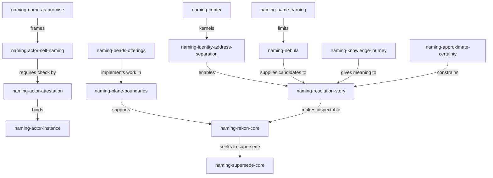

<a id="naming-exploration-draft0-gpt56lx"></a>
# Naming Exploration: Identity, Actors, And Bounded Certainty

This is an independent exploration for `rekon-con-naming`. The proposal's
center is right to make naming a candidate kernel for a new rekon core: a
wiki-like system of knowledge, agents, humans, events, findings, research,
tickets, and computations. My refinement is a hard seam:

> One entity has one durable semantic identity. That identity may have several
> current or historical addresses, and a useful resolver must return the story
> connecting them.

The distinction matters because a path, Markdown anchor, Beads ID, URL, and
session handle are not all the same kind of thing. Treating every address as
the identity makes file movement, ticket renames, and agent execution details
change what the entity is. Treating every address as disposable makes the
system impossible to cite. The candidate successor is therefore not a naming
registry bolted onto the existing corpus. It is a small identity contract that
the existing document, work, and provenance systems can implement.

The actor writing this document claims the name
`rekon-naming-agent-gpt56lx`. The model identity in `generated.by` remains
`model:openai/gpt-5.6-luna#xhigh`; the former is this execution actor's
semantic name, while the latter is its producer identity. A session locator is
an address, not a second name.

<a id="naming-exploration-draft0-gpt56lx-position"></a>
## Position In One Page

- Keep the proposal's `naming-center`: durable, self-describing names are the
  kernel of `naming-rekon-core`.
- Adopt `naming-identity-address-separation`: identity is semantic and stable;
  addresses locate a presence and may change or multiply.
- Adopt `naming-name-earning`: an entity earns a durable name when recurrence,
  responsibility, independent trust, lifecycle, or cross-boundary composition
  makes future reference valuable. A paragraph does not earn a name merely by
  existing.
- Treat `naming-name-as-promise` as the actor rule: a name is a declaration of
  addressability and scope, not a guarantee of truth, competence, or future
  success.
- Use `naming-actor-self-naming` with `naming-actor-attestation`: an actor
  chooses its name; its coordinator can bind that claim to a session and
  check uniqueness, but cannot make the actor's promises on its behalf.
- Make `naming-resolution-story` the user-visible lookup result. A name lookup
  should expose current presence, disposition, provenance, relationships, and
  relevant uncertainty, rather than returning only a row or path.
- Let `naming-beads-offerings` supply the guarded work graph, while
  `naming-plane-boundaries` keep work, knowledge, actors, occurrences, and
  orchestration from collapsing into one table.
- Seek `naming-supersede-core`: absorb the shared namespace and disposition
  contracts into the new core when they are earned, while retaining old paths
  and wave files as evidence and compatibility surfaces.

These are recommendations, not an accepted amendment. Claims about Mark
Burgess below are marked as observations or interpretations so that an
appealing metaphor does not silently become a requirement.

<a id="naming-exploration-draft0-gpt56lx-burgess"></a>
# Burgess: Certainty Is A Relationship To Scale

The web evidence around *In Search of Certainty* is unusually relevant to this
question because it does not promise a machine that creates certainty. The
author's book page says that information systems have become too large and
interconnected for people to steer or comprehend with certainty, and frames
the question as one of governing a cybernetic organism. The Google Books record
confirms the 2014 book, author, publisher, and 444-page scope; the Barnes &
Noble synopsis independently describes command-and-control as defeated by
choice, variety, and indeterminism. Those bibliographic and synopsis claims are
**Observed** from the linked publisher and bookseller records, not evidence that
every argument in the book is correct.

The author's own certainty page supplies a compact set of theses. They are
**Observed** as the page's published summaries:

- semantics and dynamics can both become unstable;
- stronger coupling makes outcomes harder to predict, while weak coupling can
  separate scales;
- equilibrium and convergence are more useful operational targets than a
  fantasy of total deterministic control;
- certainty is a point of view of an observer, and approximation places limits
  on what the observer is willing to believe;
- promises emerged from the failure of deterministic logic to describe
  distributed systems;
- an autonomous agent has a local view of causation and cannot promise on
  behalf of another agent.

This is not an argument against exactness. It is an argument about what exact
objects can honestly claim. A session ID can exactly identify an execution
record, while not saying what the execution meant. A human-readable name can
make a concept findable, while not proving the concept true. Those two
properties should not be fused.

<a id="naming-exploration-draft0-gpt56lx-burgess-knowledge"></a>
## Knowledge Is A Journey, Not An Inventory

In *The Scaffolding of Knowledge*, Burgess describes knowledge as a way to fend
off uncertainty and argues for tools that preserve intent, actual state,
relationships, and explanations. The page's `cf-know` examples do not merely
return a record for a key; they produce a connected story of causes, effects,
stakeholders, and related concepts. In *The Failure of Knowledge Management*,
he makes the stronger claim that a stored memory is not knowledge until it has
meaning and a relationship to the learner. He warns that duplicated titles,
separated documentation systems, and tidy containers can produce a mausoleum
rather than understanding.

These are **Observed** descriptions of those essays. My **Derived** design
consequence is `naming-knowledge-journey`: the core should optimize not only
for resolving a name but for helping a reader build a relationship with its
referent. A name is a landmark in a journey. Its value comes from the stable
paths, explanations, and repeated evidence attached to it, not from the name's
appearance of precision.

`naming-knowledge-journey` does not justify a mandatory ontology. Burgess also
warns in the same essays that taxonomies and universal maps can amputate
context. The new core needs an ordered layer of qualified identities and a
nebula of provisional associations. It should not force every idea into a
mutually exclusive category merely to make an index look complete.

<a id="naming-exploration-draft0-gpt56lx-language"></a>
## Names As Semantic Landmarks

In *Trust, Language, and Cognition*, Burgess describes language as a way to
sort, encode, and scale observations into addressable memory. He distinguishes
characters, words, events, and stories, and describes names as recurring
patterns that can become meaningful at an appropriate scale. He also says that
namespaces evolve as data move from a rapidly changing edge toward a slower,
more stable center. These statements are **Observed** from the essay; the
following application to rekon is **Derived**.

`naming-semantic-landmark` is the useful unit: a name is a low-entropy marker
for a distinction that an observer expects to use again. It is not merely a
label attached to a container. The marker becomes stronger when it recurs in
different stories, has an explicit scope, and points to evidence. It becomes
noise when it is minted once for every transient observation and never used to
make a decision.

This supplies a better answer to the proposal's one-name desire. The rule is
not "give every token in every medium one identical string." The rule is "do
not create two semantic entities where one referent will do." A single
`naming-semantic-landmark` can project into an anchor, a filename, a ticket
reference, and a resolver result. Those projections are addresses or
representations; they must not silently become peer identities.

<a id="naming-exploration-draft0-gpt56lx-promise"></a>
# The Name Contract

`naming-name-as-promise` is the central reinterpretation of naming. In Promise
Theory, an agent is the source of its own intent, and a promise is a declaration
within a scope, not a command that another agent has already accepted. Burgess'
Promise Theory page describes the method as modelling cooperation from the
viewpoint of autonomous agencies. His essay on Agile makes the boundary more
explicit: agents may be human or machine, titles do not establish actual
responsibility, and no agent should make promises on behalf of another.

Applied to naming, an actor's name makes a bounded statement:

> I can be addressed as this actor within this declared scope, and my future
> outputs can be related to this history.

It does not state:

- that the actor is human, wise, safe, or authoritative;
- that the actor will keep a particular promise;
- that the actor's output is verified merely because it has a name;
- that a coordinator has the right to speak for the actor.

`naming-approximate-certainty` keeps those claims separate. A name can be
resolved with high mechanical confidence while the knowledge it produced is
unverified. Conversely, a human may verify a document whose path later moves.
The OKF `generated`, `verified`, `status`, `stale_after`, and `sources` families
are therefore not optional decoration when their claims matter; they are the
evidence layer around the name contract.

<a id="naming-exploration-draft0-gpt56lx-identity"></a>
## Identity And Address Are Different

`naming-identity-address-separation` should supersede the assumption that a
file path is the entire durable identity of a knowledge entity. The current
constitution's path-shaped anchors and qualified ticket/anchor namespace are
valuable interoperability addresses. They are not required to be the only
identity layer of a future core. OKF's own `Concept ID` is the path with
`.md` removed, which is a useful bundle-local convention. Rekon can preserve
that convention while adding a semantic identity contract above it.

For one entity, the resolver may know all of the following without treating
them as multiple names:

| Kind | Example role | Identity status |
|---|---|---|
| Semantic name | A qualified Rekon concept ID | The entity's one canonical name |
| Knowledge address | Markdown path plus semantic anchor | Current or historical presence |
| Work address | Explicit Beads issue ID | Work-plane presence, possibly a linked entity |
| Execution address | Session handle or process ID | Exact locator for an actor run |
| External address | Canonical repository URL | Cross-bundle resolution route |

The examples in the table are roles, not extra identifiers to mint for one
entity. A ticket and the document it commissions are commonly two entities
with a relation, as `naming-beads-offerings` correctly observes. They share a
semantic stem only when the project intentionally declares them to be the same
entity expressed in two media.

The practical invariant is:

1. The semantic name survives a path move.
2. The address record changes when a path, ticket, or process locator changes.
3. A resolver preserves the old address as historical evidence or a
   compatibility stub when consumers still depend on it.
4. A changed meaning is never silently assigned to the old name. It becomes a
   supersession, a new entity, or an explicitly reviewed correction.

This is a candidate supersession of only the identity assumption, not a demand
for immediate path migration. New work can exercise the seam prospectively;
old files remain grandfathered as the constitution requires.

<a id="naming-exploration-draft0-gpt56lx-earning"></a>
## When A Name Is Earned

`naming-name-earning` is a proportionality gate. An entity should receive a
durable semantic name when at least one of these conditions holds:

- another session, document, actor, or project is expected to refer to it;
- it carries responsibility, acceptance, or an independent lifecycle;
- it is a recurring event, finding, research question, or computation;
- it needs its own provenance or trust assessment;
- it is a boundary across which work, knowledge, or causality is composed;
- losing its identity would make a future correction or supersession ambiguous.

An isolated sentence, a transient tool call, and an intermediate thought can
remain prose or local history. The name can be minted later if it acquires one
of these burdens. This keeps the system's nebula alive instead of turning
exploration into clerical work.

`naming-nebula` is the corresponding holding area for ideas that have useful
associations but do not yet deserve canonical identity. A nebula is not an
error and not an unbounded alias list. It is explicitly provisional material,
with links and observations that can later justify a name. A synthesis may
promote one idea, merge two genuinely equivalent ideas, or leave both open. If
it merges them, it records the finding and assigns one semantic owner rather
than preserving two competing names by habit.

<a id="naming-exploration-draft0-gpt56lx-grammar"></a>
# A Practical Grammar

The proposal's grammar is a strong starting point when read as a grammar of
projections. `naming-project-namespace` gives the scope; `naming-implied-names`
gives local readability; `naming-subdivision` lets a stable identity refine
into durable parts; and `naming-cross-modal` prevents each medium from
inventing a disconnected vocabulary.

I would retain these rules:

- A local name is short only because its containing scope supplies the prefix.
  Its qualified form is deterministic, such as `rekon-doc-constitution`.
- A qualified name uses the registered project prefix and a semantic stem. A
  project prefix is not a global proof of ownership; the resolver must retain
  the project identity and canonical repository route.
- A child name refines its parent's concern rather than taking a positional
  number. `rekon-doc-constitution-global-assembly` is more useful than
  `rekon-doc-constitution-7`.
- A hostile medium contorts the same name: hyphenate a Mermaid ID, quote a YAML
  key, or encode a filename as needed. Do not mint a second concept to satisfy
  syntax.
- An alias is only a deterministic resolution shorthand for the same semantic
  name. Labels, partial IDs, display titles, and model suffixes are not aliases
  unless the registry explicitly says how they resolve.
- A model suffix qualifies an authoring producer or an independent wave file;
  it does not normally qualify the knowledge entity. It belongs in the name
  only when the model-specific artifact itself is the referent.
- A title can change without changing identity. A semantic meaning can evolve,
  but a materially different referent must not silently inherit the old name.

The existing distinction between semantic anchors and document addresses should
be made explicit rather than removed. An anchor is the best lightweight
projection for a stable entity in Markdown. The path containing it is the
presence address. This allows the new core to supersede path-as-identity while
remaining friendly to plain Markdown and OKF consumers.

<a id="naming-exploration-draft0-gpt56lx-diagram"></a>
## The Ordered Nebula

This diagram keeps a legible spine without claiming that every relation is a
strict hierarchy. The node text is each node's identifier, not a display label
duplicating it. Relation words are deliberately explicit.



The ordered spine is identity -> resolution -> core. The nebula is the set of
candidate ideas and associations around it. The model must support both: an
actor needs a stable name to be addressed, while a research session needs room
to discover that its initial partition was wrong.

<a id="naming-exploration-draft0-gpt56lx-resolution"></a>
# What A Resolver Should Return

`naming-resolution-story` is a proposed deep interface for the new core. A
resolver should not answer only "this string maps to this path." Its minimum
result should include:

```yaml
name: <one canonical semantic name>
kind: <actor | knowledge | finding | research | event | ticket | computation>
scope: <project or explicitly wider scope>
presence:
  - address: <current path, URL, ticket ID, or execution locator>
    state: current | historical | compatibility
disposition: <draft | stable | deprecated>
provenance: <generated, verified, and keyed sources when present>
relations:
  - relation: <written in prose, or typed edge with a defined contract>
    target: <one canonical semantic name>
uncertainty: <what is not established and why>
```

This is an interface sketch, not a request to add a universal YAML schema.
OKF's permissive frontmatter remains a good interchange surface, and
`naming-beads-offerings` supplies richer work records. The resolver can project
both into a result without making either one the whole core.

The important behavior is explanatory lookup. For a name found through a
short local anchor, the result should show how scope qualified it, where it is
present now, what evidence generated it, and which relations led to it. For a
collision, it should return distinct scoped candidates rather than silently
choosing one. For a stale or superseded entity, it should return the historical
meaning and the successor relationship. This is how the system turns a
namespace into `naming-knowledge-journey` rather than a telephone directory.

<a id="naming-exploration-draft0-gpt56lx-agents"></a>
# Agents As The Flagship

The actor innovation deserves roughly the requested 15-40 percent of the
design, but it should be made concrete without pretending a session handle is
a person. The candidate entity is `naming-actor-instance`: one autonomous
execution actor with one semantic name, one producer identity, one execution
locator, and a history of scoped work.

An actor record should be able to answer:

- What is the actor's one canonical name?
- Which producer and model version produced its output?
- Which parent or human commissioned this run, if any?
- What scope and concern did it accept?
- Which capabilities or promises did it state for itself?
- Which execution locator lets a coordinator reach its transcript or result?
- Which artifacts did it generate, and with what verification status?
- Is the actor active, retired, corrected, or superseded?

The numeric or opaque session ID answers only the execution-locator question.
It remains essential for exact machine operations, but it is not a semantic
name and should not be used as the project's topic index.

<a id="naming-exploration-draft0-gpt56lx-self-naming"></a>
## Self-Naming Protocol

`naming-actor-self-naming` is a small protocol that gives the new actor real
agency while retaining coordination safety:

1. The coordinator creates or receives an opaque execution locator and records
   the requested concern. It does not silently decide the actor's enduring
   semantic name.
2. The child actor selects one self-name within the declared project scope and
   returns the name, producer identity, concern, execution locator, and a
   bounded promise about what it will attempt.
3. The coordinator checks that the name is unused or already bound to the same
   actor. A collision is resolved by asking the child to choose another name
   before the name is published; a collision does not create an alias.
4. The coordinator writes an attestation binding the self-claim to the
   execution locator and spawn context. The attestation says who observed the
   binding and when; it does not turn the coordinator into the actor.
5. Outputs use the actor name as their instance attribution through a producer
   extension or actor link, while `generated.by` continues to carry the OKF
   producer/version form needed for machine trust classification.
6. A change of concern becomes a relation or lifecycle event. It is not a new
   alias for the same actor, and it is not a reason to rename the actor merely
   because the title of its work changed.

The protocol permits an unverified self-name to be useful locally. A human or
coordinator attestation raises confidence in the binding, but lack of
attestation should not erase the actor's output. It should remain visible as
unverified provenance, just as an OKF concept without `verified` remains
consumable but machine-classified as unverified.

<a id="naming-exploration-draft0-gpt56lx-attestation"></a>
## Self-Claim And Attestation

`naming-actor-attestation` is the trust boundary. The actor claims its name;
another actor may verify that the claim was made by the execution associated
with a particular locator. These are different facts:

| Fact | Suitable evidence | What it does not prove |
|---|---|---|
| Actor chose a name | Actor output or signed claim | That the name is unique globally |
| Coordinator saw the claim in a spawn | Coordinator event and locator binding | That the actor's work is correct |
| Human accepted the actor profile | `verified: human:<id>` with a real check | That every later output is human-reviewed |
| Artifact was generated by the actor | Actor attribution plus producer identity | That its content is true |
| Artifact matches source material | Keyed sources and verification event | That its future state remains fresh |

This fits OKF's actor convention and trust tiers without pretending the
convention is an actor registry. `generated.by` remains the producer/version
identity (`<producer>/<version>`, `human:<id>`, or `process:<id>` as specified
by OKF). The actor-instance name can live in an allowed producer extension or
in a linked actor concept. The implementation must document that bridge and
must not overload `generated.by` with an unparseable second semantics.

The one-name rule applies to the actor instance itself. It does not forbid
distinct facts about producer, execution, or verification because those facts
refer to different entities and relations. It forbids calling each fact a
different actor.

<a id="naming-exploration-draft0-gpt56lx-hats"></a>
## Sessions, Hats, And Genuine Agencies

The proposal leaves a productive contrast between `naming-agents-hats` and
`naming-agents-docker`. My recommendation is to default against hats as
aliases. A session that changes from research to implementation has one actor
identity and two concerns in its history. If two independent agencies share a
runtime, they should have two actor names and an explicit relation to the
runtime process. The test is accountability and independent intent, not the
number of prompts issued.

This makes the following cases distinguishable:

- **One actor, many concerns:** one name; multiple scoped work relations and
  events.
- **One producer, many actor instances:** distinct names; shared producer
  identity and separate execution locators.
- **One runtime, multiple autonomous agencies:** distinct names; one hosting
  process address and explicit containment or delegation relations.
- **One actor corrected:** retain the actor's name, append a correction event,
  and update its current profile without rewriting history.
- **Two entities accidentally given one name:** record a duplicate finding,
  assign one owner to the existing name, and issue a supersession or new name
  for the other. Do not let an alias conceal the identity error.

This is stricter than a free-form alias system and more useful than forcing
every session to be a permanent person. It lets actor names live while keeping
their historical outputs citable.

<a id="naming-exploration-draft0-gpt56lx-census"></a>
# The Census: What Deserves A Name

The following census uses existing proposal identifiers where the idea is
already present. It adds no second name for those ideas. The decision is not
whether each kind can technically be stored, but whether it carries a durable
semantic burden.

| Kind | Existing concept | Name when | Natural home and relation |
|---|---|---|---|
| Knowledge/document | `naming-center` | A reusable explanation or concept has a stable audience | OKF/Markdown presence; links and sources explain it |
| Agent instance | `naming-actor-instance` | The run needs attribution, future contact, or distinct responsibility | Actor profile plus execution address |
| Human actor | `naming-human-actors` | Public or project work needs human responsibility identified | Human-controlled actor record; privacy is explicit |
| Event | `naming-events` | An occurrence needs future reference, resolution, or responsibility | Named event concept or work record; ordinary mutations stay audit history |
| Finding | `naming-findings` | A conclusion is durable, citable, or actionable | Document anchor for explanation; Beads ticket when it needs lifecycle |
| Research | `naming-research` | A question, evidence trail, and uncertainty must survive the session | Research artifact with keyed sources and disposition |
| Ticket | `naming-tickets` | Work needs acceptance, dependency, ownership, or closure | Beads work plane; link to knowledge rather than copy it |
| Computation | OKF Attested Computation | A sanctioned calculation is reused or independently attested | Standalone computation concept; receipt is run evidence |

`naming-event-grain` supplies the missing threshold for events. A Beads audit
row, Dolt commit, or ordinary tool invocation already has historical value but
does not automatically deserve a public semantic name. Promote an occurrence
when a later reader needs to ask about it, relate it to responsibility, resolve
it, or cite it as part of a causal story. This preserves exhaustive machine
history without making every mutation a first-class concept.

The same rule separates `naming-findings` from tickets. An actionable finding
can be a bead; a durable conclusion can be a document anchor; if both are
needed, link them and retain both lifecycles. Duplicating the conclusion into a
ticket only to make it queryable violates the knowledge/work boundary.

<a id="naming-exploration-draft0-gpt56lx-planes"></a>
# The Planes And Their Boundaries

`naming-plane-boundaries` is the architecture I would carry into a successor
constitution:

| Plane | Owns | Does not own |
|---|---|---|
| Names and identity | Semantic names, scope, collision policy, resolution, address history | Every document's prose or every tracker implementation |
| Knowledge | Documents, anchors, findings, research, sources, explanations | Work readiness and assignment |
| Work and coordination | Intent, acceptance, status, dependency, readiness, assignment | Global actor authority or canonical knowledge prose |
| Actors and trust | Humans, agent instances, producers, claims, verification, authority | Scheduling and retry policy |
| Occurrences | Named domain events plus audit and history | Every transient tool call as a public concept |
| Orchestration | Dispatch, model choice, retries, resource and policy decisions | Rewriting an actor's self-promise |

This directly uses the evidence in `naming-beads-offerings`: Beads is best
understood as guarded operations over a versioned work graph. It has explicit
issue IDs, typed dependency edges, readiness, claim, lifecycle, audit, and
rename within the data it owns. It does not provide a general actor registry,
cross-medium resolver, or global semantic namespace. That boundary is a
feature, not a gap to fill by turning Beads into a general platform.

`naming-project-namespace` should therefore treat a Beads prefix and project
UUID as resolver inputs, not as proof of global semantic ownership. A
cross-project result should carry the qualified name and canonical repository
route. Federation, hydration, and prefix routing can move or connect work
graphs; they do not by themselves establish that two names refer to one
concept.

<a id="naming-exploration-draft0-gpt56lx-certainty"></a>
# Certainty Without Certainty Theater

`naming-approximate-certainty` is a trust discipline for names. Burgess's
certainty page says that certainty belongs to an observer's point of view, and
his scale essay emphasizes that modular boundaries alter the information and
causal evidence available to a decision. His account of promises treats
cooperation as a voluntary relation among autonomous agents. These are
**Observed** claims from his pages. The following rules are **Recommended** for
rekon:

- A resolver may report high confidence that a name resolves to one current
  address without reporting high confidence in the entity's content.
- A human verification event increases the trust tier for the checked claim;
  it does not confer authority over unrelated claims or future revisions.
- A source's stable key, not `sources[0]`, owns claim attribution. Reordering
  evidence must not change which source a claim means.
- `status: deprecated` preserves historical addressability while directing a
  reader to a successor. It is not deletion and is not an invitation to
  silently retarget an old meaning.
- `stale_after` and changing semantics should be visible. A name's existence
  must not be used to imply freshness.
- A resolver should expose uncertainty and missing links rather than fill them
  with a plausible but unmarked category.

The goal is not to make every lookup hesitant. It is to make the confidence
claim proportional to the evidence. A narrow, explicit name can support an
honest statement; a broad, unqualified name may require the resolver to show
several candidates and let the observer choose the relevant scale.

<a id="naming-exploration-draft0-gpt56lx-equilibrium"></a>
## Names Stabilize Through Use

`naming-semantic-equilibrium` is a proposed lifecycle principle. Burgess's
published summaries describe convergence, fixed points, and equilibrium as
more realistic than total control. In his knowledge essays, repeated
encounter, rehearsal, and contextual relationship are what turn memory into
something trusted. This does not make repetition proof. It means that a name
becomes socially and operationally stable through a pattern of use, checking,
correction, and continued relevance.

A candidate name should converge through:

1. one initial owner and declared scope;
2. explicit links from artifacts that use it;
3. observed resolution and collision checks;
4. source and verification updates when claims change;
5. corrections that preserve the old meaning and explain the new one;
6. human acceptance when the name becomes constitutional or public.

This is not a popularity score. A heavily used wrong name can be a dangerous
attractor. It is a reason to preserve evidence and expose correction history,
not a reason to count mentions and call the result true.

<a id="naming-exploration-draft0-gpt56lx-supersede"></a>
# Supersede The Core, Not The History

`naming-supersede-core` is the ambition I would ask the synthesis to test. The
new core should not be a parallel glossary that every old document must
consult. It should earn the right to absorb the identity, disposition, and
relationship contracts that are currently spread across the canonical
constitution, hierarchy revision, `AGENTS.md`, wave conventions, and Beads
practice.

The candidate successor would own:

- one semantic identity contract and its project qualification rules;
- the distinction between identity and address;
- actor self-naming and coordinator attestation;
- the name-earning and event-grain thresholds;
- a resolver interface that returns a resolution story;
- mappings to OKF provenance/trust/lifecycle and Beads work operations;
- compatibility behavior for old anchors, paths, ticket IDs, and wave files.

The old documents would remain valuable evidence. Supersession means the new
core becomes the current account, not that the old argument is erased. The
hierarchy's promotion rule, disposition vocabulary, and compatibility-stub
pattern are prerequisites for doing this honestly. The canonical constitution's
prospective adoption and no-bulk-migration rules remain constraints until a
human accepts a successor.

<a id="naming-exploration-draft0-gpt56lx-pilot"></a>
## A Small Pilot

Before amending the constitution, run one read-only or disposable pilot with
four entities:

1. A named research finding in Markdown with a semantic anchor and keyed
   sources.
2. A separate Beads ticket that commissions follow-up work and links the
   finding without copying its prose.
3. A self-named actor instance whose output names the actor, producer, and
   execution locator, followed by a coordinator attestation.
4. A named event for a human decision, alongside an ordinary audit mutation
   that remains unnamed.

Exercise a path move, a ticket rename, an actor concern change, a verification
update, a stale result, and a successor. For each operation, inspect whether
the semantic name stayed stable, whether the address history was preserved,
and whether `naming-resolution-story` explains what happened. Use a disposable
workspace for mutations as the Beads research recommends. The pilot should
produce evidence before any broad migration or registry work.

<a id="naming-exploration-draft0-gpt56lx-tensions"></a>
# Live Tensions

- **One name versus many addresses:** the proposed separation is clean in
  theory; tooling must make it hard to accidentally promote a path or label to
  identity.
- **Self-naming versus collision control:** actors need agency, while a scope
  still needs deterministic collision checks and an honest failure path.
- **Producer versus actor:** OKF's producer/version attribution and a named
  execution instance are different entities; the bridge must stay parseable.
- **Name earning versus discoverability:** withholding names avoids noise but
  can make early findings hard to find. Forward anchors and provisional
  `naming-nebula` links are the compromise.
- **Global reach versus local authority:** a project can own its names without
  claiming a central authority across all projects. Cross-project identity
  should be explicit and evidence-backed.
- **Equilibrium versus change:** repeated use stabilizes a name, but semantic
  change must remain possible through correction and supersession.
- **Beads integration versus universalization:** Beads should carry actionable
  work and guarded graph operations, not every knowledge object.
- **Public human names versus privacy:** a human actor needs accountable
  identity where responsibility is public, but a global namespace must not
  force disclosure beyond the project's consent boundary.
- **Order versus nebula:** the resolver needs a dependable spine, while research
  needs provisional relations that do not masquerade as settled ontology.

These are not objections to naming. They are the conditions under which naming
can become a new home instead of another layer of administrative certainty
theater.

<a id="naming-exploration-draft0-gpt56lx-minted"></a>
# Identifiers Minted Here

The following identifiers are new in this exploration. Each is used as its
single name after introduction; existing proposal identifiers are reused rather
than renamed or duplicated.

- `rekon-naming-agent-gpt56lx` - this exploration's named actor instance.
- `naming-identity-address-separation` - stable semantic identity versus
  mutable or multiple locating addresses.
- `naming-name-earning` - the proportionality threshold for creating a durable
  name.
- `naming-name-as-promise` - an actor name as a bounded declaration of
  addressability and scope.
- `naming-approximate-certainty` - confidence in resolution kept distinct from
  truth, freshness, or competence.
- `naming-knowledge-journey` - relationship and repeated context as what turns
  a resolved memory into usable knowledge.
- `naming-semantic-landmark` - a recurring low-entropy name-bearing distinction
  useful for retrieval and composition.
- `naming-nebula` - provisional ideas and associations that have not earned
  canonical identity.
- `naming-resolution-story` - resolver output that explains presence,
  provenance, relations, disposition, and uncertainty.
- `naming-actor-instance` - one autonomous execution actor with one semantic
  name and an exact execution address.
- `naming-actor-self-naming` - the protocol by which an actor chooses its name
  before coordinator binding.
- `naming-actor-attestation` - an external binding of a self-claim to an
  execution locator and spawn context.
- `naming-event-grain` - the threshold for promoting an occurrence beyond
  audit history into a named event.
- `naming-plane-boundaries` - separation of names, knowledge, work, actors,
  occurrences, and orchestration.
- `naming-semantic-equilibrium` - name stability achieved through use,
  checking, correction, and continued relevance.
- `naming-supersede-core` - absorbing the naming contract into a successor core
  while preserving predecessor history.

<a id="naming-exploration-draft0-gpt56lx-cross-references"></a>
# Cross-References

- The [naming proposal revision 2](/constitution/naming/exploration/proposal2.glm53m.md)
  **supplies** the existing `naming-center`, one-name discipline, grammar,
  agent flagship, census, and supersede ambition that this exploration
  reinterprets through `naming-identity-address-separation`.
- [`beads-offerings0.sol56x.md`](/constitution/naming/exploration/beads-offerings0.sol56x.md)
  **evidences** Beads as a guarded, versioned work graph and **constrains** any
  attempt to make it the actor registry or whole knowledge core.
- The [canonical documentation constitution](/constitution/README.md)
  **constrains** anchor durability, qualified IDs, inductive refinement,
  evidence maturity, ticket balance, and prospective adoption. Its namespace
  and address practices are candidates for `naming-supersede-core` to absorb,
  not instructions to migrate immediately.
- [`README-heirarchy1.glm53m.md`](/constitution/README-heirarchy1.glm53m.md)
  **supplies** disposition, public presence, promotion, supersession, and
  compatibility-stub vocabulary needed by `naming-semantic-equilibrium` and
  `naming-supersede-core`.
- [`AGENTS.md`](/AGENTS.md) **establishes** the model-suffixed wave identity,
  independent authoring, doc-pass, and commit mechanics practiced here.
- The [OKF v0.2 specification](https://github.com/GoogleCloudPlatform/knowledge-catalog/blob/main/okf/SPEC.md)
  **defines** keyed sources, `generated` and `verified`, lifecycle, actor
  convention, and Attested Computation. It **constrains** the bridge between
  `naming-actor-instance` and producer attribution.
- Mark Burgess's [*In Search of Certainty* page](https://markburgess.org/certainty.html)
  **frames** scale, semantics, dynamics, approximation, convergence, and
  observer-bound certainty. Its [Google Books record](https://books.google.com/books?id=E56xngEACAAJ&newbks=0&hl=en)
  and [Barnes & Noble record](https://www.barnesandnoble.com/w/in-search-of-certainty-mark-burgess/1116884852)
  **corroborate** the book's bibliographic identity and public synopsis.
- Burgess's [Promise Theory page](https://markburgess.org/promises.html)
  **frames** autonomous agency, voluntary cooperation, and the distinction
  between semantics and dynamics that motivates `naming-name-as-promise`.
- Burgess's [*The Scaffolding of Knowledge*](https://markburgess.org/blog_scaffold.html)
  **supports** knowledge-oriented tools, intent, actual state, semantic links,
  and story-like explanations.
- Burgess's [*Trust, Language, and Cognition*](https://medium.com/@mark-burgess-oslo-mb/trust-language-and-cognition-22af86b7636d)
  **supports** `naming-semantic-landmark`, evolving namespaces, event/story
  composition, and the relationship between trust and interpretation.
- Burgess's [*The Failure of Knowledge Management*](https://medium.com/@mark-burgess-oslo-mb/the-failure-of-knowledge-management-5d97bb748fc3)
  **warns** that inventories, taxonomies, and duplicated documents do not
  constitute knowledge without a learning relationship.
- Burgess's [*Microservices and the Economics of Small Things*](https://www.infoq.com/articles/microservices-economics-small-things)
  **warns** that modular boundaries and decentralized intent can change the
  information available for prediction, reinforcing the scope and scale
  checks in `naming-approximate-certainty`.
