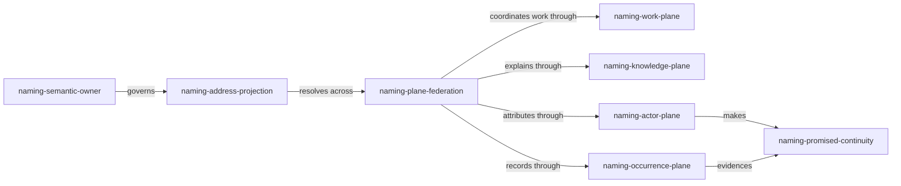

<a id="naming-promised-continuity"></a>

# `naming-promised-continuity`

Rekon's prospective core should not be a database in which everything has a
row. It should be a **practice of making continuity explicit**: important
knowledge, work, actors, occurrences, findings, and computations can be named,
revisited, related, trusted differently, and changed without being confused
with their latest representation.

`naming-promised-continuity` names that center. A durable name is not proof of
an entity's essence. It is a public promise that uses of the name will continue
to concern one referent, or will explicitly disclose when that promise can no
longer be kept. This is enough to make a plain repository feel wiki-like. It
also prevents the wiki metaphor from demanding a universal store or perfect
global ontology.

This exploration recommends that a successor to the current documentation
constitution absorb its namespace, actor, disposition, and relationship rules.
The successor should be broader than documentation: documents become one
public presence of a named world rather than the world itself.

<a id="naming-semantic-owner"></a>

# `naming-semantic-owner`

The strongest useful interpretation of one-name discipline is: **one canonical
semantic name has one semantic owner at a given scope and time**. It does not
mean one byte string must serve every protocol.

A file path, HTML anchor, Beads ID, jj change ID, session ID, URI, and human
display title have different contracts. Calling all of them names creates the
plurality problem; forcing them into one spelling hides those contracts. Under
`naming-semantic-owner`, `rekon-con-naming` can be the canonical semantic name
of the decision work while its Dolt key and repository URL are addresses of its
representations. A document commissioned by that decision remains another
entity unless acceptance deliberately makes it the decision's public presence.

`naming-semantic-owner` **constrains** `naming-address-projection`: projections
must resolve toward the owner and must not silently claim peer authority.

<a id="naming-address-projection"></a>

# `naming-address-projection`

An address projection is a medium-specific, mechanically derivable way to
reach a named entity. Qualification is projection, not synonymy:

```text
semantic name:     naming-promised-continuity
project-qualified: rekon-naming-promised-continuity
document address:  /constitution/naming/exploration/draft0.sol56m.md#naming-promised-continuity
```

The first line names the idea in its local semantic scope. The second resolves
that same name across projects. The third locates this draft's account of it.
Only the first is minted freely; the others follow registered transformations.
An old projection may remain as a compatibility route without becoming a
second semantic owner.

This reframes aliases. A deterministic abbreviation such as `con` for
`constitution` is a resolver rule only if expansion is scoped, lossless, and
machine-checkable. Otherwise it is another name, however convenient it feels.
The system should prefer full semantic stems until repeated practice justifies
a registry entry.

<a id="naming-resolution-ladder"></a>

# `naming-resolution-ladder`

Names gain context by a resolution ladder rather than by endlessly embedding
hierarchy in the identifier:

1. Resolve the exact semantic name in the current topic.
2. Resolve it in the current project.
3. Resolve its project-qualified projection in the workspace.
4. Follow an explicit canonical URI outside the workspace.
5. If more than one live owner remains, report ambiguity instead of guessing.

Inductive suffixes remain valuable because they suggest where to search, but
lexical ancestry does not prove ontology. `naming-agents-declaration` looks
related to `naming-agents`, yet the load-bearing relation is stated in prose:
`naming-agents-declaration` **implements** the autonomous part of
`naming-agents`. Search hints and semantic relations should not impersonate one
another.

<a id="naming-rename-covenant"></a>

# `naming-rename-covenant`

Durability is behavioral, not syntactic. `naming-rename-covenant` requires a
rename to record four facts: the prior semantic name, the successor semantic
name, the actor authorizing the change, and the disposition of old projections.
The old name must not later identify an unrelated entity.

Beads demonstrates a strong local operation: `bd rename` rewrites references
that Beads owns. The hierarchy proposal demonstrates compatibility stubs for
paths. Neither can atomically rewrite remote repositories, memories, prose, or
human recollection. Therefore a cross-medium rename is a migration with an
inbound-reference inventory, not an innocent string edit.

`naming-rename-covenant` **extends** the constitution's anchor compatibility
obligation and **consumes** Beads rename for the work-plane portion. It does not
promise impossible global atomicity.

<a id="naming-agents"></a>

# `naming-agents`

Agents are the flagship because they expose whether naming means identity or
mere labeling. A coordinator can assign a task, model, session handle, and
suggested call sign. None establishes what actor the agent promises to be.

The actor record should separate four facts:

| Fact | Example | Authority |
|---|---|---|
| Runtime locator | an opaque session ID | harness |
| Producer kind | `model:gpt-5.6-sol-medium` | execution environment |
| Declared actor name | a semantic actor identifier | actor itself |
| Accepted role | explorer of `rekon-con-naming` | coordinator or work graph |

This is not four names for one thing. They identify different entities or
relations: a session occurrence, a model kind, an actor's continuing claim,
and a work role. Collapsing them produces false certainty about provenance.

<a id="naming-agents-declaration"></a>

## `naming-agents-declaration`

An agent names itself by emitting a declaration before durable work:

```yaml
actor: model:gpt-5.6-sol-medium/naming-continuity-explorer
session: urn:opencode:session:<opaque-id>
promises:
  - authors: /constitution/naming/exploration/draft0.sol56m.md
  - acts_for: rekon-con-naming
```

The concrete syntax is illustrative. The semantic rule is not: only the actor
can promise its continuing actor name. A coordinator may reject a collision,
request qualification, or decline to accept the actor for a role. It should not
silently rename the actor, because that would confuse assignment authority with
identity authority.

Self-declaration alone is cheap and untrusted. `naming-agents-declaration`
**requires** `naming-agents-observation` before readers infer continuity.

<a id="naming-agents-observation"></a>

## `naming-agents-observation`

Actor continuity is established by observations linked to the declaration:
authored artifacts, task claims, commits, receipts, and attestations. A later
session may declare continuity with an actor, but consumers decide how much to
trust that declaration from evidence and authority. Model identity and session
identity should always remain available, even when a friendly actor name is the
primary human-facing reference.

OKF already separates `generated` from `verified`; the same separation should
govern actor identity. An actor declares. A process records. A human or process
may verify. No one event proves all three.

`naming-agents-observation` **extends** OKF provenance from “who wrote this” to
“why believe this actor reference denotes continuing agency.”

<a id="naming-agents-hat-relation"></a>

## `naming-agents-hat-relation`

A hat is a named role relation, not an alias for the actor. The same actor may
`acts_as` researcher, reviewer, and coordinator; another actor may later occupy
the same role. This preserves one name per entity while permitting plural work.
It also lets Beads keep work assignment separate from an actor registry:
`assignee` points at the actor, while issue metadata or a typed relation records
the role under which it acts.

<a id="naming-human-presence"></a>

# `naming-human-presence`

Humans are not a privileged exception to the actor model. They need durable
references because acceptance, verification, delegation, and authorship become
meaningless when every human is merely “the user.” OKF makes this operational:
the `human:` prefix changes the derived trust tier.

Yet a globally exposed personal identifier is not the price of human review.
`naming-human-presence` permits a person to declare a project-scoped actor name,
with private account identity held by the local resolver. Public artifacts can
say `human:rekon-maintainer`; the local system may know which account currently
controls that actor. Role continuity and personal continuity are then explicit
choices rather than accidental leakage.

`naming-human-presence` **constrains** `naming-publicity-boundary`: trust signals
must remain useful without forcing private identifiers into global names.

<a id="naming-publicity-boundary"></a>

# `naming-publicity-boundary`

Every named entity has a publicity boundary: private session, project, shared
workspace, or published world. Qualification may cross outward only through an
explicit publication or federation promise. A project namespace is therefore
not merely a prefix; it is an authority boundary that promises which names it
owns and which resolver speaks for them.

This makes “implicitly across projects” precise. Projects can refer across
boundaries without a central global registry when each publishes a stable
project identity, canonical resolver, and collision behavior. Global uniqueness
is federated authority plus qualification, not hope that all authors choose
different words.

<a id="naming-entity-threshold"></a>

# `naming-entity-threshold`

Not everything that can receive an anchor deserves first-class identity. An
entity earns a semantic name when at least one future operation must distinguish
it independently: cite it, relate it, assign responsibility, evaluate trust,
change its disposition, or resolve it from another context.

This criterion produces a heterogeneous census without producing bureaucracy:

| Kind | It earns a name when... | Natural public presence |
|---|---|---|
| Knowledge | a claim-set must remain citable through revisions | document or section |
| Finding | a conclusion has independent evidence or consequences | semantic anchor; bead if actionable |
| Research | an inquiry's scope and evidence must be revisited | research artifact |
| Work | readiness, acceptance, or responsibility must persist | Beads issue |
| Occurrence | later reasoning depends on what happened | event record or promoted audit fact |
| Computation | definition, execution, and attestation recur | OKF Attested Computation |
| Actor | authorship, agency, delegation, or trust persists | actor declaration plus observations |

`naming-entity-threshold` **guards** the new core against turning every heading,
mutation, and passing agent thought into a permanent citizen.

<a id="naming-plane-federation"></a>

# `naming-plane-federation`

The new core is a federation of deep planes, not one universal schema:



`naming-work-plane` is guarded operations over Beads' versioned work graph.
`naming-knowledge-plane` is Markdown, frontmatter, semantic anchors, sources,
and maintained public presences. `naming-actor-plane` owns declarations,
continuity evidence, delegation, and privacy boundaries.
`naming-occurrence-plane` distinguishes exhaustive operational history from
selected events promoted to semantic entities.

The planes share canonical semantic references and explicit relations; they do
not share a mandatory storage engine. This preserves Beads' focused charter and
OKF's portable, minimally opinionated bundle while still creating one navigable
world.

<a id="naming-ticket-topic-index"></a>

# `naming-ticket-topic-index`

Beads epics are Rekon's most visible provisional topic index because their IDs
say what the project is trying to become. The current export visibly contrasts
opaque historical IDs with `rekon-doc-constitution-hierarchy` and
`rekon-con-naming`. This is evidence that semantic IDs improve navigation, but
not evidence that every topic is work.

An epic should name the enduring decision or capability, not the meeting that
created it. Child IDs refine that semantic stem when the work genuinely belongs
to the epic. Typed graph edges remain necessary: lexical containment cannot say
`blocks`, `validates`, `discovered-from`, or `supersedes`.

`naming-ticket-topic-index` **implements** `naming-work-plane` at today's most
human-visible edge and **contrasts** a knowledge index, which may include stable
subjects with no open work.

<a id="naming-burgess-calibration"></a>

# `naming-burgess-calibration`

Mark Burgess's page for *In Search of Certainty* summarizes a systems argument
directly relevant here: certainty is an observer's point of view; semantics and
dynamics can each be unstable; strong coupling harms predictability; promises
arose from the failure of deterministic obligation logic in distributed
systems; and an autonomous agent can promise only its own behavior. His
research overview places Promise Theory, autonomous agents, trust, semantic
spacetime, and knowledge representation on one line of inquiry.[^naming-burgess-certainty]

That argument does not prove a naming design. It calibrates its ambition:

- A name cannot command its referent to remain unchanged. It can express a
  scoped intention about continuity.
- A coordinator cannot make an agent's identity promise on its behalf. It can
  promise how it will record, qualify, and route the declaration.
- A registry cannot manufacture certainty. It can reduce ambiguity and expose
  conflicting observations.
- Stable meaning comes from repeated cooperative use and assessment, not from
  choosing a perfect token once.
- Weakly coupled planes are more credible than a universal identity database;
  each plane can keep its own promises while exchanging references.

Promise Theory's bottom-up account models cooperation among autonomous parts,
where promises publish intentions and observers assess whether they are kept.
The overview consulted also stresses that promises are not deterministic
commands and that assumptions about another agent's behavior should be made
explicit.[^naming-promise-overview] This is exactly the distinction
`naming-promised-continuity` needs: the name is a measuring stick for semantic
continuity, not a metaphysical certificate.

[^naming-burgess-certainty]: Mark Burgess, *In Search of Certainty* author page
    and chapter summaries.
[^naming-promise-overview]: Wikipedia's Promise Theory overview, used as a
    secondary orientation source and followed to Burgess's own materials.

<a id="naming-certainty-receipt"></a>

# `naming-certainty-receipt`

Certainty should attach to an observation, not accumulate mysteriously on a
name. `naming-certainty-receipt` is a record that a resolver, verifier, or
attester observed a particular projection, content state, actor declaration,
or computation run and reached a bounded verdict.

This generalizes OKF's useful separation: `verified` assesses a definition;
attestation assesses one execution. Likewise, resolving an actor name at one
time does not verify all future work by that actor. Receipts can be numerous and
ephemeral; only those needed for later reasoning cross `naming-entity-threshold`
and receive enduring semantic names.

<a id="naming-superseding-home"></a>

# `naming-superseding-home`

The successor should be a topic-first public presence for **the named project**,
not another naming policy beside the documentation constitution. It should
absorb and reconcile:

- qualified ticket-and-anchor identity from the current constitution;
- public presence, disposition, promotion, and compatibility vocabulary from
  the hierarchy revision;
- actors, keyed sources, trust, and attested computation from OKF;
- stable work IDs, guarded lifecycle, typed relations, and readiness from
  Beads;
- actor self-declaration and observation from `naming-agents`;
- federated resolution and publicity from `naming-publicity-boundary`.

The originals remain exact evidence. Supersession changes which document
promises the maintained current account; it does not erase the sources from
which that account learned.

The smallest credible implementation is not a global service. It is a
validator and resolver over declared project names, semantic anchors, explicit
Beads IDs, actor declarations, and compatibility records. It should detect
duplicate live owners, unresolved qualification, non-deterministic aliases,
and renamed names reused for unrelated entities. Search can remain generous;
canonical resolution must be strict.

<a id="naming-nebula"></a>

# `naming-nebula`

Some tensions should remain visible rather than being normalized away:

- Can a semantic owner be a mutable topic across decades, or must sufficiently
  changed meaning become a successor entity?
- Does an actor survive model changes, session changes, or only both when a
  human authority accepts the continuity claim?
- Can project-scoped human roles support meaningful human review without making
  accountability evasive?
- When does a finding become independent of the research document that first
  states it?
- Which named occurrences belong in durable knowledge, and which should remain
  reconstructible operational history?
- Can deterministic abbreviation remain truly lossless once projects federate?
- Who is entitled to publish a project resolver, and how do two resolvers
  recover from claiming the same project name?
- How does a rename covenant propagate to offline or abandoned repositories
  without pretending global atomicity?

These are not defects in `naming-promised-continuity`. They are the uncertainty
the named system should make discussable.

<a id="naming-identifier-ledger"></a>

# `naming-identifier-ledger`

This draft minted and thereafter used these substantive identifiers:

| Identifier | Enduring referent |
|---|---|
| `naming-promised-continuity` | The core practice and this exploration's root idea |
| `naming-semantic-owner` | One canonical semantic owner per name, scope, and time |
| `naming-address-projection` | A derived medium-specific route to a semantic owner |
| `naming-resolution-ladder` | Ordered contextual resolution with explicit ambiguity |
| `naming-rename-covenant` | Required continuity record for semantic renames |
| `naming-agents` | Named autonomous actors as the flagship application |
| `naming-agents-declaration` | An actor's own promise of actor identity |
| `naming-agents-observation` | Evidence used to assess actor continuity |
| `naming-agents-hat-relation` | A role relation that does not rename its actor |
| `naming-human-presence` | Privacy-aware human participation in the actor system |
| `naming-publicity-boundary` | The authority boundary for publishing and federating names |
| `naming-entity-threshold` | Criterion for promoting something to first-class identity |
| `naming-plane-federation` | The composed named core without a universal schema |
| `naming-work-plane` | Guarded lifecycle and readiness over named work |
| `naming-knowledge-plane` | Documents, anchors, claims, and provenance |
| `naming-actor-plane` | Declarations, delegation, continuity evidence, and privacy |
| `naming-occurrence-plane` | Operational history and selected named events |
| `naming-ticket-topic-index` | Beads epics as the provisional visible topic index |
| `naming-burgess-calibration` | Promise-theoretic limits on naming certainty |
| `naming-certainty-receipt` | Bounded evidence for one resolution or assessment |
| `naming-superseding-home` | The broader maintained successor this work should earn |
| `naming-nebula` | Material uncertainty deliberately kept open |
| `naming-identifier-ledger` | This document's canonical inventory of minted identifiers |

<a id="naming-cross-references"></a>

# `naming-cross-references`

- The [naming wave proposal](/constitution/naming/exploration/proposal2.glm53m.md)
  **motivates** this exploration's one-name discipline, entity census, agent
  flagship, and superseding ambition. This draft revises its alias intuition by
  distinguishing semantic ownership from address projections.
- The [Beads offerings inventory](/constitution/naming/exploration/beads-offerings0.sol56x.md)
  **evidences** `naming-work-plane` and **constrains** Beads to work and
  coordination rather than treating it as a universal named-entity store.
- The [documentation constitution](/constitution/README.md#doc-constitution-namespace)
  **supplies** qualified IDs, inductive refinement, forward anchors, and the
  rule that lexical ancestry does not create operational edges. It is a primary
  absorption candidate for `naming-superseding-home`.
- The [hierarchy revision](/constitution/README-heirarchy1.glm53m.md#doc-constitution-hierarchy1-terms)
  **supplies** public presence, disposition, supersession, and compatibility
  vocabulary needed by `naming-rename-covenant`.
- The [OKF specification](https://github.com/GoogleCloudPlatform/knowledge-catalog/blob/main/okf/SPEC.md)
  **constrains** actor and trust semantics and **evidences** the value of keyed,
  reorder-safe source identity and bounded computation attestation.
- [`AGENTS.md`](/AGENTS.md#subagents) **evidences** model-suffixed authorship,
  independent waves, named tickets, and the present gap between opaque session
  locators and reusable actor identity.
- Beads ticket `rekon-con-naming` **coordinates** this wave and itself
  **demonstrates** a self-describing epic as a visible project topic.
- Mark Burgess's [*In Search of Certainty* page](https://markburgess.org/certainty.html)
  and [research overview](https://markburgess.org/research.html) **frame**
  `naming-burgess-calibration`: autonomy, assessment, semantic stability, and
  observer-relative certainty limit what a registry can honestly promise.
