<a id="naming-semantic-fabric"></a>
# Names As Promises In A Federated Semantic Fabric

Rekon is looking for more than a naming convention. It is looking for a place
where knowledge, actors, occurrences, findings, inquiries, computations, and
work can become visible to one another without first being flattened into one
database or one tree. The proposal calls that ambition
[`naming-rekon-core`](/constitution/naming/exploration/proposal2.glm53m.md#swirl-frames).
This exploration calls its candidate realization `naming-semantic-fabric`:

> **A project-owned, federated semantic fabric in which every durable entity
> offers one canonical semantic stem, native records remain authoritative,
> explicit relations supply context, and resolvers assemble navigable views.**

The word *fabric* matters. A directory tree gives order but only one route. A
graph gives plurality but can dissolve into undifferentiated edges. A registry
gives uniqueness but tends to make one service the sovereign of everything it
indexes. `naming-semantic-fabric` keeps the tree-like coordinate, the graph-like
nebula, and the native authority of files, actors, tickets, and computations.
It is a protocol among them, not a demand that they all become the same kind of
row.

This revises the proposal's strongest language without weakening its intent.
"One name per entity" should be a promise made and guarded inside an authority,
not a claim that all observers in a distributed world already agree. A name
should locate and distinguish; it cannot, by itself, prove identity, establish
meaning, or guarantee behavior. Those come from context, history, and
attestation. The new core is therefore not merely names. It is **named entities
making inspectable promises in context**.

<a id="naming-burgess-correction"></a>
# Burgess's Correction: Naming Without The Fantasy Of Control

Mark Burgess's *In Search of Certainty* is unusually well matched to this
problem, but not because it blesses meaningful identifiers in a simple way.
Its useful contribution is the tension it preserves.

The book's author-maintained synopsis says that certainty is an observer's
point of view, that the illusion of control depends on details ignored, that
strong coupling makes outcomes less predictable, and that autonomous agents
can only promise their own behavior.[^burgess-certainty-author-synopsis] The
searchable book preview makes the naming point directly: merely substituting a
number for a name does not make the subject meaningful (p. 158). Yet later it
also observes that giving machines friend-like or pet-like names stopped
scaling as installations grew (p. 276), and that knowing which promises are
required matters more than the participants' names (p. 283).[^burgess-certainty-google-books]

That three-part result is `naming-burgess-correction`:

1. Opaque numbers preserve discrimination but contribute almost no semantics.
2. Memorable pet names contribute local familiarity but do not create a
   scalable coordinate system.
3. Self-describing names help, but reliable cooperation still depends on the
   promises and relationships around the named entities.

The InfoQ interview makes this architectural rather than literary. Burgess
describes knowledge as how intent scales and as a bridge between human and
machine worlds; the accompanying review highlights Topic Maps as topics,
associations, and occurrences.[^burgess-certainty-infoq] The searchable book
preview adds that Topic Maps were designed so separately maintained local
worldviews could be merged rather than forced into one predetermined
hierarchy.[^burgess-certainty-google-books] That is remarkably close to the
desired wiki-ish core: named topics plus associations plus occurrences,
maintained from local perspectives.

The deeper naming analysis appears in *Spacetimes with Semantics*. Burgess
argues that an unidentifiable element effectively does not exist in an
observer's universe, that names have domains of validity, and that hierarchical
paths are only one possible coordinate system.[^burgess-semantic-spacetime1]
More sharply, an agent may promise its own name, while an observer may accept
and assign a locally unique identity; the namespace belongs to the observer.
A global uniqueness requirement cannot simply be imposed on autonomous agents.
In the same paper, a concept is a non-numerically named element with a
non-empty context; its significance comes from name and context together. An
index can accelerate finding only after some coordinate system already exists.

Later Semantic Spacetime work scales agents into super-agents and identifies
four recurring association families: aggregation, causation, cooperation, and
similarity.[^burgess-semantic-spacetime2] [^burgess-semantic-spacetime3] The
author's addressability essay then distinguishes random semantic labels from
metric coordinates: an IP address identifies but does not tell an observer how
to navigate, aggregate, or estimate distance.[^burgess-addressability-essay]

`naming-burgess-correction` therefore constrains `naming-semantic-fabric` in a
specific way. Rekon should reject both extremes: neither opaque substrate IDs
nor a master semantic taxonomy is enough. It needs observer-resolvable
coordinates, autonomous ownership, typed context, and operational evidence.

<a id="naming-kernel-commitments"></a>
# Four Kernel Commitments

<a id="naming-name-promise"></a>
## `naming-name-promise`: A Name Is Offered, Not Discovered

`naming-name-promise` is the first commitment: a canonical name is a durable
offer by an entity's steward to answer to one semantic stem within a declared
scope. A project or actor can keep that promise, change it explicitly, or fail
to keep it. An observer or resolver can accept it, reject it as colliding, or
qualify it with more context.

This avoids pretending that the string reveals an entity's essence. It also
makes responsibility visible. A filename produced by chance, a heading slug
produced by a renderer, and a UUID produced by a store are not automatically
canonical names. They become substrate coordinates until a steward promises
otherwise.

`naming-name-promise` **inherits** Promise Theory's autonomy and **extends** the
constitution's honest `generated.by` convention. The actor making the identity
claim and the observer recording it are both named. Neither can make the other
keep a promise.

<a id="naming-one-name-locality"></a>
## `naming-one-name-locality`: One Canonical Stem Within An Authority

The proposal's [`naming-one-name`](/constitution/naming/exploration/proposal2.glm53m.md#one-name)
is valuable as an editorial and registry invariant. It becomes unsound only
when promoted to a fact about all distributed observers. `naming-one-name-locality`
states the narrower and enforceable rule:

> For one authority at one point in its recorded history, one entity has one
> canonical semantic stem, and one canonical semantic stem resolves to at most
> one live entity.

Historical names can remain as retired resolution inputs. External observers
can maintain their own labels. Private human personae can deliberately remain
unlinked. None of those labels becomes a second canonical stem in the owning
authority.

This is both stricter and humbler than a universal one-name claim. It is
stricter because a project can mechanically reject duplicate live ownership.
It is humbler because cross-project sameness remains a relation or an
attestation, not an inference from matching text.

<a id="naming-coordinate-context"></a>
## `naming-coordinate-context`: Order Locates; The Nebula Means

`naming-coordinate-context` gives the system its two irreducible halves:

- A semantic coordinate orders and locates an entity. Project qualification
  and inductive refinement make a likely neighborhood legible.
- Contextual relations explain what the entity means, where it came from, what
  it affects, and which other interpretations remain possible.

Lexical ancestry does not create ontology. Trimming a stem's trailing words can
find a plausible neighborhood, but that spelling alone does not prove that the
entity is contained by, caused by, or accepted into another entity. Those
relations must be stated in words or typed edges. Conversely, an unindexed
cloud of relations forces brute-force search. The coordinate and context need
one another.

This is how `naming-semantic-fabric` keeps both order and nebula. It **inherits**
inductive refinement from the constitution and **constrains** it with Burgess's
claim that a concept requires a non-empty context.

<a id="naming-native-authority"></a>
## `naming-native-authority`: The Index Does Not Own What It Finds

`naming-native-authority` says that the authoritative identity record stays
with the system capable of keeping its promises:

- a knowledge artifact owns its frontmatter and anchors;
- an actor owns or co-signs its actor record;
- Beads owns work lifecycle and dependency mutation;
- a computation concept owns its executable contract;
- version control owns immutable historical coordinates.

A resolver, search index, graph view, or topic index consumes those records. It
does not silently become their new source of truth. `naming-native-authority`
keeps `naming-semantic-fabric` federated and lets each subsystem remain a deep
module rather than producing one universal entity table.

<a id="naming-name-grammar"></a>
# A Name Grammar With Fewer Aliases

<a id="naming-canonical-stem"></a>
## `naming-canonical-stem`: Semantic Words, Stable Scope

`naming-canonical-stem` is the one lexical identity an authority promises. It
uses lowercase ASCII words joined by hyphens, prefers semantic words over
ordinals, and starts with enough concern context to survive extraction from a
paragraph. This draft's root stem is `naming-semantic-fabric`.

At workspace scope, resolution qualifies that stem as
`rekon-constitution-naming-semantic-fabric`. Qualification is a coordinate
operation over the same stem, not the minting of another entity name. The
frontmatter records both so current tools can consume the distinction while
the grammar is unsettled.

The important departure from the priming proposal is that arbitrary lexical
abbreviations such as `con` and `exp` should not enter canonical stems. They
save a few characters while creating a glossary dependency at exactly the
cross-project boundary where shared interpretation is weakest. A user
interface may display an abbreviated rendering, but durable citations should
not depend on it.

<a id="naming-contextual-elision"></a>
## `naming-contextual-elision`: Remove Only What Context Restores

`naming-contextual-elision` permits a local document to use
`naming-semantic-fabric` where the resolver already knows the project and topic
scope. Unlike an alias, this operation removes only a declared prefix and is
reversible from explicit context. A cross-project citation restores the full
qualification and pairs it with a canonical URL.

Thus local and qualified forms are two coordinate resolutions of
`naming-canonical-stem`, not two peer names. A shorthand that cannot be expanded
without consulting a mutable synonym list does not qualify as
`naming-contextual-elision`.

<a id="naming-location-separation"></a>
## `naming-location-separation`: Paths Resolve Names; They Do Not Define Them

The proposal imagines a section's full identity as implied by its path and
filename. `naming-location-separation` reverses that dependency. The semantic
stem is explicit and stable; a path-plus-anchor is a current locator for it.
Moving `draft0.sol56x.md` should not rename every concept in the file. The file
role, revision, and model suffix identify this evidence artifact, not the
conceptual entities it discusses.

This preserves the constitution's strongest separation: the qualified
knowledge ID names, while the URL resolves. It also fits the hierarchy
proposal's assertion that layout is not identity. A path can still provide a
useful default stem when an entity is first minted, but derivation is a creation
convenience, not a permanent identity equation.

<a id="naming-refinement-coordinate"></a>
## `naming-refinement-coordinate`: Suffixes Are Search Hints, Not Edges

`naming-refinement-coordinate` retains inductive suffixing because it gives a
cheap, human-readable coordinate system. Removing trailing segments should
lead toward plausible topic roots and tickets. This supports low-resolution
skimming in the Burgess sense of an index.

The rule remains explicitly non-ontological. A lexical parent does not imply
`parent-child`, `blocks`, `causes`, `contains`, or `supersedes`. Those relations
remain first-class statements. `naming-refinement-coordinate` **supports**
`naming-coordinate-context`; it never replaces the context half.

<a id="naming-identity-change"></a>
## `naming-identity-change`: Move, Rename, Split, And Supersede Differ

One-name discipline becomes credible only when change has precise semantics.
`naming-identity-change` distinguishes four operations:

| Change | Entity continuity | Required treatment |
|---|---|---|
| Locator move | Same entity | Keep `naming-canonical-stem`; update the public presence; preserve a compatibility locator where durable consumers exist. |
| Display-title edit | Same entity | Change prose only; the canonical stem is untouched. |
| Canonical-stem rename | Presumed same entity, but review required | Record a named rename occurrence; retire the old input; resolve it to the new stem with explicit history rather than presenting two live names. |
| Semantic split or merge | Different entity set | Mint new canonical stems; relate predecessors and successors explicitly; never silently reuse an old stem. |

Beads' `rename` operation is strong inside the work plane because it rewrites
owned references. It cannot decide which of these semantic operations is
happening, and it cannot update authorities it does not own. Compatibility
stubs from the hierarchy proposal are therefore locators, not canonical name
aliases.

The current [naming topic public presence](/constitution/naming/README.md)
already supplies a useful test. Its title and description now cover actors and
artifacts, while `local_knowledge_id` remains `agent-naming`. That could be an
intentional stable stem, a broadened referent requiring a semantic rename, or a
new umbrella that should supersede the narrower entity. `naming-identity-change`
says not to repair the mismatch by reflex; name which operation actually
occurred first.

<a id="naming-resolution-promise"></a>
# Resolution Is The Core Operation

`naming-resolution-promise` is the smallest useful interface of the proposed
core. Given a name and observer context, a resolver promises either a typed
record or an explicit failure. A successful record should be able to expose:

```yaml
name: naming-semantic-fabric
qualified: rekon-constitution-naming-semantic-fabric
kind: knowledge-concept
authority: project:rekon
public_presence: /constitution/naming/exploration/draft0.sol56x.md#naming-semantic-fabric
steward: rekon-naming-parallax
disposition: draft
locators:
  - /constitution/naming/exploration/draft0.sol56x.md#naming-semantic-fabric
relations:
  - { type: revises, target: naming-center }
substrate:
  ticket: rekon-con-naming
observed_at: 2026-09-02T17:28:23-04:00
```

The example is an envelope, not a proposed universal storage schema. Each value
is projected from a native record under `naming-native-authority`. Missing and
conflicting claims should remain visible. A resolver must not manufacture
agreement merely to return one answer.

`naming-resolution-promise` should support at least these outcomes:

- **resolved**: one live owner is found in the requested authority;
- **retired**: an old canonical input points to its explicit successor;
- **ambiguous**: observer context is insufficient to choose an authority;
- **colliding**: one authority claims multiple live owners, violating
  `naming-one-name-locality`;
- **unresolved**: a forward reference or missing entity remains legitimate;
- **private**: an entity is known but does not promise public visibility.

Those outcomes make uncertainty part of the interface instead of hiding it in
search order.

<a id="naming-federated-authority"></a>
## `naming-federated-authority`: Global Reach Without A Global Sovereign

`naming-federated-authority` treats a project as the authority for its local
semantic stems. The globally meaningful coordinate is the pair of canonical
project authority and stem. A readable project prefix is convenient; the
canonical repository URL and project identity provide stronger resolution
context. Matching stems in two projects do not imply sameness, while different
stems do not rule it out.

This makes "implicitly across projects" operational without first requiring a
planetary registry. Projects promise their own name maps, consumers choose
which authorities to trust, and cross-project equivalence is an explicit
relation with provenance. A later registry may cache or attest those promises,
but `naming-federated-authority` prevents that registry from becoming the
metaphysical owner of every entity.

<a id="naming-actor-flagship"></a>
# The Flagship: Actors Name Themselves, Then Enter A Relationship

<a id="rekon-naming-parallax"></a>
## `rekon-naming-parallax`: This Actor Names Itself

This drafting actor self-proposes `rekon-naming-parallax`. The name was chosen
because this exploration's distinctive claim is parallax: identity and
certainty vary with observer position, while a stable fabric lets observers
compare their views. It is scoped to Rekon's naming work and is used in this
document as the actor name.

The name remains honestly **self-proposed**, as recorded in frontmatter. No
coordinator-side registry has accepted it. `model:openai/gpt-5.6-sol#max` names
the generating model, `sol56x` is the wave's model suffix, SX is an assignment
role, and an opaque session handle is a transport locator. None is a second
name for `rekon-naming-parallax`.

This small demonstration exposes why "agents name themselves" cannot mean
"agents unilaterally allocate globally unique strings." Self-expression and
shared addressability are a bilateral cooperation.

<a id="naming-actor-handshake"></a>
## `naming-actor-handshake`: Self-Proposal Plus Observer Acceptance

`naming-actor-handshake` is the proposed protocol:

1. The coordinator supplies the project authority, task context, naming
   constraints, and a census of currently accepted actor stems.
2. The new actor proposes one self-describing canonical stem and promises the
   scope in which it will answer to that stem. Candidate strings remain
   pre-history until accepted.
3. The coordinator or project resolver atomically accepts the proposal or
   reports a collision. Rejection asks the actor to propose again; it does not
   publish the rejected candidate as an alias.
4. The accepted actor record binds the stem to substrate locators, generating
   model, task, provenance, visibility, and continuity policy.
5. The actor uses the accepted stem in artifacts and relations. Tools continue
   to use task or session locators for transport, but present the actor stem to
   humans.

The actor makes `naming-name-promise`; the coordinator makes a resolution
promise. Neither side can create trustworthy shared identity alone. This is
the actor-specific realization of `naming-federated-authority`.

<a id="naming-actor-braid"></a>
## `naming-actor-braid`: Stop Calling Every Identity Fact A Name

An actor currently accumulates values that are easy to conflate. The
`naming-actor-braid` keeps them typed:

| Strand | Example for this work | Identity role |
|---|---|---|
| Canonical actor stem | `rekon-naming-parallax` | The one semantic actor name |
| Model lineage | `openai/gpt-5.6-sol#max` | What generated this execution |
| Session or task handle | Opaque runtime value | Exact transport and resumption locator |
| Assignment role | SX member of naming exploration | What the actor is doing here |
| Artifact signature | jj author/commit or future key signature | Evidence binding an output to an actor claim |
| Public presence | Future actor record | Where an observer resolves the actor |

These strands reinforce identity precisely because they are not aliases. A
model may generate many actors. One actor may perform several roles. A session
locator may disappear while committed evidence remains. `naming-actor-braid`
lets the resolver return all of them without violating
`naming-one-name-locality`.

The existing [OpenCode session storage account](/doc/opencode-session.md)
evidences this separation in the substrate: session rows carry an opaque ID,
parent/fork ID, human-readable title, project, and timestamps, while message
metadata separately records agent and model. That store can recover an
execution trace, but it is not yet an accepted semantic actor registry.

<a id="naming-role-is-relation"></a>
## `naming-role-is-relation`: Hats Belong On Edges

The priming proposal's hats capture a true need but place it in the wrong
category. `naming-role-is-relation` says that a role is a relation between an
actor, a capability or function, and a scope of work. "Coordinator," "SX
explorer," "reviewer," and "implementer" do not rename the actor. They state
what the actor promises to do in a context.

This gives role changes their own history, allows simultaneous roles, and
prevents a root session with many hats from acquiring many peer identities.
Beads assignment can point to the actor stem; task metadata and edges can state
the role.

<a id="naming-actor-continuity"></a>
## `naming-actor-continuity`: A Model Is Not A Persistent Person

`naming-actor-continuity` sets a conservative default: separate executions are
separate actor instances unless a persistent actor record promises continuity
and can carry state and provenance across them. Sharing a model name, prompt,
or coordinator does not establish sameness.

An actor may outlive one runtime session if its accepted public presence binds
successive session locators and records the handoff. Without that binding,
credit the output to the execution-level actor or model honestly. This avoids
inventing a fictional long-lived person behind stateless calls.

<a id="naming-petname-limit"></a>
## `naming-petname-limit`: Evocative Is Welcome; Unscoped Whimsy Is Not Enough

Burgess's book describes the small-system habit of giving machines names like
friends or pets, then notes that it failed to scale.[^burgess-certainty-google-books]
`naming-petname-limit` therefore qualifies the Docker-style idea. A memorable
tail can make an actor humane and recallable, but a random adjective-noun pair
does not say which project, actor kind, or authority owns it.

`rekon-naming-parallax` demonstrates the compromise: the memorable word remains,
while the project and concern provide a predictable neighborhood. At larger
scale, `naming-resolution-promise` and relations carry more weight than making
the stem encode every fact.

<a id="naming-human-presence"></a>
# Humans Are Named Actors, Not Exposed Subjects

`naming-human-presence` defines a human actor name as a voluntary public
presence through which a person accepts responsibility in some scope. It does
not claim to name the complete biological or legal person. A pseudonym can be
a valid human actor. Separate personae can remain deliberately unlinkable;
they are separate public presences, not multiple canonical names asserted for
one public entity.

The practical rules follow:

- A human chooses or explicitly accepts the actor stem. Do not derive it from
  an email address, git display name, account profile, or model inference.
- Visibility is promised. A private actor can be referenced by a scoped opaque
  locator without publishing a global profile.
- A public presence may bind keys, accounts, and prior names, but each binding
  states scope and evidence. It does not silently merge identities.
- `human:<id>` remains a useful OKF-shaped stem. The `<id>` should resolve to a
  consented actor presence when trust depends on it.

`naming-human-presence` **extends** the hierarchy's public-presence term from
topics to actors while preserving privacy. It also takes Burgess literally:
observability and identity are promises, not properties an observer may demand.

<a id="naming-human-trust-boundary"></a>
## `naming-human-trust-boundary`: The Prefix Is A Claim, Not Proof

OKF derives its highest trust tier when `verified.by` has a `human:` prefix.
That is a useful, cheap policy signal, but the syntax cannot authenticate
humanity or correctness.[^okf-v0-2] `naming-human-trust-boundary` makes the
limit explicit:

- `human:` classifies the responsibility being claimed;
- a signature can attest control of a key bound to that public presence;
- repository policy can authorize that actor to accept a canonical tip;
- none of these proves that the underlying claim is true merely because the
  actor is human.

The resulting trust tier is an observer policy over a named actor and evidence,
not an ontological property embedded in a prefix. The same caution applies to
Beads' actor and assignee strings. A string is an attribution input; an actor
registry or attestation supplies stronger binding.

The recent Burgess trust work supports this framing. Trust is described as an
ongoing assessment of reliability plus the costly attention driven by residual
mistrust, not a binary token.[^burgess-nlnet-trust-interview] His project uses
interaction history to study trust between agents rather than treating an
identity assertion as sufficient.[^burgess-trust-project]

<a id="naming-reference-pressure"></a>
# What Earns A Name

Naming everything produces as much noise as naming nothing. `naming-reference-pressure`
is the promotion threshold: an entity earns a canonical stem when at least one
future operation needs to distinguish and revisit it across a boundary of
time, file, actor, system, or project.

Strong signals include:

- it must be the endpoint of a durable relation;
- its provenance, disposition, ownership, or trust differs from its container;
- its lifecycle can diverge from neighboring material;
- people will need to say "this one" after headings or list positions move;
- it must be found without replaying the conversation that produced it;
- an acceptance, attestation, or supersession decision applies to it
  independently.

A sentence does not earn a name merely because an anchor is cheap. A whole
document is not the only available grain merely because frontmatter is easy.
`naming-reference-pressure` is proportional: name the smallest entity whose
independent future matters.

<a id="naming-work-knowledge-seam"></a>
## `naming-work-knowledge-seam`: Tickets Coordinate; Knowledge Explains

The Beads inventory's work-plane/knowledge-plane split is load-bearing.
`naming-work-knowledge-seam` says that a ticket and the knowledge it commissions
are different entities by default, joined by an explicit relation. The ticket
has readiness, assignment, acceptance, and closure. The finding or document
has sources, argument, disposition, and a public presence. Closing one does not
make the other true or current.

Sharing a semantic stem across media is legitimate only when the records are
deliberately two expressions of one entity under one identity contract. Topic
epics often approach that case: `rekon-con-naming` is both a durable initiative
handle and the project's most visible framing of the naming topic. A task such
as "write a Burgess review" and the review itself plainly do not.

When they differ, relation words do the work: a ticket **commissions** research,
a finding **motivates** work, an artifact **evidences** acceptance, and a
successor **supersedes** a prior account. Reusing one ID for convenience would
violate `naming-one-name-locality` by assigning one string to two live
referents.

Beads already supplies the strongest implementation of the work side. Its
explicit IDs, guarded rename, typed dependency graph, readiness, audit, and
versioned Dolt state amount to guarded operations over a work graph, as
[`naming-beads-offerings`](/constitution/naming/exploration/proposal2.glm53m.md#swirl-actors)
records. The local issue census also shows descriptive epic IDs replacing
opaque generated forms.[^rekon-beads-export] [^beads-cli-help] Beads should
implement the work plane, not absorb the knowledge plane or actor registry.

<a id="naming-finding-grain"></a>
## `naming-finding-grain`: A Finding Is A Claim With Independent Consequence

`naming-finding-grain` defines a named finding as the smallest source-grounded
conclusion whose provenance, confidence, contradiction, or consequences need
independent reference. It is larger than a raw observation and smaller than a
research report. Its record needs a proposition, source keys, maturity, and a
steward; prose around it supplies qualifications that a title cannot.

A finding can remain an anchor in a report. If it creates actionable work, a
ticket relates to it through `discovered-from`, `caused-by`, `validates`, or a
more precise Rekon relation. The ticket does not duplicate the finding's
canonical name or proof.

<a id="naming-event-threshold"></a>
## `naming-event-threshold`: Name Consequential Occurrences, Audit The Rest

`naming-event-threshold` promotes an occurrence when future reasoning must
refer to the occurrence itself: "accepted during," "renamed by," "superseded
after," "failed because of," or "attested in" this event. Wave launches,
human acceptances, semantic renames, migrations, and consequential computation
runs are likely candidates.

Routine field updates remain audit events. Beads currently has several
different mechanisms called events, with different retention and identity
properties; none should become the public occurrence ontology by accident.
`naming-event-threshold` is semantic durability, not row availability or a
desire for exhaustive naming.

<a id="naming-research-question"></a>
## `naming-research-question`: Inquiry Is Organized Around A Durable Question

`naming-research-question` makes research a first-class entity centered on a
question, scope, method, and source corpus. Reports and experiments are
artifacts produced by the inquiry; findings are its claim-sized outputs; a
synthesis can accept, revise, or leave them unresolved. Naming the inquiry by
its durable question is more stable than naming it by an agent, date, or
ordinal wave position.

This lets the historical `discovery` vocabulary retire without losing its
evidence. It also makes research reusable across tickets: one inquiry may
answer several work items, and one ticket may commission several inquiries.

<a id="naming-computation-run-seam"></a>
## `naming-computation-run-seam`: Definition, Run, And Receipt Are Not One

OKF's Attested Computation model already demonstrates careful entity
separation. `naming-computation-run-seam` names the sanctioned computation as a
durable concept, while treating each execution and receipt as occurrences with
their own identity only when retention and future reference justify it.

Verification checks the named definition against policy. Attestation checks a
particular run against the definition. A successful run does not permanently
verify the definition, and a human-verified definition does not attest a later
run. `naming-computation-run-seam` **inherits** that distinction and extends it
to named event thresholding.

<a id="naming-derived-index"></a>
# The Fabric's System Shape

`naming-derived-index` is the navigational projection of the fabric. It scans
native identity claims, builds a map from canonical stems to locators, reports
collisions, and emits human or machine views: topic indexes, graph views,
search, Beads epic lists, and resolver responses. It can be rebuilt. Losing it
must not erase an entity's identity.

This follows Burgess's distinction between a semantic index and the coordinate
system it maps. An index is useful only when names already resolve to locations;
it accelerates low-resolution skimming but does not originate meaning. It also
fits OKF's optional `index.md`: an index is progressive disclosure, not a
concept or public presence.

The minimum viable fabric therefore has no new universal database:

1. Native records promise stems, kinds, public presences, stewards, and
   dispositions.
2. Standard links and typed work edges state relations in their owning media.
3. `naming-derived-index` consumes those records and exposes
   `naming-resolution-promise`.
4. Validators enforce `naming-one-name-locality` within each declared authority
   and surface unresolved or colliding claims.
5. Git and Dolt preserve historical evidence in their respective planes.

<a id="naming-semantic-fabric-constellation"></a>
## `naming-semantic-fabric-constellation`: The Ordered Nebula

Every node below is its one identifier, without a second display label. The
edge text states the load-bearing relationship.

```mermaid
flowchart TD
    naming-burgess-correction -->|constrains| naming-name-promise
    naming-kernel-commitments -->|constitute| naming-semantic-fabric
    naming-name-grammar -->|implements| naming-kernel-commitments
    naming-name-promise -->|scopes| naming-one-name-locality
    naming-coordinate-context -->|shapes| naming-semantic-fabric
    naming-native-authority -->|decentralizes| naming-semantic-fabric
    naming-canonical-stem -->|implements| naming-name-promise
    naming-contextual-elision -->|projects| naming-canonical-stem
    naming-location-separation -->|stabilizes| naming-canonical-stem
    naming-refinement-coordinate -->|orders| naming-coordinate-context
    naming-resolution-promise -->|makes navigable| naming-semantic-fabric
    naming-federated-authority -->|scopes| naming-resolution-promise
    naming-derived-index -->|serves| naming-resolution-promise
    naming-actor-flagship -->|tests| naming-kernel-commitments
    naming-actor-handshake -->|implements| naming-name-promise
    naming-actor-braid -->|supports| naming-actor-continuity
    naming-role-is-relation -->|protects| naming-one-name-locality
    naming-petname-limit -->|constrains| naming-actor-handshake
    naming-human-presence -->|specializes| naming-actor-handshake
    naming-human-trust-boundary -->|limits| naming-human-presence
    naming-reference-pressure -->|governs| naming-finding-grain
    naming-reference-pressure -->|governs| naming-event-threshold
    naming-reference-pressure -->|governs| naming-research-question
    naming-work-knowledge-seam -->|preserves| naming-native-authority
    naming-computation-run-seam -->|refines| naming-event-threshold
    naming-identity-change -->|preserves history in| naming-semantic-fabric
```



The diagram has a center but not a single root. `naming-semantic-fabric` is made
navigable by resolution, meaningful by coordinate plus context, decentralized
by native authority, and kept honest through recorded identity change. Actor,
knowledge, work, and occurrence concerns remain distinguishable while sharing
the same naming protocol.

<a id="naming-observer-relative-certainty"></a>
# Certainty Is A Resolution Result, Not A Property Of A String

`naming-observer-relative-certainty` applies the book's central lesson: a name
does not make identity certain. It gives an observer a stable question to ask.
The answer depends on authority, visibility, context, history, and the evidence
available at resolution time.

This changes the posture of tooling. A resolver should not return the first
matching string and call it truth. It should report which authority made the
claim, which native record was observed, whether the stem is live or retired,
whether another live owner collides, and which attestations bind the record to
an actor or computation. Certainty remains bounded and revisable.

<a id="naming-certainty-bundle"></a>
## `naming-certainty-bundle`: Independent Signals Converge

`naming-certainty-bundle` is the evidence an observer can combine without
collapsing it into a magic score:

| Signal | What it contributes | What it cannot prove alone |
|---|---|---|
| Canonical semantic stem | Recall and discrimination | Correct referent or behavior |
| Authority and public presence | Who promises resolution and where | Truth of the claim |
| Kind and contextual relations | Interpretable meaning | Global agreement |
| Substrate locator | Exact session, commit, ticket, or object | Human-scale semantics |
| Version history | Continuity and explicit drift | Intent behind every change |
| Sources and verification | Provenance and review responsibility | Per-run fidelity |
| Attestation or signature | Mechanical binding to a run or key | Semantic truth or biological humanity |
| Repeated promise-keeping | Empirical reliability for an observer | Future guarantee |

The bundle gains strength through partially independent evidence, much as
Burgess emphasizes redundancy, equilibrium, and history rather than absolute
control. `naming-certainty-bundle` also agrees with OKF's decision to expose
objective credibility signals and let consumers infer trust instead of storing
one universal credibility verdict.

<a id="naming-attestation-boundary"></a>
## `naming-attestation-boundary`: Mechanism Can Be Proven More Easily Than Meaning

`naming-attestation-boundary` guards against overclaiming. A deterministic
attester can show that a receipt matches a sanctioned computation. A signature
can show that a key approved a record. A repository history can show that a
change followed another. None can mechanically prove that
`naming-semantic-fabric` is the best interpretation, that two independently
named actors are the same person, or that a human review is correct.

Attestation should therefore bind the claims it can check and leave semantic
judgment named as judgment. This boundary is not a weakness; it is the honest
division between dynamics and semantics that Burgess insists must be understood
together.

<a id="naming-core-compact"></a>
# A Compact Worth Superseding Into The Constitution

`naming-core-compact` is candidate replacement language, not merely a link to
add beside the current namespace section:

> **Rekon is a federated semantic fabric of named entities.** Every durable
> entity SHOULD offer one canonical semantic stem within a declared project
> authority. One authority MUST NOT assign one live stem to multiple entities
> or multiple live stems to one entity. Local elision and medium projection MAY
> render that same stem differently only when resolution is deterministic.
>
> A name is a coordinate and a promise, not proof of identity or meaning.
> Durable entities SHOULD state kind, steward, disposition, public presence,
> and enough explicit relationships and provenance to establish context.
> Native systems remain authoritative for the behavior they own; derived
> indexes and resolvers expose those promises without becoming a second source
> of truth.
>
> Actors, including humans, agents, and processes, are named entities. An actor
> self-proposes its stem; the receiving authority accepts or rejects it. Models,
> runtime handles, roles, and signatures are typed attributes or relations, not
> alternate actor names. Human public presence requires consent, and a
> `human:` prefix is a responsibility claim rather than proof.
>
> Knowledge, findings, research, consequential occurrences, work, and
> computations receive names in proportion to durable reference pressure.
> Tickets coordinate work and documents explain knowledge; they share a name
> only when they are deliberately expressions of one entity. Otherwise their
> relationship is explicit.
>
> Locator moves, semantic renames, splits, merges, and supersessions are
> distinct operations. Historical inputs remain resolvable as retired
> locators or lineage, never as silently competing live names. Cross-project
> sameness is asserted by sourced relations, not inferred from spelling.

This compact absorbs the useful core of qualified IDs, inductive refinement,
semantic anchors, forward references, public presence, disposition, and
relationship vocabulary. It adds the missing actor protocol, observer-relative
resolution, entity threshold, and certainty boundary.

<a id="naming-home-not-layout"></a>
## `naming-home-not-layout`: The Spiritual Home Is A Contract

`naming-home-not-layout` explains how this can supersede without forcing a
premature migration. The new home is the identity and resolution contract, not
the directory that stores its first draft. A root topic, `doc/` topic, upstream
`docs/` tree, Beads database, and actor registry can all participate if they
make the same promises.

If accepted, the synthesis should replace rather than append to three current
claims:

- Replace path-derived implied identity with `naming-location-separation` and
  explicit stems. Paths remain locators.
- Replace "tickets and anchors share one namespace" with
  `naming-work-knowledge-seam`: all entities share a naming protocol, while one
  string names one referent and cross-plane records relate unless deliberately
  co-expressions.
- Replace a presumed workspace-global string namespace with
  `naming-federated-authority`: project-local ownership plus qualified,
  evidence-bearing cross-project resolution.

Keep explicit semantic anchors, prospective adoption, grandfathering,
compatibility stubs, forward anchors, source keys, disposition, public presence,
and relationship prose. Those are not rival systems. They are existing parts of
`naming-semantic-fabric` that have already survived use.

OKF remains a neighboring knowledge interchange standard and Beads remains the
work-plane implementation. Rekon should compose with both, not claim to
supersede their charters.

<a id="naming-resolution-walk"></a>
# The First Resolving Walk

`naming-resolution-walk` is a deliberately small experiment that could test the
center without migrating the corpus or adding a database:

1. Inventory the accepted or candidate canonical stems in the naming topic,
   their exact locators, kinds, dispositions, and source authorities.
2. Include the `rekon-con-naming` work entity and one self-proposed actor,
   preserving their distinct native records.
3. Build a disposable read-only projection that resolves local and qualified
   forms, follows one forward reference, and reports collisions rather than
   choosing by search order.
4. Exercise one locator move, one Beads-owned rename in a disposable store, and
   one semantic supersession. Record which references each native operation can
   and cannot preserve.
5. Generate a small topic index and graph from the projection, delete the
   projection, rebuild it, and confirm that no identity was lost.
6. Have a second actor perform `naming-actor-handshake`; compare its accepted
   actor record with its model, runtime locator, and roles.

The experiment should remain in `.test-agent/naming-resolution-walk/` until its
findings earn durable names. It must not prune or reconcile undeclared legacy
artifacts. Its purpose is to expose where promises are real and where the prose
still relies on hope.

<a id="naming-semantic-fabric-nebula"></a>
# The Nebula That Must Remain Open

Order is useful here precisely because it shows what is not settled:

- **Authority discovery.** `naming-federated-authority` needs a way to discover
  a project's canonical resolver and distinguish two projects claiming the
  same readable prefix. A repository URL may be enough at first; a registry or
  signature may later add certainty.
- **Canonical-stem change.** `naming-identity-change` preserves history, but
  there is no settled threshold between repairing a poor name and admitting
  that the referent itself changed.
- **Actor persistence.** `naming-actor-continuity` deliberately defaults to new
  execution, but long-running named agents may need durable memory, delegation,
  and key rotation.
- **Self-naming governance.** `naming-actor-handshake` divides self-proposal and
  acceptance cleanly, but collision arbitration, offensive names, namespace
  squatting, and coordinator capture remain social policy.
- **Human compartmentalization.** `naming-human-presence` protects consent and
  pseudonymity, while attribution and duplicate detection can pressure the
  system toward unwanted identity linkage.
- **Grain.** `naming-reference-pressure` is a judgment. Tooling can find
  unanchored inbound references and divergent lifecycle, but it cannot decide
  every boundary between a claim, finding, section, and topic.
- **Cross-plane co-expression.** `naming-work-knowledge-seam` needs examples of
  the rare cases where a ticket and public presence truly express one entity
  rather than merely share a subject.
- **Relation vocabulary.** Burgess's aggregation, causation, cooperation, and
  similarity families are compelling, while the constitution and Beads already
  have practical vocabularies. Their alignment should be researched rather
  than collapsed by renaming every edge.
- **Observer disagreement.** `naming-observer-relative-certainty` requires UIs
  that can show two authorities disagreeing without degrading into an
  unranked pile or a falsely definitive winner.

These are not defects to hide before adoption. They are the live boundary of
the proposed core. `naming-semantic-fabric` is valuable if it gives each tension
a place to be named, related, tested, and later superseded without pretending
the nebula has already become a tree.

<a id="naming-identifier-ledger"></a>
# Identifier Ledger

This ledger makes the one-name discipline auditable. The following conceptual
and actor identifiers are minted by this artifact and used above:

| Identifier | Sole referent in this artifact |
|---|---|
| `naming-semantic-fabric` | The proposed federated, named-entity core |
| `naming-burgess-correction` | The numbers/pet-names/promises tension derived from Burgess |
| `naming-kernel-commitments` | The four commitments constituting the proposed core |
| `naming-name-promise` | A steward's scoped offer of canonical identity |
| `naming-one-name-locality` | The enforceable one-live-stem invariant within one authority |
| `naming-coordinate-context` | Ordered location joined with relational meaning |
| `naming-native-authority` | Native systems retaining authority over their identity promises |
| `naming-name-grammar` | The canonical-stem, elision, location, refinement, and change grammar |
| `naming-canonical-stem` | One semantic lexical identity promised by an authority |
| `naming-contextual-elision` | Reversible omission of scope supplied by observer context |
| `naming-location-separation` | Semantic identity remaining independent of current path |
| `naming-refinement-coordinate` | Inductive suffixes as navigation, not ontology |
| `naming-identity-change` | The move/rename/split/merge/supersede distinction |
| `naming-resolution-promise` | The typed name-to-record resolver contract |
| `naming-federated-authority` | Project-local ownership with cross-project qualification |
| `naming-actor-flagship` | The actor self-naming movement and its special treatment |
| `rekon-naming-parallax` | This drafting actor's self-proposed actor name |
| `naming-actor-handshake` | Self-proposal followed by observer acceptance |
| `naming-actor-braid` | Typed actor name, model, locator, role, and evidence strands |
| `naming-role-is-relation` | Roles modeled as scoped actor relations rather than aliases |
| `naming-actor-continuity` | The evidence threshold for identity across executions |
| `naming-petname-limit` | The scaling boundary of arbitrary memorable names |
| `naming-human-presence` | A consented human actor persona rather than an exposed person |
| `naming-human-trust-boundary` | The limit of prefix-, key-, and policy-based human trust claims |
| `naming-reference-pressure` | The proportional threshold for first-class naming |
| `naming-work-knowledge-seam` | Distinct work and knowledge entities linked across planes |
| `naming-finding-grain` | The smallest conclusion with independent provenance or consequence |
| `naming-event-threshold` | The criterion for promoting an occurrence above audit history |
| `naming-research-question` | Inquiry organized around a durable question and corpus |
| `naming-computation-run-seam` | Separation of computation definition, execution, and receipt |
| `naming-derived-index` | Rebuildable navigation over native identity records |
| `naming-semantic-fabric-constellation` | The exact-ID relationship view of this proposal |
| `naming-observer-relative-certainty` | Certainty as an observer's resolution result |
| `naming-certainty-bundle` | Independent signals supporting bounded identity confidence |
| `naming-attestation-boundary` | The boundary between mechanical proof and semantic judgment |
| `naming-core-compact` | Candidate constitutional replacement language |
| `naming-home-not-layout` | The core as a shared contract rather than a directory migration |
| `naming-resolution-walk` | The proposed disposable end-to-end experiment |
| `naming-semantic-fabric-nebula` | The deliberately unresolved boundary questions |
| `naming-identifier-ledger` | This audit of identifiers minted by the artifact |
| `naming-cross-references` | The explained relationships to prior and neighboring work |

The `sources[].id` values are keyed citation identifiers, not additional names
for the ideas above. They are listed in frontmatter and repeated here for exact
wave comparison:

`naming-topic-public-presence`, `naming-proposal2`,
`beads-offerings-report`, `doc-constitution`,
`doc-constitution-hierarchy1`, `workspace-agents`, `okf-v0-2`,
`opencode-session-storage`, `rekon-beads-export`, `beads-cli-help`,
`burgess-certainty-author-synopsis`, `burgess-certainty-google-books`,
`burgess-certainty-archive-record`, `burgess-certainty-infoq`,
`burgess-promise-theory`, `burgess-promise-faq`,
`burgess-semantic-spacetime1`, `burgess-semantic-spacetime2`,
`burgess-semantic-spacetime3`, `burgess-semantic-spacetime-project`,
`burgess-addressability-essay`, `burgess-nlnet-trust-interview`, and
`burgess-trust-project`.

Other identity-bearing values introduced by this artifact, but not peer names
for the concepts above, are `rekon-constitution-naming-semantic-fabric` (the
qualified coordinate for `naming-semantic-fabric`) and
`naming-exploration-draft0` (the wave key). `sol56x` is the coordinator-provided
model suffix rather than a newly minted entity identifier.

Identifiers deliberately reused rather than reminted include
`naming-center`, `naming-one-name`, `naming-rekon-core`, `naming-weak-numerics`,
`naming-events`, `naming-findings`, `naming-research`, `naming-tickets`, and
`naming-beads-offerings` from the priming proposal; `rekon-con-naming` from
Beads; `agent-naming` from the naming topic public presence; and
`human:rektide` from the existing actor convention and corpus.

<a id="naming-cross-references"></a>
# Cross-References

- The [naming topic public presence](/constitution/naming/README.md) **locates**
  this wave as unsettled sundry evidence and **demonstrates** the live
  `agent-naming` versus broadened-topic identity question governed by
  `naming-identity-change`.
- [`proposal2.glm53m.md`](/constitution/naming/exploration/proposal2.glm53m.md)
  **motivates** this exploration's center and one-name discipline.
  `naming-semantic-fabric` **revises** its global implication, alias grammar,
  path-derived names, and hats while preserving its ambition.
- [`beads-offerings0.sol56x.md`](/constitution/naming/exploration/beads-offerings0.sol56x.md)
  **evidences** Beads as guarded operations over a versioned work graph and
  **constrains** `naming-work-knowledge-seam` against turning Beads into a
  universal knowledge or actor store.
- The [documentation constitution](/constitution/README.md) **supplies**
  semantic anchors, qualified IDs, inductive refinement, forward references,
  and relationship prose. `naming-core-compact` is intended to **supersede in
  part** its shared ticket-and-anchor namespace account, not its whole module
  contract.
- [`README-heirarchy1.glm53m.md`](/constitution/README-heirarchy1.glm53m.md)
  **supplies** disposition, public presence, compatibility stubs, and the rule
  that layout is not identity. `naming-home-not-layout` **extends** that rule
  from documentation layout to every entity plane.
- The [OKF v0.2 specification](https://github.com/GoogleCloudPlatform/knowledge-catalog/blob/main/okf/SPEC.md)
  **constrains** actor strings, trust tiers, keyed sources, and the separation
  of verification from per-run attestation. `naming-human-trust-boundary`
  **exposes** the authentication limit of its intentionally cheap `human:`
  classifier.
- Burgess's [author synopsis](https://markburgess.org/certainty.html),
  [InfoQ interview](https://www.infoq.com/articles/in-search-of-certainty-book-review/),
  [Promise Theory account](https://markburgess.org/promises.html), and
  [FAQ](https://markburgess.org/promiseFAQ.html) **frame** certainty, autonomy,
  knowledge, promise drift, and trust.
- [*Spacetimes with Semantics I*](https://arxiv.org/html/1411.5563v1#S5.SS2)
  **directly evidences** observer-owned namespaces and agent name promises;
  its [knowledge-space sections](https://arxiv.org/html/1411.5563v1#S6)
  **motivate** `naming-coordinate-context`, `naming-resolution-promise`, and
  `naming-derived-index`.
- [*Spacetimes with Semantics II*](https://arxiv.org/abs/1505.01716) and
  [*Spacetimes with Semantics III*](https://arxiv.org/abs/1608.02193)
  **extend** the frame to scaled agency and recurring association families.
  They keep the fabric from collapsing into a file-naming style guide.
- The [addressability essay](https://markburgess.org/blog_spacetime2.html)
  **contrasts** semantic labels with navigable coordinates and **motivates**
  the pairing of canonical stems, qualification, indexes, and relations.
- [`/doc/opencode-session.md`](/doc/opencode-session.md) **evidences** opaque
  session locators, parent/fork relations, human-readable titles, and separate
  model/agent metadata. It **supports** `naming-actor-braid` while remaining a
  recovery account rather than an actor public presence.
- The [NLnet trust interview](https://nlnet.nl/project/TrustSemanticLearning/interview.html)
  and [Trust in Network Society project](https://markburgess.org/trustproject.html)
  **support** trust as an ongoing observer assessment based on interaction and
  attention, not a binary property conferred by a name.

[^burgess-certainty-author-synopsis]: Mark Burgess, [*In Search of Certainty* author synopsis and numbered summaries](https://markburgess.org/certainty.html).
[^burgess-certainty-google-books]: Mark Burgess, [*In Search of Certainty* searchable preview](https://books.google.com/books?id=nNGGCAAAQBAJ), especially search results for "name" and "names" on pp. 158, 276, and 283. The [Internet Archive record](https://archive.org/details/insearchofcertai0000burg) confirms the 2015 O'Reilly edition, contents, and bibliographic metadata.
[^burgess-certainty-infoq]: Joao Miranda, ["In Search of Certainty" - Book Review and Interview with Mark Burgess](https://www.infoq.com/articles/in-search-of-certainty-book-review/), 2014.
[^burgess-semantic-spacetime1]: Mark Burgess, [*Spacetimes with Semantics I*](https://arxiv.org/html/1411.5563v1), especially [Elements with names](https://arxiv.org/html/1411.5563v1#S2.SS1), [Agent names, identifiers and namespaces](https://arxiv.org/html/1411.5563v1#S5.SS2), and [Semantic knowledge spaces](https://arxiv.org/html/1411.5563v1#S6).
[^burgess-semantic-spacetime2]: Mark Burgess, [*Spacetimes with Semantics II*](https://arxiv.org/abs/1505.01716), 2015.
[^burgess-semantic-spacetime3]: Mark Burgess, [*Spacetimes with Semantics III*](https://arxiv.org/abs/1608.02193), revision 4, 2017.
[^burgess-addressability-essay]: Mark Burgess, ["Laugh IT up - the Internet is just a gas"](https://markburgess.org/blog_spacetime2.html), 2015.
[^okf-v0-2]: [Open Knowledge Format v0.2](https://github.com/GoogleCloudPlatform/knowledge-catalog/blob/main/okf/SPEC.md), sections 5.1-5.3, 7, and 10.
[^burgess-nlnet-trust-interview]: NLnet, ["Mark Burgess - Promise Theory"](https://nlnet.nl/project/TrustSemanticLearning/interview.html), published 2024-09-12.
[^burgess-trust-project]: Mark Burgess, [Trust in Network Society](https://markburgess.org/trustproject.html).
[^rekon-beads-export]: [`/.beads/issues.jsonl`](/.beads/issues.jsonl), inspected as the current exported work corpus; descriptive and older generated IDs coexist.
[^beads-cli-help]: Installed `bd --help`, `bd create --help`, `bd rename --help`, and `bd find-duplicates --help`, inspected 2026-09-02.
