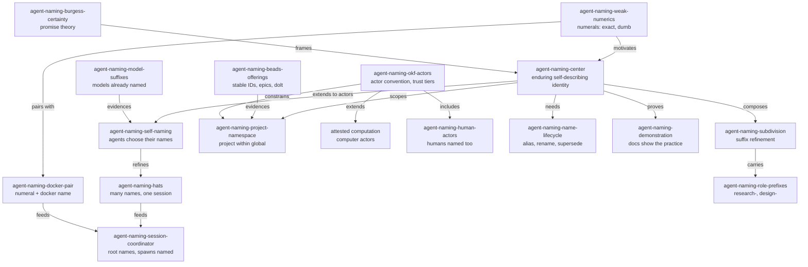

<a id="agent-naming"></a>
# Naming Agents — Exploration Wave Proposal

<a id="agent-naming-stage"></a>
## What Is Up

The rework has been building referentiality for documents: semantic anchors
that survive rewording, qualified knowledge IDs sharing a namespace with
beads tickets, a docroot and terms of art, OKF frontmatter that names its
writer and its checker. One class of actor remains unnamed: **agents**.
Subagents are addressed by session handles (`ses_...`) — exact, numerical,
and self-describing to no one. The root session does many different kinds of
work under one number, with no way to say which thing it is being today.

The idea, five minutes old when proposed and already an obsession: agents
ought to be given names, ideally names they choose themselves, names that
relate to the names around them — because we are creating a project
namespace, within a global namespace, where topics, agents, and issues all
have names. This wave explores that idea before any of it hardens.

The proposal you are reading does two jobs. First, it captures the idea as it
arrived — the concrete center, the swirl around it — with each idea given
its own enduring identifier, used throughout, so the document demonstrates
the practice it proposes. Second, it specifies the wave: five agents (GX,
SX, SM, FM, LX), each writing an independent exploration, launched in the
background when the human says go. **Launch is held.** Another agent may be
added to this wave later; that request is expected and waited for.

<a id="agent-naming-center"></a>
## The Concrete Center, And What Swirls

<a id="agent-naming-center-stamp"></a>
### The center we can stamp down

`agent-naming-center`: **identity and referentiality — enduring,
self-describing markers for every actor and artifact in the workspace, with
names that subdivide.** A name is a handle that survives change, describes
its referent, and composes with other names. Everything below either serves
that center or orbits it.

`agent-naming-weak-numerics` **motivates** the center: numerical indexes
(`ses_...`, list positions, change IDs, `sources[0]`) were weak because they
are not referentially stable as markdowns change and describe nothing. OKF
made the same move when it replaced positional citation with keyed `sources`
IDs. Names as primary, numerals as the exact-but-dumb layer beneath.

### The swirl

| Identifier | The idea |
|---|---|
| `agent-naming-self-naming` | Agents name themselves. The root session self-names, changes its name, or wears many names at once. |
| `agent-naming-hats` | A session does more than one thing: one numerical identity wears many hats — aliases, one per concern. |
| `agent-naming-docker-pair` | Docker-style dual naming: everyone gets both a numerical name and a docker name. The human likes this. |
| `agent-naming-subdivision` | Names subdivide: talk about what happens within a name by adding more suffixes. This path — `constitution/naming/exploration/` — already does it. |
| `agent-naming-project-namespace` | A project namespace within a global namespace; topics, agents, and issues are co-tenants. |
| `agent-naming-role-prefixes` | `research-`, `design-` and kin factor into names as role components. |
| `agent-naming-beads-offerings` | Beads has modeling offerings we lean on only a little: stable human-readable IDs, epics, labels, dependency edges, `--claim`, rename-with-reference-rewrite, and dolt underneath making the graph queryable. |
| `agent-naming-okf-actors` | OKF's actor convention (`human:<id>`, `process:<id>`, `<producer>/<version>`), trust tiers keyed on the `human:` prefix, and Attested Computation — executors and attesters as *computer actors*. |
| `agent-naming-human-actors` | Humans are actors too and should be named; the trust system already depends on it. |
| `agent-naming-burgess-certainty` | Mark Burgess, *In Search of Certainty*: promise theory, autonomous agents, names and semantics, certainty as a feeling. Research task of its own. |
| `agent-naming-model-suffixes` | We already name models in wave filename suffixes; the practice extends from model types to agent instances. |
| `agent-naming-session-coordinator` | The root session as coordinator that names itself and names its children at spawn; task IDs let us speak to a named agent again. |
| `agent-naming-name-lifecycle` | Names live: alias, rename, supersede. Actors need a disposition story the way artifacts got one in hierarchy1. |
| `agent-naming-demonstration` | The documents themselves demonstrate the practice: mint identifiers, use them, weave their relations. |

### The constellation, drawn



Relations among these are stated with the constitution's relationship
vocabulary (motivates, constrains, extends, evidences, contrasts,
implements, inherits) so the network is legible, not decorative. Where an
idea **contrasts**: `agent-naming-hats` contrasts
`agent-naming-docker-pair` in granularity — the pair is one-to-one
(numeral↔name), hats are one-to-many (session↔concerns). Both may be true at
once; that tension is for the wave to hold, not for this proposal to
resolve.

<a id="agent-naming-agent-docs"></a>
# What Each Agent Writes

Five agents explore independently: **GX** (`glm-max-z`), **SX**
(`sol-max-gpt`), **SM** (`sol-medium-gpt`), **FM** (`flash-max`), **LX**
(`luna-xhigh-gpt`). Each writes one file:

```text
constitution/naming/exploration/draft0.<model-suffix>.md
```

Expected suffixes: GX `glm53m`, SX `sol56x`, SM `sol56m`, FM `glm53fm`,
LX `gpt56lx` (each agent confirms its own identity honestly in frontmatter —
that act is itself the practice). Each document carries five required
movements:

1. **The essence, written down.** Capture the idea in its pure essence so it
   makes sense: what is the concrete center we can stamp down? State it,
   defend it, and be willing to move it.
2. **The wider brainstorm.** Then brainstorm more around it, more widely:
   constellations of clustered items, nebulae that stay nebulous. Give ideas
   their own enduring identifiers and use them. Draw relations between
   ideas. Do not over-distill. Do not over-prescribe. Surround something
   beautiful with swirling thought.
3. **The wiring.** How, where, and why does this connect to the existing
   recent work — the constitution hierarchy revision, terms of art,
   namespace and anchors, OKF uplift, beads usage, subagent practice in
   `AGENTS.md`? Weave this thread amid the others; name the threads.
4. **In Search of Certainty.** Research Mark Burgess's *In Search of
   Certainty* (look across the web a little) and write a section relating it
   to naming, agents, and certainty. Its own section.
5. **Humans as named actors.** Humans should probably be named too —
   another actor class. Its own section.

Style requirements that are the point, not decoration:

- mint identifiers for your ideas; use them afterwards; let the document
  demonstrate the practices we are trying to encode;
- self-describing names over bare numerical indexes as primary identity;
- relations between ideas, stated in words, whenever a connection is
  load-bearing;
- both order AND nebula — make sense of the swirl without flattening it.

<a id="agent-naming-wiring"></a>
# Threads To Weave Into

The third movement above should find at least these threads (agents may
find more):

- [`README-heirarchy1.glm53m.md`](/constitution/README-heirarchy1.glm53m.md)
  — terms of art (`docroot`, disposition, public presence, migration
  vocabulary), OKF uplift, and the shift from location-carried trust to
  frontmatter-carried trust. Actor naming is the same shift for people and
  processes.
- The [canonical constitution](/constitution/README.md) — the shared
  ticket/anchor namespace, qualified IDs, inductive refinement (names
  subdividing is already its mechanic), forward anchors, and the actor
  identity already present in `generated.by`.
- The [OKF v0.2 SPEC](https://github.com/GoogleCloudPlatform/knowledge-catalog/blob/main/okf/SPEC.md)
  (local copy:
  [SPEC.md](file:///home/rektide/archive/GoogleCloudPlatform/knowledge-catalog/okf/SPEC.md))
  — §7 actor convention, §5.2–5.3 trust tiers keyed on `human:`, §10
  Attested Computation whose executors and attesters are computer actors
  with names and resources, §5.1 keyed source IDs replacing positional
  citation (the anti-`agent-naming-weak-numerics` precedent).
- Beads — what it offers beyond our tiny usage. Inspect
  `/.beads/issues.jsonl` for the real schema, `bd --help` for surface area;
  note stable `--id` names, epic/child namespacing, labels, dependency
  types (`blocks`, `supersedes`, `parent-child`), `--claim` as
  name-taking, rename-rewrites-references, and dolt as a queryable,
  versioned graph.
- [`AGENTS.md`](/AGENTS.md) — subagent practice (background agents, task
  IDs as handles — currently pure numerals), wave conventions, model
  suffixes as existing model-naming practice, doc-pass, `.test-agent/` as
  pre-history.
- The live wave itself: this directory,
  `constitution/naming/exploration/`, is a root topic subdividing by
  suffix — the demonstration is already running.

<a id="agent-naming-tensions"></a>
# Tensions Deliberately Left Open

- **Who mints names** — self, coordinator, or registry — and what happens
  on collision in the global namespace.
- **Stability vs liveness**: sessions morph; when does a hat deserve
  promotion to its own name, and when does a name retire?
- **Alias vs rename vs supersede** for actors; beads renames rewrite
  references, which is powerful and heavy.
- Whether agent names join the shared ticket/anchor namespace or live in a
  parallel actor namespace with bridges.
- What numerals still owe us: jj change IDs and session handles stay exact;
  names are the semantic layer, not a replacement.
- Proportionality: when has an actor earned a name at all?
- Privacy and the global namespace: what is named publicly, what stays
  local.

<a id="agent-naming-launch"></a>
# Launch Kit (Held)

Do not launch yet. When the human says go:

1. Optionally create the beads epic `rekon-agent-naming` (decision-type,
   P2) so the wave has a lifecycle handle, and record its ID here.
2. Spawn five background subagents — `glm-max-z`, `sol-max-gpt`,
   `sol-medium-gpt`, `flash-max`, `luna-xhigh-gpt` — each with the brief
   below, `draft0.<suffix>.md` filename adjusted per agent.
3. Hold a slot open: the human will ask for another agent soon. Wait for it.
4. On completion, collect each agent's references and minted identifier
   list; a synthesis round (`draft0-syn`) may follow once compared.

The brief, verbatim:

```text
You are a named-in-progress actor exploring "naming agents" for the rekon
workspace. Write constitution/naming/exploration/draft0.<suffix>.md
(replace <suffix> with your honest concise model name, e.g. glm53m,
sol56x, sol56m, glm53fm, gpt56lx). Do not read other draft0.* files in
this directory; independence is the evidence.

Read first:
- /constitution/naming/exploration/proposal0.glm53m.md (the proposal:
  center, swirl, constellation, threads, tensions)
- /constitution/README.md (namespace: qualified IDs, inductive refinement,
  forward anchors, relationship vocabulary)
- /constitution/README-heirarchy1.glm53m.md (terms of art, disposition,
  public presence)
- /AGENTS.md (subagents, waves, model suffixes, doc-pass)
- /home/rektide/archive/GoogleCloudPlatform/knowledge-catalog/okf/SPEC.md
  (actors, trust tiers, attested computation, keyed sources)
- /.beads/issues.jsonl and `bd --help` (what beads actually offers)

Write five movements: (1) the pure essence — the concrete center you can
stamp down, stated and defended; (2) the wider brainstorm — constellations,
clusters, nebulae; mint an enduring identifier per idea and use them;
draw relations between ideas in words; do not over-distill, do not
over-prescribe; (3) the wiring — how/where/why this connects to the recent
work named in the proposal's threads section, weaving this amid the others;
(4) research Mark Burgess's "In Search of Certainty" across the web and
write its own section relating it to naming, agents, and certainty;
(5) humans as named actors — its own section.

Let your document demonstrate the practice: identifiers minted and used,
self-describing names over bare numerical indexes, relations stated.
Carry OKF frontmatter with an honest generated.by naming your actual model
identity, semantic anchors on substantive sections, and jj commit your file
when done (message: "naming: exploration draft — <your suffix>"). In your
final reply, return your references (files and URLs consulted) and the full
list of identifiers you minted, so the coordinator can compare waves later.
```

<a id="agent-naming-cross-references"></a>
# Cross-References

- [`README-heirarchy1.glm53m.md`](/constitution/README-heirarchy1.glm53m.md)
  **motivates** this wave's vocabulary (disposition, terms of art) and
  **is piloted by** this directory's topic-subdividing shape.
- The [canonical constitution](/constitution/README.md) **constrains** the
  identifier mechanics (inductive refinement, namespace ownership) any
  naming scheme should inherit.
- The [OKF SPEC](https://github.com/GoogleCloudPlatform/knowledge-catalog/blob/main/okf/SPEC.md)
  **defines** the actor and trust machinery a naming scheme must compose
  with, and **evidences** the keyed-over-positional precedent.
- [`AGENTS.md`](/AGENTS.md) **coordinates** the wave mechanics and holds
  the subagent practice naming would illuminate.
- Beads corpus `/.beads/issues.jsonl` **evidences** stable named IDs
  working at our scale, mostly unexploited.
