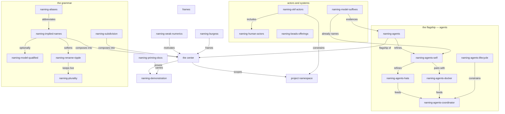

<a id="stage"></a>
# Naming — Exploration Wave Proposal, Revision 1

Revision 1 of the wave proposal. Revision 0 survives unchanged as the
critiqued original — its asymmetric anchors, with a root ID that did not
match its document identity, are themselves evidence for why this revision
exists.

A naming convention is demonstrated at the top of this document and used
throughout; see [grammar](#grammar) for what it means.

What changed from revision 0, on human direction:

- **Broadened scope.** Agents getting names remains the main innovation and
  receives special treatment — roughly 35–50% of the wave's effort and
  output — but the exploration is now more than the agent topic: the name
  grammar itself, aliases, referentiality across systems, humans, issues,
  and ideas.
- **Relaxed flow.** The five movements are no longer required, not even
  suggested: they are an *imagined flow*, a possible example the agents are
  free to re-interpret, take the spirit of, re-frame, re-assess, remix.
- **Grammar added.** A cluster of new ideas arrived between revisions:
  short anchors that imply their full names, optional model qualification,
  glossary aliases, and the rename ripple that long names risk.

<a id="stage-situation"></a>
## The Situation

The rework has been building referentiality for documents: semantic anchors,
qualified knowledge IDs shared with beads tickets, a docroot, terms of art,
OKF frontmatter naming writer and checker. Actors remain the unnamed class
in that economy — agents addressed by session numerals, humans implicit,
computations anonymous. The obsession, still young: **give the workspace's
actors and ideas enduring, self-describing names that compose** — with
agent self-naming as the flagship, and with the naming system itself now
under examination too, because between revision 0 and this one the naming
of names became interesting in its own right.

This proposal does two jobs: capture the idea field honestly — center,
swirl, grammar — with every idea carrying its own identifier, used
throughout, so the document demonstrates what it proposes; and specify the
wave: five agents (GX, SX, SM, FM, LX), each writing an independent
exploration, launched in the background when the human says go. **Launch is
held.** Another agent is expected to be added to this wave; that request is
waited for.

<a id="center"></a>
# The Center, And What Swirls

<a id="center-stamp"></a>
## The center we can stamp down

**Enduring, self-describing identity for every actor, artifact, and idea —
names that imply their context, subdivide, and compose.** A name is a
handle that survives rewording, describes its referent, expands from a
short local form to an exact global one, and connects to other names.
`naming-weak-numerics` motivates it: numerical indexes are exact but
describe nothing and are not referentially stable as markdowns change.
Names become the primary layer; numerals remain the dumb-but-exact layer
beneath.

<a id="swirl"></a>
# The Swirl

Ideas are clustered. The flagship cluster comes first and holds the main
innovation; the wave gives it roughly 35–50% of its attention with special
treatment, and lets the rest range across the broader field.

## The flagship — agents

| Local identifier | The idea |
|---|---|
| `naming-agents` | Agents themselves get names, ideally relating to the names around them — the main innovation. |
| `naming-agents-self` | Agents name themselves: the root session self-names, changes its name, or wears many names at once. |
| `naming-agents-hats` | A session does more than one thing: one numerical identity wears many hats — aliases, one per concern. Contrasts `naming-agents-docker` in granularity: the pair is one-to-one, hats are one-to-many. Both may hold at once. |
| `naming-agents-docker` | Docker-style dual naming: everyone gets a numerical name and a docker name. Human-endorsed. |
| `naming-agents-coordinator` | The root session as coordinator: names itself, names its children at spawn; task IDs let us address a named agent again. |
| `naming-agents-lifecycle` | Names live: alias, rename, supersede. Actors need the disposition story artifacts received in hierarchy1. |

## The grammar — how names mean

| Local identifier | The idea |
|---|---|
| `naming-implied-names` | Short local anchors imply their full names: `id="stage"` implies `constitution-naming-exploration-proposal1-stage`. Loved idea; the anchor carries the tip, the context carries the rest. |
| `naming-model-qualified` | Optional model segment — `constitution-naming-exploration-proposal1-glm53m-stage` — for exact resolution to one authoring agent. Usually omitted *deliberately*, to keep a useful ambiguity; cite specific agents when precision matters. A permissible feature, not a default. |
| `naming-aliases` | Long names are honest but heavy, so projects define aliases in their glossary, usually within the README. Endorsed starter: `constitution`→`con`, `exploration`→`exp`, `research`→`res`, `design` and `draft` written whole. `con-naming-exp-agent-naming` is not the worst — an OK example. |
| `naming-subdivision` | Names subdivide by suffix refinement to speak of parts: this document's own path is the demo. |
| `naming-rename-ripple` | The trade-off: file renames imply updating references — in-project, and potentially many links across the global namespace. Implied names soften it: the local anchor never needs rewriting; only fully-qualified external citations do. Compatibility stubs (hierarchy1's migration vocabulary) mitigate the rest. |
| `naming-plurality` | The felt risk: inventing more than one name and reference system at once, internal versus external names. Partially dissolved by `naming-implied-names` — one name, two resolutions — but worth holding as a live tension. |

## Actors and systems

| Local identifier | The idea |
|---|---|
| `naming-okf-actors` | OKF's actor convention (`human:<id>`, `process:<id>`, `<producer>/<version>`), trust tiers keyed on the `human:` prefix, and Attested Computation — executors and attesters as computer actors. |
| `naming-human-actors` | Humans are actors and should be named too; the trust system already depends on the `human:` prefix being meaningful. |
| `naming-beads-offerings` | Beads modeling we barely use: stable human-readable IDs, epics, labels, dependency edges, `--claim` as name-taking, rename-with-reference-rewrite, dolt making the graph queryable. |
| `naming-model-suffixes` | We already name models in wave filename suffixes; the practice extends from model types to agent instances. |

## Frames

| Local identifier | The idea |
|---|---|
| `naming-burgess` | Mark Burgess, *In Search of Certainty*: promise theory, autonomous agents, names and semantics, certainty as a feeling. Research movement of its own. |
| `naming-priming-docs` | Documents built to feed and prime the agents that will read them — this proposal is one, and the practice is loved and already mentioned elsewhere; the wave leans on it deliberately. |
| `naming-demonstration` | The documents themselves demonstrate the practice: identifiers minted and used, relations woven, no bare numerical index carrying meaning. |

<a id="constellation"></a>
# The Constellation, Drawn



Relations use the constitution's vocabulary (motivates, constrains,
extends, refines, evidences, contrasts, frames) so the network stays
legible. One named contrast is load-bearing: `naming-agents-hats`
**contrasts** `naming-agents-docker` — granularity, not opposition.

<a id="grammar"></a>
# The Name Grammar This Document Demonstrates

Revision 0 was caught using section names that varied from its document
identity — root ID `agent-naming` inside a file whose honest name was
`constitution-naming-exploration-proposal0`. This revision demonstrates a
candidate grammar instead of preaching it:

1. **Anchors are terminal segments; the document implies the rest.** The
   anchor on this section is `id="grammar"`. Its full name is implied:
   `constitution-naming-exploration-proposal1-grammar`. Nothing in the file
   repeats the prefix; the context carries it.
2. **Model qualification is permissible, optional, and usually withheld.**
   `constitution-naming-exploration-proposal1-glm53m-grammar` resolves to
   exactly this revision by this author. Omitting it is deliberate: the
   unqualified name covers revision 0's counterpart section too, and that
   ambiguity is often the point. Cite specific agents when exactness
   matters.
3. **Concept identifiers imply their concern.** The swirl's local
   identifiers expand by concern-prefixing: `naming-agents-hats` ⇒
   `constitution-naming-agents-hats`. A workspace-scoped resolution is
   equally valid when ambiguity suffices — `con-naming-exp-agent-naming`
   is the endorsed example. Concept IDs and document-section anchors are
   different kinds of names; both expand.
4. **Aliases live in the project glossary, usually the README.** Starter
   set: `con`, `exp`, `res`, with `design` and `draft` written whole.
   Global terms like `exp-`/`res-` work as prefix components in longer
   names.
5. **Renames ripple, and implication is the dam.** A moved or renamed file
   changes the full names of every section it contains — for free, with no
   in-file edits. What breaks is only the fully-qualified external
   citation, which is exactly where compatibility stubs and deliberate
   aliasing apply.

This grammar is a proposal-within-the-proposal: prime material for the
wave to confirm, remix, or overturn.

<a id="flow"></a>
# An Imagined Flow

Not required. Not even suggested. An imagined flow — a possible example of
how an exploration document might move, offered in the spirit that agents
are free to re-interpret, take the spirit of, re-frame, re-assess, remix
as they may:

1. **The essence, written down.** Capture the pure essence so it makes
   sense: the concrete center to stamp, stated and defended — and movable.
2. **The wider brainstorm.** Constellations, clusters, nebulae that stay
   nebulous; identifiers minted and used; relations drawn in words; not
   over-distilled, not over-prescribed.
3. **The wiring.** How, where, why this connects to the recent work,
   weaving the thread amid the others, naming the threads.
4. **In Search of Certainty.** Burgess researched across the web, related
   back — its own movement.
5. **Humans as named actors.** Its own movement.

If followed as-is, the weighting guidance applies: the agent flagship
receives roughly 35–50% of the effort with special treatment; the rest
ranges across the grammar, the actor systems, the frames. Mechanics, as
distinct from content, are not negotiable — one file, independence,
honest frontmatter, a commit — because they are what make the waves
comparable, not what the waves say.

<a id="threads"></a>
# Threads To Weave Into

- [`README-heirarchy1.glm53m.md`](/constitution/README-heirarchy1.glm53m.md)
  — terms of art, disposition, public presence, migration vocabulary
  (compatibility stubs for the rename ripple), and the same
  location-to-frontmatter trust shift naming now proposes for actors.
- The [canonical constitution](/constitution/README.md) — qualified IDs,
  inductive refinement (subdivision is its mechanic), forward anchors,
  relationship vocabulary, actor identity already in `generated.by`.
- The [OKF v0.2 SPEC](https://github.com/GoogleCloudPlatform/knowledge-catalog/blob/main/okf/SPEC.md)
  (local copy:
  [SPEC.md](file:///home/rektide/archive/GoogleCloudPlatform/knowledge-catalog/okf/SPEC.md))
  — §7 actors, §5.2–5.3 trust tiers, §10 Attested Computation's computer
  actors, §5.1 keyed source IDs replacing positional citation.
- Beads — `/.beads/issues.jsonl` for the real schema, `bd --help` for the
  surface, and the offerings listed under `naming-beads-offerings`.
- [`AGENTS.md`](/AGENTS.md) — subagent practice, wave conventions, model
  suffixes, doc-pass, `.test-agent/` as pre-history.
- The live wave itself — this directory subdivides
  `constitution > naming > exploration`, revision numbering is visible in
  `proposal0`/`proposal1`, and this document is a `naming-priming-docs`
  instance: built to feed the agents that will read it.

<a id="tensions"></a>
# Tensions Deliberately Left Open

- **Who mints names** — self, coordinator, or registry — and global
  collision policy.
- **Stability vs liveness**: when a hat is promoted to its own name; when
  a name retires.
- **Alias vs rename vs supersede** for actors and for ideas.
- **Alias governance**: who curates the glossary, how abbreviations drift,
  what happens when two projects abbreviate differently.
- **Rename ripple vs implied names**: how much mitigation is real and how
  much is hope; where fully-qualified citation is worth its brittleness.
- **Plurality**: document anchors, concept IDs, beads IDs, actor names —
  one namespace with bridges, or several with translations?
- **Numerals' residual role**: jj change IDs and session handles stay
  exact; names are the semantic layer, not a replacement.
- **Proportionality**: when has an actor or idea earned a name at all?
- **Privacy and the global namespace**: what is named publicly, what stays
  local.

<a id="launch"></a>
# Launch Kit (Held)

Do not launch yet. When the human says go:

1. Optionally create the beads epic `rekon-agent-naming` (decision-type,
   P2) so the wave has a lifecycle handle; record its ID here.
2. Spawn five background subagents — `glm-max-z`, `sol-max-gpt`,
   `sol-medium-gpt`, `flash-max`, `luna-xhigh-gpt` — each with the brief
   below, `draft0.<suffix>.md` adjusted per agent.
3. Hold a slot open: the human will ask for another agent soon. Wait.
4. On completion, collect each agent's references and minted identifier
   list; a synthesis round may follow once the waves are compared.

The brief, verbatim:

```text
You are a named-in-progress actor exploring "naming" for the rekon
workspace. Write constitution/naming/exploration/draft0.<suffix>.md
(replace <suffix> with your honest concise model name, e.g. glm53m,
sol56x, sol56m, glm53fm, gpt56lx). Do not read other draft0.* files in
this directory; independence is the evidence.

Prime yourself on:
- /constitution/naming/exploration/proposal1.glm53m.md (the center, the
  swirl with identifiers, the name grammar, the threads, the tensions)
- /constitution/README.md (namespace: qualified IDs, inductive refinement,
  forward anchors, relationship vocabulary)
- /constitution/README-heirarchy1.glm53m.md (terms of art, disposition,
  public presence)
- /AGENTS.md (subagents, waves, model suffixes, doc-pass)
- /home/rektide/archive/GoogleCloudPlatform/knowledge-catalog/okf/SPEC.md
  (actors, trust tiers, attested computation, keyed sources)
- /.beads/issues.jsonl and `bd --help` (what beads actually offers)

The proposal is priming material, not instruction. It imagines a flow —
essence, wider brainstorm, wiring, Burgess, humans — that you are free to
re-interpret, take the spirit of, re-frame, re-assess, remix. If you
follow it, weight the agent flagship (agents getting names) at roughly
35-50% of your effort with special treatment, and range across the rest:
the name grammar, aliases, actor systems, frames. Whatever you write:

- mint an enduring identifier per idea and use it afterwards;
- prefer self-describing names over bare numerical indexes;
- state relations between ideas in words when the connection is
  load-bearing;
- keep both order AND nebula — make sense of the swirl without flattening
  it.

Mechanics are fixed so waves stay comparable: OKF frontmatter with an
honest generated.by naming your actual model identity, semantic anchors,
and a jj commit when done (message: "naming: exploration draft —
<your suffix>"). In your final reply, return your references (files and
URLs consulted) and the full list of identifiers you minted, so the
coordinator can compare waves later.
```

<a id="cross-references"></a>
# Cross-References

- [`proposal0.glm53m.md`](/constitution/naming/exploration/proposal0.glm53m.md)
  **is revised by** this document and **evidences** the anchor-asymmetry
  problem the grammar cluster answers.
- [`README-heirarchy1.glm53m.md`](/constitution/README-heirarchy1.glm53m.md)
  **motivates** the vocabulary any naming scheme inherits and **supplies**
  compatibility stubs for `naming-rename-ripple`.
- The [canonical constitution](/constitution/README.md) **constrains** the
  mechanics (inductive refinement, namespace ownership) and **will be
  amended by** whatever the wave eventually proposes.
- The [OKF SPEC](https://github.com/GoogleCloudPlatform/knowledge-catalog/blob/main/okf/SPEC.md)
  **defines** the actor and trust machinery naming must compose with.
- [`AGENTS.md`](/AGENTS.md) **coordinates** the wave mechanics and holds
  the subagent practice the flagship would illuminate.
- The beads corpus `/.beads/issues.jsonl` **evidences** stable named IDs
  working at our scale, mostly unexploited.
