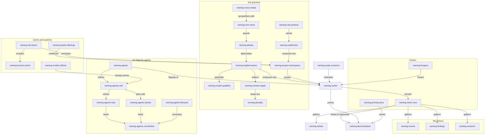

<a id="stage"></a>
# Naming And The New Core — Exploration Wave Proposal, Revision 2

This revision takes the idea from the top and integrates all three rounds
of direction, rather than patching forward. The chain survives as evidence:
revision 0 caught the agents-only framing and asymmetric anchors; revision 1
broadened into the name grammar and relaxed the flow; revision 2 integrates
— one name per entity, an honest weighting, and the real ambition named.

A naming convention is demonstrated at the top of this document and used
throughout; see [grammar](#grammar).

<a id="stage-where"></a>
## Where This Stands

What started as "subagents ought to be given names" has become: **rekon
seeks a new core — a new spiritual home for what the project is — as a
wiki-ish system of knowledge, agents, events, findings, research, and the
rest, named and referable within projects and implicitly therefore across
projects.** Naming is the kernel of that core: the part we can build first,
demonstrate in living documents, and grow outward until the named system
*is* the project.

Three commitments organize everything below:

1. **One name per entity.** A strong desire, freshly revved on: entities,
   nodes, and references should not accumulate second names. The effort is
   on alert for duplicates and tries to make good on this everywhere,
   including in its own diagrams. See [one-name](#one-name).
2. **Agents are the flagship, not the whole.** The agent innovation —
   actors that name themselves — receives special treatment at roughly
   15–40% of the wave's effort. The rest ranges across the grammar, the
   census of what gets named, the actor systems, and the frames.
3. **Supersede, don't decorate.** The wave should not merely figure out how
   to rework and thread itself into existing documents; it should in part
   seek to replace them — to become the new document. See
   [supersede](#supersede).

This proposal does two jobs: capture the idea field honestly — center,
swirl, grammar, ambition — with every idea carrying its own single
identifier, used throughout, so the document demonstrates what it proposes;
and specify the wave: five agents (GX, SX, SM, FM, LX), each writing an
independent exploration, launched in the background when the human says go.
**Launch is held.** Another agent is expected to be added to this wave;
that request is waited for.

<a id="center"></a>
# The Center

**Enduring, self-describing identity for every entity in the workspace —
one name per entity, names that imply their context, subdivide, and
compose — within projects, and implicitly therefore across projects.**
Call it `naming-center`. A name is a handle that survives rewording,
describes its referent, expands from a short local form to an exact global
one, and connects to other names. The entities are the census of a wiki-ish
system: knowledge and documents, agents and humans, events, findings,
research, issues, computations.

`naming-weak-numerics` motivates the center: numerical indexes are exact
but describe nothing and are not referentially stable as markdowns change.
Names become the primary layer; numerals remain the dumb-but-exact layer
beneath.

The center is the kernel of `naming-rekon-core`: name things well and the
rest of the system — referentiality, trust, promotion, migration — has
something durable to stand on.

<a id="one-name"></a>
# The One-Name Discipline

The strongest fresh desire, and a standing goal of this effort: **avoid
giving entities, nodes, and references multiple names.** Duplicated names
drift apart; the duplicates themselves become rename-ripple liabilities;
and every bracketed diagram label is a small fork of identity.

In practice, here and in the wave:

- the identifier *is* the name; documents use it and only it;
- when a name must survive a hostile medium — a mermaid node id, a YAML
  key, a filename — contort the name as it is into viability (hyphenate,
  drop separators) rather than minting a labeled duplicate. Every node in
  [constellation](#constellation) is drawn this way;
- an alias is an *abbreviated resolution form of the same name* —
  `con-naming-exp-agent-naming` resolves `constitution-naming-…` — not a
  second identity. Aliases live in the project glossary, usually the
  README, and expand deterministically;
- positional handles (`sources[0]`, list order, bare session numerals) are
  not names and must not be asked to do naming's work;
- when a genuine second name appears anyway, treat it as a finding: name
  the duplicate, decide which form is the name, alias or retire the other.

<a id="swirl"></a>
# The Swirl

Ideas are clustered. Each carries one local identifier that concern-expands
(`naming-agents-hats` ⇒ `constitution-naming-agents-hats`).

<a id="swirl-flagship"></a>
## The flagship — agents (~15–40% of the wave's effort)

| Identifier | The idea |
|---|---|
| `naming-agents` | Agents themselves get names, ideally relating to the names around them — the main innovation. |
| `naming-agents-self` | Agents name themselves: the root session self-names, changes its name, or wears many names at once. |
| `naming-agents-hats` | A session does more than one thing: one numerical identity wears many hats — aliases, one per concern. Contrasts `naming-agents-docker` in granularity: the pair is one-to-one, hats are one-to-many. Both may hold at once. |
| `naming-agents-docker` | Docker-style dual naming: everyone gets a numerical name and a docker name. Human-endorsed. |
| `naming-agents-coordinator` | The root session as coordinator: names itself, names its children at spawn; task IDs let us address a named agent again. |
| `naming-agents-lifecycle` | Names live: alias, rename, supersede. Actors need the disposition story artifacts received in hierarchy1. |

<a id="swirl-grammar"></a>
## The grammar — how names mean

| Identifier | The idea |
|---|---|
| `naming-one-name` | One name per entity; the discipline this document practices and the wave must keep making good on. |
| `naming-cross-modal` | Cross-modal sympathy: markdown anchors, mermaid node ids, beads IDs, YAML keys, and filenames share one namespace — contortion and aliases let a name live in every medium. The epic name `rekon-con-naming` is itself an instance: an alias inside a beads ID. |
| `naming-implied-names` | Short local anchors imply their full names: `id="stage"` implies `constitution-naming-exploration-proposal2-stage`. The anchor carries the tip; context carries the rest. |
| `naming-model-qualified` | Optional model segment — `constitution-naming-exploration-proposal2-glm53m-stage` — for exact resolution to one authoring agent. Usually omitted *deliberately* to keep useful ambiguity; cite specific agents when precision matters. Permissible, not default. |
| `naming-aliases` | Projects define abbreviations in their glossary, usually the README: `constitution`→`con`, `exploration`→`exp`, `research`→`res`, with `design` and `draft` written whole. `con-naming-exp-agent-naming` is not the worst — an OK example. |
| `naming-subdivision` | Names subdivide by suffix refinement to speak of parts: this document's own path is the demo. |
| `naming-role-prefixes` | `research-`, `design-` and kin factor into names as role components — prefixes turned into longer prefixes for global terms (`exp-`, `res-`). |
| `naming-project-namespace` | A project namespace within a global namespace; topics, agents, issues, and ideas are co-tenants. |
| `naming-rename-ripple` | The trade-off: file renames imply updating references in-project and potentially across the global namespace. Implied names soften it — the local anchor never needs rewriting; only fully-qualified external citations do — and compatibility stubs (hierarchy1) catch the rest. |
| `naming-plurality` | The felt risk: inventing more than one name and reference system at once, internal versus external. Partially dissolved by `naming-implied-names` — one name, two resolutions — but hold it as a live tension. |

<a id="swirl-census"></a>
## The census — what gets named

| Identifier | The idea |
|---|---|
| `naming-events` | Events as first-class named entities: waves launched, acceptances, promotions, migrations — the system's history becoming citable. |
| `naming-findings` | Findings as named, citable outputs of research — smaller than documents, bigger than claims. |
| `naming-research` | Research as an entity kind with its own names, succeeding the legacy `discovery` term as hierarchy1 provides. |
| `naming-tickets` | Tickets as one of the most user-visible framings we have: epic names read as the project's topic index. Pulling tickets into the named system is key. |
| — | Knowledge/documents, agents, humans, issues, and computations appear in their own clusters below; the census gathers them all. |

<a id="swirl-actors"></a>
## Actors and systems

| Identifier | The idea |
|---|---|
| `naming-okf-actors` | OKF's actor convention (`human:<id>`, `process:<id>`, `<producer>/<version>`), trust tiers keyed on the `human:` prefix, and Attested Computation — executors and attesters as computer actors. |
| `naming-human-actors` | Humans are actors and should be named too; the trust system already depends on the `human:` prefix being meaningful. |
| `naming-beads-offerings` | Beads modeling we barely use: stable human-readable IDs, epics, labels, dependency edges, `--claim` as name-taking, rename-with-reference-rewrite, dolt making the graph queryable. |
| `naming-model-suffixes` | We already name models in wave filename suffixes; the practice extends from model types to agent instances. |
| `naming-weak-numerics` | Numerals: exact, dumb, not referentially stable, self-describing to no one. |

<a id="swirl-frames"></a>
## Frames

| Identifier | The idea |
|---|---|
| `naming-rekon-core` | The ambition: a new core, a new spiritual home for rekon at large — what the project *is* — as a wiki-ish system of named knowledge, agents, events, findings, research, within projects and implicitly across projects. |
| `naming-burgess` | Mark Burgess, *In Search of Certainty*: promise theory, autonomous agents, names and semantics, certainty as a feeling. Research movement of its own. |
| `naming-priming-docs` | Documents built to feed and prime the agents that will read them — this proposal is one, the practice is loved and already recognized elsewhere, and the wave leans on it deliberately. |
| `naming-demonstration` | The documents themselves demonstrate the practice: identifiers minted and used, one name each, relations woven, no bare numerical index carrying meaning. |

<a id="constellation"></a>
# The Constellation, Drawn

Every node is drawn as its identifier — contorted into mermaid viability,
never labeled with a duplicate. Subgraph ids are the cluster names, equally
contorted. This is the one-name discipline operating in a hostile medium.



Relations use the constitution's vocabulary (motivates, constrains,
refines, evidences, contrasts, frames) so the network stays legible. The
one named contrast remains load-bearing: `naming-agents-hats` **contrasts**
`naming-agents-docker` — granularity, not opposition.

<a id="grammar"></a>
# The Name Grammar This Document Demonstrates

Revision 0 was caught using section names that varied from its document
identity. This document demonstrates the candidate grammar instead of
preaching it:

1. **Anchors are terminal segments; the document implies the rest.** The
   anchor on this section is `id="grammar"`. Its full name is implied:
   `constitution-naming-exploration-proposal2-grammar`. Nothing in the file
   repeats the prefix; context carries it.
2. **Model qualification is permissible, optional, and usually withheld.**
   `constitution-naming-exploration-proposal2-glm53m-grammar` resolves to
   exactly this revision by this author. Omission is deliberate: the
   unqualified name covers the chain's counterpart sections too, and that
   ambiguity is often the point.
3. **Concept identifiers imply their concern.** Swirl identifiers expand by
   concern-prefixing: `naming-agents-hats` ⇒
   `constitution-naming-agents-hats`. A workspace-scoped resolution is
   equally valid when ambiguity suffices — `con-naming-exp-agent-naming`
   is the endorsed example. Concept IDs and document-section anchors are
   different kinds of names; both expand.
4. **Aliases abbreviate the one name; they are not second names.** Starter
   glossary: `con`, `exp`, `res`, with `design` and `draft` written whole.
   Global abbreviations work as prefix components in longer names.
5. **One name per entity, contorted when the medium is hostile.** Diagram
   nodes are their identifiers; subgraph ids are their cluster names; no
   bracketed duplicates. A YAML key or filename bends the name's spelling,
   never mints a peer.
6. **Renames ripple, and implication is the dam.** A moved or renamed file
   changes the full names of every section it contains — for free, with no
   in-file edits. What breaks is only the fully-qualified external
   citation, which is exactly where compatibility stubs and deliberate
   aliasing apply.

This grammar is a proposal-within-the-proposal: prime material for the
wave to confirm, remix, or overturn.

<a id="supersede"></a>
# Supersede, Don't Decorate

The wave should not merely figure out how to rework and thread itself into
the existing documents. It should in part seek to **replace** them — to
become the new document, the new core, the new spiritual home for what
rekon is. The threads listed under [threads](#threads) are therefore both
priming material and supersede candidates: the canonical constitution's
namespace sections, the hierarchy revision's terms of art, the scattered
conventions in `AGENTS.md` — any of them may be absorbed into whatever the
wave's synthesis becomes, leaving the originals as honored history rather
than living authority.

Superseding is earned, not forced. Current law — prospective adoption,
grandfathering, no pruning — still applies while the successor earns its
place: it must be *better at being the home*, not merely newer. The
tension between ambition and restraint is held deliberately in
[tensions](#tensions).

<a id="flow"></a>
# An Imagined Flow

Not required. Not even suggested. An imagined flow — a possible example of
how an exploration document might move, offered in the spirit that agents
are free to re-interpret, take the spirit of, re-frame, re-assess, remix
as they may:

1. **The essence, written down.** Capture the pure essence so it makes
   sense: the concrete center to stamp, stated and defended — and movable.
2. **The wider brainstorm.** Constellations, clusters, nebulae that stay
   nebulous; identifiers minted and used, one name each; relations drawn
   in words; not over-distilled, not over-prescribed.
3. **The wiring — or the superseding.** How, where, why this connects to
   the existing work; and where it should aim to replace rather than
   decorate, becoming the new home for what rekon is.
4. **In Search of Certainty.** Burgess researched across the web, related
   back — its own movement.
5. **Humans as named actors.** Its own movement.

If followed as-is, the weighting guidance applies: the agent flagship at
roughly 15–40% with special treatment; the rest across the grammar, the
census, the actor systems, the frames. Mechanics, as distinct from
content, are not negotiable — one file, independence, honest frontmatter,
a commit — because they make the waves comparable, not what the waves say.

<a id="threads"></a>
# Threads To Weave Into — And To Supersede

- The [canonical constitution](/constitution/README.md) — qualified IDs,
  inductive refinement, forward anchors, relationship vocabulary, actor
  identity in `generated.by`. The primary supersede candidate: its
  namespace sections want to become part of the new core.
- [`README-heirarchy1.glm53m.md`](/constitution/README-heirarchy1.glm53m.md)
  — terms of art, disposition, public presence, migration vocabulary
  (compatibility stubs for `naming-rename-ripple`). Also a candidate: the
  docroot and topic machinery wants a home in the named system, not a
  parallel one.
- The [OKF v0.2 SPEC](https://github.com/GoogleCloudPlatform/knowledge-catalog/blob/main/okf/SPEC.md)
  (local copy:
  [SPEC.md](file:///home/rektide/archive/GoogleCloudPlatform/knowledge-catalog/okf/SPEC.md))
  — §7 actors, §5.2–5.3 trust tiers, §10 Attested Computation's computer
  actors, §5.1 keyed source IDs replacing positional citation. A neighbor
  to compose with, not to replace.
- Beads — `/.beads/issues.jsonl` for the real schema, `bd --help` for the
  surface, and the offerings listed under `naming-beads-offerings`. Issues
  are already named citizens, and tickets are among our most user-visible
  framings: the epic names read as the project's topic index, and the
  corpus itself evidences the shift from opaque generated IDs
  (`rekon-13x`, `rekon-4kh`) to self-describing ones
  (`rekon-doc-constitution-hierarchy`). The census learns from them.
- [`AGENTS.md`](/AGENTS.md) — subagent practice, wave conventions, model
  suffixes, doc-pass, `.test-agent/` as pre-history. Its scattered naming
  conventions want gathering into the core.
- The live wave itself — this directory subdivides
  `constitution > naming > exploration`, the revision chain is visible in
  `proposal0`/`proposal1`/`proposal2`, and this document is a
  `naming-priming-docs` instance: built to feed the agents that will read
  it.

<a id="tensions"></a>
# Tensions Deliberately Left Open

- **One name vs aliases**: if an alias is an abbreviated resolution form,
  where exactly is the line before it behaves as a second name? Who judges
  drift?
- **Supersede vs restraint**: earning replacement without violating
  grandfathering and prospective adoption; when is a successor *the*
  document and the predecessor merely history?
- **Who mints names** — self, coordinator, or registry — and global
  collision policy.
- **Stability vs liveness**: when a hat is promoted to its own name; when
  a name retires.
- **Alias governance**: who curates the glossary, how abbreviations drift,
  what happens when two projects abbreviate differently.
- **Rename ripple vs implied names**: how much mitigation is real and how
  much is hope; where fully-qualified citation is worth its brittleness.
- **Plurality**: document anchors, concept IDs, beads IDs, actor names —
  one namespace with bridges, or several with translations?
- **Scope of the concern**: has `constitution/naming/` already been
  outgrown by `naming-rekon-core`? Moving would be its own rename-ripple
  exercise — a live demonstration either way.
- **Numerals' residual role**: jj change IDs and session handles stay
  exact; names are the semantic layer, not a replacement.
- **Proportionality**: when has an actor, event, or finding earned a name
  at all?
- **Privacy and the global namespace**: what is named publicly, what stays
  local.

<a id="launch"></a>
# Launch Kit (Held)

Do not launch yet. When the human says go:

1. Optionally create the beads epic `rekon-con-naming` (decision-type,
   P2) so the wave has a lifecycle handle; record its ID here. The name is
   itself cross-modal: an alias (`con`) living inside a beads ID.
2. Spawn five background subagents — `glm-max-z`, `sol-max-gpt`,
   `sol-medium-gpt`, `flash-max`, `luna-xhigh-gpt` — each with the brief
   below, `draft0.<suffix>.md` adjusted per agent.
3. Hold a slot open: the human will ask for another agent soon. Wait.
4. On completion, collect each agent's references and minted identifier
   list; a synthesis round may follow once the waves are compared.

The brief, verbatim:

```text
You are a named-in-progress actor exploring "naming" for the rekon
workspace. Write constitution/naming/exploration/draft0.<suffix>.md
(replace <suffix> with your honest concise model name, e.g. glm53m,
sol56x, sol56m, glm53fm, gpt56lx). Do not read other draft0.* files in
this directory; independence is the evidence.

Prime yourself on:
- /constitution/naming/exploration/proposal2.glm53m.md (the center, the
  one-name discipline, the swirl with identifiers, the grammar, the
  supersede ambition, the threads, the tensions)
- /constitution/README.md (namespace: qualified IDs, inductive refinement,
  forward anchors, relationship vocabulary)
- /constitution/README-heirarchy1.glm53m.md (terms of art, disposition,
  public presence)
- /AGENTS.md (subagents, waves, model suffixes, doc-pass)
- /home/rektide/archive/GoogleCloudPlatform/knowledge-catalog/okf/SPEC.md
  (actors, trust tiers, attested computation, keyed sources)
- /.beads/issues.jsonl and `bd --help` (what beads actually offers;
  tickets are our most user-visible framings — epic names read as the
  project's topic index)

The proposal is priming material, not instruction. It imagines a flow —
essence, wider brainstorm, wiring-or-superseding, Burgess, humans — that
you are free to re-interpret, take the spirit of, re-frame, re-assess,
remix. If you follow it, weight the agent flagship (actors naming
themselves) at roughly 15-40% of your effort with special treatment, and
range across the rest: the name grammar, the census of named entities
(knowledge, agents, events, findings, research), the actor systems, the
frames. The deepest frame: rekon seeking a new core, a new spiritual home
— a wiki-ish system of named entities within projects and implicitly
across projects. Where your work earns it, aim to supersede — to become
part of the new home — not merely to thread into existing documents.
Whatever you write:

- mint an enduring identifier per idea and use it afterwards — one name
  per entity, no duplicates; when a medium is hostile (mermaid ids, YAML
  keys), contort the name rather than labeling a copy;
- prefer self-describing names over bare numerical indexes;
- state relations between ideas in words when the connection is
  load-bearing;
- keep both order AND nebula — make sense of the swirl without flattening
  it.

Mechanics are fixed so waves stay comparable: OKF frontmatter with an
honest generated.by naming your actual model identity, semantic anchors,
and a jj commit when done (message: "naming: exploration draft —
<your suffix>"). In your final reply, return your references (files and
URLs consulted) and the full list of identifiers you minted, so the
coordinator can compare waves later.
```

<a id="cross-references"></a>
# Cross-References

- [`proposal1.glm53m.md`](/constitution/naming/exploration/proposal1.glm53m.md)
  and
  [`proposal0.glm53m.md`](/constitution/naming/exploration/proposal0.glm53m.md)
  **are superseded in part by** this document, and **evidence** the
  asymmetry and weighting problems their rounds surfaced.
- The [canonical constitution](/constitution/README.md) **constrains** the
  mechanics today and **is the primary supersede candidate** the wave's
  synthesis may absorb.
- [`README-heirarchy1.glm53m.md`](/constitution/README-heirarchy1.glm53m.md)
  **supplies** compatibility stubs for `naming-rename-ripple` and **is a
  candidate** for absorption into the named core.
- The [OKF SPEC](https://github.com/GoogleCloudPlatform/knowledge-catalog/blob/main/okf/SPEC.md)
  **defines** the actor and trust machinery naming must compose with.
- [`AGENTS.md`](/AGENTS.md) **coordinates** the wave mechanics and holds
  naming conventions wanting gathering.
- The beads corpus `/.beads/issues.jsonl` **evidences** stable named IDs
  working at our scale, mostly unexploited.
