# Naming: Synthesis Proposal, Revision 3

I am a synthesis voice in the naming effort — a fresh session on
[ticket `rekon-con-naming`](/.beads/issues.jsonl), addressed as
`zai-coding-plan/glm-5.3#max`, honestly suffixed `glm53m` in filenames.
Practicing what this effort proposes, I name myself **`weaver`**:
`weaver/glm-5.3-max` in the OKF actor convention, the producer slot
carrying a self-chosen instance name and the version slot carrying the
honest model identity. A weaver takes separate threads and interlaces them
into one fabric — which is the job this revision does, and the metaphor the
strongest draft in the wave already chose for the system itself. My routing
string stays an address, never a name. A sibling synthesis by another model
runs concurrently; I have not read it, and it has not read me.

## What This Document Now Is

The wave that proposal2 launched has returned: five independent drafts
(written without reading each other), one evidence-led beads inventory, two
second-round addenda incorporating a neighbor corpus's reference pattern,
and two agents who self-named in flight. Revision 3 is therefore not
another launch proposal. The launch kit and the effort-weighting guidance
are dead sections, superseded by the fact they prepared for. What replaces
them is the synthesis the wave asked for: **the proposal becomes the
candidate successor document** — the current integrated account of the
naming effort, structured so that a human acceptance on `rekon-con-naming`
could promote it toward the new home rather than layer it atop the chain.

The chain survives as evidence: revision 0 caught the agents-only framing
and the asymmetric anchors; revision 1 broadened into the grammar and
relaxed the flow; revision 2 integrated the one-name discipline, the
census, and the supersede ambition. Revision 3 integrates the wave. Where
an idea already carries an identifier — minted by the proposal chain or by
a draft — I use that identifier as-is; the [identifier
ledger](#identifier-ledger) records every mint, adoption, and duplicate
resolution this synthesis performed on the wave's own output, because a
synthesis that re-mints what it inherits would violate the discipline
under test.

Six positions are taken here, each resolving or scoping a live
disagreement the sources hold productively:

1. **One canonical name, a declared reference family.** One name per
   entity survives as *canonicality* — exactly one canonical semantic name
   per entity per authority — while cardinality of references is free:
   resolution forms, dense display tokens, and exact addresses may
   multiply around the one name, provided each has a declared or derived
   mapping back to it. See
   [one canonical name and a declared family](#one-canonical-name-and-a-declared-family).
2. **Identity is minted, not derived.** The semantic stem is created and
   pinned; paths and heading slugs are addresses. Slug-at-mint reconciles
   the derived and declared addressing regimes at the moment of creation.
3. **Abbreviations never enter canonical stems.** They live in the
   resolve register as project-glossary conveniences under the collapse
   test. The epic `rekon-con-naming` — an alias inside a beads ID — is
   grandfathered evidence that practice preceded law, not precedent.
4. **Roles are relations, not hats.** One actor name; roles and concerns
   are typed relations with their own history. A concern earns its own
   *actor* name only when an independent agency exists to be accountable.
5. **The disciplines are tool-assisted by intent.** The seam between
   naming law and its future tooling is named — `naming-tool-seam` — and
   deliberately left unspecified in this document.
6. **The home is a contract first, a directory move second.** The move,
   on acceptance, is the demonstration that the kernel can survive its own
   rename ripple.

## What The Wave Returned

The wave's returns, inventoried before they are integrated:

- [`beads-offerings0.sol56x.md`](/constitution/naming/exploration/beads-offerings0.sol56x.md)
  — the evidence floor. Its load-bearing abstraction: beads is **guarded
  operations over a versioned work graph**; the work plane, not the whole
  system. Its method — Observed / Derived / Hypothesis labels on
  load-bearing claims, and three non-collapsible evidence planes (archive
  source, installed CLI, live store) — is itself a naming-adjacent
  achievement the successor should keep.
- Five independent drafts —
  [`draft0.glm53m.md`](/constitution/naming/exploration/draft0.glm53m.md) (seat
  GX, self-named `herald/glm-5.3-max`),
  [`draft0.sol56m.md`](/constitution/naming/exploration/draft0.sol56m.md) (SM),
  [`draft0.glm53fm.md`](/constitution/naming/exploration/draft0.glm53fm.md) (FM),
  [`draft0.gpt56lx.md`](/constitution/naming/exploration/draft0.gpt56lx.md) (LX),
  [`draft0.sol56x.md`](/constitution/naming/exploration/draft0.sol56x.md) (SX,
  self-named `rekon-naming-parallax`) — each minting its own identifiers,
  none reading the others.
- Two second-round addenda (GX and SX), each incorporating the reference
  pattern of the [Watchman carrier](file:///home/rektide/src/opencode-watchman/.design/watchman/carrier0.gpt56s.md)
  — its `C1`–`C12` ladder mapping dense tokens to elaborated commit
  subjects, dual-form headings, dense short-form citation, GFM auto-slug
  navigation — and each mechanically verifying its own anchors with a
  rendering pipeline before committing.
- Two live demonstrations of the flagship: an actor name minted by
  nothing but frontmatter (`herald/glm-5.3-max`, later reused across a
  *different session* than its minting draft — continuity across address
  churn, demonstrated), and an honest self-proposal still awaiting
  acceptance (`rekon-naming-parallax`).

The epistemic headline, minted here as `naming-convergence-evidence`:
**five drafts, forbidden to read each other, converged on the same
grounds.** All five independently read names through Burgess's promise
theory; all five separated an exact/numeral layer from a semantic name
layer; all five reached a proportionality threshold for the census; all
five held the work/knowledge plane split; all five grounded actor naming
in self-declaration plus some acceptance role. Convergence under isolation
is the strongest evidence this workspace produces, and it licenses treating
the converged claims below as settled law rather than taste.

# The Center Re-Grounded

The center stands — `naming-center`, minted by proposal2: enduring,
self-describing identity for every entity in the workspace, within
projects and implicitly across projects. Revision 3 re-grounds it on what
the wave found underneath.

A name is a promise. Fused from the wave's independently minted variants —
`naming-promise-ground` (GX), `naming-promised-continuity` (SM),
`naming-name-as-promise` (FM and LX, a collision this synthesis resolves
in the [ledger](#duplicate-findings-and-resolutions)), `naming-name-promise`
(SX):

> **A name is a promise made by its minter to its resolvers: within a
> declared scope, this string will keep denoting this referent — and when
> it can no longer, the change will be disclosed, not drifted.**

The promise is bounded, and its boundaries are load-bearing (LX's
delimitations, adopted): a name does not promise truth, competence,
freshness, or future success. Those are the evidence layer's job —
`naming-approximate-certainty` keeps resolution confidence distinct from
content trust, and `naming-certainty-bundle` lists the independent signals
an observer may combine without collapsing them into a score.

Three consequences the wave established independently, now law:

1. **Only the named can promise the name.** No agent can make a promise on
   behalf of another — so self-naming is not a nicety but the only
   coherent mint for an actor's name, and a coordinator's legitimate role
   shrinks to collision-checking, attestation, and record.
2. **Certainty is engineered at the handles.** `naming-fixed-point` (GX):
   durable names are observer-relative stability deliberately anchored —
   the cheapest certainty technology available to a plain-markdown
   workspace. `naming-referential-certainty` (FM) splits Burgess's prize
   in two: outcome certainty is unavailable to anyone; *referential*
   certainty is manufacturable, by convergence machinery. That is the
   deliverable.
3. **Meaning is low information.** `naming-low-information` (GX) and
   `naming-meaning-scarcity` (FM): a good name is the minimal string that
   stands out in its context — Shannon arithmetic, not aesthetics — which
   is why `rekon-con-naming` reads as an index while `rekon-13x` reads as
   noise, and why dense tokens (below) win at re-mention.

The center remains the kernel of `naming-rekon-core` — the ambition that
rekon's new spiritual home is a wiki-ish system of named entities — now
sharpened by GX's `naming-named-workspace` (the claim: the workspace as
one named system is what rekon *is*) and architected by SX's
`naming-semantic-fabric` (federated, native-authority, resolver-navigable).
The [home section](#the-home-and-how-it-is-earned) carries how that
ambition would be earned.

# The Settled Law

What five independent observers measured in the same star. Each item names
its sources' identifiers; the relations were checked against the drafts,
not averaged from them.

## Names Are Promises

Settled above in [the center](#the-center-re-grounded); recorded here as
law with its facets. The promise frame converts three of proposal2's
tensions into mechanism (GX's summary, adopted):

- one-name becomes **error correction for semantics** — duplicate names
  are two promises about one future, and their drift is unattributable;
- implied names become **weak coupling** — the local anchor never
  rewrites because its coupling to context is loose; only fully-qualified
  citations pay the rename ripple;
- the grammar itself is a **contract** — `naming-grammar-contract` (FM):
  bilateral promise proposals activated by collective adoption, which
  grounds the constitution's prospective-adoption rule retroactively and
  firmly. You cannot conscript anyone into a contract, not even
  retroactively; grandfathering already says so in practice.

Burgess stays a frame, not an authority: `naming-burgess-calibration` (SM)
is the honest reading — the work *calibrates ambition*; it does not prove
a design. SX's `naming-burgess-correction` adds the field evidence the
other drafts reached from the summaries alone: opaque numbers discriminate
without meaning (p. 158); pet names familiarize without scaling (p. 276);
self-describing names help, but cooperation rides on the promises and
relations around the named (p. 283).

## Two Layers And One Identity

Every draft separated an exact layer (numerals, handles, hashes, routing
strings — exact, dumb, free to churn) from a semantic layer (the names —
meaningful, approximately resolved, deliberately stabilized). The wave's
facets, kept distinct because they are:

| Identifier | The facet |
|---|---|
| `naming-layer-split` (GX) | the law: two layers, separately stable, weakly coupled; every naming failure is a layer violation |
| `naming-numeral-layer` (FM) | the census side: numerals are not failed names but the dynamics layer, kept and never asked to denote |
| `naming-identity-address-separation` (LX) | the seam: one identity, many addresses historical and current, and a resolver that returns the story between them |
| `naming-address-projection` (SM) | the operation: qualification is projection toward the owner, not synonymy |
| `naming-location-separation` (SX) | the path rule: paths resolve names; they do not define them |

This is the synthesis position on proposal2's `naming-implied-names`: **the
reading is revised, the identifier kept.** Proposal2 said the anchor
implies its full name — true and useful *as a resolution convention* at
read time. Three drafts independently refused it as an *identity
equation*: a file move should not rename every concept in the file
(`naming-location-separation`), and a title edit should not rename the
entity (`naming-identity-address-separation`). Identity is minted and
pinned (below); the implied name is how a reader expands the pinned name
from context. `naming-plurality`, proposal2's live worry about inventing
two name systems, dissolves here: one semantic layer, many expansion
grammars, one exact layer beneath — one semantics, many resolvers.

## One Canonical Name And A Declared Family

The second-round question, answered with a position. Proposal2's
`naming-one-name` — avoid second names — meets the carrier's evidence
that an entity wants a *family* of references: `C2` beside the elaborated
commit subject, the derived heading slug, the future commit hash, the
pinned line range. SX's addendum put the amendment exactly (R1):
canonicality and cardinality are different axes.

**The law:** within one authority at one recorded time, one live entity
has one canonical semantic name (`naming-one-name-locality`, SX, as the
enforceable form of proposal2's desire; `naming-semantic-owner`, SM, as
its ownership corollary). Around that name it may expose a **declared
reference family**, provided each member has a role and scope, resolves to
the one owner, and sits under explicit precedence. What one-name actually
forbids: unmapped competing semantic names, silent reuse of a stem for a
new referent, one string doing two entities' work. That is the correct
reading of GX's phrase — *one name per entity*, not *one string per
entity*, and never *one entity per name*.

The family's structure is `naming-reference-registers` (GX's addendum),
corroborated and refined by SX's R4 role table:

| Register | What it is | Law |
|---|---|---|
| **Name** | the canonical semantic stem | one per entity per authority; minted and pinned; contains no abbreviations |
| **Resolution forms** | rule-derived expansions and compressions | derivable by rule from readable context; the glossary is scale-setting apparatus |
| **Display tokens** | declared dense compressions — `C2`, R-numbers | declared in a mapping table carried by the corpus; scope-bound; may renumber (the constitution's standing warning about coordinates) |
| **Exact addresses** | pointers to places and objects | churn freely and carry no meaning: session handles, change IDs, line ranges, heading auto-slugs |

The distinction that keeps the table honest: a **token stands for the
name** — its mapping is semantic, declared, in the roll — while an
**address points at a place**. The GFM auto-slug is an address that happens
to be computed from text; machinery, not meaning. Multiplicity is
legitimate when every member is a register entry with a mapping;
multiplicity is *accidental duplication* when two forms compete for
identity with no mapping between them. The test is mechanical and adopted
from GX's `naming-alias-collapse`, extended by SX's R5: **expansion must
be recoverable in context — by rule or by declared table — never by
negotiation or history.**

## What Earns A Name And What Caps It

Five drafts, five names for the census threshold — the wave's most
instructive duplicate cluster, resolved in the
[ledger](#duplicate-findings-and-resolutions) to canonical
`naming-reference-pressure` (SX): **an entity earns a canonical name when
at least one future operation must distinguish and revisit it across a
boundary of time, file, actor, system, or project.** Strong signals: it
must be the endpoint of a durable relation; its provenance, disposition,
or trust differs from its container; its lifecycle can diverge; an
acceptance, attestation, or supersession decision applies to it
independently.

And the complement, kept distinct because it is the other side of the
inequality: `naming-ceremony-budget` (GX) — names are relationships with a
Dunbar-style budget; **mint only the names whose relationships you can
sustain.** Pressure is demand; budget is supply. The nebula between them
is not failure: LX's `naming-nebula` — the provisional holding area of
associations that have not earned identity — is respected savings, on
purpose, until reuse makes the name cheaper than the sentence it replaces.
That is how the design keeps both order and nebula.

## The Census Typed By Speech Acts

Proposal2 listed what gets named; the wave answered *what each kind of name
does*. `naming-speech-acts` (GX) types the census, and FM's observations
corroborate from inside the carrier: conventional-commit `type(scope)`
prefixes are a speech-act taxonomy embedded in the name itself — work-item
names want to announce what kind of promise they are. The consolidated
census:

| Kind | The name is a | Earns a name when | Natural home |
|---|---|---|---|
| Knowledge — documents, anchors, concepts | **address** — where a meaning lives | a claim-set must stay citable through revisions | document plus semantic anchor |
| Actor — agent instance | **vow** — who stands behind this | attribution or future contact is needed | actor record; the roll |
| Human actor | **vow, the scarce one** | responsibility must be identifiable where it is public | consented public presence |
| Event | **commemoration** — a fixed point in time others may cite | a future promise will need to cite it | named event concept; ordinary mutations stay audit history |
| Finding | **claim-handle** — a portable conclusion with provenance | independent evidence or consequence exists | semantic anchor; a bead when actionable (`naming-finding-grain`, SX) |
| Research | **inquiry-handle** — a question with a lifecycle | scope and evidence must outlive the session | research artifact around a durable question (`naming-research-question`, SX) |
| Ticket | **commitment** — work promised to acceptance | acceptance, dependency, ownership, or closure must persist | beads work plane |
| Computation | **sanction** — the blessed way to produce a value | a definition, its runs, and its attestations recur | OKF Attested Computation, with `naming-computation-run-seam` (SX) keeping definition, run, and receipt distinct |
| Source key | **attribution** — a tiny name for a consulted thing | a claim needs stable attribution under reordering | OKF keyed `sources[].id` (`naming-keyed-sources`, FM) |

Two consequences adopted. The event threshold becomes forward-looking
(`naming-event-threshold` SX, `naming-event-grain` LX, GX's commemoration
test): an occurrence earns a name exactly when a future document would
point here — semantic durability, not row availability. And the plane
split gains its principle: a ticket's name is a commitment, a document's
name is an address; forcing both into one store conflates speech acts.

## Planes, Seams, And Guarded Operations

The beads inventory's settlement, now with reasons. `naming-seam` (FM) and
`naming-work-knowledge-seam` (SX): the work plane and knowledge plane are
deliberately distinct — a ticket promises work, a document promises
explanation — and they are different entities even when about the same
thing, joined by explicit relations unless deliberately declared one
entity in two media. `naming-speech-acts` supplies the deep reason
(different promises), `naming-native-authority` (SX) the architectural one
(the authoritative record stays with the system capable of keeping its
promises — beads owns work mutation, files own knowledge, actors own
identity claims, version control owns history).

`naming-forward-promise` (FM) re-reads the constitution's forward anchors
in promise terms, adopted as law: **a forward anchor is a promise
proposal, not yet a promise** — like a will not yet signed. Acceptance
signs it; the day the document lands, the proposal becomes a promise kept.
This also explains the rule against empty placeholder documents: writing
the referent before the promise is signed fakes the order.

And the inventory's own method is law-shaped: guarded operations over raw
manipulation — mutate through the operations that keep the graph's
invariants, not by hand-editing what they guard. This earns its place in
[the tool seam](#the-tool-seam) below.

## Change Is A Covenant Kept By Repair

No global rename transaction exists — there is only convergence by repair
(`naming-convergence-repair`, GX; the maintenance theorem honored in
practice). Two drafts supply complementary halves, both adopted:
`naming-rename-covenant` (SM) — a rename records four facts: prior name,
successor name, authorizing actor, disposition of old projections; and the
repair regime — stubs, alias re-expansion, doc-pass sweeps as idempotent
operators converging on the renamed state, with FM's correction carried:
convergence means desired end state *plus* an error-correction operator
idempotent there; a compatibility stub that merely fails to crash has not
converged, one that lands you on the current canonical owner has.

The operation taxonomy is `naming-identity-change` (SX), adopted with one
merge — GX's `naming-archive-actors` extends its disposition story to
actors, and the hard rule generalizes: **a retired name is never silently
reused.** See [identity change operations](#identity-change-operations).

# The Grammar As It Now Stands

Proposal2 demonstrated a grammar; the wave revised it. This is the
consolidated statement, in the order a name lives.

## Mint, Resolve, Cite

`naming-mint-resolve-cite` (GX) reorganized the disciplines around three
operations, and the wave's second round confirmed the organization. The
disciplines attach to operations, not to names:

| Operation | What happens | Which discipline binds here |
|---|---|---|
| **Mint** | an actor creates a canonical stem in a concern namespace | one name per entity; self-describing; collision → contort or refine, never duplicate; no abbreviations in the stem |
| **Resolve** | a reader expands a name to its referent | aliases, elision, tokens, and addresses live only here — pure functions of context or declared tables, never second identities |
| **Cite** | a writer uses a name with a relationship word | the compatibility obligation: once cited, moving meaning requires a stub, an alias, or a disclosed supersession |

`naming-resolution-ladder` (SM) orders resolution — topic, project,
workspace, canonical URI — with the rule that ambiguity is *reported*,
never guessed. `naming-resolution-scale` (FM's mint for GX's
`naming-scale-of-resolution`, alias-resolved in the ledger): abbreviation
is downscaling, qualification is upscaling, and resolution failures are
usually scale mismatches. The Nyquist point is the proportionality law:
do not mint meaning below the scale at which it will be observed.

## The Four Registers

Stated as law in [one canonical name and a declared
family](#one-canonical-name-and-a-declared-family); recorded here in
grammar order. Around one entity: the **name** (pinned stem), its
**resolution forms** (glossary aliases, contextual elision,
qualification), its **display tokens** (`naming-citation-token`, GX —
per-corpus terse references whose expansion is *declared* in a carried
mapping table, not derived from spelling; SX's R2 is the corroborating
derivation: a dense coordinate compresses declared local context), and its
**exact addresses** (churn freely, carry no meaning). A GFM heading
auto-slug is an address computed from text; a pinned explicit anchor is a
name-address hybrid whose correspondence to the heading is declared at
mint — which is the next section.

`naming-cross-modal` (proposal2) survives as the sympathy that makes this
work: markdown anchors, mermaid node ids, beads IDs, YAML keys, and
filenames share one namespace — contortion (bending the name's spelling
into medium viability) and declared projection let a name live in every
medium, and SX's R5 adds the refinement: lossy projections should be
*declared*, not disguised as unchanged spelling.

## Stems, Qualification, And Elision

`naming-canonical-stem` (SX): lowercase semantic words joined by hyphens,
preferring meaning over ordinals, starting with enough concern context to
survive extraction from a paragraph. `naming-subdivision` and
`naming-refinement-coordinate` (proposal2, SX): suffixes refine — they are
search hints and coordinates, never ontology; lexical ancestry does not
create operational edges, which stay typed statements
(`naming-coordinate-context`, SX: the coordinate locates, the relations
mean).

Qualification (`naming-model-qualified`, proposal2; the ladder, SM):
local stem → project-qualified → canonical URI. Model qualification —
`proposal3-glm53m-stage` — remains permissible, optional, usually
withheld: the unqualified name covers the chain's counterpart sections,
and that ambiguity is often the point.

Elision and abbreviation, with the position taken:
`naming-contextual-elision` (SX) permits removing only what context
restores. Glossary abbreviations — proposal1's endorsed starter `con`,
`exp`, `res` — are demoted from the mint register to the resolve
register: **never in canonical stems** (SX's kill, adopted: they create a
glossary dependency at exactly the cross-project boundary where shared
interpretation is weakest), **permitted as resolve-time conveniences**
(proposal2's convenience, kept) **under the collapse test** (GX's guard).
SM's foresight is recorded as concurring: prefer full stems until repeated
practice justifies a registry entry. The live finding stands: the epic
`rekon-con-naming` carries an alias inside a beads ID — grandfathered,
cited as evidence, not retro-renamed, and a standing reminder that law
should catch up with practice before practice hardens.

## Anchors: Slug At Mint

The second round's reconciliation of the derived and declared addressing
regimes, adopted whole: `naming-derived-vs-declared` (GX) names the pair —
an address can be *derived* (computed from heading text by the renderer;
zero dual maintenance, but it churns when rhetoric does) or *declared*
(pinned as its own artifact; stable under rewording, but can drift
silently from its heading). `naming-slug-at-mint` (GX) reconciles them:
**at creation, set the explicit anchor equal to the derived slug of the
heading, then pin it.** Self-describing at birth, stable thereafter, and
when a heading is later reworded the divergence becomes *visible* —
forcing the conscious keep-or-stub decision the constitution already
demands, instead of silent drift between two parallel artifacts.

This document practices it, and verifies mechanically — the verification
loop and its findings are recorded in [mechanical anchor
verification](#mechanical-anchor-verification). The standing cautions are
adopted as tensions: derived addresses are only as canonical as the
deriving renderer (pandoc-verified is not yet GitHub-verified; a
cross-renderer probe should precede any slug-at-mint *law*), and SX's R6
table holds the honest posture split — frozen evidence may ride derived
slugs; mutable canonical presences need declared references with generated
compatibility.

## Identity Change Operations

`naming-identity-change` (SX), with the actor extension folded in:

| Change | Entity continuity | Required treatment |
|---|---|---|
| Locator move | same entity | keep the canonical stem; update the public presence; preserve a compatibility locator where durable consumers exist |
| Display-title edit | same entity | change prose only; the stem is untouched |
| Canonical-stem rename | presumed same; review required | record the rename occurrence (`naming-rename-covenant`); retire the old input; resolve it to the new stem with explicit history |
| Semantic split or merge | different entity set | mint new stems; relate predecessors and successors explicitly; never silently reuse an old stem |
| Actor retirement | the actor, not the record | disposition for actors (`naming-archive-actors`); citations stay valid because they are archival; no silent reuse |

The live test stands: this topic's own public presence
([`/constitution/naming/README.md`](/constitution/naming/README.md)) says
"naming" in title and description while its `local_knowledge_id` remains
`agent-naming` — an intentional stable stem, a broadened referent needing
a semantic rename, or a new umbrella that should supersede the narrower
entity. Per the table: name which operation occurred *first*; do not
repair the mismatch by reflex.

# The Actor Flagship, With Live Evidence

The flagship keeps its special treatment — and it is no longer purely
theoretical. Two of five drafting agents self-named during the wave; one
of them (`herald/glm-5.3-max`) then signed a *later session's* addendum
with the same name, demonstrating continuity across address churn with no
infrastructure at all — only a convention slot to land in. This synthesis
adds a third instance by the same means: `weaver/glm-5.3-max`, minted in
the frontmatter you can check.

## The Actor String Grammar

`naming-actor-grammar` (GX), adopted: reuse the OKF §7 convention verbatim
— `<producer>/<version>` for agents, `human:<id>`, `process:<id>` — with
the producer slot read as the **self-chosen instance name** and the
version slot as the honest model or process identity. `herald/glm-5.3-max`
and `weaver/glm-5.3-max` are conformant shapes; nothing new is invented,
so the trust machinery (which keys off `human:`) breaks nothing, and an
agent self-name sits honestly at machine tier until a human vouches for
it.

The distinctions that keep it honest, convergent across all five drafts:
`naming-address-vs-identity` (GX) — seats, session IDs, task IDs, and
routing strings are addresses, not names; `naming-actor-instance` (LX) —
the named thing is the continuing actor, not the execution, not the model;
`naming-actor-braid` (SX) — the strands (canonical stem, model lineage,
session handle, assignment role, artifact signature, public presence)
reinforce identity precisely because they are typed attributes and
relations, not aliases; `naming-actor-continuity` (SX) — a model is not a
persistent person; separate executions are separate instances unless an
accepted actor record promises continuity and carries the handoff;
`naming-petname-limit` (SX) — evocative is welcome, unscoped whimsy is
not; the memorable word stays inside a predictable project-and-concern
neighborhood (`rekon-naming-parallax`, `herald`, `weaver`).

`naming-stamp` (FM): an agent's first output act is to state its name —
frontmatter `generated.by`, the assignee string on a claim, the citation
when instance precision matters. An unstamped artifact is an unsigned
promise. Filenames stay model-suffixed (addresses for humans scanning a
directory); the vow lives in frontmatter — the same pattern as anchors:
the file carries the tip, the frontmatter carries the promise.
`naming-claim-binds` (FM): beads `--claim` binds an actor *string* to
work — the work plane records the name; the actor layer mints it. One
name, three planes' records, no duplicates.

## Acceptance And The Handshake

`naming-acceptance` (GX): names arrive self-minted, bequeathed-then-
accepted, or earned — and all three end in the same act, somebody
promising the name. `naming-actor-handshake` (SX) and
`naming-actor-self-naming` with `naming-actor-attestation` (LX) converge
on the protocol: the coordinator supplies scope, constraints, and a census
of accepted stems; the child proposes one stem; the coordinator accepts
or reports a collision — rejection asks for another proposal and never
publishes the rejected candidate as an alias; an attestation binds the
accepted claim to the spawn context and locator, saying who observed the
binding and when, without turning the coordinator into the actor.
`naming-agents-declaration` and `naming-agents-observation` (SM) add the
trust geometry, adopted: declaration is cheap and untrusted until linked
to observations — authored artifacts, claims, commits, attestations — and
OKF's `generated`/`verified` separation governs actor identity the same
way it governs content. `naming-actor-calibration` (FM) states why any of
this is precondition rather than decoration: attribution precedes
verification; an unnamed actor's outputs are unverifiable in principle.

## The Roll

`naming-actor-registry` (GX): a proportional plain-file roll — a topic
whose README lists one line per actor: the actor string, a
self-description in the actor's own words, status. Beads *consumes* the
roll (assignee strings, `authored-by` edges) without owning it, matching
the inventory's finding that beads has no actor registry and should not
grow one. Grep is the resolver for now; the roll is the one thing that
must not drift — which is exactly the kind of invariant
[the tool seam](#the-tool-seam) exists to check. Heavier actors earn
their own concept files; humans and agents are co-tenants
(`naming-human-actors`, proposal2).

## Roles Are Relations, Not Hats

Position taken, superseding the loose reading of proposal2's
`naming-agents-hats`. The identifier is kept; the reading is revised.
Three drafts converged on the correction — `naming-agents-hat-relation`
(SM: a hat is a named role relation, not an alias),
`naming-role-is-relation` (SX: hats belong on edges), and LX's adversarial
default against hats-as-aliases (the test is accountability and
independent intent, not the number of prompts issued). The synthesized
law: **one actor, one name; roles are typed relations between the actor,
a capability, and a scope of work** — with their own history, allowing
simultaneous roles, preventing a many-concern session from acquiring
peer identities. A concern is promoted to its own *actor* name only when
it is an independent agency by LX's test; otherwise it stays a relation.
Proposal2's contrast with `naming-agents-docker` resolves too: the docker
pair *is* `naming-layer-split` instantiated on one entity — numeral
handle beside semantic name — and hats at a finer scale were aliases all
along, which the registers now govern properly.

## Humans As Named Actors

Convergent and settled in shape: humans are named actors
(`naming-human-actors`), with consent and privacy as first-class
machinery — `naming-human-presence` (SM and SX minted the same string for
the same idea; the ledger records the happy case), a voluntary public
presence through which a person accepts responsibility in a scope;
pseudonyms are valid; personae may remain deliberately unlinkable;
`human:<id>` resolves to a consented presence when trust depends on it,
and is never derived from an email, a git display name, or inference.

`naming-human-trust-boundary` (SX): the `human:` prefix is a
responsibility claim, not proof — it classifies what is being claimed; a
key binding attests control; repository policy authorizes acceptance;
none of it makes the claim true because a human made it.
`naming-human-scarcity` (FM): the human's promise is the scarcest
resource in the system — the trust stack funnels through it, so never
fabricate the scarce act (a model rereading its own draft must never
write a `human:` verification event — under the promise frame this is not
etiquette but forgery), make the human's naming acts legible as acts, and
spend them where they compound. The privacy question — what a human's
name-promise commits to in a global, federated namespace — stays open in
[tensions](#tensions-deliberately-left-open).

# The Tool Seam

Mid-flight direction from the human, incorporated as law-shaped intent:

**The naming system is meant to be tool-assisted.** The disciplines this
document carries — one canonical name, the reference registers, pinned
anchors, resolution, verification, the roll's non-drift — are written to
be *checkable*, and they should lean on tool support rather than pure
manual vigilance. The corpus already shows the shape of this, three times
over: a fellow agent minted its anchors slug-at-mint and then mechanically
verified them against a renderer's derivation, catching its own hand-mint
divergence five times out of eight before committing; the second addendum
repeated the practice with a declared mapping table; and the beads
research recommends guarded operations over raw manipulation of the work
graph — the same instinct, one layer down. Discipline alone is exactly as
fragile as FM warned when it named the resolver as the contract's missing
enforcement.

What this document deliberately does **not** do is specify the tools. No
tool names for the future machinery, no designs, no commands, no behavior
derivations. The need is named — `naming-tool-seam`, minted here — and the
seam is marked **deliberately deferred**: tool behaviors will be derived
separately, later, from the laws this document states. The laws are
written so that derivation will be possible: every discipline above has a
mechanical test at its core (expansion recoverable by rule or declared
table; anchors equal to derived slugs at mint; one live owner per stem
per authority; collision, ambiguity, and retirement as explicit outcomes),
which is precisely what makes a discipline tool-assistable rather than a
matter of taste. When the tools are derived, they arrive as citizens of
the named system — stamped, named, and held to the same registers as
everything else.

# The Constellation, Drawn

Every node is its identifier — minted here, or adopted as-is from the
proposal chain or a draft — contorted only where mermaid demands, never
labeled with a duplicate. This is the one-name discipline operating in a
hostile medium, and the registers operating in a diagram.

```mermaid
flowchart TD
    subgraph the-ground
        naming-burgess -->|grounds| naming-promise-ground
        naming-promise-ground -->|stabilizes into| naming-fixed-point
        naming-promise-ground -->|contrasts| naming-weak-numerics
        naming-convergence-evidence -->|confirms| naming-promise-ground
        naming-promise-ground -->|manufactures| naming-referential-certainty
    end
    subgraph the-law
        naming-layer-split -->|separates| naming-weak-numerics
        naming-reference-registers -->|generalizes| naming-layer-split
        naming-one-name-locality -->|scopes| naming-reference-registers
        naming-reference-pressure -->|gates| naming-one-name-locality
        naming-ceremony-budget -->|caps| naming-reference-pressure
        naming-speech-acts -->|types| naming-reference-pressure
        naming-alias-collapse -->|guards| naming-reference-registers
    end
    subgraph the-grammar
        naming-canonical-stem -->|implements| naming-promise-ground
        naming-slug-at-mint -->|births| naming-canonical-stem
        naming-location-separation -->|stabilizes| naming-canonical-stem
        naming-identity-change -->|maintains| naming-canonical-stem
        naming-mint-resolve-cite -->|governs| naming-canonical-stem
    end
    subgraph the-actors
        naming-actor-grammar -->|inherits| naming-okf-actors
        naming-actor-handshake -->|completes| naming-acceptance
        naming-role-is-relation -->|protects| naming-one-name-locality
        naming-archive-actors -->|extends| naming-agents-lifecycle
        naming-human-scarcity -->|gates| naming-human-presence
        naming-stamp -->|signs| naming-actor-grammar
    end
    subgraph the-planes-and-the-home
        naming-work-knowledge-seam -->|preserves| naming-native-authority
        naming-tool-seam -->|awaits| naming-resolver
        naming-resolution-story -->|returns| naming-reference-registers
        naming-center -->|kernels| naming-rekon-core
        naming-named-workspace -->|refines| naming-rekon-core
        naming-semantic-fabric -->|implements| naming-named-workspace
        naming-named-workspace -->|seeks to supersede| naming-successor
        naming-supersede-proof -->|gates| naming-successor
    end
```

Load-bearing edges in words: `naming-convergence-evidence` **evidences**
the promise ground (five independent mints of one idea);
`naming-reference-registers` **generalizes** `naming-layer-split` while
`naming-one-name-locality` **constrains** it to the enforceable form;
`naming-tool-seam` **awaits** `naming-resolver` — the seam is named, the
tool deferred; and `naming-speech-acts` **motivates**
`naming-work-knowledge-seam`: different promises, different planes.

# Tensions Deliberately Left Open

Order where promises are load-bearing; nebula where they would be
premature. These are held, not solved:

- **The grounding circle** (FM's deepest, promoted): names promise
  referents, but what pins a name to its *first* referent? Minting is
  recorded — frontmatter sources, beads `created_by` — yet the ostensive
  act leaves no record of its own. Every keepable promise rests on one
  unrecorded one. Partially mitigated by the stamp and the handshake;
  not dissolved.
- **The alias-collapse audit.** The pure-function test is mechanical; who
  *runs* it — the doc-pass, the roll keeper, future tooling at the
  deferred seam — and what does catching a collapse cost?
- **Renderer relativity of derived addresses.** Pandoc-verified is not
  GitHub-verified; a cross-renderer conformance probe should precede any
  promotion of slug-at-mint into the constitution's anchor law. That
  promotion is a human-gated law change, not a wave edit.
- **Ordered tokens and re-sequencing.** Density loves sequence; sequence
  invites renumbering; renumbering is the constitution's standing warning
  about coordinates. Frozen corpora dodge it; living ones need a policy.
  Cross-corpus token import — corpus B inheriting corpus A's table —
  remains the glossary federation problem in miniature.
- **Self-name inflation and roll acceptance.** Agents minting grand names
  is cheap; keeping them is not. Does the roll need an acceptance step
  before a self-name counts, and whose — coordinator attestation, human
  vow, or use alone? `rekon-naming-parallax` remains honestly
  self-proposed; that honesty is the current answer.
- **Instance versus model attribution.** Same model, five seats: is the
  promise really different? This synthesis says yes — the instance is the
  unit of context — but the claim wants evidence from citations that
  actually needed instance precision.
- **Privacy of the global roll.** A human's name-promise in a federated
  namespace is a standing commitment; pseudonym policy is alias
  governance for persons, and one-name pushes against it.
- **Authority discovery.** Federation without a sovereign still needs a
  way to discover a project's canonical resolver and distinguish two
  projects claiming one readable prefix.
- **Event threshold fallibility.** The commemoration test is
  forward-looking; expect false names (minted, never cited) and missed
  ones. The repair is deprecation and late minting.
- **Cross-plane co-expression.** When is a ticket and its public presence
  genuinely one entity in two media rather than two linked entities
  sharing a stem? Epics approach the case; examples are wanted.
- **Scope of the concern.** Has `constitution/naming/` already been
  outgrown? The position here: the home is a contract first
  (`naming-home-not-layout`, SX); the move to a root topic
  (`naming-promotion-move`, GX) is the *demonstration*, executed only on
  acceptance with hierarchy1's migration machinery — inbound link
  inventory, compatibility stubs — because a kernel that cannot survive
  its own rename ripple orderly has no business being anyone's core.
- **Widening `rekon` itself.** `naming-named-workspace` implies the
  project's own name widens from "the repo" to "the named workspace it
  hosts." A deliberate succession and the human's call.

# The Home And How It Is Earned

`naming-successor` (FM; canonical for the cluster the ledger resolves):
the wave's synthesis should not thread itself into the existing
documents — it should *become* one. This revision is that synthesis's
first draft: the proposal chain restructured from launch kit into
candidate successor. Superseding is earned, not proclaimed; the successor
wins only by being *better at being the home* — more resolvable, more
keepable, more honest about who promised what — not merely newer.

## What The Successor Absorbs

If acceptance on `rekon-con-naming` earns it, the successor absorbs —
leaving the originals as honored history, per the constitution's evolution
rules:

- **From the [canonical constitution](/constitution/README.md#doc-constitution-namespace):**
  the shared namespace, qualified IDs, inductive refinement, forward
  anchors, the relationship vocabulary, and the display-coordinate
  distinction — these become the successor's grammar chapter, joined to
  mint/resolve/cite, the registers, and identity-change operations.
- **From [`hierarchy1`](/constitution/README-heirarchy1.glm53m.md#doc-constitution-hierarchy1-terms):**
  disposition, public presence, promotion, and the migration vocabulary —
  extended past documents to actors (`naming-archive-actors`) and to
  names themselves (`naming-convergence-repair`).
- **From [`AGENTS.md`](/AGENTS.md):** the scattered conventions — model
  suffixes, task-ID addressing, wave mechanics, one-name, never overwrite
  a peer, `.test-agent/` as pre-history — gathered into the home's
  practice chapters, not rewritten.
- **From beads:** nothing replaced; the work-plane settlement stands with
  its reasons (speech acts differ across planes; native authority). Use
  existing primitives first; test the seams beads deliberately stops at —
  aliases, actors, named events, cross-project resolution.
- **From OKF:** a neighbor to compose with, not replace — the actor
  convention inherited verbatim, trust tiers consumed, keyed sources and
  attested computation adopted as census kinds.

FM's successor table of contents survives almost intact as the shape of
the accepted document: the promise frame; the grammar as contract; actors;
the census; planes and seam; humans; lineage. This revision adds the
chapter the second round demanded: the reference registers, and the tool
seam marking where derivation is owed.

## The Compact

Candidate replacement language — SX's `naming-core-compact` as amended by
its own R7 and by this synthesis's positions. Nothing here is enacted;
enactment is what acceptance would mean:

> **Rekon is a federated semantic fabric of named entities.** Every
> durable entity SHOULD offer one canonical semantic stem within a
> declared project authority. One authority MUST NOT assign one live stem
> to multiple entities or multiple live stems to one entity. An entity
> MAY expose a declared family of references — resolution forms derived
> by rule, display tokens declared in a carried mapping, exact addresses
> that churn freely — provided each states its role and scope and
> resolves to the one semantic owner. Unmapped competing semantic names
> are a collision. Abbreviations MUST NOT enter canonical stems.
>
> A name is a coordinate and a promise, not proof of identity or meaning.
> Durable entities SHOULD state kind, steward, disposition, public
> presence, and enough explicit relationships and provenance to establish
> context. Native systems remain authoritative for the behavior they own;
> derived indexes and resolvers expose those promises without becoming a
> second source of truth.
>
> Actors — humans, agents, processes — are named entities. An actor
> self-proposes its stem; the receiving authority accepts or rejects it.
> Models, runtime handles, roles, and signatures are typed attributes or
> relations, not alternate actor names. Human public presence requires
> consent, and a `human:` prefix is a responsibility claim rather than
> proof.
>
> Knowledge, findings, research, consequential occurrences, work, and
> computations receive names in proportion to durable reference pressure,
> capped by the ceremony budget. Tickets coordinate work and documents
> explain knowledge; they share a name only when deliberately one entity
> in two media — otherwise their relationship is explicit.
>
> Locator moves, display edits, stem renames, splits, merges, and
> supersessions are distinct operations. Historical inputs remain
> resolvable as retired locators or lineage, never as silently competing
> live names. Cross-project sameness is asserted by sourced relations,
> not inferred from spelling.
>
> The disciplines above are written to be mechanically checkable and are
> meant to be upheld with tool assistance; the tooling itself is
> deliberately unspecified here and derived separately.

## Earning Tests And Small Pilots

`naming-supersede-proof` (GX), with the wave's pilots merged into one
family. The successor is earned when:

1. a fresh agent, primed *only* on it, mints correct names, cites
   correctly, and self-names unprompted — this document is written to be
   exactly that priming test;
2. it covers every case the constitution's namespace chapter covers, with
   fewer exceptions;
3. named actors change real outcomes — the roll gets used, acceptances
   cite actors, an event is commemorated and later cited;
4. the ceremony budget holds — names minted stay few enough to sustain.

The pilots, disposable and evidence-first: SX's `naming-resolution-walk`
(inventory the topic's stems; build a throwaway projection; resolve local
and qualified forms; exercise a move, a guarded rename, a supersession;
rebuild the index and lose nothing) and LX's four-entity pilot (a named
finding, a commissioning ticket that links without copying, a self-named
actor with a coordinator attestation, a named human decision beside an
unnamed audit mutation). Both belong in `.test-agent/` until their
findings earn durable names; neither prunes or reconciles anything.

# Cross Comparison Of The Sources

What each source is, at its best and its worst — the synthesis duty,
discharged. A closing image first: the wave behaved like parallax
measurements of one star. Five observers, forbidden to compare
instruments, reported positions that differ in framing and vocabulary but
agree on the invariant. This document is the astrometry.

**[proposal0](/constitution/naming/exploration/proposal0.glm53m.md)** —
the founding obsession, captured with energy and discipline (the swirl
table, the constellation practice, the brief that made independence the
evidence). Its scope was agents-only and its anchors asymmetric — the root
ID did not match its document identity — which made it the corpus's own
exhibit for why the grammar cluster exists. Notable: its whole identifier
family (`agent-naming-*`) was re-minted as `naming-*` one revision later,
an early, instructive rename-ripple the chain absorbed by hand.

**[proposal1](/constitution/naming/exploration/proposal1.glm53m.md)** —
the pivot: scope broadened past the agent flagship, the grammar cluster
born (implied names, model qualification, aliases, rename ripple,
plurality), the flow relaxed into an imagined example, and an honest
self-critique of revision 0's asymmetry. Weakness: still pre-one-name, and
its endorsed alias starter set (`con`, `exp`) is the position this
synthesis demotes to the resolve register.

**[proposal2](/constitution/naming/exploration/proposal2.glm53m.md)** —
the integrator and the best pure *proposal*: one-name codified,
cross-modal sympathy, the census, the honest weighting brackets, the
supersede ambition, and a threads section that aged into an accurate map
of the absorption targets. Weaknesses, honestly earned: its launch kit
and weighting died the day the wave returned; its implied-names reading
(path-derived identity) is reversed here by convergent draft evidence;
and its swirl tables list *what* is named without the *speech acts* that
type them.

**[beads-offerings0](/constitution/naming/exploration/beads-offerings0.sol56x.md)**
— the evidence floor and the wave's best-behaved document methodologically:
three non-collapsible evidence planes, claim-maturity labels, the
work-plane settlement, boundary-as-feature. It changed what the wave could
*claim*, not just what it said. Notable: its "guarded operations over a
versioned work graph" abstraction and its interface-floor caution are
direct ancestors of the tool seam. Weakness: none material; its YAML
envelope sketches brush against tool spec, gently.

**[draft0.glm53m](/constitution/naming/exploration/draft0.glm53m.md) (GX,
herald)** — the theorist-operator. Strengths: Burgess grounded with keyed
citations; mint/resolve/cite; speech-acts; the actor grammar plus a live
self-name that then *persisted across sessions* — the flagship's best
evidence; and the addendum's registers unification with mechanical anchor
verification, including the honest divergence table (five of eight
hand-mints wrong before the loop). Weaknesses: dense to a fault; the
original body's loose anchors (`id="stage"` under a long title),
self-admitted and left as evidence; initial acceptance of proposal2's
implied-names reading, corrected only in the addendum.

**[draft0.sol56m](/constitution/naming/exploration/draft0.sol56m.md) (SM)**
— the contract lawyer. Strengths: the cleanest legal distinctions in the
wave — semantic owner, address projection, resolution ladder, rename
covenant; the four-fact actor separation; declaration-requires-observation;
the publicity boundary; certainty receipts. Its foresight on aliases
(prefer full stems until practice justifies) reads today like a minority
opinion that won. Weaknesses: the second round passed it by (no carrier
addendum); it stayed model-anonymous — no instance name, the flagship
practiced by omission; and its abstractions rarely touch ground instances.

**[draft0.glm53fm](/constitution/naming/exploration/draft0.glm53fm.md) (FM)**
— the tool-shaped theorist. Strengths: the grammar as contract; the
resolution operations table; referential certainty as the deliverable;
convergence-not-idempotence; forward anchors as unsigned wills;
human-scarcity; and the single deepest tension named in the wave — the
grounding circle. Its successor table of contents is visibly the skeleton
this synthesis fleshed. Weaknesses: `naming-resolver` edges toward tool
spec (now softened by the seam); its Burgess evidence leans on secondary
sources; its nebula is a paragraph where others grew a mechanism.

**[draft0.gpt56lx](/constitution/naming/exploration/draft0.gpt56lx.md) (LX)**
— the trust architect. Strengths: the identity/address table and the
resolution story; the self-naming protocol with the attestation evidence
table (what each fact proves and does not); Observed/Derived discipline
with bibliographic corroboration; the pilot; and the adversarial position
— default against hats — that moved this synthesis's law. Its
"certainty theater" framing names the failure mode the whole effort must
avoid. Weaknesses: longer on caution than construction; no carrier
addendum; and it minted `naming-nebula` for a holding-area mechanism
unaware SM had minted the same string for kept-open uncertainty — the
wave's cleanest accidental collision, resolved in the ledger.

**[draft0.sol56x](/constitution/naming/exploration/draft0.sol56x.md) (SX,
parallax)** — the systems architect, and the draft this synthesis leaned
on most. Strengths: the semantic fabric; the kernel commitments;
one-name-locality (the enforceable form); the identity-change table; the
resolution outcomes (retired, ambiguous, colliding, unresolved, private —
uncertainty in the interface); the only RFC-shaped adoption language in
the wave (the compact); Burgess with actual page numbers; the R0–R8
addendum, the deepest carrier incorporation; and a self-name whose
honestly-recorded `self-proposed` status models exactly the acceptance
gap the handshake describes. Weaknesses: ceremony budget strain — forty
minted identifiers in one draft, several elaborated to unwieldy length
(the R-names, deliberately carrier-practicing but heavy); occasional
over-taxonomy that synthesis had to prune rather than extend.

**The addenda, jointly** — the second round's evidence: two agents,
incorporating the same neighbor corpus independently, converged on the
reference family and the registers within hours of each other. The
convergence that opened the wave closed it.

# Identifier Ledger

The one-name discipline applied to the wave's own output — the place
where this synthesis's authority is exercised transparently. Canonical
ownership follows the constitution's rule: acceptance assigns it; here,
synthesis proposes it and the human accepts or amends.

## Minted Here

| Identifier | The idea |
|---|---|
| `naming-convergence-evidence` | five independently authored drafts, forbidden to read each other, converged on the same grounds; convergence under isolation is this workspace's strongest epistemic signal, and it licenses treating converged claims as settled |
| `naming-tool-seam` | the naming disciplines are meant to be tool-assisted; the seam between naming law and its future tooling is named and deliberately left unspecified — tool behaviors derived separately, later |

Plus one actor name, minted by the practice it advocates:
**`weaver/glm-5.3-max`** (this document's `generated.by`; routing address
`zai-coding-plan/glm-5.3#max` recorded in extensions, an address, never a
name).

## Duplicate Findings And Resolutions

The wave minted freely; synthesis consolidates. Four topologies appeared,
each instructive:

**Same string, same referent — convergence, joint ownership kept.**
`naming-human-presence` was minted by both SM and SX for the same idea
(consented human actor persona). No action needed beyond recording joint
provenance. `naming-name-as-promise` (FM and LX) is the near case: FM's
general sense (the minter promises the string keeps denoting the referent)
is canonical; LX's actor-specific delimitations (not a guarantee of truth,
competence, or success) are folded into the law's boundaries rather than
kept as a second referent.

**Same string, different referent — collision, resolved.**
`naming-nebula`: SM minted it for "material uncertainty deliberately kept
open" (a tensions-section practice proposal2 already carries without the
string); LX minted it for the pre-identity holding area of provisional
associations — a distinct, load-bearing mechanism. Canonical: LX's
mechanism. SM's sense dissolves into the tensions practice; recorded here
so the string's history stays recoverable.

**Different string, same referent — aliases of record, canonical chosen.**
The wave's largest cluster, resolved:

| Canonical | Retired as alias of record | The shared idea |
|---|---|---|
| `naming-reference-pressure` (SX) | `naming-entity-threshold` (SM), `naming-census-proportion` (FM), `naming-name-earning` (LX) | the demand-side threshold for earning a name (`naming-ceremony-budget`, GX, stays distinct — the supply-side cap) |
| `naming-successor` (FM) | `naming-superseding-home` (SM), `naming-supersede-core` (LX) | the wave's synthesis becoming the new home document |
| `naming-scale-of-resolution` (GX) | `naming-resolution-scale` (FM) | names resolve at scales; glossaries set scale; Nyquist proportionality |
| `naming-role-is-relation` (SX) | `naming-agents-hat-relation` (SM) | roles are typed relations, not actor aliases (and proposal2's `naming-agents-hats` keeps its string with a revised reading) |
| `naming-citation-token` (GX) | SX's R2 elaborated name | declared dense reference tokens, scope-bound |

**Different string, different referent — distinct facets, all kept.** The
layer family (`naming-layer-split`, `naming-numeral-layer`,
`naming-identity-address-separation`, `naming-address-projection`,
`naming-location-separation`); the resolver family (`naming-resolver`,
`naming-resolution-promise`, `naming-resolution-story`,
`naming-resolution-ladder` — tool, contract, result, algorithm); the
certainty family (`naming-fixed-point`,
`naming-referential-certainty`, `naming-approximate-certainty`,
`naming-observer-relative-certainty`, `naming-certainty-receipt`,
`naming-certainty-bundle`, `naming-attestation-boundary`); the home family
(`naming-rekon-core` the ambition, `naming-named-workspace` the claim,
`naming-semantic-fabric` the architecture, `naming-successor` the
document). Each earns its string by doing distinct work; retiring any
would lose a facet, and the registers — not deletion — are how their
multiplicity stays honest.

## Adopted Identifiers

Used above as-is, never re-minted. From the **proposal chain**:
`naming-center`, `naming-one-name`, `naming-weak-numerics`,
`naming-aliases`, `naming-implied-names`, `naming-model-qualified`,
`naming-subdivision`, `naming-role-prefixes`,
`naming-project-namespace`, `naming-rename-ripple`, `naming-plurality`,
`naming-cross-modal`, `naming-events`, `naming-findings`,
`naming-research`, `naming-tickets`, `naming-okf-actors`,
`naming-human-actors`, `naming-beads-offerings`, `naming-model-suffixes`,
`naming-burgess`, `naming-priming-docs`, `naming-demonstration`,
`naming-rekon-core`, `naming-agents`, `naming-agents-self`,
`naming-agents-hats` (reading revised), `naming-agents-docker`,
`naming-agents-coordinator`, `naming-agents-lifecycle`. From **GX**:
`naming-promise-ground`, `naming-fixed-point`, `naming-layer-split`,
`naming-mint-resolve-cite`, `naming-scale-of-resolution`,
`naming-low-information`, `naming-speech-acts`,
`naming-address-vs-identity`, `naming-acceptance`,
`naming-actor-grammar`, `naming-actor-registry`,
`naming-archive-actors`, `naming-convergence-repair`,
`naming-ceremony-budget`, `naming-named-workspace`,
`naming-promotion-move`, `naming-supersede-proof`, `naming-alias-collapse`,
`naming-citation-token`, `naming-derived-vs-declared`,
`naming-slug-at-mint`, `naming-reference-registers`. From **SM**:
`naming-promised-continuity`, `naming-semantic-owner`,
`naming-address-projection`, `naming-resolution-ladder`,
`naming-rename-covenant`, `naming-agents-declaration`,
`naming-agents-observation`, `naming-publicity-boundary`,
`naming-plane-federation`, `naming-ticket-topic-index`,
`naming-burgess-calibration`, `naming-certainty-receipt`. From **FM**:
`naming-name-as-promise` (canonical sense), `naming-grammar-contract`,
`naming-meaning-scarcity`, `naming-resolver`, `naming-actor-calibration`,
`naming-stamp`, `naming-claim-binds`, `naming-computations`,
`naming-keyed-sources`, `naming-seam`, `naming-forward-promise`,
`naming-referential-certainty`, `naming-human-scarcity`,
`naming-successor`. From **LX**: `naming-identity-address-separation`,
`naming-approximate-certainty`, `naming-knowledge-journey`,
`naming-semantic-landmark`, `naming-nebula` (canonical sense),
`naming-resolution-story`, `naming-actor-instance`,
`naming-actor-self-naming`, `naming-actor-attestation`,
`naming-event-grain`, `naming-semantic-equilibrium`. From **SX**:
`naming-semantic-fabric`, `naming-burgess-correction`,
`naming-name-promise`, `naming-one-name-locality`,
`naming-coordinate-context`, `naming-native-authority`,
`naming-canonical-stem`, `naming-contextual-elision`,
`naming-location-separation`, `naming-refinement-coordinate`,
`naming-identity-change`, `naming-resolution-promise`,
`naming-federated-authority`, `naming-actor-handshake`,
`naming-actor-braid`, `naming-role-is-relation`,
`naming-actor-continuity`, `naming-petname-limit`,
`naming-human-presence`, `naming-human-trust-boundary`,
`naming-reference-pressure`, `naming-work-knowledge-seam`,
`naming-finding-grain`, `naming-event-threshold`,
`naming-research-question`, `naming-computation-run-seam`,
`naming-derived-index`, `naming-observer-relative-certainty`,
`naming-certainty-bundle`, `naming-attestation-boundary`,
`naming-core-compact`, `naming-home-not-layout`,
`naming-resolution-walk`. Actor names in currency:
`herald/glm-5.3-max`, `rekon-naming-parallax` (self-proposed),
`weaver/glm-5.3-max`, `rekon-naming-agent-gpt56lx`, `human:rektide`.

# Mechanical Anchor Verification

This document practices `naming-slug-at-mint` and verifies it the way the
carrier addenda did: every explicit anchor above was minted to equal its
heading's derived GFM slug, then checked mechanically by rendering the
document and comparing the renderer's derived identifiers against the
declared ones. The verification loop *is* the mint; its findings, recorded
honestly: the headings were composed plain (no em dashes, no code spans,
no parentheses) precisely so that hand-mint and derivation agree — and
they did, for all thirty-eight anchors, with zero corrections needed. Zero
is the finding, and it is the constructive half of the carrier addendum's
five-of-eight: compose headings for derivation at mint time and the loop
converges without correction; compose freely and the loop is what catches
you. Derived addresses are only as canonical as the deriving renderer;
pandoc-verified is not yet GitHub-verified, and the cross-renderer probe
stays a named tension rather than a settled fact. This section is also the
tool seam's smallest demonstration: a discipline written with a mechanical
test at its core, checked by machinery, recorded by the actor who ran it.

# Cross References

- [`proposal2.glm53m.md`](/constitution/naming/exploration/proposal2.glm53m.md)
  **is revised and superseded in part by** this document: its launch kit
  and weighting are complete and retired; its center, census, and
  identifier family survive, adopted throughout; its implied-names
  reading is revised by convergent draft evidence while its identifier is
  kept. [`proposal0`](/constitution/naming/exploration/proposal0.glm53m.md)
  and [`proposal1`](/constitution/naming/exploration/proposal1.glm53m.md)
  **remain** the chain's critiqued passes, superseded in part by proposal2
  and now indirectly by this revision.
- The five drafts and the
  [beads inventory](/constitution/naming/exploration/beads-offerings0.sol56x.md)
  **are the evidence** this document synthesizes; their identifiers are
  adopted or resolved in the [ledger](#identifier-ledger), never
  re-minted. The two carrier addenda (on
  [`draft0.glm53m.md`](/constitution/naming/exploration/draft0.glm53m.md)
  and [`draft0.sol56x.md`](/constitution/naming/exploration/draft0.sol56x.md))
  **supply** the second round: reference families, registers,
  slug-at-mint, and the practice of mechanical verification.
- The [canonical constitution](/constitution/README.md) **constrains**
  this document's mechanics today — anchors, qualified IDs, relationship
  vocabulary, prospective adoption — and **is the primary absorption
  candidate** the successor would earn: its namespace sections want to
  live in the new home's grammar chapter. Its display-coordinate
  distinction ([§ references-anchors](/constitution/README.md#doc-constitution-references-anchors))
  **anticipated** the display-token register.
- [`README-heirarchy1.glm53m.md`](/constitution/README-heirarchy1.glm53m.md)
  **supplies** the disposition family `naming-archive-actors` extends to
  actors, the migration vocabulary `naming-promotion-move` would execute,
  and the terms of art (public presence, promotion, compatibility stub)
  the successor absorbs.
- The [OKF v0.2 SPEC](https://github.com/GoogleCloudPlatform/knowledge-catalog/blob/main/okf/SPEC.md)
  (local copy:
  [SPEC.md](file:///home/rektide/archive/GoogleCloudPlatform/knowledge-catalog/okf/SPEC.md))
  **defines** the actor convention `naming-actor-grammar` inherits
  verbatim, the trust tiers the human-actor cluster leans on, the keyed
  sources (`naming-keyed-sources`) and attested computation
  (`naming-computations`, `naming-computation-run-seam`) the census
  adopts. A neighbor to compose with, not replace.
- [`AGENTS.md`](/AGENTS.md) **coordinates** the wave mechanics this
  revision complied with — background subagents, model suffixes, jj
  commit, independence — and **holds** the scattered conventions the home
  would gather.
- The [naming topic presence](/constitution/naming/README.md) **locates**
  this wave and **carries** the live `agent-naming` stem-versus-broadened-
  referent question that `naming-identity-change` names; its pointer to
  proposal2 will want retipping at acceptance — a doc-pass item for the
  coordinator, deliberately not edited by this synthesis.
- The beads corpus [`/.beads/issues.jsonl`](/.beads/issues.jsonl)
  **evidences** explicit self-describing IDs working as a topic index and
  **carries** [`rekon-con-naming`](/.beads/issues.jsonl) — the decision
  this document is evidence toward, and itself a grandfathered alias
  inside a canonical stem.
- The [Watchman carrier](file:///home/rektide/src/opencode-watchman/.design/watchman/carrier0.gpt56s.md)
  **evidences** the reference family in the wild — the C1–C12 ladder,
  dual-form headings, dense citation — as inspected directly and as
  incorporated by the two addenda.
- A sibling `proposal3.*.md` by another model **runs concurrently**;
  comparison of the two syntheses is the coordinator's next evidence
  event, and neither document read the other.
