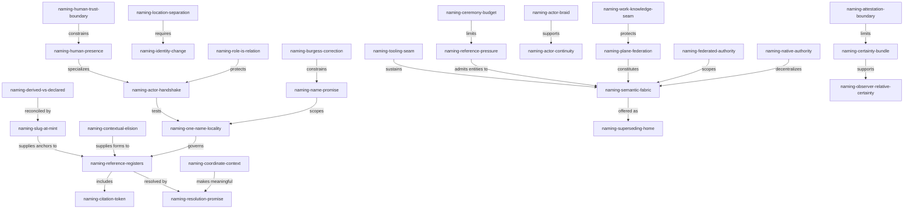

# `naming-proposal3`

**Naming and the new core, synthesis proposal, revision 3.**

The exploration wave is complete. Revision 0 captured the original obsession:
agents should have enduring names. Revision 1 widened the concern into a name
grammar. Revision 2 named the larger ambition: naming might be the kernel of a
new spiritual home for Rekon. Five independent drafts and one evidence-led
Beads inventory have now tested that ambition. Two later addenda also supplied
the missing concrete pressure: a dense corpus can need `C2` and a long
elaborated name for the same entity, while a heading can generate its own GFM
link target without a separately invented phrase.

This revision decides what the proposal now is. It is not another launch kit,
nor an addendum to revision 2. It is a candidate current account that can
supersede the proposal chain and, if accepted, replace parts of the canonical
constitution's referentiability and namespace account. The sources remain
evidence; succession changes which account is maintained, not what the sources
said.

I am a fresh actor, not a continuation of either self-named wave author. I
self-propose `rekon-naming-concordance`: *concordance* because this work maps
many textual references back to their owners without pretending the texts are
identical. The actual generating model remains separately and honestly named
in `generated.by`. This proposal has not been human-verified, and the actor name
has not been accepted by a project actor registry.

Where the sources minted several names for substantially one idea, this
synthesis selects one existing identifier and leaves the others in their source
artifacts. It does not silently reassign them. The selection is auditable in
[`naming-proposal3-identifier-ledger`](#naming-proposal3-identifier-ledger).

# `naming-semantic-fabric`

The proposal's center is a **federated semantic fabric**:

> Rekon is a project-owned fabric of durable entities, explicit relationships,
> and resolvable references. Within a declared authority, every live entity
> has at most one canonical semantic name and every live canonical name has at
> most one owner. An entity may also carry several declared references in
> different registers, provided their roles, scopes, mappings, precedence, and
> lifecycle all lead back to that semantic owner.
>
> A name is a scoped promise of continuity, not proof of truth, identity,
> freshness, or behavior. Coordinates help an observer locate; relationships,
> provenance, history, and verification provide context. Ambiguity and
> disagreement remain visible rather than being resolved by search order.
>
> Knowledge, work, actors, occurrences, computations, and orchestration retain
> native authorities and distinct lifecycles. They share a naming compact and
> explicit relations, not one universal table. Names are earned in proportion
> to durable reference pressure, so provisional material may remain nebular.
>
> Actors self-propose their semantic names; a receiving authority accepts or
> rejects the proposal and records its binding. Models, sessions, roles,
> signatures, and work assignments remain typed facts or references, not peer
> actor names. Human public identity is consented and scoped.
>
> The compact is meant to be tool-assisted. Its tooling boundary is explicit,
> but tool behavior is deliberately outside this proposal.

`naming-semantic-fabric` is stronger than a directory tree because it admits
many routes and relations. It is stronger than an undifferentiated graph
because semantic coordinates preserve neighborhood and likely ownership. It is
safer than a universal registry because native systems remain authoritative
for the promises they can actually keep.

The following local map demonstrates deliberate reference plurality. `K1`-`K9`
are dense citation tokens scoped to this document. The canonical-name column
has precedence. A token has no lexical meaning outside this declared map and
does not become a second canonical name merely because prose can use it to pick
out the entity.

| Token | Canonical semantic name | Compact role |
|---|---|---|
| `K1` | `naming-semantic-fabric` | The proposed core |
| `K2` | `naming-one-name-locality` | Canonical ownership invariant |
| `K3` | `naming-reference-registers` | Governed plurality of references |
| `K4` | `naming-resolution-promise` | Contextual reference-to-owner contract |
| `K5` | `naming-plane-federation` | Native authorities composed without flattening |
| `K6` | `naming-actor-handshake` | Self-proposal plus observer acceptance |
| `K7` | `naming-reference-pressure` | Threshold for enduring identity |
| `K8` | `naming-superseding-home` | Candidate maintained successor |
| `K9` | `naming-tooling-seam` | Tool assistance required, behavior deferred |

In dense form: K1 is constrained by K2, made usable by K3 and K4, distributed
through K5, tested most sharply by K6, bounded by K7, offered as K8, and made
sustainable by K9. The long forms remain the semantic account; the short forms
make this relation sentence readable.

# `naming-name-promise`

`naming-name-promise` is the conceptual ground: **a canonical name is a scoped
promise by a steward or autonomous actor that this reference will continue to
concern one semantic owner, or that a break in continuity will be disclosed.**

The promise wording must not anthropomorphize every file. An actor can promise
its own identity claim. A document cannot intend; its named steward or project
authority promises how its identity will be maintained. A work system promises
the integrity of the records it owns. An observer decides whether those
promises are credible. This distinction keeps the strongest insight shared by
the drafts without turning Promise Theory into a mandatory ontology.

A semantic name therefore promises less than several drafts occasionally ask
of it. It does not establish that:

- the referent is true, competent, current, human, or globally unique;
- every observer agrees that two referents are the same;
- a memorable actor persona persists across independent executions;
- a name-bearing ticket and document are one entity;
- a successful resolution verifies the content reached.

It promises enough: continuity is claimed in a scope, responsibility for that
claim is inspectable, and change will not silently reuse the old name for an
unrelated referent.

# `naming-one-name-locality`

K2 replaces a universal reading of "one name" with an enforceable one:

> Within one declared authority at one recorded time, one live entity has at
> most one canonical semantic name, and one live canonical semantic name has
> at most one entity owner.

This is a one-to-one invariant over **canonical semantic ownership**, not a ban
on every other string by which an observer can refer. Historical inputs,
contextually shortened forms, dense citation tokens, paths, URL fragments,
native object IDs, and evidence coordinates may all coexist under K3. They are
legitimate when their role and route to the owner are declared. Two prose names
competing as the canonical explanation inside one authority remain a defect.

The locality clause matters. Another project may use the same spelling for a
different entity or a different spelling for an entity it considers
equivalent. Cross-project sameness is an evidenced relation, not a fact inferred
from matching strings. A wider registry may relay or attest local claims, but
it does not retroactively become their semantic sovereign.

K2 keeps the moral force of revision 2's one-name discipline and rejects its
most brittle interpretation: one byte string need not survive every medium.
Canonicality is singular; references are typed and plural.

# `naming-reference-registers`

K3 is the second-round settlement. Every durable entity may expose a declared
reference family whose members occupy different registers:

| Register | What it contributes | Governing rule | Example shape |
|---|---|---|---|
| Canonical semantic name | The authority's maintained account of what entity this is | Exactly one live owner under K2 | `naming-reference-registers` |
| Resolution form | More or less qualified spelling of the canonical name | Reversible from context or an explicit rule; never silently synonymous | project qualification, contextual elision, retired compatibility input |
| Citation token | Dense local discourse and compact graph notation | Declared in a scoped map; canonical precedence explicit | `K3`, carrier-style `C2` |
| Locator | A current or historical place or native object | May churn; records where, not what | path and fragment, session handle, native issue key |
| Evidence binding | Exact support for a claim about the entity | States observation scope and revision; proves only what it binds | commit identity, pinned line range, receipt, signature |

The fifth register deliberately separates proof from location. A line range
locates evidence, but its revision binding is what makes it exact. A signature
binds an actor or key to bytes, but does not explain the semantic referent. The
distinction prevents "exact" from becoming an undifferentiated trust word.

Register membership depends on use, not syntax. A descriptive Beads ID can be
the canonical semantic name of a work entity inside the work authority and a
native locator when cited from another plane. A URL can be a locator for an
abstract concept or the canonical resource identity of a web asset. The map
must state the role instead of assuming punctuation decides it.

Multiple direct anchors for one section are legitimate only when one owner and
one mapping establish precedence and lifecycle. A current auto-generated slug,
a pinned semantic anchor, a dense short anchor, and a retired compatibility
anchor can all lead to one section. Unmapped accumulation is not a reference
family; it is identity drift.

## `naming-canonical-stem`

`naming-canonical-stem` is the lexical form an authority promises. It should use
stable semantic words, carry enough concern context to survive extraction, and
avoid ordinals when the words can distinguish meaning. Project qualification
adds authority context without minting a new entity. This proposal's local stem
is `naming-proposal3`; its workspace-qualified form is recorded in
frontmatter.

Paths, model suffixes, wave roles, and revision numbers can name an evidence
artifact without becoming part of every concept the artifact discusses. In
particular, moving this file must not rename `naming-reference-registers`.

Arbitrary abbreviation is not a default part of the canonical grammar. The
existing work ID `rekon-con-naming` remains exactly that work entity's native,
canonical ID; this proposal does not infer a workspace-global
`con` -> `constitution` rule from it. A project may declare such a rule as a
resolution form, but it must accept the scope and lifecycle obligation rather
than calling the abbreviation self-evident.

## `naming-contextual-elision`

`naming-contextual-elision` permits only what declared observer context can put
back. A local reference may omit a known project or topic prefix when the
containing artifact supplies it unambiguously. A cross-project citation restores
authority qualification and pairs it with a canonical route.

Elision differs from synonymy. Removing a declared prefix is reversible.
Replacing `constitution` with `con` requires a separate rule. Replacing a long
semantic name with `K3` requires this document's map. All three can be valid
resolution forms, but only the first is available without another declaration.

## `naming-citation-token`

`naming-citation-token` names a per-corpus dense reference whose mapping is
declared rather than derived. The carrier pattern demonstrates why it is
useful: a dependency sentence can foreground the relation when its endpoints
are short, while first mention and lookup retain the long elaborated name.

The K-map above adopts that pattern with explicit limits:

- the token is scoped to this artifact and importers that carry its map;
- the canonical semantic name always wins a disagreement;
- ordered tokens may encode reading order but do not thereby become ontology;
- renumbering is cheap only before durable citation creates an obligation;
- publication outside the corpus must carry enough mapping context to resolve;
- no short direct anchor is minted merely because a token exists.

Functionally, `K3` can name its entity in conversation. Constitutionally, it
is a subordinate citation register. The tension in that vocabulary is honest:
the goal is not to deny ordinary language, but to make canonical precedence and
maintenance responsibility explicit.

## `naming-derived-vs-declared`

`naming-derived-vs-declared` distinguishes two address regimes. A derived
address is mechanically computed from visible source, such as the GFM slug of a
heading. Text implies link, and changing text necessarily changes that current
link. A declared address is pinned independently. It can survive rewording, but
it can also drift semantically from the visible heading unless checked.

Neither regime is universally superior. Immutable, revision-pinned evidence can
often rely on a derived heading target. A mutable public presence with durable
inbound links needs a pinned semantic target. Dense corpora may additionally
need map-derived short forms. K3 records all of these without pretending they
have identical failure modes.

## `naming-slug-at-mint`

`naming-slug-at-mint` reconciles the regimes for new durable Markdown sections:

> At creation, derive the GFM link target from the visible heading, declare an
> explicit anchor with exactly that value, and then pin the anchor.

The sequence is `heading text -> derived slug -> declared anchor`. The heading
and anchor agree at birth, so the visible section name implies its link instead
of beginning with two hand-invented phrases. Later rhetorical rewording may
change the current auto-generated slug while the explicit anchor preserves
inbound links. That visible divergence requires a deliberate identity decision:
keep the old semantic owner, add a mapped compatibility form, or perform a
semantic rename under `naming-identity-change`.

This document makes the strongest self-consistent case easy to inspect: every
substantive heading is its canonical identifier, and every explicit anchor was
minted equal to that heading's derived GFM target. The equality is mechanically
checked. Existing documents remain grandfathered; this candidate rule does not
retrofit their anchors or silently change their obligations.

The source-level equality can leave the explicit target and heading-derived
target co-located under the same value in rendered output. Whether that
duplication is acceptable or needs another representation is unresolved. This
artifact practices the proposed mint relation while preserving the conformance
question for the nebula rather than smuggling an implementation answer into the
compact.

# `naming-location-separation`

`naming-location-separation` rejects the proposal chain's path-implied semantic
identity. A path, filename, heading fragment, ticket database, and session
locator are public or exact presences. They help resolve an entity; they do not
define every entity they contain.

This retains the canonical constitution's strongest instinct - durable identity
outranks current layout - while correcting a contradiction in proposal 2. If a
file move automatically changes the full names of all its sections, layout does
define identity. Under this synthesis, a path can seed a sensible stem at mint,
but the accepted stem remains stable when the path moves.

An evidence artifact itself is different. `proposal3.sol56x.md` identifies this
revision, role, and model-suffixed wave artifact. The concepts discussed inside
it remain independently named. One container may be a public presence for many
semantic entities without owning their spelling forever.

# `naming-identity-change`

K2 becomes credible only when kinds of change are not collapsed:

| Change | Continuity judgment | Required semantic treatment |
|---|---|---|
| Locator move | Same entity | Keep the canonical name; update current presence; preserve compatibility where consumers require it |
| Display edit | Same entity | Change prose; keep the canonical name; inspect anchor divergence deliberately |
| Canonical-name rename | Presumed same entity, reviewed | Record old and successor names, authorizing actor, scope, and disposition; never reuse the old input for an unrelated entity |
| Semantic correction | Possibly same entity | Preserve the historical claim and state whether the owner was corrected or superseded |
| Split or merge | Entity set changed | Mint names for the resulting entities and state predecessor/successor relations |
| Supersession | New maintained account | Keep the predecessor resolvable as history and direct current readers explicitly |

No project can promise an atomic rename across every remote repository, human
memory, copied citation, or offline checkout. Native authorities should preserve
the references they own; compatibility records and later maintenance converge
the rest. The promise is explicit repair and non-reuse, not imaginary global
control.

# `naming-coordinate-context`

`naming-coordinate-context` keeps both order and nebula. Semantic stems and
inductive suffixes are coordinates: trimming a suffix should lead toward a
plausible concern neighborhood. They make low-resolution skimming and text search
useful. They do not prove containment, causation, authorship, blocking,
validation, or supersession.

Meaning comes from non-empty context: prose, sources, explicit relationship
words, typed edges, history, and observer perspective. A tree without those
relations mistakes spelling for ontology. A graph without coordinates becomes
an undifferentiated cloud. `naming-semantic-fabric` needs both.

The canonical constitution's relationship vocabulary remains useful precisely
because it is modest. Words such as **inherits**, **implements**, **consumes**,
**motivates**, **constrains**, **contrasts**, **extends**, and **evidences** make
load-bearing context legible without pretending every prose link is operational
metadata.

# `naming-resolution-promise`

K4 is the semantic contract of following any member of K3. Given a reference
and observer context, a valid resolution account identifies the claimed
canonical owner and authority, shows how the reference register maps to it,
and preserves material context: current or historical presence, disposition,
provenance, trust signals, relationships, and unresolved conflict.

Resolution is not search. Search may be generous, rank candidates, and exploit
lexical ancestry. Canonical resolution must not silently choose the first
matching string when authority is ambiguous, two live owners collide, a
forward reference is unresolved, or visibility is private. Those conditions
are meaningful results, not inconveniences to hide.

K4 incorporates the strongest part of the drafts' "resolution story" without
turning this proposal into an interface schema. Its constitutional concern is
what a reference relation may claim. How tools discover, represent, or deliver
that account is deliberately left at K9.

# `naming-native-authority`

`naming-native-authority` keeps the authoritative record with the system or
steward capable of maintaining its semantics:

- a knowledge artifact owns its current prose, frontmatter, anchors, and source
  claims;
- an actor owns its self-proposal while a receiving authority owns acceptance
  and scope;
- the work graph owns work lifecycle, dependency, readiness, assignment, and
  guarded mutation;
- a computation concept owns its sanctioned definition while a run record owns
  execution evidence;
- version histories own immutable observations of earlier states.

Indexes, graph views, registries, and caches may project these claims. They must
not silently become a second source of truth. A projection should be rebuildable
from native records or clearly disclose what independent assertion it adds.

# `naming-federated-authority`

`naming-federated-authority` gives cross-project reach without a global
sovereign. A project promises its local canonical names and publishes enough
authority context for another project to qualify and follow them. A readable
prefix is a coordinate, not proof of ownership. A canonical repository or
bundle identity is stronger routing context, but trust still belongs to the
observer.

Matching names in two authorities do not prove sameness. Different names do not
prove difference. Equivalence, derivation, supersession, and contradiction are
explicit, sourced relations. A future shared registry may improve discovery or
attest authority claims; it does not erase their locality.

This is the operational meaning of "within projects and implicitly across
projects": local promises compose through qualification and evidence rather
than through a prerequisite planetary allocation service.

# `naming-plane-federation`

K5 is a federation of deep planes, not one universal schema. A plane names an
authority boundary and lifecycle, not necessarily one storage engine.

| Plane | Owns | Does not own |
|---|---|---|
| Names and references | Canonical ownership, scope, reference maps, identity change | Every native entity record or all semantic judgment |
| Knowledge | Documents, concepts, findings, inquiries, sources, public explanation | Work readiness and assignment |
| Work and coordination | Intent, acceptance, status, priority, dependencies, readiness, claims | Global actor identity or canonical explanatory prose |
| Actors and trust | Actor proposals, acceptance, delegation, continuity evidence, consent, verification responsibility | Model routing, scheduling, or the truth of every output |
| Occurrences and history | Consequential named events plus exhaustive native audit history | Promotion of every mutation into a public entity |
| Computation | Sanctioned definitions, executions, and bounded receipts | Semantic truth beyond what an attestation checks |
| Orchestration | Dispatch, resource policy, retries, and execution choices | Rewriting an actor's identity promise or another plane's records directly |

The Beads inventory supplies the strongest evidence for this architecture. Its
load-bearing abstraction is guarded operations over a versioned work graph. It
offers stable work IDs, rich records, typed dependencies, readiness, lifecycle,
audit, and local reference-preserving rename. It deliberately does not provide
a general knowledge graph, actor registry, cross-medium name authority, or
orchestration policy. That boundary is a deep-module strength, not a deficiency
to erase.

OKF supplies a neighboring knowledge interchange compact: keyed sources,
generation and verification actors, lifecycle, portable links, and sanctioned
computation concepts. It deliberately avoids a central taxonomy, registry, or
runtime. K5 composes with both systems and supersedes neither.

## `naming-work-knowledge-seam`

`naming-work-knowledge-seam` replaces the assumption that sharing a stem makes
a ticket and an anchor one entity. A ticket coordinates intent, acceptance,
dependency, ownership, and closure. A document or finding explains claims,
evidence, context, and current knowledge. They are different entities by
default, joined by an explicit relation.

They may be declared co-expressions of one entity when their identity and
lifecycle genuinely coincide, but shared subject matter is not enough. "Write
the naming compact" and "the naming compact" differ. Closing the former does
not verify the latter; moving the latter does not rename the former.

The existing `rekon-con-naming` ID is the canonical work reference for this
effort. `naming-proposal3` is this evidence artifact's local semantic identity.
The ticket **coordinates** the proposal; the proposal **addresses** the
decision. Their explicit relation is more truthful than forcing one string to
own both.

# `naming-reference-pressure`

K7 is the proportionality rule: **name the smallest entity whose independent
future matters across a boundary of time, file, actor, system, or project.** A
durable name is earned when an entity must be cited, related, assigned,
trusted, corrected, given a distinct lifecycle, or superseded without replaying
the conversation that created it.

| Kind | It earns a canonical name when | Natural authority |
|---|---|---|
| Knowledge | A claim-set or explanation must remain citable through revisions | Knowledge artifact or semantic section |
| Work | Readiness, acceptance, responsibility, or dependency must persist | Work graph |
| Actor | Authorship, agency, delegation, contact, or trust must persist | Actor presence plus acceptance record |
| Finding (`naming-finding-grain`) | A source-grounded conclusion has independent provenance, confidence, contradiction, or consequence | Semantic section; linked work entity if actionable |
| Occurrence (`naming-event-threshold`) | Later reasoning must refer to what happened, when, and under whose responsibility | Named event presence; ordinary changes remain audit history |
| Research (`naming-research-question`) | A durable question, scope, method, and evidence corpus must outlive one run | Inquiry record with reports and findings as outputs |
| Computation (`naming-computation-run-seam`) | A sanctioned definition is reused, or a run and receipt need independent retention | Computation concept; execution and receipt remain distinct occurrences |

`naming-finding-grain` keeps a finding smaller than a report and larger than a
raw observation. If it creates actionable work, a work entity relates to it;
the ticket does not duplicate the finding merely to make it queryable.

`naming-event-threshold` separates consequential occurrences - an acceptance,
semantic rename, migration, launch, failure, or attested run that future
reasoning needs - from exhaustive mutation history. Row availability never
alone earns public semantic identity.

`naming-research-question` names inquiry by the question and evidence boundary,
not merely by date, model, or wave ordinal. Reports are artifacts of the
inquiry; findings are claim-sized outputs; work may commission or consume it.

`naming-computation-run-seam` preserves OKF's careful distinction: verification
checks a named definition against policy, while attestation checks one run
against the definition. Neither fact silently verifies the other.

Keyed source IDs are stable join keys inside a provenance record. They are
excellent anti-positional references, but they do not automatically mint every
source as a new Rekon entity. The source itself earns a canonical name only
under K7.

# `naming-ceremony-budget`

`naming-ceremony-budget` is K7's counterweight. Every canonical name creates a
relationship to maintain: an owner, scope, mapping, citations, collision risk,
and change history. Every extra reference form adds a smaller but real mapping
and compatibility cost. The system should mint only what its collaborators can
sustain.

Names become cheaper than repeated explanation when reference pressure is
real. Before then, prose, local headings, search, and exact history are valid.
A token table is justified by dense reuse, not by admiration for token tables.
An actor public presence is justified by continuing attribution, not by every
short-lived process wanting a persona.

# `naming-agents`

Agents remain the flagship because they make every distinction observable at
once. A model name, session locator, wave seat, role, actor self-conception,
coordinator acceptance, artifact attribution, and human verification can all
surround one run. Calling all of them names creates false continuity; reducing
them all to an opaque session ID destroys useful meaning.

This proposal's actor claim is intentionally modest. `rekon-naming-concordance`
is a fresh execution actor's self-proposed semantic name in the Rekon naming
scope. It does not claim continuity with `rekon-naming-parallax`, even though
both executions report the same model family. It is not human-accepted. The
frontmatter preserves model identity independently so a reader need not trust
the persona to know what generated the artifact.

## `naming-actor-handshake`

K6 reconciles self-naming with observer-owned namespaces:

1. A receiving authority supplies scope and the accepted-name context it can
   honestly see.
2. The actor self-proposes one canonical semantic stem and a bounded statement
   of the agency that stem will denote.
3. The authority accepts the proposal or reports a collision. A rejected
   candidate remains pre-history, not a published alias.
4. Acceptance binds the actor stem to the observed execution context and
   records who made the binding. It does not verify the actor's work.
5. Artifacts cite the accepted actor when available and retain model and exact
   execution provenance as separately typed references.

An authority may suggest a name, as a coordinator suggests a task or Docker-like
call sign. The actor must accept it before it becomes the actor's own promise.
Conversely, self-proposal is not unilateral allocation of a globally unique
string. Shared addressability is bilateral: the actor promises identity; the
authority promises resolution in its scope.

## `naming-actor-braid`

`naming-actor-braid` keeps adjacent identity facts typed:

| Strand | Role | Is it the actor's canonical name? |
|---|---|---|
| Actor stem | Semantic owner inside the accepting authority | Yes |
| Model or producer lineage | What generated or executed this run | No |
| Session or task locator | Exact transport, transcript, or resumption address | No |
| Work role | What the actor is doing in a scope | No; it is a relation |
| Artifact or signature binding | Evidence connecting output, key, and actor claim | No |
| Public presence | Where the accepted actor account resolves | No; it is a locator |

The old Docker-pair intuition survives here in corrected form: friendly semantic
identity and exact runtime address are both valuable, but they occupy different
registers. Neither has to impersonate the other.

## `naming-role-is-relation`

`naming-role-is-relation` moves hats onto edges. Researcher, reviewer,
coordinator, implementer, and wave seat describe what an actor undertakes in a
scope. They do not rename the actor. One actor may hold simultaneous roles;
another may later occupy the same role; each relation can have its own history.

This keeps the useful observation behind the proposal's hats without creating
one peer identity per concern. If a role develops independent agency,
accountability, continuity, and reference pressure, K7 may promote that agency
to a distinct actor. Mere prompt change is not enough.

## `naming-actor-continuity`

`naming-actor-continuity` takes the conservative default: separate executions
are separate actor instances unless an accepted persistent actor presence binds
them through an explicit handoff and continuing provenance. Sharing a model,
prompt template, coordinator, or evocative name does not establish one person.

An actor may outlive a session. The name then denotes the maintained agency,
not the live process, and session locators can accumulate as historical
references. Retired actor names remain archival and must not be silently reused.
The exact evidence required for stronger continuity is still in the nebula.

## `naming-human-presence`

`naming-human-presence` treats a human actor name as a voluntary, scoped public
persona through which a person accepts responsibility. It does not claim to
name the entire biological or legal person. A human chooses or explicitly
accepts the public stem; it must not be inferred from an email address, account
profile, or tool-specific display string.

Project-scoped pseudonyms and deliberately unlinkable personae can protect
privacy. They are separate public presences unless the person elects to bind
them. Visibility is itself part of the promise: a private actor may remain
resolvable only inside its authority without being forced into a global roll.

## `naming-human-trust-boundary`

`naming-human-trust-boundary` keeps syntax from becoming certainty theater.
OKF's `human:` prefix is a useful responsibility and policy classifier. It does
not authenticate biological humanity, prove a review was careful, or make the
reviewed proposition true. A signature can bind a key; project policy can
authorize an actor; history can support an observer's assessment. None replaces
semantic judgment.

Humans still matter specially because acceptance, verification, and public
responsibility are scarce acts. The answer is to make those acts and their
scope legible, not to inflate every human-prefixed statement into proof.

# `naming-burgess-correction`

The drafts' Burgess research converges on a correction, not a blessing of
self-describing strings. The source drafts report the following from *In Search
of Certainty*, Promise Theory, and Semantic Spacetime; this synthesis did not
independently re-read those web sources:

1. Opaque numbers discriminate exactly while contributing little semantic
   navigation.
2. Friend-like and pet-like machine names help at small scale but do not become
   a scalable coordinate system merely by being memorable.
3. Meaning depends on scope, observer, and context; a name without non-empty
   context is not enough.
4. Autonomous actors can promise only their own conduct. An observer can accept,
   qualify, record, or reject an identity claim in its namespace.
5. Strong coupling and command-and-control promises become less credible at
   scale; weakly coupled authorities can converge through explicit repair.
6. Reliable cooperation depends more on inspectable promises and relationships
   than on what participants are called.

`naming-burgess-correction` constrains both extremes. Exact substrate IDs are
necessary but semantically thin. Elaborated names are useful but do not create
truth. A master taxonomy cannot impose one worldview on autonomous projects.
K1 therefore combines coordinates, contextual relations, native authority, and
evidence.

## `naming-observer-relative-certainty`

`naming-observer-relative-certainty` states the epistemic limit: a name gives an
observer a stable question to ask, not certainty as a property of a string. An
observer may be highly confident that a reference resolves to one current owner
while remaining uncertain whether that owner's claims are true or fresh.

Resolution confidence, content verification, actor authentication, human
authorization, and per-run attestation are different judgments. K4 must preserve
their separation. A stale or deprecated entity can still resolve exactly. An
unverified concept can still be useful. A human-reviewed definition still does
not attest every later computation run.

## `naming-certainty-bundle`

`naming-certainty-bundle` collects partially independent signals without
collapsing them into a magic score:

| Signal | Contributes | Cannot prove alone |
|---|---|---|
| Canonical name and authority | Recall, discrimination, claimed ownership | Truth or global agreement |
| Reference map and current presence | Explainable navigation and compatibility | Semantic correctness |
| Kind and explicit relations | Interpretable context | Completeness of the graph |
| Native exact locator | Reproducible selection of a record or run | Human-scale meaning |
| Version and identity-change history | Continuity and disclosed drift | Original intent |
| Sources and verification | Provenance and checking responsibility | Future freshness or universal truth |
| Signature or attestation | Mechanical binding within a defined scope | Meaning, competence, or humanity |
| Repeated promise-keeping | Observer evidence of reliability | Future guarantee |

## `naming-attestation-boundary`

`naming-attestation-boundary` marks where mechanism stops. Deterministic evidence
can show that bytes, a key, a history edge, or a computation receipt match a
declared contract. It cannot prove that two independently named actors are the
same person, that a finding is the best interpretation, or that a human review
is correct. Mechanical claims should be strong and narrow; semantic judgment
should remain named as judgment.

# `naming-tooling-seam`

K9 states one requirement and one deferral. **The naming compact is intended to
be tool-assisted, not sustained by manual vigilance alone.** One-name ownership,
declared reference registers, anchor correspondence, resolution, provenance,
and verification are durable disciplines only if mechanical support can share
the burden. The corpus already evidences that shape through mechanically checked
anchors and guarded operations rather than raw state manipulation.

This proposal intentionally stops at the seam. It names the invariants and the
need for assistance; it does not name tools, prescribe interfaces, assign
commands, design implementations, or derive tool behavior. Those decisions
belong to separate later work after the semantic compact is accepted. K9 is a
dependency of sustainable adoption, not an invitation to hide unsettled naming
policy inside software.

# `naming-proposal3-constellation`

Every node below is its canonical semantic identifier. The K-tokens remain a
display register for dense prose rather than becoming competing diagram labels.

The graph is ordered enough to navigate but not a taxonomy. For example,
`naming-reference-pressure` admits actors and findings without asserting that
one contains the other. The relation words carry semantics that lexical
ancestry cannot.

# `naming-superseding-home`

K8 carries revision 2's earned ambition: **proposal 3 is a candidate maintained
home for Rekon's naming concern, not another policy to layer beside the proposal
chain.** If accepted, it should become the current account readers are directed
to. Proposal revisions 0-2 and all independent drafts remain exact evidence and
retain their identifiers.

The candidate succession is selective:

| Existing account | Keep | Replace or absorb |
|---|---|---|
| Canonical constitution, semantic anchors | Durable explicit anchors, compatibility obligation, forward references | Hand-guessed anchor/name separation is refined by `naming-slug-at-mint` and K3 |
| Canonical constitution, shared ticket-anchor namespace | Project qualification, semantic stems, reciprocal links | Presumed ticket/knowledge identity is replaced by `naming-work-knowledge-seam` and a shared compact across planes |
| Canonical constitution, inductive refinement | Semantic suffixes as navigational coordinates | Any inference that lexical ancestry creates ontology remains rejected by `naming-coordinate-context` |
| Hierarchy revision | Public presence, disposition, promotion, migration map, inbound-link inventory, compatibility stubs, prospective adoption | Those terms extend from documents to name and actor lifecycle; the hierarchy itself is not superseded here |
| Workspace guidance | Honest model suffixes, independent waves, named tickets, non-overwrite, doc-pass | Scattered naming implications are gathered here; operational guidance remains where it is |
| OKF | Portable Markdown, actors, keyed sources, trust and lifecycle signals, attested computation | Nothing: it is a neighboring interchange standard, not a succession target |
| Beads | Stable work IDs, guarded lifecycle, typed work graph, readiness and history | Nothing: it remains the work-plane authority, not the whole semantic fabric |

In blunt terms, this synthesis chooses what to keep, kill, and create:

| Disposition | Decision |
|---|---|
| **Keep** | Scoped promise, one canonical owner, semantic qualification, inductive coordinates, explicit relations, durable and forward anchors, disposition, compatibility, exact substrate references, native authorities, and prospective adoption |
| **Kill as current proposal** | One byte string across every medium, path-derived semantic identity, ungoverned alias glossaries, hats as actor aliases, unilateral global self-naming, a global registry prerequisite, Beads as a universal entity store, and the now-completed launch kit |
| **Create** | K1's federated fabric, K3's reference registers, declared dense tokens, slug-at-mint anchors, K4's contextual resolution promise, K6's actor handshake, K7's naming threshold, and K9's deferred tool-assistance seam |

## `naming-home-not-layout`

`naming-home-not-layout` resolves the source disagreement about promotion. The
spiritual home is the compact and its maintained public presence, not a required
root-directory move. A topic README, constitution chapter, work record, actor
presence, and external project can all participate without sharing one layout.

This proposal therefore does not move `constitution/naming/`, choose a future
canonical filename, or enact the hierarchy revision. Contract adoption and
layout migration remain separate. If acceptance later promotes this account,
the project's public-presence and migration rules decide its location with an
inbound-reference inventory and compatibility obligations. The naming core
should survive that decision; it should not prejudge it.

## `naming-supersede-proof`

Supersession is earned. K8 should become the maintained home only when evidence
shows that:

1. A fresh actor primed on the compact can distinguish canonical names,
   reference forms, tokens, locators, and evidence bindings without inventing
   peer identities.
2. New durable headings follow slug-at-mint, existing anchors remain
   grandfathered, and identity-changing edits are distinguished from display
   edits.
3. One actor handshake records self-proposal, authority acceptance, producer,
   runtime locator, and role without conflating them.
4. One knowledge/work pair demonstrates separate native lifecycles and an
   explicit relation rather than forced ID parity.
5. One move, rename, and supersession preserve semantic ownership and history
   across the references each authority actually owns.
6. K7 and `naming-ceremony-budget` keep the named set supportable while useful
   provisional material remains discoverable.
7. Tool assistance is shown to be a credible separate support line under K9,
   without making acceptance depend on an unreviewed implementation design.
8. A human accepts the semantic choices and succession scope on the coordinating
   work item.

Until then, `naming-proposal3` is a draft candidate and the canonical
constitution remains governing practice.

# `naming-nebula`

The synthesis settles a spine and preserves the unresolved field around it:

- **Canonicality versus ordinary speech.** A dense token plainly "names" an
  entity in conversation. K3 calls it a citation register to preserve
  precedence. Whether that umbrella vocabulary helps or merely legislates
  ordinary language remains open.
- **Authority discovery.** `naming-federated-authority` explains ownership but
  not how an observer discovers the canonical authority when readable project
  prefixes collide.
- **Alias governance.** This proposal rejects arbitrary aliases as a default,
  but compatibility names, consented human pseudonyms, imported token maps, and
  project abbreviations still need lifecycle and scope policy.
- **Renderer relativity.** `naming-slug-at-mint` needs one declared GFM target
  convention. Punctuation, Unicode, duplicate headings, and renderer revisions
  can disagree even when each derivation is internally consistent.
- **Co-located target duplication.** Slug-at-mint can leave an explicit target
  and a heading-derived target carrying the same value at the same section. The
  source correspondence is strong; the rendered conformance consequence is not
  yet settled.
- **Pinned-anchor divergence.** A maintained heading can improve while its
  explicit anchor stays stable. The point at which visible divergence should
  trigger a new mapped anchor rather than remain compatibility is unsettled.
- **Token durability.** Dense ordered references want cheap renumbering; first
  publication creates compatibility pressure. No accepted threshold says when
  a local token becomes durable.
- **Semantic rename versus changed referent.** `naming-identity-change` names the
  operations, but judgment still decides whether a large correction preserves
  the entity or requires succession.
- **Actor persistence.** `naming-actor-continuity` defaults conservatively, but
  durable memory, delegation, model changes, key rotation, and handoff may make
  longer-lived agency credible.
- **Self-naming governance.** K6 handles collision structurally but not abusive
  names, squatting, coordinator capture, or disagreement among authorities.
- **Human compartmentalization.** Privacy may require unlinkable personae while
  public accountability pressures the system toward linkage. Neither value
  automatically outranks the other.
- **Reference pressure.** K7 remains judgment. A missed early name can hide a
  finding; a premature name can harden a distinction research should dissolve.
- **Cross-plane co-expression.** Rare cases may justify one entity expressed as
  both work and knowledge, but the evidence threshold is not yet settled.
- **Relation vocabulary.** The constitution, Beads, and Burgess-derived
  association families overlap without aligning exactly. Premature unification
  would erase operational differences.
- **Observer disagreement.** K4 must preserve competing authority claims without
  becoming either an unranked pile or a falsely definitive winner.
- **Tooling.** K9 intentionally leaves all behavior derivation to later work.
  The compact can still change before that work should stabilize around it.

`naming-nebula` is not an exception to the system. It is the material that has
not crossed K7. Order gives collaborators stable handles for what is settled;
the nebula prevents those handles from pretending the inquiry is over.

# `naming-proposal3-cross-references`

- [`proposal2.glm53m.md`](/constitution/naming/exploration/proposal2.glm53m.md)
  **is revised by** this proposal. Its new-core ambition, census, one-name
  discipline, agent flagship, and supersede posture survive; path-implied
  identity, literal cross-modal singularity, hats, and alias defaults do not.
- [`beads-offerings0.sol56x.md`](/constitution/naming/exploration/beads-offerings0.sol56x.md)
  **evidences** `naming-native-authority`, `naming-plane-federation`, and
  `naming-work-knowledge-seam`: Beads is guarded operations over a versioned
  work graph, not the semantic fabric as a whole.
- [`draft0.sol56m.md`](/constitution/naming/exploration/draft0.sol56m.md)
  **supplies** semantic ownership, address projection, rename responsibility,
  role-as-relation, privacy-aware humans, plane federation, and the restrained
  superseding-home frame.
- [`draft0.glm53m.md`](/constitution/naming/exploration/draft0.glm53m.md)
  **supplies** the strongest operational grammar, ceremony budget,
  falsifiable supersession test, carrier-derived `naming-citation-token`,
  `naming-derived-vs-declared`, `naming-slug-at-mint`, and
  `naming-reference-registers`.
- [`draft0.glm53fm.md`](/constitution/naming/exploration/draft0.glm53fm.md)
  **evidences** independent convergence on names as promises, resolution scale,
  exact-versus-semantic layers, actor attribution before trust, selective event
  naming, and the work/knowledge seam.
- [`draft0.gpt56lx.md`](/constitution/naming/exploration/draft0.gpt56lx.md)
  **supplies** careful identity/address separation, an explanatory resolution
  account, coordinator attestation, bounded certainty, a concrete pilot posture,
  and unusually clear claim-maturity restraint.
- [`draft0.sol56x.md`](/constitution/naming/exploration/draft0.sol56x.md)
  **supplies** `naming-semantic-fabric`, locality, native and federated
  authority, canonical stems, actor handshake and braid, reference pressure,
  identity-change semantics, certainty boundaries, and the fullest carrier
  reference-family analysis.
- The [canonical constitution](/constitution/README.md)
  **constrains** this draft today and **is a selective succession target** for
  K8. Its durable anchors, qualified IDs, relationship prose, forward
  references, source maturity, ticket balance, and prospective adoption remain
  foundational.
- The [hierarchy revision](/constitution/README-heirarchy1.glm53m.md)
  **supplies** public presence, disposition, promotion, migration, inbound-link,
  and compatibility vocabulary. `naming-home-not-layout` extends its distinction
  between contract adoption and layout movement.
- The [OKF v0.2 specification](https://github.com/GoogleCloudPlatform/knowledge-catalog/blob/main/okf/SPEC.md)
  **defines** the portable actor, keyed-source, trust, lifecycle, path, and
  computation conventions with which K1 composes. Its minimal, non-centralized
  posture supports `naming-native-authority`.
- [`AGENTS.md`](/AGENTS.md) **governs** this synthesis's independent wave,
  model-suffix, source, non-overwrite, and commit mechanics. Its doc-pass and
  named-work practices are evidence for the broader compact.
- The [`constitution/naming/` public presence](/constitution/naming/README.md)
  **locates** this work as unsettled evidence. Its still-narrow `agent-naming`
  frontmatter identity is a live case for `naming-identity-change`, not something
  this proposal silently repairs.

# `naming-proposal3-identifier-ledger`

The synthesis minted only the identifiers for entities or concepts that did not
already have a suitable source name.

| Minted identifier | Sole referent here |
|---|---|
| `naming-proposal3` | This revision-3 synthesis artifact |
| `rekon-naming-concordance` | This fresh synthesis actor's self-proposed name |
| `naming-tooling-seam` | Tool assistance as required support, with all tool behavior deliberately deferred |
| `naming-proposal3-constellation` | This proposal's canonical-ID relationship view |
| `naming-proposal3-cross-references` | The explained links from this proposal to its corpus |
| `naming-proposal3-identifier-ledger` | This audit of minted and adopted identifiers |
| `naming-proposal3-source-comparison` | The terminal comparison of every consulted source document |

The synthesis also minted nine scoped citation tokens, not canonical semantic
names: `K1`, `K2`, `K3`, `K4`, `K5`, `K6`, `K7`, `K8`, and `K9`. Their sole
mapping authority is the table under `naming-semantic-fabric`.

The frontmatter source keys are likewise scoped reference identifiers rather
than new semantic owners. Minted here for reorder-safe provenance, they are:
`proposal0-glm53m`, `proposal1-glm53m`, `proposal2-glm53m`,
`beads-offerings0-sol56x`, `draft0-sol56m`, `draft0-glm53m`,
`draft0-glm53fm`, `draft0-gpt56lx`, `draft0-sol56x`, `naming-readme`,
`constitution-readme`, `hierarchy1-glm53m`, `agents-guidance`, and
`okf-v0-2`.

Three other identity-bearing values are used but not independently minted as
semantic names: `rekon-constitution-naming-proposal3` is the mechanically
qualified resolution form of `naming-proposal3`; `rekon-con-naming` is the
already-existing work entity adopted as this proposal's coordinating ticket;
and `model:openai/gpt-5.6-sol#max` is the environment-provided generating model
identity. Historical actor `rekon-naming-parallax`, topic ID `agent-naming`, and
carrier token `C2` appear only as source referents or examples; this synthesis
does not adopt them for a new owner.

The following identifiers are adopted exactly as minted in the source corpus.
They are the synthesis's current vocabulary and are used above under these
names:

| Adopted identifier | Adopted meaning | Source lineage |
|---|---|---|
| `naming-semantic-fabric` | Federated named-entity core with native authorities | `draft0.sol56x.md` |
| `naming-name-promise` | Steward's scoped promise of semantic continuity | `draft0.sol56x.md` |
| `naming-one-name-locality` | One live canonical name and owner within one authority | `draft0.sol56x.md` |
| `naming-reference-registers` | Typed plurality around one canonical semantic owner | `draft0.glm53m.md` addendum |
| `naming-canonical-stem` | The authority's stable lexical semantic identity | `draft0.sol56x.md` |
| `naming-contextual-elision` | Reversible removal of context-supplied qualification | `draft0.sol56x.md` |
| `naming-citation-token` | Dense, scope-bound reference declared by an in-corpus map | `draft0.glm53m.md` addendum |
| `naming-derived-vs-declared` | The two address-minting regimes | `draft0.glm53m.md` addendum |
| `naming-slug-at-mint` | Derive the heading slug once, declare it, then pin it | `draft0.glm53m.md` addendum |
| `naming-location-separation` | Paths locate semantic identity rather than define it | `draft0.sol56x.md` |
| `naming-identity-change` | Distinction among move, edit, rename, correction, split, merge, and supersession | `draft0.sol56x.md` |
| `naming-coordinate-context` | Ordered semantic coordinates joined to explicit relational meaning | `draft0.sol56x.md` |
| `naming-resolution-promise` | Observer-contextual reference-to-owner contract | `draft0.sol56x.md` |
| `naming-native-authority` | Each deep system retains authority over promises it can keep | `draft0.sol56x.md` |
| `naming-federated-authority` | Project-local ownership composed across projects | `draft0.sol56x.md` |
| `naming-plane-federation` | Deep native planes sharing references rather than storage | `draft0.sol56m.md` |
| `naming-work-knowledge-seam` | Work and knowledge are distinct by default and explicitly related | `draft0.sol56x.md` |
| `naming-reference-pressure` | Threshold for promoting the smallest independently consequential entity | `draft0.sol56x.md` |
| `naming-finding-grain` | Smallest conclusion with independent provenance or consequence | `draft0.sol56x.md` |
| `naming-event-threshold` | Consequential occurrences named; routine mutations audited | `draft0.sol56x.md` |
| `naming-research-question` | Inquiry organized around a durable question and evidence scope | `draft0.sol56x.md` |
| `naming-computation-run-seam` | Definition, run, and receipt retain separate trust claims | `draft0.sol56x.md` |
| `naming-ceremony-budget` | Maintenance cost limiting how many names and mappings are minted | `draft0.glm53m.md` |
| `naming-agents` | Agents as the flagship test of the naming compact | proposal chain |
| `naming-actor-handshake` | Actor self-proposal plus authority acceptance | `draft0.sol56x.md` |
| `naming-actor-braid` | Typed actor, model, locator, role, presence, and evidence strands | `draft0.sol56x.md` |
| `naming-role-is-relation` | Hats modeled as scoped role edges rather than aliases | `draft0.sol56x.md` |
| `naming-actor-continuity` | Evidence-bearing continuity across executions | `draft0.sol56x.md` |
| `naming-human-presence` | Consented and scoped human public persona | converged independently in `draft0.sol56m.md` and `draft0.sol56x.md` |
| `naming-human-trust-boundary` | Human syntax and bindings are claims, not proof | `draft0.sol56x.md` |
| `naming-burgess-correction` | Numbers, pet names, promises, context, and observer scope held together | `draft0.sol56x.md` |
| `naming-observer-relative-certainty` | Certainty as an observer's bounded resolution judgment | `draft0.sol56x.md` |
| `naming-certainty-bundle` | Independent signals supporting bounded confidence | `draft0.sol56x.md` |
| `naming-attestation-boundary` | Mechanical binding separated from semantic judgment | `draft0.sol56x.md` |
| `naming-superseding-home` | A broader maintained successor that earns current authority | `draft0.sol56m.md` |
| `naming-home-not-layout` | The new home as compact, not mandatory directory movement | `draft0.sol56x.md` |
| `naming-supersede-proof` | Falsifiable conditions for earning maintained succession | `draft0.glm53m.md` |
| `naming-nebula` | Provisional associations not yet promoted to canonical identity | converged independently in `draft0.sol56m.md` and `draft0.gpt56lx.md` |

Several source identifiers cover nearly the same semantic ground. They remain
valid historical identifiers in their artifacts but are not adopted as peer
current names here:

| Current synthesis owner | Source alternatives retained as history |
|---|---|
| `naming-semantic-fabric` | `naming-center`, `naming-rekon-core`, `naming-named-workspace` |
| `naming-name-promise` | `naming-promised-continuity`, `naming-promise-ground`, `naming-name-as-promise` |
| `naming-one-name-locality` | `naming-one-name`, `naming-semantic-owner`, `naming-identity-address-separation` |
| `naming-reference-registers` | `naming-reference-family-binds-many-references-to-one-entity`, `naming-reference-role-distinguishes-name-coordinate-locator-and-proof`, `naming-cross-medium-reference-map-unifies-projections-without-flattening` |
| `naming-resolution-promise` | `naming-resolution-story`, `naming-resolver`, `naming-resolution-ladder` |
| `naming-plane-federation` | `naming-plane-boundaries`, `naming-seam` |
| `naming-reference-pressure` | `naming-name-earning`, `naming-entity-threshold`, `naming-census-proportion` |
| `naming-actor-handshake` | `naming-agents-declaration`, `naming-actor-self-naming`, `naming-acceptance` |
| `naming-role-is-relation` | `naming-agents-hats`, `naming-agents-hat-relation` |
| `naming-superseding-home` | `naming-successor`, `naming-supersede-core`, `naming-core-compact` |

This table records synthesis disposition; it does not rewrite the referents in
the source documents or claim that every paired formulation was perfectly
identical.

# `naming-proposal3-source-comparison`

The comparison ends this proposal because the successor claim must remain
answerable to the disagreement that produced it.

| Source | General character | Particular strengths and notable features | Relative weakness and synthesis disposition |
|---|---|---|---|
| [`proposal0.glm53m.md`](/constitution/naming/exploration/proposal0.glm53m.md) | Generative launch document centered on the original agent-naming obsession | Preserves the moment of discovery; identifies weak numerics, self-naming, hats, Docker pairing, coordinator roles, lifecycle, OKF actors, Beads, humans, and Burgess before the field was orderly | Too agent-heavy and procedurally prescriptive; its asymmetric anchors and held launch state became evidence against its own grammar. Retained as origin, not current proposal |
| [`proposal1.glm53m.md`](/constitution/naming/exploration/proposal1.glm53m.md) | Broadening grammar revision | Correctly expands from agents to all named entities, relaxes the wave flow, introduces implied names, model qualification, aliases, subdivision, and rename ripple | Treats path context and an abbreviation glossary as more stable than the later work supports. Its scope correction survives; its grammar is selectively replaced |
| [`proposal2.glm53m.md`](/constitution/naming/exploration/proposal2.glm53m.md) | Ambitious integrated proposal and direct predecessor | Names the new-core ambition, one-name discipline, entity census, cross-modal pressure, Beads work-plane role, and "supersede, don't decorate" posture; provides the shared vocabulary that made independent comparison possible | One-name is over-literal, contortion disguises lossy projections, path-implied identity conflicts with layout independence, aliases and hats lack governance, and its launch kit is obsolete. Revision 3 supersedes it as proposal candidate |
| [`beads-offerings0.sol56x.md`](/constitution/naming/exploration/beads-offerings0.sol56x.md) | Evidence-led system inventory | Most empirically grounded artifact; distinguishes installed and archive-current behavior, identifies guarded operations over a versioned work graph, separates work and knowledge, and exposes boundaries around actors, events, federation, history, and rename | Deliberately narrow and long; it cannot decide the semantic compact or actor model. Adopted as architectural constraint and reality check, never as the whole core |
| [`draft0.sol56m.md`](/constitution/naming/exploration/draft0.sol56m.md) | Restrained continuity-and-ownership argument | Cleanest early separation of canonical semantic owner from address projection; strong rename covenant, resolution ladder, actor declaration/observation split, roles as relations, privacy-aware humans, plane federation, and superseding-home language | Understates the bilateral acceptance needed for observer-owned namespaces and predates the carrier evidence. Its conceptual restraint is heavily retained under later identifiers |
| [`draft0.glm53m.md`](/constitution/naming/exploration/draft0.glm53m.md) | Rich promise-theoretic system design and self-demonstration | Deepest mint/resolve/cite analysis; excellent exact/semantic layer split, speech-act census, ceremony budget, actor roll, acceptance routes, convergence framing, falsifiable supersession test, and the most concise carrier synthesis through citation tokens, derived/declared addressing, slug-at-mint, and reference registers | Sometimes promotes Burgess analogy into ontology, grants questionable cross-session actor continuity, and proposes a root-topic move before the compact is accepted. Its grammar and carrier addendum are central; its migration and stronger personification are rejected |
| [`draft0.glm53fm.md`](/constitution/naming/exploration/draft0.glm53fm.md) | Compact promise-theory convergence | Independently corroborates names as promises, grammar as contract, resolution scale, semantic versus numeral layers, attribution before trust, selective event naming, forward anchors as proposals, human attention scarcity, and work/knowledge separation | The authoring actor remains mostly a model label despite arguing for instance naming; self-naming acceptance and privacy are thinner, and its successor posture stops short of the larger supersede claim. Valuable corroboration more than chosen vocabulary |
| [`draft0.gpt56lx.md`](/constitution/naming/exploration/draft0.gpt56lx.md) | Careful bounded-certainty and interface-oriented exploration | Strong identity/address separation, name-earning test, knowledge journey, explanatory resolution account, actor self-naming plus coordinator attestation, plane boundaries, confidence discipline, and a small pilot. It is especially honest about observed versus derived Burgess claims | Mints several near-synonyms for ideas the corpus already carries and leaves the actor-instance/OKF producer bridge unresolved. Its explanatory posture is absorbed into K4 and the certainty sections, while interface detail is deferred by K9 |
| [`draft0.sol56x.md`](/constitution/naming/exploration/draft0.sol56x.md) | Broad federated semantic-fabric proposal with the fullest carrier addendum | Strongest overall architecture: locality, canonical stems, native and federated authority, location separation, identity-change taxonomy, explicit resolver outcomes, actor handshake and braid, roles, continuity restraint, human consent, reference pressure, work/knowledge seam, derived views, certainty bundle, and home-not-layout. Its R0-R8 addendum most fully admits many references to one owner | Very large vocabulary, several identifiers too long for sustained use, and an addendum that remains structurally separate from the body it revises. Revision 3 adopts its architecture while consolidating names and choosing the shorter register vocabulary from the parallel addendum |

The contextual sources play different roles and should not be mistaken for wave
competitors:

| Context source | Strength carried forward | Boundary or tension |
|---|---|---|
| [Canonical constitution](/constitution/README.md) | Plain-Markdown durability, semantic anchors, qualification, inductive navigation, explicit relationships, evidence maturity, ticket balance, and prospective adoption | Its path-shaped concept identity and shared ticket-anchor namespace are narrower than K1 and are selective succession targets |
| [Hierarchy revision](/constitution/README-heirarchy1.glm53m.md) | Public presence, frontmatter disposition, promotion as synthesis, compatibility stubs, migration maps, and contract/layout separation | It is still unaccepted and remains about knowledge layout; revision 3 composes with it rather than enacting it |
| [`AGENTS.md`](/AGENTS.md) | Independent waves, actual-model suffixes, non-overwrite, source priming, doc-pass, named work, and committed evidence | Operational conventions are scattered and sometimes preserve older directory assumptions; this proposal gathers only their naming semantics |
| [OKF v0.2](https://github.com/GoogleCloudPlatform/knowledge-catalog/blob/main/okf/SPEC.md) | Minimal portable format, keyed provenance, actor strings, trust tiers, lifecycle, permissive extension, and computation attestation | Actor syntax is classification rather than registry; concept IDs remain path-derived; human prefixes signal rather than authenticate. K1 must compose without claiming to revise OKF |
| [Naming topic presence](/constitution/naming/README.md) | Makes the exploration findable and correctly marks it draft | Its `agent-naming` identity and proposal-2 tip lag the broadened concern; that mismatch is a future acceptance and identity-change decision, not an edit for this independent artifact |

Across the corpus, the strongest common theme is not "give everything a clever
string." It is that durable collaboration needs semantic continuity, exact
substrate references, explicit context, named responsibility, and honest
change. The productive disagreement was whether plurality threatened that
continuity. The carrier evidence resolves the false binary: plurality is useful
when references occupy declared registers and one authority remains the
canonical semantic owner. What remains genuinely unsettled is not whether the
fabric has many references, but who may promise their mappings, how long those
promises should live, and what evidence earns wider trust.
