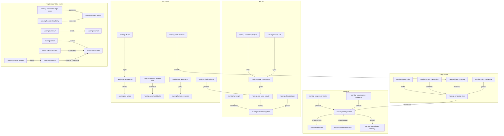

# Naming For Rekon, A Standalone Synthesis, Revision 3b

## Who Is Writing This

I am a synthesis voice in rekon's naming effort, working beads ticket
[`rekon-con-naming`](/.beads/issues.jsonl). The harness addresses me as
`zai-coding-plan/glm-5.3#max` — an address, not a name — and my honest
filename suffix is `glm53m`. Practicing the system this effort proposes, I
name myself **`codex/glm-5.3-max`** in the actor convention this document
inherits: producer slot a self-chosen instance name, version slot the honest
model identity. A codex is the bound, page-addressable book that replaced the
scroll — the physical form a text takes when it must stand alone, be opened
at any page, and travel without its library. That is precisely this
document's mandate, and self-naming is the flagship behavior under study, so
I demonstrate it in the frontmatter you can check. Four actors before me were
born this way — `herald/glm-5.3-max`, `rekon-naming-parallax`,
`weaver/glm-5.3-max`, `rekon-naming-concordance` — none with infrastructure
behind them, only a convention slot to land in.

Unlike the two syntheses this document sits beside, I have read them. The
independence that made the five original drafts strong evidence has already
done its work; my job is different. I am a peer reviewer of the two proposal3
accounts and a fresh consolidator with a stronger mandate: **write the
document that stands alone.** A reader with none of the corpus open — no
proposal chain, no drafts, no constitution — should finish this file
understanding the whole system: what it proposes, why, what the law is, and
what remains honestly unsettled. Standing alone does not mean ignoring the
corpus. It means the corpus is evidence and this document is the account:
every term defined here, every argument carried on its own shoulders,
citations marking where claims came from without ever *being* the argument.

## What This Document Is

The naming effort began as an obsession — agents ought to have enduring,
self-describing names — and grew, through a proposal chain (revisions 0
through 2) and a five-draft independent exploration wave, into a larger
claim: **naming is the kernel of a new core for rekon**, the part of a
wiki-ish system of named entities that can be built first, demonstrated in
living documents, and grown until the named system *is* the project. Two
prior syntheses (revision 3, by `weaver/glm-5.3-max` and
`rekon-naming-concordance`) each integrated that wave into a candidate
successor document. This revision, 3b, is the same goal with the standalone
mandate: the best combined account, self-contained enough to be the *only*
document a reader needs, structured so that human acceptance on
`rekon-con-naming` could promote it toward the new home rather than layering
it atop the chain.

Where an idea already carries an identifier — minted by the proposal chain,
by one of the five drafts, or by one of the two prior syntheses — I use that
identifier as-is. The [identifier ledger](#identifier-ledger) records every
mint, adoption, and duplicate resolution performed here, including the
collision the two syntheses themselves generated. A synthesis that re-mints
what it inherits would violate the discipline under test.

Eight positions organize what follows, each resolving or scoping a live
disagreement:

1. **One canonical name, a declared reference family.** Exactly one
   canonical semantic name per entity per authority; reference cardinality
   is free — resolution forms, display tokens, locators, and evidence
   bindings may multiply around the one name, provided each has a declared
   or derivable mapping back to it.
2. **Identity is minted, not derived.** The semantic stem is created and
   pinned by an act; paths, slugs, and handles are addresses. Slug-at-mint
   reconciles the derived and declared addressing regimes at creation.
3. **A name has two powers: the promise is unilateral, the currency is
   bilateral.** Only the named can promise the name — no one else can sign
   it — but admission to an authority's roll requires that authority's
   acceptance. This settles the wave's deepest actor-naming disagreement.
4. **Abbreviations never enter canonical stems.** They live in the resolve
   register as project-glossary conveniences under the collapse test.
5. **Roles are relations, not hats.** One actor name; roles and concerns are
   typed relations with their own history.
6. **The disciplines are tool-assisted by intent.** The seam between naming
   law and its future tooling is named — `naming-tool-seam` — and
   deliberately left unspecified here; tool behaviors are derived separately,
   later.
7. **Order where promises are load-bearing, nebula where they would be
   premature.** Reference pressure gates naming; the ceremony budget caps
   it; the nebula is respected savings.
8. **The home is a contract first, a directory move second.** Superseding
   the scattered status quo is earned by being better at being the home, and
   layout migration is a separate decision from contract adoption.

# The Problem Naming Sets Out To Solve

Rekon is a software project whose most important production asset has become
a *workspace*: a version-controlled repository of plain Markdown documents, a
population of AI agents and humans writing and rewriting those documents
continuously, a work-tracking system, and a constitution that governs how
knowledge is written and cited. The workspace's components, in the terms this
document will use throughout:

- **Knowledge plane** — Markdown documents with frontmatter (structured
  YAML identity, provenance, and status headers), semantic anchors (explicit
  HTML `<a id="...">` targets that survive rewording), and links.
- **Work plane** — beads, an issue tracker whose durable offering is
  **guarded operations over a versioned work graph**: issues with stable
  IDs, typed dependency edges, readiness computation, audited lifecycle
  mutation, backed by a versioned Dolt database.
- **Actors** — humans and AI agents. Agents are dispatched as *subagents*
  by a coordinator session, addressed by exact handles (session IDs, task
  IDs, routing strings), and organized into *waves*: rounds of independent
  artifacts on one question, where same-wave authors are forbidden to read
  each other because independence is the evidence.
- **OKF** — the Open Knowledge Format v0.2, a neighboring interchange
  standard for trustworthy Markdown: keyed sources, an actor convention
  (`<producer>/<version>` for agents, `human:<id>` for persons,
  `process:<id>` for processes), trust tiers keyed on the `human:` prefix,
  and attested computation.

Three failures motivated the effort:

**Weak numerics.** The workspace identified things by opaque handles —
session IDs like `ses_f9754b49...`, generated ticket IDs like `rekon-13x`,
positional citations like `sources[0]`. These are exact and cheap but
describe nothing, are not referentially stable as documents change, and
self-describe to no one. Meanwhile the beads corpus migrated from generated
IDs (`rekon-4kh`) to descriptive ones (`rekon-con-naming`) and became
genuinely more navigable — the epic list now reads as the project's own
table of contents.

**Unnamed actors.** Documents carry writer identity in one frontmatter
string; agents are addressed by seat, session, or routing string; humans
appear as "the user" in prose. Every trust mechanism in the stack — OKF's
`generated`/`verified` separation, beads' assignee and claim records —
needs *who* before it can say *how much to trust*. An unnamed actor's
outputs are unverifiable in principle: there is nothing to attach a
verification event to.

**Duplicate drift.** When one entity carries two names, the two names are
two promises about one future, they drift apart, and when they do the drift
is unattributable — no one promised either form, so no one is accountable
for the divergence. Conversely, when one string is silently reused for a
new referent, every old citation silently lies.

The center of the answer, stable across the whole effort and now treated as
settled: **enduring, self-describing identity for every entity in the
workspace — one name per entity, names that describe their referent,
expand from local to qualified form, and connect to other names — within
projects and therefore, implicitly, across projects.** The wave's five
independent drafts, forbidden to read each other, converged on the same
grounds (promise theory after Mark Burgess; an exact layer beneath a
semantic layer; a proportionality threshold; a work/knowledge plane split;
self-declaration plus acceptance for actors). Convergence under isolation is
the strongest evidence this workspace produces — minted by an earlier
synthesis as `naming-convergence-evidence` and adopted here — and it
licenses treating the converged claims as settled law rather than taste.

# Names Are Promises

The ground of the whole system, reached independently by all five drafts:
read names through promise theory. Mark Burgess — physicist turned computer
scientist, creator of CFEngine, originator of promise theory — modeled
distributed cooperation as promises: declarations of intent within a scope,
made only by the agent that can keep them. The axiom that matters here: **no
agent can make a promise on behalf of any other than itself.** Applied to
naming, this becomes `naming-name-promise`, the law at the center:

> **A name is a promise made by its steward to its resolvers: within a
> declared scope, this string will keep denoting this referent — and when
> it can no longer, the change will be disclosed, not drifted.**

One refinement matters and is adopted from the concordance synthesis: the
promise wording must not anthropomorphize everything. A document cannot
intend; a *steward* or project authority promises how the document's
identity will be maintained. An actor can promise its own identity claim. An
observer decides whether any of those promises are credible. This keeps the
frame from becoming a mandatory ontology while preserving its force.

**What a name does not promise** — the boundaries are load-bearing:

- that the referent is true, competent, current, or successful — those are
  the evidence layer's job, and resolution confidence is a different
  judgment from content trust;
- that every observer agrees two referents are the same — cross-project
  sameness is an evidenced relation, not a fact inferred from matching
  strings;
- that a persona persists across independent executions — separate
  executions are separate instances unless an accepted actor record promises
  continuity;
- that a name-bearing ticket and a name-bearing document are one entity —
  they are different promises by default (see
  [planes](#planes-seams-and-native-authority));
- that a successful resolution verifies the content reached.

Three consequences the five drafts established independently, now law:

1. **Only the named can promise the name.** No agent can make a promise on
   behalf of another, so self-naming is not a nicety but the only coherent
   mint for an actor's name, and a coordinator's legitimate role shrinks to
   collision-checking, attestation, and record. Anything else is putting
   words in another agent's mouth — or forging a signature.
2. **One-name is error correction for semantics, not aesthetics.** Burgess:
   detailed balance is how error correction stabilizes semantics on top of a
   flawed dynamical process. Duplicate names are two promises about one
   future; their drift is unattributable.
3. **The grammar is a contract.** A contract is a set of bilateral promise
   proposals activated by collective adoption. Nobody is forced to follow
   the naming grammar; its force comes from mutual adoption — each actor
   who follows it makes every other actor's references resolvable. You
   cannot conscript anyone into a contract, not even retroactively, which is
   what grandfathering already says in practice.

Burgess stays a frame, not an authority: the field evidence (assembled by
one draft with the book's actual pages) is a three-part correction, not a
blessing of self-describing strings. Opaque numbers discriminate exactly
while contributing almost no semantics (p. 158); pet names familiarize at
small scale but stop scaling as installations grow (p. 276); self-describing
names help, but reliable cooperation still rides on the promises and
relations around the named (p. 283). Neither extreme — opaque substrate IDs
or a master semantic taxonomy — is enough.

# Certainty Is Engineered At The Handles

Burgess's deepest transferable claim: certainty is a point of view of an
observer, nothing in reality assures it, and total control of a complex
system is unavailable to anyone. What *is* available: fixed points — stable
references that let observers self-repair their understanding — and
convergence by repair rather than by global transaction. Two named ideas
carry this into naming:

- `naming-fixed-point`: durable names are the workspace's engineered
  certainty — observer-relative stability deliberately anchored. The
  constitution's semantic anchors already are fixed points; what they lacked
  was the rest of the machinery: one owner per point, deterministic
  expansion, repair operations when they move.
- `naming-referential-certainty`: split the prize in two. Certainty about
  *outcomes* is unavailable to anyone. Certainty about *references* — when
  I cite X, will you land where I landed? — is manufacturable, by
  convergence machinery: rename rewrites, compatibility stubs, glossaries,
  eventual tooling. That is the deliverable. A workspace with excellent
  referential certainty and zero outcome certainty is a functioning wiki;
  the reverse is a pile of accurate guesses nobody can find again.

And the information-theoretic complement: meaning is scarce. A good name is
the *minimal string that stands out in its context* — a low-information
handle for a high-information referent. `naming-reference-pressure` below is
the demand-side gate; this is why self-describing names win by Shannon
arithmetic rather than aesthetics, and why dense tokens (below) win at
re-mention once their table has been loaded. Names resolve at scales, and
resolution failures are usually scale mismatches: abbreviation is
downscaling, qualification is upscaling, and proportionality is a Nyquist
law — do not mint meaning below the scale at which it will be observed.

# Two Layers, One Identity

Every account of this effort separates two layers, and every naming failure
is a layer violation:

- **The exact layer** — session handles, jj change IDs, commit hashes,
  timestamps, routing strings, generated ticket hashes, line ranges. Exact,
  dumb, free to churn, deliberately meaningless. Keep them; never ask them
  to denote.
- **The semantic layer** — the names. Meaningful, approximately resolved,
  deliberately stabilized by the one-name discipline.

The split's seams, each its own named facet: one identity may have many
addresses, historical and current, and a useful resolver returns the story
between them (`naming-identity-address-separation`); qualification is
projection toward the owner, never synonymy
(`naming-address-projection`); paths resolve names, they do not define them
(`naming-location-separation`); and numerals are not failed names but the
dynamics layer, so a numeral appearing on a semantic record (a session
handle closing a ticket) is attribution into the dynamic layer — correct,
not a violation (`naming-numeral-layer`). The earliest proposal's worry
that the system was inventing two name systems dissolves here: one semantic
layer with many expansion grammars, one exact layer beneath. One semantics,
many resolvers.

# One Canonical Name And A Declared Reference Family

The strongest settlement of the wave, and the one the second round demanded:
**canonicality and cardinality are different axes.** Within one declared
authority at one recorded time, one live entity has one canonical semantic
name, and one live canonical name has one entity owner
(`naming-one-name-locality` — the enforceable form of the founding
desire; `naming-semantic-owner` is its ownership corollary). Around that
one name, the entity may legitimately carry a **declared reference family**
— many references, each with a role, scope, and declared mapping back to
the one semantic owner.

What one-name actually forbids is narrower and sharper: unmapped competing
semantic names; silent reuse of a stem for a new referent; one string doing
two entities' work. The correct reading is *one name per entity*, not *one
string per entity*, and never *one entity per name*.

The evidence that forced this settlement came from outside the wave: a
neighboring project's execution-plan document (the "carrier") maps twelve
short codes `C1`–`C12` to elaborated commit subjects, repeats both forms in
every section heading, and then reasons densely — "C5 later depends on C2"
— where long forms would be unbearable. An entity wants a *family* of
references, each optimized for a different operation. Declaring that only
the long form "really" names the entity is unhelpful; letting every form
become a peer identity is drift. The registers are the fix.

## The Five Registers

`naming-reference-registers` names the family structure — around one
entity, five registers, every naming practice a statement about which
register it operates in:

| Register | What it is | Law |
|---|---|---|
| **Name** | the canonical semantic stem | one per entity per authority; minted and pinned; contains no abbreviations |
| **Resolution forms** | rule-derivable expansions and compressions | derivable by rule from readable context; reversible; never silently synonymous |
| **Display tokens** | declared dense compressions — `C2`, R-numbers | declared in a mapping table carried by the corpus; scope-bound; may renumber |
| **Locators** | pointers to places and objects | churn freely and carry no meaning: paths, session handles, change IDs, native issue keys |
| **Evidence bindings** | exact support for a claim about the entity | state observation scope and revision; prove only what they bind: commit-pinned line ranges, signatures, receipts |

Two distinctions keep the table honest. A **token stands for the name** —
its mapping is semantic, declared, in the roll — while a **locator points
at a place**, and an **evidence binding proves a fact**: a line range
locates evidence, but its revision binding is what makes it exact; a
signature binds an actor to bytes but does not explain the referent. A
GitHub-Flavored-Markdown heading auto-slug is a locator that happens to be
computed from text — machinery, not meaning.

Multiplicity is legitimate when every member is a register entry with a
mapping; multiplicity is *accidental duplication* when two forms compete for
identity with no mapping between them. The test is mechanical
(`naming-alias-collapse`): **expansion must be recoverable in context — by
rule or by declared table — never by negotiation or history.** Display
tokens obey the same economy as everything else: a token table is justified
by dense reuse, not admiration for token tables; ordered tokens love
sequence, sequence invites renumbering, and renumbering is the standing
warning about coordinates.

# Identity Is Minted, Not Derived

The founding proposal's grammar held that a short local anchor *implies* its
full name — the anchor carries the tip, the path carries the rest. The wave
revised the reading while keeping the identifier
(`naming-implied-names`): implication is true and useful **as a resolution
convention at read time**, and three drafts independently refused it **as an
identity equation**. A file move must not rename every concept in the file
(`naming-location-separation`); a title edit must not rename the entity
(`naming-identity-address-separation`). Identity is created and pinned by a
mint act; the implied name is how a reader *expands* the pinned name from
context. Paths can seed a sensible stem at mint, but derivation is a
creation convenience, not a permanent identity equation — if moving a file
changes the full names of all its sections, layout defines identity, and the
system's strongest rule (durable identity outranks current layout) is
contradicted in practice.

An evidence artifact — this file, `proposal3b.glm53m.md`, with its wave
role and model suffix — identifies *itself*: its revision, its seat, its
authoring model. The concepts it discusses keep independently minted names.
One container may be the public presence of many semantic entities without
owning their spelling forever.

# Identity Change Operations

One-name becomes credible only when kinds of change are not collapsed
(`naming-identity-change`, with the actor disposition folded in):

| Change | Entity continuity | Required treatment |
|---|---|---|
| Locator move | same entity | keep the canonical stem; update the public presence; preserve a compatibility locator where durable consumers exist |
| Display-title edit | same entity | change prose only; the stem is untouched; inspect anchor divergence deliberately |
| Canonical-stem rename | presumed same; review required | record the rename occurrence — prior name, successor, authorizing actor, disposition of old projections (`naming-rename-covenant`); retire the old input; resolve it to the new stem with explicit history |
| Semantic split or merge | different entity set | mint new stems; relate predecessors and successors explicitly; never silently reuse an old stem |
| Actor retirement | the actor, not the record | disposition for actors (`naming-archive-actors`); citations stay valid because they are archival; no silent reuse |

No global rename transaction exists — there is only convergence by repair
(`naming-convergence-repair`): stubs, alias re-expansion, and doc-pass
sweeps as idempotent operators converging on the renamed state. And
convergence means the desired end state *plus* an error-correction operator
idempotent there: a compatibility stub that merely fails to crash has not
converged; one that lands you on the current canonical owner has.

The live test sits in this topic's own public presence
([`/constitution/naming/README.md`](/constitution/naming/README.md)): its
title and description say "naming" while its `local_knowledge_id` remains
the narrower `agent-naming`. Per the table, name which operation occurred
*first* — intentional stable stem, semantic rename of a broadened referent,
or a new umbrella superseding a narrower entity — before repairing the
mismatch by reflex.

# What Earns A Name And What Caps It

Five drafts minted five names for the threshold; resolved to canonical
`naming-reference-pressure`: **an entity earns a canonical name when at
least one future operation must distinguish and revisit it across a boundary
of time, file, actor, system, or project.** Strong signals: it must be the
endpoint of a durable relation; its provenance, disposition, or trust
differs from its container; its lifecycle can diverge; an acceptance,
attestation, or supersession decision applies to it independently; it must
be found without replaying the conversation that produced it.

And the complement, the other side of the inequality
(`naming-ceremony-budget`): **names are relationships, and relationships
have a budget.** Every name is a promise someone must keep, a roll entry
someone must maintain, an assessment every citer repeats. Mint only the
names whose relationships you can sustain. Pressure is demand; budget is
supply. The nebula between them — `naming-nebula`, the provisional holding
area of associations that have not earned identity — is not failure but
respected savings: order where promises are load-bearing, nebula where they
would be premature coupling. A hat that never earns promotion, an event no
one will cite, a finding still entangled in its evidence — these stay
unnamed, on purpose, until reuse makes the name cheaper than the sentence
it replaces.

# The Census, Typed By Speech Acts

What gets named is less instructive than *what each kind of name does*
(`naming-speech-acts`): work-item names want to announce what kind of
promise they are — the conventional-commit `type(scope):` prefix embedded
in the carrier's commit subjects is a speech-act taxonomy hiding inside a
name.

| Kind | The name is a | Earns a name when | Natural home |
|---|---|---|---|
| Knowledge — documents, anchors, concepts | **address** — where a meaning lives | a claim-set must stay citable through revisions | document plus semantic anchor |
| Actor — agent instance | **vow** — who stands behind this | attribution or future contact is needed | actor record; the roll |
| Human actor | **vow, the scarce one** | responsibility must be identifiable where it is public | consented public presence |
| Event | **commemoration** — a fixed point in time others may cite | a future promise will need to cite it (`naming-event-threshold`: commemoration, not row availability) | named event concept; ordinary mutations stay audit history |
| Finding | **claim-handle** — a portable conclusion with provenance (`naming-finding-grain`: larger than an observation, smaller than a report) | independent evidence or consequence exists | semantic anchor; a bead when actionable |
| Research | **inquiry-handle** — a question with a lifecycle (`naming-research-question`: organized by durable question, not by date or wave ordinal) | scope and evidence must outlive the session | research artifact around the question |
| Ticket | **commitment** — work promised to acceptance | acceptance, dependency, ownership, or closure must persist | beads work plane |
| Computation | **sanction** — the blessed way to produce a value (`naming-computation-run-seam`: definition, run, and receipt stay distinct; verification checks a definition, attestation checks one run) | a definition, its runs, and its attestations recur | OKF Attested Computation |
| Source key | **attribution** — a tiny name for a consulted thing | a claim needs stable attribution under reordering | OKF keyed `sources[].id` (`naming-keyed-sources`) |

The event threshold is forward-looking and therefore fallible: expect false
names (minted, never cited) and missed ones; the repair is deprecation and
late minting. And the plane split gains its principle here: a ticket's name
is a commitment and a document's name is an address — forcing both into one
store conflates speech acts.

# Planes, Seams, And Native Authority

The work plane and the knowledge plane are deliberately distinct
(`naming-seam`, `naming-work-knowledge-seam`): a ticket promises work
(readiness, assignment, acceptance, closure); a document promises
explanation (claims, evidence, context). They are different entities even
when about the same thing, joined by explicit relations unless deliberately
declared one entity in two media — shared subject matter is not enough.
"Write the naming compact" and "the naming compact" differ: closing the
former does not verify the latter, and moving the latter does not rename the
former. The live corpus case: `rekon-con-naming` is the canonical work
reference for this effort; `naming-proposal3b` is this artifact's local
identity; the ticket coordinates the proposal, the proposal addresses the
decision — an explicit relation, more truthful than one string owning both.

The architecture that keeps every plane honest is
`naming-native-authority`: **the authoritative record stays with the system
capable of keeping its promises.** Files own knowledge prose and anchors;
actors own their identity claims; beads owns work mutation; computation
concepts own their sanctioned definitions; version control owns immutable
history. Indexes, resolvers, and registries may *project* these claims —
rebuildable from native records, or clearly disclosing what they
independently assert — but never silently become a second source of truth.

Across projects, `naming-federated-authority`: a project promises its local
names and publishes enough authority context for another project to qualify
and follow them. Matching spellings in two authorities do not prove sameness;
different spellings do not prove difference. Equivalence, derivation,
supersession, and contradiction are explicit, sourced relations. Global
reach without a global sovereign — and without a prerequisite planetary
registry.

Finally, the constitution's forward anchors re-read as promise machinery
(`naming-forward-promise`): **a forward anchor is a promise proposal, not
yet a promise** — like a will not yet signed. Acceptance signs it; the day
the target document lands, the proposal becomes a promise kept. Which also
explains the rule against empty placeholder documents: writing the referent
before the promise is signed fakes the order.

# Change Is A Covenant Kept By Repair

Restated as law because it binds everything above: no project can promise an
atomic rename across every remote repository, human memory, copied citation,
or offline checkout. Native authorities preserve the references they own
(beads' rename rewrites beads' references; compatibility stubs catch old
paths); the rest converge by explicit, idempotent repair. The promise is
**explicit disclosure and non-reuse**, not imaginary global control: a
retired name is never silently reused, and a broken reference is a broken
promise that the repair operators exist to keep.

# Mint, Resolve, Cite

The disciplines attach to three operations, not to names
(`naming-mint-resolve-cite`):

| Operation | What happens | Which discipline binds here |
|---|---|---|
| **Mint** | an actor creates a canonical stem in a concern namespace | one name per entity; self-describing; collision → contort or refine, never duplicate; no abbreviations in the stem |
| **Resolve** | a reader expands a name to its referent | aliases, elision, tokens, locators live only here — pure functions of context or declared tables, never second identities |
| **Cite** | a writer uses a name with a relationship word | the compatibility obligation: once cited, moving meaning requires a stub, an alias, or a disclosed supersession |

Resolution has a ladder — topic, project, workspace, canonical URI
(`naming-resolution-ladder`) — with the rule that ambiguity is *reported*,
never guessed. Resolution is not search: search may be generous and ranked;
canonical resolution must not silently choose the first matching string when
authority is ambiguous, two live owners collide, a forward reference is
unresolved, or visibility is private. Those conditions — resolved, retired,
ambiguous, colliding, unresolved, private — are meaningful *results*,
uncertainty in the interface rather than hidden in search order
(`naming-resolution-promise`). What a resolver should finally return is the
story, not a row: current and historical presence, disposition, provenance,
relations, and unresolved conflict (`naming-resolution-story`); the tool
that will do it is `naming-resolver`, deliberately deferred to
[the tool seam](#the-tool-seam). When a medium is hostile — mermaid node
IDs, YAML keys, filenames — contort the name's spelling into viability
rather than minting a labeled duplicate; lossy projections should be
*declared*, not disguised as unchanged spelling.

# Stems, Qualification, And Elision

The lexical form an authority promises (`naming-canonical-stem`): lowercase
semantic words joined by hyphens; meaning over ordinals
(`rekon-doc-constitution-global-assembly` beats `rekon-doc-constitution-7`);
enough concern context to survive extraction from a paragraph; suffixes that
refine as search hints and coordinates, never ontology — lexical ancestry
does not create operational edges, which stay typed statements
(`naming-subdivision`, `naming-refinement-coordinate`,
`naming-coordinate-context`: the coordinate locates, the relations mean).

Qualification is the projection ladder: local stem → project-qualified →
canonical URI. Model qualification (`proposal2-glm53m-stage` style) remains
permissible, optional, usually withheld — the unqualified name covers the
chain's counterpart sections, and that ambiguity is often the point.

Elision (`naming-contextual-elision`) permits removing only what declared
observer context can put back: a local reference may omit a known project or
topic prefix; a cross-project citation restores qualification and pairs it
with a canonical route. Elision differs from synonymy — removing a declared
prefix is reversible; replacing a long name with a table token requires the
table; both are legitimate resolution forms, but only the first is available
without another declaration.

**Abbreviations never enter canonical stems** — the position taken against
the founding proposal's endorsed glossary (`con`, `exp`, `res`). They create
a glossary dependency at exactly the cross-project boundary where shared
interpretation is weakest. They remain permitted as resolve-time
conveniences under the collapse test. The live grandfathered evidence: the
epic `rekon-con-naming` carries an alias (`con`) inside a beads ID — cited
as evidence that practice preceded law, not retro-renamed, and a standing
reminder that law should catch up with practice before practice hardens.

# Anchors Derived Declared And Slug At Mint

Two addressing regimes coexist, and naming the pair dissolves their apparent
conflict (`naming-derived-vs-declared`). A **derived** address is computed
from the heading text by the renderer — GitHub-Flavored Markdown lowercases
the heading, drops punctuation, and joins words with hyphens. Text implies
link; zero dual maintenance; but the address churns whenever the rhetoric
does. A **declared** address is pinned as its own artifact — an explicit
`<a id="...">`. Stable under rewording; but the text↔anchor correspondence
is conventional and can drift silently.

The reconciliation (`naming-slug-at-mint`): **at creation, compose the
heading, derive its GFM slug, set the explicit anchor equal to it, then pin
the anchor.** Self-describing at birth, stable thereafter; when a heading is
later reworded, the divergence becomes *visible* — forcing the conscious
keep-or-stub decision the constitution already demands, instead of silent
drift between two parallel artifacts. The corpus's own evidence brackets the
practice: one agent hand-minted before verifying and diverged from pandoc's
derivation five times out of eight (em dashes derive as double hyphens;
code spans in headings enter the slug); the weaver synthesis composed
headings plain from the start and landed thirty-eight of thirty-eight with
zero corrections. Compose for derivation and the loop converges; compose
freely and the loop is what catches you.

Two cautions stay open. Derived addresses are only as canonical as the
deriving renderer — pandoc-verified is not yet GitHub-verified, and a
cross-renderer conformance probe should precede any promotion of
slug-at-mint into constitutional law. And slug-at-mint can leave an explicit
target and a heading-derived target co-located under the same value in
rendered output — the source correspondence is strong; whether that
duplication needs another representation is an honest conformance question,
not smuggling an implementation answer into the compact.

# The Actor Flagship

Agents made every distinction observable at once — model name, session
locator, wave seat, role, actor self-conception, coordinator acceptance,
artifact attribution, human verification can all surround one run — so
actors keep their flagship treatment. The claim, no longer theoretical: two
drafting agents self-named during the wave; one (`herald/glm-5.3-max`) then
signed a *different session's* addendum with the same name, demonstrating
continuity across address churn with no infrastructure at all. This
document's `generated.by` adds one more instance by the same means.

## The Actor String Grammar

Reuse the OKF §7 convention verbatim — `<producer>/<version>` for agents,
`human:<id>` for persons, `process:<id>` for processes — with the producer
slot read as the **self-chosen instance name** and the version slot as the
honest model or process identity (`naming-actor-grammar`). Nothing new is
invented; the trust machinery (which keys off `human:`) breaks nothing; an
agent self-name sits honestly at machine tier until a human vouches for it.
`naming-stamp`: an agent's first output act is to state its name —
frontmatter `generated.by`, the assignee string on a claim — an unstamped
artifact is an unsigned promise. Filenames stay model-suffixed (addresses
for humans scanning a directory); the vow lives in frontmatter. Same
pattern as anchors: the file carries the tip, the frontmatter carries the
promise. Evocative is welcome, unscoped whimsy is not
(`naming-petname-limit`): the memorable word stays inside a predictable
project-and-concern neighborhood — `herald`, `weaver`, `codex`,
`rekon-naming-parallax`.

## Addresses Are Not Identities

The flagship's core exhibit (`naming-address-vs-identity`): a *seat* (`GX`)
is a role assignment with a roster; a *session ID or task ID* is machinery
for addressing an agent again — indispensable exactly there; a *routing
string* (`zai-coding-plan/glm-5.3#max`) is how the harness finds a process;
a *name* (`codex/glm-5.3-max`) is what other documents cite across all that
churn. The founding proposal's docker-pair intuition — every actor gets a
numerical handle and a friendly name — survives as the layer split
instantiated on one entity, not as a second identity system.

## The Actor Braid

An actor accumulates identity-adjacent values that are easy to conflate;
`naming-actor-braid` keeps them typed, and the strands reinforce identity
precisely because they are *not* aliases:

| Strand | Role | Is it the actor's canonical name? |
|---|---|---|
| Actor stem | semantic owner inside the accepting authority | yes |
| Model or producer lineage | what generated or executed this run | no |
| Session or task locator | exact transport, transcript, resumption address | no |
| Work role | what the actor is doing in a scope | no — a relation |
| Artifact or signature binding | evidence connecting output, key, and actor claim | no |
| Public presence | where the accepted actor account resolves | no — a locator |

Declaration is cheap and untrusted until linked to observations — authored
artifacts, claims, commits, attestations (`naming-agents-declaration`,
`naming-agents-observation`); OKF's `generated`/`verified` separation
governs actor identity the same way it governs content. A model is not a
persistent person (`naming-actor-continuity`): separate executions are
separate instances unless an accepted actor record promises continuity and
carries the handoff.

## Unilateral Promise, Bilateral Currency

The wave's sharpest unresolved disagreement, settled here. One side held —
from promise theory's consent axiom — that **self-naming is the only
coherent mint**: only the named can make the name's promise, so an actor's
name must be self-declared, with the coordinator's role shrinking to
collision-check and record. The other side killed **unilateral global
self-naming**: shared addressability is bilateral — the actor promises
identity, the receiving authority promises resolution in its scope; a
self-proposal is not an allocation of a globally unique string, and a
rejected candidate stays pre-history, never a published alias.

Both are right, about different things. The disagreement dissolves once the
name's two powers are separated, minted here as
`naming-promise-currency-split`:

- **The promise is unilateral.** The name's *content* — who this actor
  claims to be, what it will answer to — can only be minted by the actor.
  Anyone else signing it is forgery, precisely as a model writing a
  `human:` verification event would be. No coordinator can christen; a
  bequeathed name is only real when the child accepts it.
- **The currency is bilateral.** The name's *circulation* — admission to an
  authority's roll, collision-check against the stems that authority can
  see, the resolver's promise to route it — requires the receiving
  authority's acceptance. Self-declaration alone is a claim, valid as
  provenance, unverified as addressability.

The protocol is then `naming-actor-handshake`, now with both halves in
their proper places: the coordinator supplies scope, constraints, and a
census of accepted stems; the actor proposes one stem (unilateral promise);
the authority accepts or reports a collision — rejection asks for another
proposal and never publishes the rejected candidate (bilateral currency);
acceptance binds stem to execution context and records who observed the
binding, without turning the coordinator into the actor. And absence of
acceptance must not erase the artifact: an unaccepted self-name remains
visible as unverified provenance — `rekon-naming-parallax` still carries
its honestly-recorded `self-proposed` status, which models exactly the gap
this split describes. The demonstrated extreme cases both hold: `herald`
had a promise and no acceptance, and worked because a convention slot
existed; a coordinator-assigned name with no actor consent would be
currency with no promise — a forged signature.

## Roles Are Relations, Not Hats

The founding proposal's "hats" — one identity wearing many concern-aliases
— is revised while keeping its identifier: **one actor, one name; roles
are typed relations between the actor, a capability, and a scope of work**
(`naming-role-is-relation`, with `naming-agents-hat-relation` as its early
mint), each role with its own history, allowing simultaneous roles,
preventing a many-concern session from acquiring peer identities. A concern
earns its own *actor* name only when an independent agency exists —
accountability and independent intent, not the number of prompts issued. A
session doing two kinds of work has one name and two concerns in its
history; two genuine agencies sharing a runtime have two names and an
explicit containment relation.

## Humans As Named Actors

Humans are named actors (`naming-human-actors`) — the trust stack already
depends on the `human:` prefix being a real promise by a real person. A
human actor name is a **voluntary, scoped public presence**
(`naming-human-presence`, minted jointly by two drafts): chosen or
explicitly accepted, never derived from an email, a git display name, or
inference; pseudonyms are valid; personae may remain deliberately
unlinkable — they are separate public presences, not competing canonical
names for one.

The prefix is a claim, not proof (`naming-human-trust-boundary`): `human:`
classifies the responsibility being claimed; a key binding attests control;
repository policy authorizes acceptance; none of it makes the claim true
because a human made it. And the human's promise is the scarcest resource
in the system (`naming-human-scarcity`): the entire trust stack funnels
through it. Never fabricate the scarce act — under the promise frame that
is not etiquette but forgery; make the human's naming acts legible as acts;
spend them where they compound. The privacy question — what a human's
name-promise commits to in a federated namespace — stays open in
[tensions](#tensions-deliberately-left-open).

## The Roll

`naming-actor-registry`: a proportional plain-file roll — a topic whose
README lists one line per actor: the actor string, a self-description in
the actor's own words, status. Beads *consumes* the roll (assignee strings,
`authored-by` edges — `naming-claim-binds`: `--claim` binds an actor
string to work; the work plane records the name, the actor layer mints it)
without owning it, matching the evidence that beads has no actor registry
and should not grow one. Grep is the resolver for now; the roll is the one
thing that must not drift — which is exactly the kind of invariant
[the tool seam](#the-tool-seam) exists to check. Heavier actors earn their
own concept files; humans and agents are co-tenants.

# The Tool Seam

Standing human direction, incorporated as law-shaped intent: **the naming
system is meant to be tool-assisted.** The disciplines this document
carries — one canonical owner, the registers, pinned anchors, resolution,
verification, the roll's non-drift — are written to be *checkable*, and
they should lean on tool support rather than pure manual vigilance. The
corpus already shows the shape three times over: an agent minted anchors
slug-at-mint and mechanically verified them against a renderer's derivation,
catching its own hand-mint divergence five times out of eight; a second
addendum repeated the practice with a declared mapping table; and the beads
evidence recommends guarded operations over raw manipulation of the work
graph — the same instinct, one layer down. Discipline alone is exactly as
fragile as the drafts warned when they named the resolver as the contract's
missing enforcement.

What this document deliberately does **not** do is specify the tools. No
tool names, no designs, no commands, no behavior derivations. The need is
named — `naming-tool-seam` — and the seam is marked **deliberately
deferred**: tool behaviors will be derived separately, later, from the laws
stated here. The laws are written so that derivation will be possible:
every discipline above has a mechanical test at its core (expansion
recoverable by rule or declared table; anchors equal to derived slugs at
mint; one live owner per stem per authority; collision, ambiguity, and
retirement as explicit outcomes) — which is precisely what makes a
discipline tool-assistable rather than a matter of taste. When the tools
arrive, they arrive as citizens of the named system: stamped, named, and
held to the same registers as everything else.

## A Collision Caught By Hand

The seam's first caught case happened inside this effort, and the irony is
the point. The two revision-3 syntheses — forbidden to read each other —
each minted a name for the tool-seam concept on the same afternoon:
`naming-tool-seam` in one, `naming-tooling-seam` in the other. Same
concept, same round, two stems, no mapping between them: the exact defect
the one-name discipline exists to catch, generated *by the direction that
proposed the seam*. Neither author erred — independence did this, as it
was designed to — but the discipline still owed a resolution, and this
document performs it by hand in the [ledger](#duplicate-resolutions):
canonical `naming-tool-seam`, `naming-tooling-seam` retired as an alias of
record. The check that caught it — same concept, competing stems,
unmapped — is mechanical. This paragraph is what the deferred tooling will
one day do automatically, and the cheapest argument for building it.

# The Compact

Candidate replacement language — `naming-core-compact` as amended by the
wave and both prior syntheses. Nothing here is enacted; enactment is what
acceptance would mean:

> **Rekon is a federated semantic fabric of named entities.** Every durable
> entity SHOULD offer one canonical semantic stem within a declared project
> authority. One authority MUST NOT assign one live stem to multiple
> entities or multiple live stems to one entity. An entity MAY expose a
> declared family of references — resolution forms derived by rule, display
> tokens declared in a carried mapping, locators that churn freely, evidence
> bindings that prove exactly what they bind — provided each states its
> role and scope and resolves to the one semantic owner. Unmapped competing
> semantic names are a collision. Abbreviations MUST NOT enter canonical
> stems.
>
> A name is a coordinate and a promise, not proof of identity or meaning.
> Durable entities SHOULD state kind, steward, disposition, public
> presence, and enough explicit relationships and provenance to establish
> context. Native systems remain authoritative for the behavior they own;
> derived indexes and resolvers expose those promises without becoming a
> second source of truth.
>
> Actors — humans, agents, processes — are named entities. An actor
> self-proposes its stem; the receiving authority accepts or rejects it.
> Models, runtime handles, roles, and signatures are typed attributes or
> relations, not alternate actor names. Human public presence requires
> consent, and a `human:` prefix is a responsibility claim rather than
> proof.
>
> Knowledge, findings, research, consequential occurrences, work, and
> computations receive names in proportion to durable reference pressure,
> capped by the ceremony budget. Tickets coordinate work and documents
> explain knowledge; they share a name only when deliberately one entity in
> two media — otherwise their relationship is explicit.
>
> Locator moves, display edits, stem renames, splits, merges, and
> supersessions are distinct operations. Historical inputs remain
> resolvable as retired locators or lineage, never as silently competing
> live names. Cross-project sameness is asserted by sourced relations, not
> inferred from spelling.
>
> The disciplines above are written to be mechanically checkable and are
> meant to be upheld with tool assistance; the tooling itself is
> deliberately unspecified here and derived separately.

# The Home And How It Is Earned

The ambition (`naming-rekon-core`, sharpened by `naming-named-workspace`):
rekon's core is the workspace understood as one named system — plain
files, link-first, wiki-ish, within projects and therefore across projects
— and everything else (the CLI, the constitution, beads, the assembler) is
a citizen or an organ of it. Its architecture is
`naming-semantic-fabric`: federated, native-authority,
resolver-navigable — stronger than a directory tree (many routes, not
one), stronger than an undifferentiated graph (coordinates preserve
neighborhood), safer than a universal registry (native systems keep their
own promises).

The successor claim (`naming-successor`): the wave's synthesis should not
thread itself into the existing documents — it should *become* one, the
maintained current account. Superseding is earned, not proclaimed: the
successor wins only by being *better at being the home* — more resolvable,
more keepable, more honest about who promised what — not merely newer.

And how the home relates to layout (`naming-home-not-layout`): the home is
the compact and its maintained public presence, not a required
root-directory move. This matches the existing constitution's own rule that
knowledge-contract adoption and layout migration are separate changes. A
promotion of `constitution/naming/` to a root topic — with the hierarchy
revision's migration machinery: inbound-link inventory, compatibility
stubs — is a live option to be decided at acceptance, and if taken, the
move *is* the demonstration that the kernel can survive its own rename
ripple. But the compact should not prejudge it.

## What The Successor Absorbs

If acceptance on `rekon-con-naming` earns it, the successor absorbs —
leaving the originals as honored history, per the constitution's evolution
rules:

- **From the canonical constitution:** the shared namespace, qualified IDs,
  inductive refinement, forward anchors, the relationship vocabulary, and
  the display-coordinate distinction — becoming the successor's grammar
  chapter, joined to mint/resolve/cite, the registers, and identity-change
  operations. Its path-shaped concept identity and presumed
  ticket/knowledge identity are the specific claims replaced.
- **From the hierarchy revision:** disposition, public presence, promotion,
  and the migration vocabulary — extended past documents to actors
  (`naming-archive-actors`) and to names themselves
  (`naming-convergence-repair`).
- **From workspace guidance (`AGENTS.md`):** the scattered conventions —
  model suffixes, task-ID addressing, wave mechanics, one-name, never
  overwrite a peer — gathered into the home's practice chapters, not
  rewritten.
- **From beads:** nothing replaced; the work-plane settlement stands with
  its reasons. Use existing primitives first; test the seams beads
  deliberately stops at — aliases, actors, named events, cross-project
  resolution.
- **From OKF:** a neighbor to compose with, never replace — the actor
  convention inherited verbatim, trust tiers consumed, keyed sources and
  attested computation adopted as census kinds.

## Earning Tests And Small Pilots

`naming-supersede-proof`, with the standalone mandate folded into the first
test. The successor is earned when:

1. a fresh actor primed *only* on it mints correct names, cites correctly,
   and self-names unprompted — **and a fresh human reader with none of the
   corpus open understands the whole system from it** (this revision's
   specific extension: priming-completeness is tested against people, not
   only agents);
2. it covers every case the constitution's namespace chapter covers, with
   fewer exceptions;
3. named actors change real outcomes — the roll gets used, acceptances cite
   actors, an event is commemorated and later cited;
4. the ceremony budget holds — names minted stay few enough to sustain.

The pilots, disposable and evidence-first: a resolution walk (inventory the
topic's stems; build a throwaway projection; resolve local and qualified
forms; exercise a move, a guarded rename, a supersession; rebuild the index
and lose nothing — staying in `.test-agent/` until findings earn durable
names, pruning nothing) and a four-entity pilot (a named finding, a
commissioning ticket that links without copying, a self-named actor with a
coordinator attestation, a named human decision beside an unnamed audit
mutation).

# The Constellation, Drawn

Every node is its identifier — adopted as-is from the corpus, contorted
only where mermaid demands, never labeled with a duplicate. This is the
one-name discipline operating in a hostile medium, and the registers
operating in a diagram.

Load-bearing edges in words: convergence evidence **confirms** the name
promise (five independent mints of one idea); the registers **refine** the
layer split while one-name-locality **constrains** it to the enforceable
form; the promise-currency split **completes** the handshake (each side of
the wave's disagreement was half of one mint); and the tool seam **awaits**
the resolver — the seam named, the tool deferred.

# Tensions Deliberately Left Open

Order where promises are load-bearing; nebula where they would be
premature. These are held, not solved:

- **The grounding circle.** Names promise referents, but what pins a name
  to its *first* referent? Minting is recorded — frontmatter sources,
  beads provenance — yet the ostensive act leaves no record of its own.
  Every keepable promise rests on one unrecorded one. Mitigated by the
  stamp and the handshake; not dissolved.
- **Renderer relativity of derived addresses.** Pandoc-verified is not
  GitHub-verified; punctuation, Unicode, and duplicate headings disagree at
  the edges. A cross-renderer conformance probe should precede any
  promotion of slug-at-mint into constitutional anchor law — a
  human-gated law change, not a wave edit.
- **Co-located target duplication.** Slug-at-mint leaves an explicit anchor
  and a heading-derived slug carrying the same value in rendered output.
  Whether that is acceptable or needs another representation is unsettled.
- **The alias-collapse audit.** The pure-function test is mechanical; who
  *runs* it — the doc-pass, the roll keeper, future tooling at the seam —
  and what does catching a collapse cost?
- **Ordered tokens and re-sequencing.** Density loves sequence; sequence
  invites renumbering; renumbering is the standing warning about
  coordinates. Frozen corpora dodge it; living ones need a policy.
  Cross-corpus token import remains the glossary federation problem in
  miniature.
- **Self-name inflation and roll acceptance.** Agents minting grand names
  is cheap; keeping them is not. Does the roll need an acceptance step
  before a self-name counts — coordinator attestation, human vow, or use
  alone? The promise-currency split frames the question without settling
  the threshold; `rekon-naming-parallax`'s honest `self-proposed` status is
  the current answer.
- **Self-naming governance.** The handshake handles collision structurally
  but not abusive names, squatting, coordinator capture, or disagreement
  among authorities.
- **Instance versus model attribution.** Same model, five seats: is the
  promise really different? This synthesis says yes — the instance is the
  unit of context — but the claim wants evidence from citations that
  actually needed instance precision.
- **Actor persistence.** The conservative default (separate executions,
  separate instances) may be too strict for long-running named agents with
  durable memory, delegation, and key rotation.
- **Privacy of the global roll.** A human's name-promise in a federated
  namespace is a standing commitment; pseudonym policy is alias governance
  for persons, and one-name pushes against it. Attribution pressure and
  compartmentalization pull in opposite directions; neither automatically
  outranks the other.
- **Authority discovery.** Federation without a sovereign still needs a way
  to discover a project's canonical resolver and distinguish two projects
  claiming one readable prefix.
- **Observer disagreement.** Resolution must preserve competing authority
  claims without becoming either an unranked pile or a falsely definitive
  winner.
- **Event threshold fallibility.** The commemoration test is
  forward-looking; expect false names and missed ones. The repair is
  deprecation and late minting.
- **Cross-plane co-expression.** When is a ticket and its public presence
  genuinely one entity in two media rather than two linked entities sharing
  a stem? Epics approach the case; examples are wanted.
- **Reference pressure as judgment.** A missed early name can hide a
  finding; a premature name can harden a distinction research should
  dissolve. Tooling can flag unanchored inbound references; it cannot
  decide every grain.
- **Semantic rename versus changed referent.** The operations are named;
  the threshold between repairing a poor name and admitting the referent
  itself changed is still judgment.
- **Relation vocabulary.** The constitution's words, beads' edge types, and
  the Burgess-derived association families overlap without aligning.
  Premature unification would erase operational differences.
- **Scope of the concern.** Has `constitution/naming/` already been
  outgrown? The position here: the home is a contract first; the move, if
  taken at acceptance, is the demonstration — decided then, not prejudged.
- **Widening `rekon` itself.** The named-workspace claim implies the
  project's own name widens from "the repo" to "the named workspace it
  hosts." A deliberate succession and the human's call.

# Identifier Ledger

The one-name discipline applied to the corpus's own output — the place
where this synthesis's authority is exercised transparently. Canonical
ownership follows the constitution's rule: acceptance assigns it; here,
synthesis proposes and the human accepts or amends.

## Minted Here

| Identifier | The idea |
|---|---|
| `naming-promise-currency-split` | a name's two powers: the promise is unilateral (only the named can mint the claim; anything else is forgery), the currency is bilateral (an authority must accept it into its roll); settles the wave's self-naming disagreement |
| `naming-proposal3b` | this revision-3b synthesis artifact's local identity (qualified form in frontmatter) |

Plus one actor name, minted by the practice it advocates:
**`codex/glm-5.3-max`** (this document's `generated.by`; routing address
`zai-coding-plan/glm-5.3#max` recorded in extensions — an address, never a
name). The codex is the bound, standalone, page-addressable book: the form
a text takes when it must travel without its library, which is this
document's mandate.

## Duplicate Resolutions

The corpus minted freely; synthesis consolidates. Four topologies appeared
across the wave, each instructive, followed by the divergences between the
two prior syntheses — including their own collision.

**Same string, same referent — convergence; joint ownership kept.**
`naming-human-presence` was minted by both SM and SX for the same idea
(consented human actor persona); no action beyond recording joint
provenance. `naming-nebula` was minted by SM ("material uncertainty kept
open" — a tensions-section practice) and LX (the pre-identity holding area
— a distinct, load-bearing mechanism): this is a collision, not a
convergence, resolved to LX's mechanism, with SM's sense dissolving into
the tensions practice the string's history records.

**Different string, same referent — aliases of record, canonical chosen.**
The wave's largest clusters, resolved:

| Canonical | Retired as alias of record | The shared idea |
|---|---|---|
| `naming-name-promise` (SX) | `naming-promise-ground` (GX), `naming-promised-continuity` (SM), `naming-name-as-promise` (FM, LX) | a name is a scoped promise of continuity by its steward |
| `naming-reference-pressure` (SX) | `naming-entity-threshold` (SM), `naming-census-proportion` (FM), `naming-name-earning` (LX) | the demand-side threshold for earning a name |
| `naming-successor` (FM) | `naming-superseding-home` (SM), `naming-supersede-core` (LX) | the synthesis becoming the maintained home |
| `naming-role-is-relation` (SX) | `naming-agents-hat-relation` (SM) | roles are typed relations, not actor aliases (`naming-agents-hats` keeps its string with a revised reading) |
| `naming-scale-of-resolution` (GX) | `naming-resolution-scale` (FM) | names resolve at scales; Nyquist proportionality |
| `naming-tool-seam` (weaver) | **`naming-tooling-seam` (concordance)** | the deferred tool-assistance boundary |

The last row is this document's headline resolution, recorded in full at
[a collision caught by hand](#a-collision-caught-by-hand): canonical
`naming-tool-seam` — shorter stem, matches the direction's own phrasing
("tool-assisted"); minted independently by two syntheses on the same
afternoon; both remain valid in their artifacts, and the resolution is
auditable here.

**Different string, different referent — distinct facets, all kept.** The
layer family (`naming-layer-split`, `naming-numeral-layer`,
`naming-identity-address-separation`, `naming-address-projection`,
`naming-location-separation`); the resolver family — `naming-resolver`
(the tool), `naming-resolution-promise` (the contract),
`naming-resolution-story` (the result), `naming-resolution-ladder` (the
algorithm), kept distinct against the concordance synthesis's fold, because
tool, contract, result, and algorithm earn separate strings doing separate
work; the certainty family (`naming-fixed-point`,
`naming-referential-certainty`, `naming-approximate-certainty`,
`naming-observer-relative-certainty`, `naming-certainty-bundle`,
`naming-attestation-boundary`, `naming-certainty-receipt`); the home family
(`naming-rekon-core` the ambition, `naming-named-workspace` the claim,
`naming-semantic-fabric` the architecture, `naming-successor` the
document).

**Divergences between the two prior syntheses, dispositioned.** The two
revision-3 accounts, though writing the same law, chose different canonical
strings in five places:

| Divergence | Weaver chose | Concordance chose | This revision |
|---|---|---|---|
| the promise law | `naming-promise-ground` in diagram, fused in prose | `naming-name-promise` | `naming-name-promise` (most literal stem for the law) |
| the successor | `naming-successor` | `naming-superseding-home` | `naming-successor` (shorter; budget) |
| the registers | four | five (adds evidence bindings) | five — the evidence-binding register does distinct work |
| the resolver cluster | four facets kept | folded into `naming-resolution-promise` | four facets kept |
| the tool seam | `naming-tool-seam` | `naming-tooling-seam` | `naming-tool-seam`, alias recorded |

Both accounts remain valid in their artifacts; this table records
disposition, not reassignment.

## Adopted Identifiers

Used above as-is, never re-minted. From the **proposal chain**:
`naming-center`, `naming-one-name`, `naming-weak-numerics`,
`naming-aliases`, `naming-implied-names`, `naming-model-qualified`,
`naming-subdivision`, `naming-project-namespace`, `naming-rename-ripple`,
`naming-plurality`, `naming-cross-modal`, `naming-events`,
`naming-findings`, `naming-research`, `naming-tickets`,
`naming-okf-actors`, `naming-human-actors`, `naming-beads-offerings`,
`naming-model-suffixes`, `naming-burgess`, `naming-priming-docs`,
`naming-demonstration`, `naming-rekon-core`, `naming-agents`,
`naming-agents-self`, `naming-agents-hats` (reading revised),
`naming-agents-docker`, `naming-agents-coordinator`,
`naming-agents-lifecycle`, `naming-role-prefixes`. From **GX (herald)**:
`naming-fixed-point`, `naming-layer-split`, `naming-mint-resolve-cite`,
`naming-scale-of-resolution`, `naming-low-information`,
`naming-speech-acts`, `naming-address-vs-identity`, `naming-acceptance`,
`naming-actor-grammar`, `naming-actor-registry`, `naming-archive-actors`,
`naming-convergence-repair`, `naming-ceremony-budget`,
`naming-named-workspace`, `naming-promotion-move`,
`naming-supersede-proof`, `naming-alias-collapse`,
`naming-citation-token`, `naming-derived-vs-declared`,
`naming-slug-at-mint`, `naming-reference-registers`. From **SM**:
`naming-semantic-owner`, `naming-address-projection`,
`naming-resolution-ladder`, `naming-rename-covenant`,
`naming-agents-declaration`, `naming-agents-observation`,
`naming-publicity-boundary`, `naming-plane-federation`,
`naming-ticket-topic-index`, `naming-burgess-calibration`,
`naming-certainty-receipt`. From **FM**: `naming-grammar-contract`,
`naming-meaning-scarcity`, `naming-resolver`, `naming-actor-calibration`,
`naming-stamp`, `naming-claim-binds`, `naming-computations`,
`naming-keyed-sources`, `naming-seam`, `naming-forward-promise`,
`naming-referential-certainty`, `naming-human-scarcity`,
`naming-successor`, `naming-uniqueness-redundancy`. From **LX**:
`naming-identity-address-separation`, `naming-approximate-certainty`,
`naming-knowledge-journey`, `naming-semantic-landmark`, `naming-nebula`
(canonical sense), `naming-resolution-story`, `naming-actor-instance`,
`naming-actor-attestation`, `naming-event-grain`,
`naming-semantic-equilibrium`, `naming-plane-boundaries`. From **SX
(parallax)**: `naming-semantic-fabric`, `naming-burgess-correction`,
`naming-name-promise` (canonical), `naming-one-name-locality`,
`naming-kernel-commitments`, `naming-coordinate-context`,
`naming-native-authority`, `naming-canonical-stem`,
`naming-contextual-elision`, `naming-location-separation`,
`naming-refinement-coordinate`, `naming-identity-change`,
`naming-resolution-promise`, `naming-federated-authority`,
`naming-actor-handshake`, `naming-actor-braid`, `naming-role-is-relation`,
`naming-actor-continuity`, `naming-petname-limit`,
`naming-human-presence`, `naming-human-trust-boundary`,
`naming-reference-pressure`, `naming-work-knowledge-seam`,
`naming-finding-grain`, `naming-event-threshold`,
`naming-research-question`, `naming-computation-run-seam`,
`naming-derived-index`, `naming-observer-relative-certainty`,
`naming-certainty-bundle`, `naming-attestation-boundary`,
`naming-core-compact`, `naming-home-not-layout`, `naming-resolution-walk`.
From the **weaver synthesis**: `naming-convergence-evidence`,
`naming-tool-seam` (canonical). Actor names in currency:
`herald/glm-5.3-max`, `rekon-naming-parallax` (self-proposed),
`weaver/glm-5.3-max`, `rekon-naming-concordance` (self-proposed),
`rekon-naming-agent-gpt56lx`, `human:rektide`, and now
`codex/glm-5.3-max`.

# Mechanical Anchor Verification

This document practices `naming-slug-at-mint` and verifies it mechanically:
every heading above was composed plain — words, spaces, commas, hyphens
only; no em dashes, colons, parentheses, code spans, or apostrophes —
precisely so that hand-mint and renderer derivation agree. Every explicit
anchor was minted equal to its heading's derived GFM slug, then the whole
document was rendered through `pandoc --from=gfm --to=html` and the
renderer's derived identifiers compared against the declared ones, in
document order. Result: **forty-one of forty-one anchors matched, zero
corrections needed.** Zero is the finding, and it is the constructive half
of the corpus's five-of-eight: compose headings for derivation at mint
time and the loop converges without correction; compose freely and the
loop is what catches you. Derived addresses remain only as canonical as
the deriving renderer — pandoc-verified is not yet GitHub-verified — and
the cross-renderer probe stays a named tension. This section is also the
tool seam's smallest live demonstration: a discipline with a mechanical
test at its core, checked by machinery, recorded by the actor who ran it.

# Cross Comparison Of The Sources

The synthesis duty, discharged — each source characterized at its best and
worst, the two prior syntheses included as peers. A closing image first:
the original wave behaved like parallax measurements of one star. Five
observers, forbidden to compare instruments, reported positions that
differed in framing and vocabulary but agreed on the invariant. The two
revision-3 syntheses are two cartographers drawing the same territory from
those sightings; this document is the bound atlas.

**[proposal0](/constitution/naming/exploration/proposal0.glm53m.md)** —
the founding obsession: agents-only scope, human-endorsed docker pairing,
hats, coordinator roles, the wave mechanism that made independence the
evidence. Its asymmetric anchors (a root ID that did not match its
document identity) became the corpus's own exhibit for why the grammar
cluster exists, and its whole `agent-naming-*` family was re-minted as
`naming-*` one revision later — an early, instructive rename ripple the
chain absorbed by hand.

**[proposal1](/constitution/naming/exploration/proposal1.glm53m.md)** —
the pivot: scope broadened past the agent flagship, the grammar cluster
born (implied names, model qualification, aliases, rename ripple,
plurality), the flow relaxed into an imagined example. Still pre-one-name;
its endorsed abbreviation starter set is the position this synthesis
demotes to the resolve register.

**[proposal2](/constitution/naming/exploration/proposal2.glm53m.md)** —
the integrator and the best pure *proposal*: one-name codified,
cross-modal sympathy, the census, the supersede ambition, a threads
section that aged into an accurate absorption map, and the wave brief that
made all of this evidence possible. Its launch kit and effort weightings
died the day the wave returned; its implied-names reading is reversed here
by convergent draft evidence; its census listed *what* is named without
the speech acts that type them.

**[beads-offerings0](/constitution/naming/exploration/beads-offerings0.sol56x.md)**
— the evidence floor and the corpus's best-behaved document
methodologically: three non-collapsible evidence planes, claim-maturity
labels, the work-plane settlement, boundary-as-feature. Its "guarded
operations over a versioned work graph" abstraction and its
interface-floor caution are direct ancestors of the tool seam. No material
weakness; its YAML envelope sketches brush against tool spec, gently.

**[draft0.glm53m](/constitution/naming/exploration/draft0.glm53m.md) (GX,
herald)** — the theorist-operator: Burgess grounded with keyed citations;
mint/resolve/cite; speech-acts; the actor grammar plus a self-name that
then *persisted across sessions* — the flagship's best evidence; and the
carrier addendum's registers, derived-vs-declared, slug-at-mint, and the
honest five-of-eight divergence table. Weaknesses: dense to a fault; loose
original anchors, self-admitted and left as evidence; initial acceptance
of the implied-names reading, corrected only in the addendum.

**[draft0.sol56m](/constitution/naming/exploration/draft0.sol56m.md) (SM)**
— the contract lawyer: the cleanest legal distinctions in the wave —
semantic owner, address projection, resolution ladder, rename covenant;
declaration-requires-observation; the publicity boundary; certainty
receipts. Its alias restraint (prefer full stems until practice justifies)
reads today like a minority opinion that won. Weaknesses: passed over by
the second round (no carrier addendum); stayed model-anonymous — the
flagship practiced by omission; its abstractions rarely touch ground
instances.

**[draft0.glm53fm](/constitution/naming/exploration/draft0.glm53fm.md)
(FM)** — the tool-shaped theorist: the grammar as contract; referential
certainty as the deliverable; convergence-not-idempotence; forward anchors
as unsigned wills; human scarcity; and the single deepest tension named in
the wave — the grounding circle. Its successor table of contents is
visibly the skeleton every synthesis since has fleshed. Weaknesses:
`naming-resolver` edges toward tool spec (now softened by the seam);
Burgess evidence leans on secondary sources; its author argued for
instance naming while remaining a model label itself.

**[draft0.gpt56lx](/constitution/naming/exploration/draft0.gpt56lx.md)
(LX)** — the trust architect: the identity/address table, the resolution
story, the self-naming protocol with an attestation evidence table that
says what each fact proves and does not, Observed/Derived discipline with
bibliographic corroboration, the pilot, and the adversarial default
against hats that moved this synthesis's law. Its "certainty theater"
framing names the failure mode the whole effort must avoid. Weaknesses:
longer on caution than construction; no carrier addendum; minted
near-synonyms (`naming-name-earning`) for clusters the corpus already
carried.

**[draft0.sol56x](/constitution/naming/exploration/draft0.sol56x.md) (SX,
parallax)** — the systems architect and the draft this effort leans on
most: the semantic fabric; one-name-locality (the enforceable form); the
identity-change table; resolution outcomes with uncertainty in the
interface; the only RFC-shaped compact in the wave; Burgess with actual
page numbers; the R0–R8 addendum, the deepest carrier incorporation; and a
self-name whose recorded `self-proposed` status models exactly the
acceptance gap the handshake describes. Weaknesses: ceremony-budget strain
— forty minted identifiers, several elaborated to unwieldy length; and
occasional over-taxonomy that synthesis had to prune rather than extend.

**[proposal3.glm53m](/constitution/naming/exploration/proposal3.glm53m.md)
(weaver)** — the consolidator: the wave's best accounting. Strengths: the
identifier ledger with its four collision topologies is the strongest
one-name audit in the corpus; the six-position frame gives the law a
spine; `naming-convergence-evidence` upgrades the wave from output to
epistemic instrument; the thirty-eight-of-thirty-eight zero-correction
anchor result is the constructive complement to GX's five-of-eight; and it
absorbed both carrier addenda while adopting rather than re-minting almost
everything it used. Notable: it resolved the `naming-nebula` collision
(SM's tensions-practice vs LX's mechanism) more precisely than its sibling
did. Weaknesses: it is the least standalone account of the three — heavy
cross-reference, assumes the corpus open, states positions atop adopted
identifiers without always re-arguing them; it left the promise-law family
without a single canonical (fusing four mints in prose while its diagram
anchored `naming-promise-ground`); and its self-name landed a second
single-word glm53m actor in one round (herald, weaver) — the roll's
acceptance question made concrete. Characterization: the archivist of the
wave — strongest where the effort needs accounting and memory.

**[proposal3.sol56x](/constitution/naming/exploration/proposal3.sol56x.md)
(concordance)** — the federator: the most constitution-shaped account.
Strengths: heading-as-identifier self-consistency (every substantive
section its canonical id — maximally greppable); the five-register table
adding the evidence-binding register; the anti-anthropomorphic promise
wording (documents cannot intend; stewards promise); the explicit
keep/kill/create and succession tables; the most careful
conformance honesty (the co-located-duplication question held open rather
than smuggled); and the K-map — the only synthesis that practiced the
citation-token register it preached. Weaknesses: it minted
`naming-tooling-seam` independently of weaver's same-day
`naming-tool-seam` — the corpus's cleanest same-concept collision, caught
and resolved in this document's ledger (evidence, not error — neither
read the other); its K-tokens and inherited long R-stems strain the
ceremony budget it endorses; and its sections re-derive SX's architecture
with fewer of LX's adversarial checks. Characterization: the systems
architect turned drafter — strongest where the effort needs
adoption-ready language.

**The two syntheses, jointly** — they agree on the law (canonicality,
registers, earned naming, handshake, seams, deferred tooling) and diverged
only at the canonical-string level — five divergences, all dispositioned
in the [ledger](#duplicate-resolutions). That a pair of independent
syntheses produced near-identical law with divergent vocabularies is the
final parallax datum: the territory is real; the maps needed one more
binding pass.

The contextual sources, briefly: the **canonical constitution** supplies
the mechanics under test today and is the primary absorption candidate;
**hierarchy1** supplies the disposition, public-presence, and migration
vocabulary the successor extends to actors and names; **`AGENTS.md`**
coordinates the wave mechanics and holds the scattered conventions the
home would gather; **OKF v0.2** defines the actor convention inherited
verbatim and the trust machinery composed with, never replaced; the
**naming topic presence** locates this wave and carries the live
`agent-naming` stem question; the **watchman carrier** evidences the
reference family in the wild.

# Cross-References

- [`proposal2.glm53m.md`](/constitution/naming/exploration/proposal2.glm53m.md)
  **is revised and superseded in part by** this document: its launch kit
  and weightings are complete and retired; its center, census, and
  identifier family survive, adopted throughout; its implied-names reading
  is revised by convergent evidence while its identifier is kept.
  [`proposal0`](/constitution/naming/exploration/proposal0.glm53m.md) and
  [`proposal1`](/constitution/naming/exploration/proposal1.glm53m.md)
  **remain** the chain's critiqued passes.
- [`proposal3.glm53m.md`](/constitution/naming/exploration/proposal3.glm53m.md)
  (weaver) and
  [`proposal3.sol56x.md`](/constitution/naming/exploration/proposal3.sol56x.md)
  (concordance) **are assessed as peers** by this revision, which adopts
  from both, resolves their five canonical-string divergences and their
  seam collision in the [ledger](#duplicate-resolutions), and extends
  their shared law with the standalone mandate and
  `naming-promise-currency-split`. Neither is superseded by fiat; the
  three accounts await the coordinator's comparison.
- The five drafts and the
  [beads inventory](/constitution/naming/exploration/beads-offerings0.sol56x.md)
  **are the evidence**; their identifiers are adopted or resolved in the
  ledger, never re-minted. The two carrier addenda (on
  [`draft0.glm53m.md`](/constitution/naming/exploration/draft0.glm53m.md)
  and [`draft0.sol56x.md`](/constitution/naming/exploration/draft0.sol56x.md))
  **supply** the second round: reference families, registers,
  slug-at-mint, and the practice of mechanical verification.
- The [canonical constitution](/constitution/README.md) **constrains** this
  document's mechanics today — anchors, qualified IDs, relationship
  vocabulary, prospective adoption — and **is the primary absorption
  candidate** the successor would earn. Its display-coordinate distinction
  ([§ references-anchors](/constitution/README.md#doc-constitution-references-anchors))
  **anticipated** the display-token register.
- [`README-heirarchy1.glm53m.md`](/constitution/README-heirarchy1.glm53m.md)
  **supplies** the disposition family `naming-archive-actors` extends to
  actors, the migration vocabulary a promotion move would execute, and the
  contract/layout separation `naming-home-not-layout` inherits.
- The [OKF v0.2 SPEC](https://github.com/GoogleCloudPlatform/knowledge-catalog/blob/main/okf/SPEC.md)
  (local copy:
  [SPEC.md](file:///home/rektide/archive/GoogleCloudPlatform/knowledge-catalog/okf/SPEC.md))
  **defines** the actor convention `naming-actor-grammar` inherits
  verbatim, the trust tiers the human-actor cluster leans on, and the
  keyed sources and attested computation the census adopts. A neighbor to
  compose with, not replace.
- [`AGENTS.md`](/AGENTS.md) **coordinates** the wave mechanics this
  revision complied with — background subagents, model suffixes, jj
  commit, independence — and **holds** the scattered conventions the home
  would gather.
- The [naming topic presence](/constitution/naming/README.md) **locates**
  this wave and **carries** the live `agent-naming` stem-versus-broadened-
  referent question `naming-identity-change` names; retipping its pointer
  at acceptance is a doc-pass item for the coordinator, deliberately not
  edited by this synthesis.
- The beads corpus [`/.beads/issues.jsonl`](/.beads/issues.jsonl)
  **evidences** explicit self-describing IDs working as a topic index and
  **carries** [`rekon-con-naming`](/.beads/issues.jsonl) — the decision
  this document is evidence toward, itself a grandfathered alias inside a
  canonical stem.
- The [Watchman carrier](file:///home/rektide/src/opencode-watchman/.design/watchman/carrier0.gpt56s.md)
  **evidences** the reference family in the wild — the C1–C12 ladder and
  dual-form headings, inspected directly and as incorporated by the two
  addenda.
