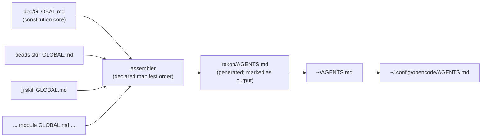
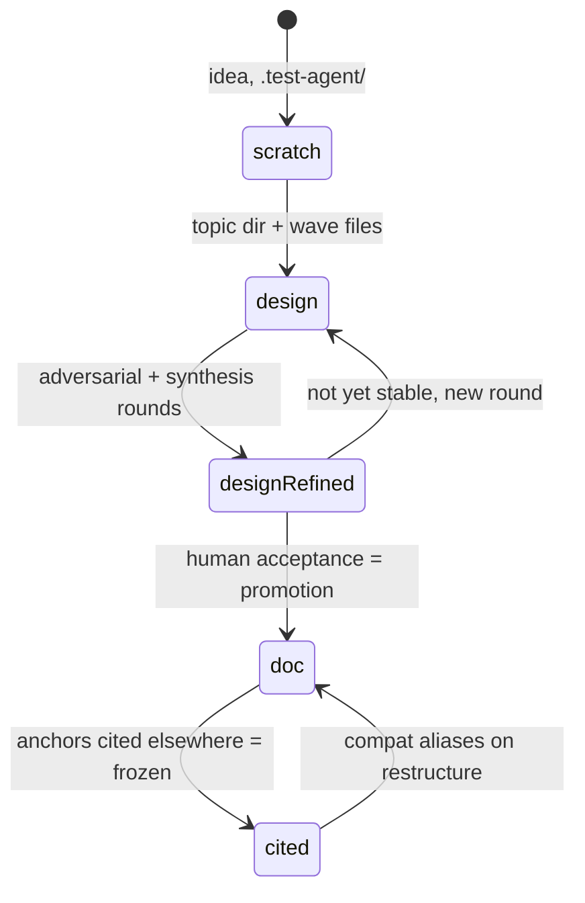

<a id="c-vision"></a>
# C1 Purpose and Core Vision

## C1.1 What is up

The workspace's global guidance is one file: `rekon/AGENTS.md`, 375 lines, carried
everywhere by a symlink chain (`~/.config/opencode/AGENTS.md → ~/AGENTS.md →
~/src/rekon/AGENTS.md`). It has been deliberately monolithic — one place to look, most
knowledge ambient, selected parts calved into skills. That served discovery well. It
costs us in three ways: **data locality** (knowledge about beads sits in the same file
as jj rules and doc conventions, so editing one concern rereads and re-commits all of
them), **muddy history** (the file's log conflates every concern), and an **invisible
ambient budget** (nothing marks how much global context costs or who owns each line).

Over Aug 31–Sep 1, five project constitutions were born independently across `~/src`
projects. is-tree v2's open question D27 Q1 — should the projects converge on a shared
constitution template? — is exactly what this workspace-level effort answers. And
rektide's latest direction goes further than convergence: it changes the shape of the
global file itself.

## C1.2 The re-spin: from manuscript to modules

Stop thinking of AGENTS.md as a manuscript agents and humans edit. Think of the
workspace as a population of **self-explaining knowledge modules**, and of AGENTS.md as
their **assembled projection**.

A knowledge module is a directory that carries its own three answers:

- **what it is** — a canonical `README.md`;
- **how it is loaded on demand** — `SKILL.md`, a relative symlink to the README;
- **what it claims from ambient attention** — `GLOBAL.md`, the small fragment it
  contributes to a deterministically assembled AGENTS.md.

Everything the old monolith did is still done, but each concern owns its own file, its
own history, and its own claim on the global stage. The compact version:

> **Edit locally, assemble globally, cite durably, coordinate by tickets.**

## C1.3 Five commitments

1. **Locality.** Knowledge lives in the directory it is about. A module's fragment
   history (`jj log` on its files) is the history of that concern alone.
2. **Evolution.** Knowledge has a lifecycle: it is born exploratory in `design/`,
   argued in waves, and may be promoted to stable `doc/` knowledge. Evidence is
   preserved, never overwritten; positions change through addenda and new revisions.
3. **Exposure.** When a module has operational depth, it exposes itself as a skill —
   loadable by agents that need it and skippable by everyone else.
4. **Contribution.** Ambient context is a budget with visible cost. Every ambient line
   is declared by some module's `GLOBAL.md`; assembly is deterministic tooling, and
   AGENTS.md becomes build output rather than an editing surface.
5. **Referentiability.** Knowledge is written to be cited: semantic anchors that do
   not rot, doc-refs that name relationships, and a section namespace shared with
   beads ticket IDs so work and knowledge address each other.

## C1.4 Self-similarity requirement

The constitution must land practicing its own rules: it is itself a knowledge module
(`doc/README.md` canonical, `doc/SKILL.md → README.md`, `doc/GLOBAL.md` carrying the
distilled ambient core). A constitution whose storage shape contradicts its content is
a memo, not a constitution.

<a id="c-module"></a>
# C2 The Knowledge Module: README / SKILL / GLOBAL

## C2.1 Directory shape

```text
<topic>/                      # under design/ or doc/ in a project
  README.md                   # canonical artifact: the knowledge itself
  SKILL.md -> README.md       # relative symlink: on-demand agent exposure
  GLOBAL.md                   # ambient fragment this module contributes
  <support docs, waves...>    # research, longer write-ups, maintenance notes
```

## C2.2 README.md is the one source

`README.md` is canonical because it is the only universally recognized entry point:
forges render it, humans open it first, agents are trained to look. One source of
truth means no separate skill body that drifts away from the document it summarizes.

Its OKF frontmatter is the module's trustworthy label — and, in a deliberate
unification, **the skill's routing surface**. The open question from the scratch
README ("should skill descriptions carry a quick intro that can standalone? this gets
weird") resolves as: yes, and the place is the `description:` field, written *for
routing* — when to load this, what is inside — not as a summary of conclusions.
`status:` and `tags:` complete the routing picture; a `status: draft` skill is
navigable but flagged unstable.

## C2.3 SKILL.md is a projection, not a second document

`SKILL.md` is a **relative** symlink (`ln -s README.md SKILL.md`) so the directory is
relocatable and clone-safe. It marks the directory as a skill and gives on-demand
loaders a conventional handle. Relative — not absolute — matters: absolute symlinks
break on clone, move, or archive.

## C2.4 GLOBAL.md is a claim on ambient attention, not a copy

`GLOBAL.md` holds what must be true even when nobody loaded anything: a pointer to
the module ("X exists; load doc/SKILL.md for depth") plus the few norms that must hold
in every session. It should mostly **point, rarely restate**. When a rule must appear
verbatim ambiently, that duplication is deliberate, tiny, and owned — it is the
module paying rent on global context.

## C2.5 Assembled AGENTS.md

Deterministic tooling assembles AGENTS.md from declared fragments:



The assembled file begins with a generated marker: *this file is assembled from
GLOBAL.md fragments; edit fragments, not this file*. The existing symlink chain is
untouched — what it points at changes meaning, from manuscript to build product.

Benefits, concretely:

- **data locality and history**: each concern's ambient lines have their own
  file-level commit history; blame and rename tracking work per concern;
- **visible cost**: growing the ambient core means editing some module's GLOBAL.md —
  a reviewable, attributable act;
- **reversibility**: retiring a module from ambient context is dropping its fragment
  from the manifest, not surgery on a 375-line file;
- **determinism**: same fragments, same manifest, same bytes — the global context
  becomes reproducible.

The assembler is follow-up work (epic `rekon-agents-maintenance`), sequenced after
this constitution. Until it exists, AGENTS.md remains hand-edited and the fragments
land incrementally beside it. The constitution defines the target shape, not a
big-bang migration.

<a id="c-lifecycle"></a>
# C3 Lifecycle: design/ and doc/, and Promotion

## C3.1 Two tissues

- **`design/<topic>/` — the laboratory.** For building, exploring, and learning.
  Waves of independent model drafts, adversarial and synthesis rounds, prototypes of
  argument. High churn is healthy here; wave files are immutable evidence once
  written — refinement appends, rounds are new files.
- **`doc/<topic>/` — the library.** Stable, user-facing knowledge, where "user" means
  anyone (human or agent) who needs to *use* the knowledge rather than develop it.

## C3.2 Both tissues can self-form as skills

A `design/<topic>/` may carry SKILL.md so agents working an active stream can load
its context; a `doc/<topic>/` may carry SKILL.md for stable operational depth (e.g.
jj). Both may contribute GLOBAL.md fragments. The discriminator is the label, not the
tissue: design skill descriptions MUST carry their unstable `status:` so routing
knows what it is loading.

## C3.3 Promotion



Promotion from design/ to doc/ is:

- **triggered** by human acceptance of a synthesis (or stabilization of repeated
  practice);
- **mechanized** as `doc/<topic>/README.md`, a real distilled file citing the design
  wave corpus in OKF `sources` — the waves stay in design/ as evidence, never deleted;
- **meaningful** as a commitment, not merely a quality award: audience (user-facing),
  stability (survived adversarial rounds), and **referential durability** — in design/
  anchors are encouraged; in doc/ cited anchors are obligations that must survive
  restructuring (compatibility aliases, per [is-tree D4](#c-references)).

Nothing demotes silently: retiring a doc/ topic is explicit (`status: deprecated`,
log.md entry), never deletion.

## C3.4 Local deviation clause

rekon itself uses top-level `<topic>/` directories rather than `doc/<topic>/`. That
is a rekon-specific deviation, documented in `rekon/SKILL.md`, not a generally
recommended pattern. The constitution states the general shape; projects may deviate
and must say so in their own skill.

<a id="c-referentiability"></a>
# C4 Durable Referentiability

Referentiability is the immune system of the corpus: it is what lets knowledge be
cited across time, models, and projects without rotting. Durable wiki-like links are
central, not ornamental.

1. **Anchors before substantive headings** in durable documents: explicit
   `<a id="...">`, lowercase ASCII, semantic not number-derived, stable under
   rewording; a compatibility alias when meaning must move. Never rely on
   renderer-generated heading slugs.
2. **Coordinates are optional machinery** (topic prefixes and hierarchical display
   numbers, per is-tree/dolt-rs); modules opt in when section-granular citation
   matters. Where used, the lineage rule holds: coordinates are reading aids, anchors
   are identity — `V3.2` may renumber, `#v-tuple-ordering` must not rot.
3. **Doc-refs name relationships**: the link label carries the coordinate when used,
   the URL targets the anchor, and the surrounding sentence says why the target
   matters, using the inherited vocabulary (inherits, implements, consumes, motivates,
   constrains, contrasts, extends, evidences).
4. **Link scope**: bundle-root-relative inside a repo; canonical commit-pinned URLs
   for published cross-repo evidence; `file://` labeled as local-WIP for uncommitted
   evidence.
5. **Grading by tissue**: design waves — anchors strongly encouraged (cheap, and
   synthesis needs them); doc/ — obligatory once cited; GLOBAL.md — no anchors
   needed, ambient lines carry no citation identity of their own.

<a id="c-namespace"></a>
# C5 The Ticket/Anchor Namespace

## C5.1 One trie, two kinds of nodes

Beads already namespaces child IDs under their epic:
`rekon-doc-constitution-authoring` under `rekon-doc-constitution`. This constitution
extends that same trie into documents. Tickets and document sections are both
hyphen-separated segment paths; a section may elaborate a ticket the way a child
ticket elaborates a parent.

**Local form (project-implicit).** Inside a project, the beads prefix is redundant —
project identity comes from the repo you stand in. Ticket local-id:
`doc-constitution-authoring`. A section elaborating that ticket takes anchor
`doc-constitution-authoring`, or refines it by appending segments:
`doc-constitution-authoring-evidence`.

**Inductive refinement rule.** anchor `foo-bar-baz` elaborates ticket (or anchor)
`foo-bar` exactly as child ticket `foo-bar-baz` elaborates parent `foo-bar`. The
namespace self-documents:

- given an anchor, find its owning ticket by trimming segments until a ticket
  matches;
- given a ticket, `rg "foo-bar"` in the project's docs finds every elaboration;
- if a section later needs a ticket of its own, its natural ID already exists —
  the namespace anticipated the work.

Refinement adds **meaning, not counters**: `-evidence`, `-dialogue`, `-criteria` —
not `-2`. Model suffixes live outside this namespace entirely (they are file
identity, not section identity).

## C5.2 Globally qualified form (cross-project)

Across projects the beads prefix restores qualification, with distinct separators so
sections and tickets never collide in prose:

| Kind | Form | Example |
|---|---|---|
| Ticket, global | beads ID verbatim | `rekon-doc-constitution-authoring` |
| Section, global | `project:local-anchor` | `rekon:doc-constitution-authoring-evidence` |
| Foreign section, real example | colon form of the target's local anchor | `dolt-rs:w-coordinates-link-semantics` (their W3.4 relationship vocabulary) |

The mapping is mechanical: `rekon:x-y-z` (section) corresponds to the would-be
ticket name `rekon-x-y-z`. When the target exists as a file, prefer a real Markdown
link with anchor over a bare qualified reference; the qualified form is for tickets,
forward anchors, and prose where the target may not exist yet.

## C5.3 Forward anchors

A ticket may fix a name before content exists ("Forward anchor: `rekon/SKILL.md`
does not exist yet" — already the practice in this epic's children). The promise is
directional: when the document appears, it uses that name. The inverse also holds: a
document section may cite its elaborating ticket in frontmatter or a Tracking line
even before the ticket is filed — but tickets are earned, not owed (C8).

<a id="c-ambient"></a>
# C6 Ambient Core vs On-Demand

## C6.1 The boundary test

A rule belongs in the ambient core if it passes all three:

1. **Corruption test** — violating it breaks the workspace for agents that never
   load anything (a wrong model suffix destroys wave provenance; overwriting a peer's
   file destroys wave independence; a renderer-slug link rots silently).
2. **Cheapness test** — a few lines, no per-project registry, no machinery.
3. **Universality test** — applies to nearly every document-writing session in
   nearly every project.

Machinery that needs registries, coordinates, or orchestration (wave seals,
dependency gating, evidence rubrics) is on-demand depth in the skill, not ambient
law.

## C6.2 The ambient core (sketch)

- module shape: README.md canonical, SKILL.md relative symlink, GLOBAL.md fragment;
  edit fragments, not assembled output;
- wave files end in `.<model-name>.md`, name the actual model, never overwrite
  peers, new rounds are new files;
- OKF frontmatter as trustworthy label; `description:` written for routing;
- link durably: semantic anchor before a heading, never renderer slugs;
- refine append-only (addenda) rather than rewriting cited positions;
- cross-references explain relevance, never invented for cohesion;
- distinguish claim classes at least as observed / inference / recommendation /
  hypothesis.

## C6.3 Presenting the opt-ins

The constitution's own GLOBAL.md carries a one-line pointer: *for waves, coordinates,
evidence rubrics, promotion, and doc-pass procedure, load `doc/SKILL.md`*.
Availability is ambient; machinery is on demand. A concrete draft of the fragment is
Appendix A.

<a id="c-evolution"></a>
# C7 Evolution, History, and Accepted Tips

## C7.1 Within a module

Refinement appends: numbered addenda answer follow-ups, qualify earlier claims, and
continue the numbering without reusing anchors. A materially changed position earns a
new model-suffixed revision, not a silent rewrite. Historical documents remain valid
under the constitution they cited; new rules apply prospectively (inherited from
is-tree D8.1/D11 and dolt-rs W1.1/W6.2).

## C7.2 Accepted tips

- **design/**: the accepted wave artifact gains a suffix-less symlink
  (`constitution.md → constitution-draft0.glm53m.md`), so general navigation reaches
  the tip while citations keep naming the exact evidence file.
- **doc/**: `README.md` is a real distilled file, not a symlink — OKF frontmatter and
  `sources` must describe *this* document, and library content is maintained rather
  than pointed. The wave corpus it distilled stays citable in design/ or scratch.

## C7.3 History surfaces

File history under jj is the real log. `log.md` remains the reserved OKF update
history (newest first); `index.md` remains the reserved directory listing — a topic
dir that grows past a handful of files earns both. **Scratch is pre-history**:
`.test-agent/` is gitignored, so anything the accepted document cites as evidence
must be promoted to a committed location (or absorbed into the document's `sources`)
before acceptance. This binds this very effort: the brief, lineage map, and peer
drafts now live only in scratch.

<a id="c-ticketing"></a>
# C8 Balanced Ticketing

Documentation and tickets reinforce one another; neither gates the other. Tickets are
the **shape** projection of work — surface, lifecycle, dependencies, acceptance.
Documents are the **content** projection — argument, evidence, vocabulary. They
intersect in the shared namespace (C5).

A ticket earns its existence when the work has:

- a lifecycle a human must see and close (real acceptance criteria);
- dependencies that order it against other work;
- multi-session or multi-agent coordination needing a durable handle;
- a name worth fixing before the document exists (forward anchor).

No ticket when the writing is the whole act: a design note, a wave file, a scratch
exploration, prose maintenance. Anti-patterns to name: ticket-per-section
bureaucracy; and docless epics that accrete knowledge into ticket descriptions —
beads records intent and shape, not storage; the wiki lives in files.

The current epic is the model: five children, each with forward anchors to unwritten
documents, acceptance criteria naming documents into existence.

<a id="c-tensions"></a>
# C9 Tensions and Open Decisions

1. **README as distilled file vs symlink-to-wave.** Recommended here: real file in
   doc/ (frontmatter honesty, maintained content), symlinks only for design/ tips.
   Cost: a maintained document can drift from the wave corpus it cites.
2. **Scratch mortality.** This effort's brief, lineage map, and all wave drafts are
   gitignored. Where does the constitution's evidence corpus live durably — promoted
   into a committed `design/` dir in rekon at acceptance, a committed waves subdir,
   or absorbed into `sources` and allowed to evaporate?
3. **GLOBAL.md governance.** Risk of a *distributed monolith*: fragments recreating
   the bloat with nobody seeing the whole. Norm ("fits a screen"), assembler warning,
   or hard cap?
4. **Assembly manifest ownership and order.** rekon owns a manifest; order is
   narrative, not discovery. Does the assembled file preserve the old monolith's
   section headings (human-familiar anchors) or pure fragment order?
5. **Symlink fragility.** SKILL.md breaks under symlink-unaware copying and routers
   that demand regular files. Mitigation: the assembler verifies/regenerates links;
   the regeneration is a documented one-liner.
6. **Design-tissue skills.** Exposing unstable knowledge as loadable skills — is
   `status: draft` in the routing description sufficient, or should design skills be
   name-only opt-in until promoted?
7. **Exact-string identity of section and child ticket.** When anchor `foo-bar-baz`
   and ticket `foo-bar-baz` both exist, identity is the feature. But `bd rename`
   rewrites ticket IDs; anchors that encoded an old name need a compatibility story.
8. **Duplication between GLOBAL.md and README.** Verbatim ambient rules are
   deliberate duplication and a drift surface; should the assembler diff fragments
   against their READMEs and warn?

<a id="c-questions"></a>
# C10 Dialogue Questions

1. README model: distilled real file in `doc/` (recommended) or symlink to the
   accepted wave? And where does this effort's scratch evidence corpus land durably?
2. Global separator: `rekon:anchor` (recommended — tickets stay hyphen-joined beads
   IDs, sections get the colon) or an alternative?
3. Ambient budget: soft norm vs assembler-enforced cap on GLOBAL.md size?
4. Assembly order: manifest at rekon root (recommended), per-module priority field,
   or discovery order?
5. Design skills before promotion: allowed with status-labeled descriptions
   (recommended) or name-only until they land in doc/?
6. Adoption scope: is this workspace law for all `~/src` projects now, or a shared
   template with per-project opt-in and rekon as reference implementation (the
   spirit of is-tree D27 Q1)?
7. Force of the refinement rule: MUST for new work with grandfathering, or SHOULD?

<a id="c-cross-references"></a>
# C11 Cross-References

- [Torch brief](file:///home/rektide/src/rekon/.test-agent/doc-constitution/brief-for-sol.md)
  **motivates** this draft's assignment and supplies
  the verified lineage table; this is an independent same-wave peer rather than the
  sol dialogue it was written for.
- [Scratch README](file:///home/rektide/src/rekon/.test-agent/doc-constitution/README.md)
  **evidences** the Sep 1 decisions (two tiers, cheap
  ambient core, location, beads integration) and the lineage dag.
- [is-tree v1](file:///home/rektide/src/is-tree/.design/research/topic-document-constitution/topic-document-constitution.gpt56t.md)
  **inherited**: document unit, model suffixes, semantic anchors, doc-refs,
  append-only refinement, same-wave independence.
- [dolt-rs wiki constitution](file:///home/rektide/src/dolt-rs/.design/research/constitution/constitution.gpt56t.md)
  **inherited**: coordinates-vs-identity split, relationship vocabulary, immutable
  evidence with mutable tips, suffix-less accepted-tip symlinks — and its inline
  reindexer is prior art for the deterministic assembler this constitution proposes.
- [is-tree v2](file:///home/rektide/src/is-tree/.design/research/topic-document-constitution/topic-document-constitution2.gpt56t.md)
  **motivates** the whole effort: its D27 Q1 is this convergence, hoisted.
- [first-compute v1](file:///home/rektide/src/first-compute/.design/research/topic-document-constitution/topic-document-constitution.gpt56t.md)
  and [v2](file:///home/rektide/src/first-compute/.design/research/topic-document-constitution/topic-document-constitution2.gpt56t.md)
  **evidence** the wave protocol at scale: assignment manifests, immutable wave
  barriers, fair synthesis, adversarial rounds — all exercised Sep 1.
- [execsnoop-rc constitution](file:///home/rektide/src/execsnoop-rc/.design/constitution/constitution.glm53.md)
  **evidences** the GLM adaptation line, the `.design/<topic>/<topic>.<model>.md`
  layout, and multi-letter topic prefixes.
- [Global AGENTS.md](file:///home/rektide/src/rekon/AGENTS.md) **extends**: the wave
  conventions, doc-pass, OKF, and jj practice this builds on — and the surface whose
  Writing section the distilled core will replace.
- [Beads epic `rekon-doc-constitution`](file:///home/rektide/src/rekon/.beads/issues.jsonl)
  **tracks** this work and already practices the namespace rules: children under the
  epic, forward anchors to unwritten documents.

<a id="c-appendix-global"></a>
# C12 Appendix A: Draft GLOBAL.md for the Constitution Module

A concrete, reviewable artifact — what `doc/GLOBAL.md` could contain on day one:

```markdown
## Documents

Knowledge lives in topic modules: `README.md` is canonical, `SKILL.md` is a relative
symlink to it (on-demand load), `GLOBAL.md` is this module's ambient fragment.
AGENTS.md is assembled from GLOBAL.md fragments — edit fragments, not the assembled
file.

Wave files end in `.<model-name>.md` and name the actual model; never overwrite a
peer's file; new rounds are new files; refine append-only via addenda. Give durable
documents OKF frontmatter (description written for routing) and semantic anchors
before headings — never renderer-generated slugs. Cross-references explain relevance.
Label claims as observed / inference / recommendation / hypothesis.

Waves, coordinates, evidence rubrics, design→doc promotion, doc-pass: load
`doc/SKILL.md`.
```

That fragment is the whole ambient cost of this constitution: nine lines, one
pointer, zero machinery.

<a id="c-appendix-self-check"></a>
# C13 Appendix B: Self-Check

- [x] filename carries actual model suffix (`glm53m` = GLM 5.3 Max)
- [x] every substantive heading has a unique semantic anchor, `c-` prefixed
- [x] no same-wave peer draft was read before completing this file
- [x] claim classes kept distinct (lineage facts observed from files; assembler
      benefits are recommendations; C9/C10 are explicitly open)
- [x] cross-references name relationships; no invented cohesion
- [x] OKF frontmatter lists only sources actually consulted
