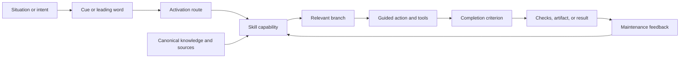
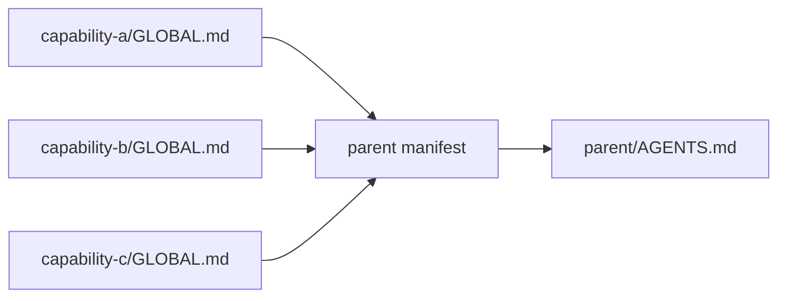

<a id="skillify"></a>
# Skillification: Turning Knowledge Into Activatable Capability

Revision 1 preserves the general capability design from the independent Sol
draft and integrates the GLM draft's strongest operational compression: one
body with three Markdown exposures, semi-uniform skill entrypoints, explicit
description/body division, and default-zero ambient contribution. It does not
adopt the peer's narrower definition of skillification as AGENTS extraction;
that remains one application.

**Skillification** is the transformation of knowledge, judgment, or recurring
practice into a named capability that can be activated in the right situation
and followed with a predictable process.

It is interface design for attention and action.

A document can preserve excellent knowledge and still fail to affect work: the
reader does not know it exists, does not recognize when it applies, loads too
much surrounding material, or stops before the process is complete. A prompt
can activate behavior and still fail to preserve knowledge: it drifts from its
sources, hides assumptions, and has no durable maintenance surface.

A skill joins the two. It gives knowledge:

- an **activation boundary**: when this capability should enter attention;
- a **canonical body**: what owns the current method and meaning;
- a **process shape**: steps, reference, branches, or a deliberate mixture;
- a **completion contract**: how to tell the work is actually complete;
- an **evidence path**: what sources, checks, or observations ground it;
- a **lifecycle**: how it is piloted, revised, accepted, and retired.

The root virtue is not identical output. It is **process predictability**: when
the same kind of situation recurs, the capability is reached and the same
discipline governs how the work proceeds.

In the Markdown knowledge-module profile, the compact form is:

> **One body, three exposures:** read the `README`, load the `SKILL`, assemble
> the `GLOBAL`.

<a id="skillify-not"></a>
## What Skillification Is Not

Skillification is not:

- converting every document into a special filename;
- making one prompt longer and calling it reusable;
- extracting text from global context merely to reduce token count;
- replacing deterministic automation with prose instructions;
- copying a reference into a second body that will drift;
- creating one skill for every topic noun;
- freezing unsettled exploration into premature procedure.

Documentation, automation, ambient policy, and skills overlap, but they solve
different delivery problems. A mature system chooses among them instead of
making skills the universal container.

<a id="skillify-flow"></a>
# The Activation Flow

Knowledge becomes capability through a sequence of attention transitions:



Each edge can fail independently:

- the cue may never be recognized;
- routing may load the wrong skill;
- the skill may expose irrelevant branches;
- the process may invite premature completion;
- the completion criterion may be unverifiable;
- evidence may not reach the maintained body.

Skill design must therefore cover activation, execution, and evolution. Good
prose in the body addresses only one of the three.

<a id="skillify-vocabulary"></a>
# Working Vocabulary

| Term | Meaning |
|---|---|
| Capability | A repeatable job or discipline that can be invoked in a recognizable situation. |
| Skill | The activation-bound interface that delivers a capability to a person or agent. |
| Canonical body | The maintained source of current meaning and process. |
| Activation boundary | The situations in which the skill should and should not enter context. |
| Cue | A compact concept, phrase, event, file shape, or tool state that signals relevance. |
| Leading word | A compact pretrained concept that anchors both routing and execution behavior. |
| Branch | A materially different path through the capability, not a synonym for the same trigger. |
| Ambient seed | Minimal always-visible guidance needed before selective activation is possible. |
| Context pointer | A link whose wording says when and why to load deeper material. |
| Support reference | Branch-specific evidence or detail outside the common body. |
| Completion criterion | A checkable condition proving a step or capability has reached its boundary. |
| Router | A small capability whose job is choosing among other capabilities. |
| Host profile | The file, metadata, discovery, and loading conventions of one skill runtime. |

This vocabulary separates the general practice from any one agent harness. A
host may use Markdown files, a registry, a database, or generated context; the
activation and completion contracts remain recognizable.

<a id="skillify-placement"></a>
# First Placement Decision

Before designing a skill, decide which delivery channel the knowledge needs:

| Question | Placement |
|---|---|
| Must this change behavior before any route can be recognized? | Keep the smallest actionable form ambient. |
| Is it deep and stable, needed when a recognizable capability activates? | Put it in the canonical skill body. |
| Does only one branch need it? | Put it behind a conditional support-reference pointer. |
| Is the behavior deterministic and fully specifiable? | Implement a tool or validation rather than prose skill. |
| Is it exploratory, one-off, or transcript-like? | Keep it in research, design, or scratch without skill machinery. |

Skillification moves knowledge closer to the capability that owns it. It does
not imply moving every rule out of ambient context.

<a id="skillify-candidate"></a>
# What Should Become A Skill

A promising candidate has one or more of these properties:

- the work recurs across sessions or people;
- success depends on non-obvious sequencing or judgment;
- missing a step creates a recognizable failure mode;
- the process has stable common structure but meaningful branches;
- useful reference is too large to keep ambient;
- experts repeatedly reconstruct the same context for newcomers;
- tools exist, but deciding when and how to use them remains contextual;
- completion can be made more observable than “seems done.”

<a id="skillify-candidate-not"></a>
## Prefer Another Form When

| Situation | Better form |
|---|---|
| The behavior is deterministic and fully specified. | Code, validation, or automation. |
| The rule must be known before any trigger can be recognized. | Ambient policy or guardrail. |
| The content is stable factual lookup with no activation problem. | Ordinary reference documentation or searchable data. |
| The work is genuinely one-off. | A task plan, ticket, or temporary design note. |
| The model already follows the instruction reliably by default. | No instruction; avoid a no-op skill. |
| The domain is still being discovered and branches are unknown. | Research or design work, perhaps exposed as an explicitly draft skill. |
| The only reason to split is document size. | Better structure and progressive disclosure inside the existing module. |

A document can later become skill-backed when recurrence or activation need
emerges. A skill can later become code when judgment has been eliminated. The
forms are lifecycle positions, not status ranks.

<a id="skillify-contract"></a>
# The Skill Contract

A well-formed skill answers six questions.

<a id="skillify-contract-activation"></a>
## 1. Activation

- What observable situations should load it?
- What nearby situations should not?
- Can the need be recognized before the missing knowledge causes harm?
- Is activation autonomous, human-selected, or reached by another skill?

Descriptions are routing interfaces. They should front-load a useful leading
word, name each distinct branch once, and avoid repeating the body. Synonym
lists add context load without adding a route.

> **Descriptions route; bodies do.** Ambient seeds act before loading; support
> references deepen only the branch that needs them.

<a id="skillify-contract-scope"></a>
## 2. Scope

- What capability does this skill own?
- What does it inherit from external policy or references?
- Where does it stop?
- Which neighboring skill owns the next concern?

A narrow title does not guarantee a coherent scope. The boundary should follow
one job, invocation, or sequence, not arbitrary source-document sections.

<a id="skillify-contract-body"></a>
## 3. Body

The body may contain:

- ordered steps;
- flat reference rules;
- decision tables;
- branches;
- examples;
- context pointers to support material.

Inline what every branch needs. Push branch-specific depth behind descriptive
pointers. Keep one concept's definition, rules, exceptions, and caveats
co-located so loading one part brings the necessary neighbors with it.

<a id="skillify-contract-completion"></a>
## 4. Completion

Every procedural step needs a checkable stopping condition. The final
capability needs an acceptance boundary that is stronger than “produced an
answer.” Examples include:

- every modified model accounted for;
- every reported finding resolved or preserved explicitly;
- a command exits cleanly against the target artifact;
- a human decision is recorded;
- a durable file exists and its links validate;
- the observed failure reproduces before the fix and disappears afterward.

Sharpen completion before splitting a skill. Hide later steps only when their
visibility repeatedly causes the agent to rush the current work.

<a id="skillify-contract-evidence"></a>
## 5. Evidence

The skill should identify what owns its claims and what checks its process:

- primary source code or documentation;
- live commands and observed output;
- tests and fixtures;
- accepted design decisions;
- external references;
- known limits and stale-after dates.

Frontmatter or metadata orients the reader; it is not claim-level proof. A
source list must contain only material actually consulted.

<a id="skillify-contract-lifecycle"></a>
## 6. Lifecycle

The skill declares draft, stable, deprecated, or host-equivalent status. It
names who generated or authored it, who verified it, and when review is due.
Consequential revisions preserve why behavior changed rather than silently
rewriting history.

<a id="skillify-forms"></a>
# Skill Forms

<a id="skillify-form-procedure"></a>
## Procedural Skill

Guides a repeatable sequence toward a completion criterion. Good for release,
migration, incident response, setup, and review workflows.

Primary design risk: premature completion or unhandled branches.

<a id="skillify-form-reference"></a>
## Reference Skill

Makes a specialized rule set available when its domain activates. It may be a
flat body rather than a sequence. Good for framework conventions, protocol
contracts, command semantics, or domain vocabulary.

Primary design risk: becoming an undifferentiated encyclopedia with weak
routing.

<a id="skillify-form-router"></a>
## Router Skill

Chooses among capabilities that are intentionally not all model-invoked. It
trades one remembered entry point for lower catalog context and reduced human
cognitive load.

Primary design risk: becoming a second catalog that repeats every child
description.

<a id="skillify-form-evaluator"></a>
## Evaluator Or Reviewer Skill

Applies a stable rubric to artifacts or behavior, often independently from the
author. Good for code review, accessibility checks, document acceptance, and
policy conformance.

Primary design risk: rubric theater, where the evaluation names categories but
does not gather evidence or bind findings to acceptance.

<a id="skillify-form-hybrid"></a>
## Hybrid Skill

Combines common steps with reference and branches. Most mature skills are
hybrids. Hybrid is not permission for sprawl: each included form must serve the
same activation boundary and completion contract.

<a id="skillify-information"></a>
# Information Architecture

Skillification organizes information by activation need, not merely topic.

```text
always visible cue or policy
        |
        v
skill entry: orientation + common process
        |
        +-- branch A pointer --> support reference A
        +-- branch B pointer --> support reference B
        +-- evidence pointer --> sources / fixtures / design history
```

<a id="skillify-information-levels"></a>
## The Disclosure Ladder

| Level | Put here |
|---|---|
| Ambient seed | Costly-to-miss action required before activation. |
| Description | Routing triggers and branches. |
| Common body | Steps and reference every invocation needs. |
| Support reference | Detail only one branch needs. |
| External source | Canonical evidence or knowledge owned elsewhere. |

Pushing information down the ladder saves context but increases the chance it
is not reached. Pulling information up improves availability but charges every
invocation. The correct position is determined by activation timing and cost
of absence, not a universal size threshold.

<a id="skillify-information-authority"></a>
## One Meaning, One Authority

Skillification often begins from existing documents. Preserve one source of
truth:

- expose the canonical body directly when the host permits;
- use a symlink or generated adapter when a conventional entry filename is
  required;
- use a small routing overlay when the canonical source lives elsewhere;
- link external depth rather than copying it;
- make deliberate ambient duplication small and traceable to its owner.

If the human documentation and skill body can disagree independently, the
package is not complete.

<a id="skillify-host"></a>
# Host Profiles

The general skill contract is independent of storage. A host profile maps it
onto concrete files and runtime behavior.

<a id="skillify-host-markdown"></a>
## Markdown Knowledge-Module Profile

One useful profile is:

```text
<parent-scope>/
  AGENTS.md                 generated ambient context for this scope
  agents.manifest.json      declared fragment inputs and order
  <capability>/
    README.md               canonical body and landing page
    SKILL.md -> README.md   host entrypoint
    GLOBAL.md               optional ambient contribution
    <support documents>     progressive disclosure
```

This profile works well where humans navigate repositories and agents discover
`SKILL.md`. `GLOBAL.md` is not copied manually into the parent: a deterministic
assembler consumes explicitly declared fragments, orders them, records
provenance, and generates `AGENTS.md`. Contributors edit the owning module, not
the parent output.

Only `README.md` is required. `SKILL.md` is **uniform in form, selective in
presence**: wherever it exists, it exposes the canonical README exactly (a
relative symlink in this profile), but a module earns it only when routing has
concrete value. `GLOBAL.md` is likewise earned rather than automatic.

The profile is not the definition of skillification. A different host may
register a URL, package metadata, database record, callable function, or remote
capability while preserving the same activation/body/completion contract.

<a id="skillify-host-global"></a>
## `GLOBAL.md` Contributes To A Parent `AGENTS.md`

The simple rule is:

> A module's `GLOBAL.md` is its ambient contribution; a parent program
> assembles selected contributions into that scope's `AGENTS.md`.



“Global” is relative to the parent scope, not necessarily the whole machine. A
parent can be a user workspace, project, package, or directory subtree. The
manifest decides inclusion; merely creating `GLOBAL.md` does not claim every
scope.

This distinction matters because a capability may be:

- ambient in one project but irrelevant elsewhere;
- included at the workspace root because it governs all projects;
- included only beneath a language or deployment subtree;
- skill-loadable everywhere while ambient nowhere;
- represented by different scope-specific projections when one fragment cannot
  truthfully serve all parents.

Programmatic assembly SHOULD provide:

- explicit inputs rather than surprising recursive discovery;
- stable fragment identity and deterministic order;
- source provenance in generated output;
- duplicate and malformed-fragment failures;
- visible per-fragment and total context cost;
- link handling that preserves or rejects location-dependent targets;
- a check mode that detects hand edits without rewriting;
- no automatic pruning of undeclared artifacts.

This profile turns `AGENTS.md` into a linked ambient interface while leaving
`README.md` as the canonical knowledge body and `SKILL.md` as exact on-demand
activation.

New modules default to no `GLOBAL.md`: ambient cost must be demonstrated. A
migration of already-ambient guidance is different. Its inherited rules may
begin in GLOBAL to preserve behavior, then move on demand only through a
separate, evaluated tiering decision.

<a id="skillify-host-invocation"></a>
## Model And User Invocation

A model-invoked entry advertises its description in every session. Use it when
autonomous discovery or skill-to-skill reach matters enough to pay that cost.

A user-invoked entry spends no model catalog context but requires the human to
remember and select it. Use it for deliberate workflows; introduce a router if
human recall becomes the bottleneck.

Invocation mode is a deployment decision and can change without rewriting the
canonical capability body.

<a id="skillify-method"></a>
# Skillification Method

<a id="skillify-method-capture"></a>
## 1. Capture The Real Practice

Gather the artifacts that currently carry the capability:

- documents and runbooks;
- repeated chat instructions;
- tickets and acceptance criteria;
- command histories;
- scripts and tools;
- failure reports and recovery notes;
- expert tacit decisions.

Describe the situation before designing the skill: who is trying to accomplish
what, what goes wrong now, and what evidence distinguishes success.

<a id="skillify-method-capability"></a>
## 2. Name The Capability

Name a verb or discipline, not a source pile. “Publish a Rust crate” and
“diagnose a hard bug” are capabilities. “All Rust notes” and “misc debugging”
are storage categories.

Choose a leading word that recruits useful prior knowledge and can appear in
prompts, descriptions, body language, tickets, and documentation without a
long repeated definition.

<a id="skillify-method-boundary"></a>
## 3. Draw Activation And Stop Boundaries

List:

- positive trigger situations;
- negative neighbors;
- distinct branches;
- inherited policy;
- downstream capabilities;
- concerns explicitly out of scope.

If two branches have unrelated triggers, they probably need separate skills.
If two topics always activate together and share completion, they probably
belong in one.

<a id="skillify-method-shape"></a>
## 4. Choose Process Shape

Decide whether the capability is procedural, reference, router, evaluator, or
hybrid. Write completion criteria before polishing prose. The criteria expose
missing steps and prevent the design from optimizing for a pleasant-looking
document instead of finished work.

<a id="skillify-method-disclose"></a>
## 5. Arrange Progressive Disclosure

Keep common process visible. Move only branch-specific depth. Each context
pointer says what the target contains and the condition that justifies loading
it. Verify that following the branch never requires guessing which file to
read.

<a id="skillify-method-route"></a>
## 6. Write The Route

For model invocation, write one trigger per branch and remove synonyms that do
not create a distinct path. For user invocation, write a compact human label.
Choose whether another skill needs to reach it.

The route is complete when representative situations activate the intended
capability and neighboring situations do not.

<a id="skillify-method-pilot"></a>
## 7. Pilot Against Real Work

Run the skill on representative tasks. Capture:

- whether it activated;
- which branch was taken;
- where extra context was fetched;
- whether steps were skipped or rushed;
- whether completion was observable;
- what information was missing, duplicated, or unused;
- whether the result fed maintenance evidence back into the body.

Do not infer routing quality from one successful invocation.

<a id="skillify-method-stabilize"></a>
## 8. Stabilize Or Decline

Integrate accepted lessons, preserve design evidence, and assign status. A
valid outcome is not to create a skill: ordinary documentation, automation, or
ambient guidance may fit better. Declining skillification is evidence of a
working decision process, not failure.

<a id="skillify-evaluation"></a>
# Evaluation

<a id="skillify-evaluation-routing"></a>
## Routing Quality

Build a scenario matrix:

| Scenario | Expected |
|---|---|
| Clear positive for each branch | Skill loads and chooses the branch. |
| Neighboring domain | Skill does not load. |
| Ambiguous boundary | Router asks or selects by documented criteria. |
| Costly-to-miss precondition | Ambient seed changes behavior before loading. |
| Support-reference branch | Pointer is followed only when needed. |

Track false negatives and false positives qualitatively or quantitatively. A
skill that never loads and a skill that loads everywhere both fail.

<a id="skillify-evaluation-process"></a>
## Process Quality

Evaluate:

- adherence to required steps;
- skipped branches or checks;
- premature completion;
- reproducibility of evidence gathering;
- clarity of stop boundaries;
- recovery when inputs are incomplete;
- whether another competent actor can inspect the resulting artifact.

The target is predictable process, not stylistically identical answers.

<a id="skillify-evaluation-economics"></a>
## Context Economics

Count all delivery costs:

- always-loaded descriptions;
- ambient seeds;
- common skill body;
- support references actually loaded;
- repeated source fetching;
- human memory required for user invocation.

Moving text out of ambient context can still increase total load if a verbose
description is always advertised or every branch loads the same hidden
reference. Measure the path, not one file.

<a id="skillify-evaluation-maintenance"></a>
## Maintenance Quality

Ask:

- does one file own each meaning?
- can a source change be updated in one place?
- are verification and staleness visible?
- does version history isolate this capability's evolution?
- can the skill be removed without orphaning canonical knowledge?
- do links explain their relationship rather than merely coexist?

<a id="skillify-lifecycle"></a>
# Lifecycle

| State | Contract |
|---|---|
| Discovery | Recurring practice and failures are being captured. No routing promise. |
| Design | Activation boundary, branches, body, and completion are proposed. |
| Pilot | Real tasks exercise routing and process; status remains visibly unstable. |
| Stable | Representative branches work, sources and verification are current, and maintenance has an owner. |
| Deprecated | A replacement or changed practice is named; old activation routes redirect or retire deliberately. |

Significant changes can return a stable skill to design without deleting its
current body. Historical evidence and accepted current guidance serve
different readers and should remain distinguishable.

<a id="skillify-examples"></a>
# Example Capability Shapes

| Domain | Likely form | Activation boundary | Completion evidence |
|---|---|---|---|
| Incident response | Procedural hybrid | A production failure or alert with unclear cause. | Impact bounded, evidence preserved, remediation and follow-up recorded. |
| Package release | Procedure | A maintained package is ready for a versioned release. | Version, tests, artifact publication, and release record verified. |
| Code review | Evaluator | A fixed diff and specification need independent assessment. | Standards and spec findings reported distinctly with exact references. |
| Research | Procedural/reference hybrid | A question needs source-grounded investigation. | Durable findings cite primary sources and state unresolved claims. |
| API migration | Procedure with support references | Code must move between known API contracts. | All call sites migrated, compatibility choices explicit, checks pass. |
| Domain metric | Reference | A metric name appears in analysis or implementation. | Definition, source, exclusions, and review date are available. |
| Skill catalog navigation | Router | A human knows the goal but not the capability name. | One appropriate skill selected or a genuine gap identified. |

The same source corpus can yield different skills when activation boundaries
differ. Conversely, several documents can feed one capability when they govern
one job.

<a id="skillify-failures"></a>
# Failure Modes

| Failure | What happened |
|---|---|
| Prompt wrapping | Existing prose was placed behind a skill name without designing activation or completion. |
| Documentation fork | Human docs and skill body became independent authorities. |
| Trigger soup | The description lists synonyms and adjacent topics without distinct branches. |
| Skill sprawl | Every topic became a catalog entry, increasing context and discovery noise. |
| Hidden prerequisite | A critical rule moved behind a skill that cannot be recognized before the rule is needed. |
| Reference dumping | Every source was loaded regardless of branch. |
| Premature procedure | Active research was frozen into a confident workflow. |
| No-op instruction | The skill restates default behavior without changing process. |
| Automation avoidance | Deterministic checks remain prose because a skill was easier to write than a tool. |
| Completion theater | The final step says “review” or “ensure quality” without an observable criterion. |
| Sediment | Old branches and caveats accumulate because deletion feels risky and evidence is absent. |
| Host capture | One runtime's filenames and metadata are mistaken for the general nature of a skill. |

<a id="skillify-canvas"></a>
# Skillification Canvas

Use this as a design prompt, not mandatory ceremony:

```markdown
# Capability

## Situation
Who is trying to accomplish what? What repeatedly goes wrong?

## Activation
Positive triggers:
Negative neighbors:
Invocation mode:
Leading word:

## Scope
Owns:
Inherits:
Stops before:
Hands off to:

## Branches
1.
2.

## Common Body
Steps/reference every invocation needs:

## Progressive Disclosure
Branch -> support reference -> condition for loading:

## Completion
Per-step criteria:
Final acceptance:

## Evidence
Sources:
Checks:
Known limits:
Review date:

## Evaluation
Positive scenarios:
Negative scenarios:
Boundary scenarios:
Context cost:

## Lifecycle
Status:
Owner:
Replacement/deprecation path:
```

<a id="skillify-principles"></a>
# Proposed General Principles

1. Skillify capabilities, not document piles.
2. Design activation, body, completion, and lifecycle together.
3. Preserve one canonical meaning across human and agent surfaces.
4. In the Markdown profile, assemble declared GLOBAL contributions into a
   parent-scoped AGENTS interface; do not hand-copy them.
5. Keep costly-to-miss prerequisites visible before selective activation.
6. Make descriptions route; make bodies operate; make references support
   branches.
7. Split by independent invocation or sequence pressure, not file size alone.
8. Prefer automation when judgment is no longer required.
9. Evaluate routing and process, not merely prose quality.
10. Treat context, catalog space, and human recall as different costs.
11. Let “do not create a skill” remain a successful design outcome.

<a id="skillify-open"></a>
# Open Questions

1. What portable metadata can express activation and completion across skill
   hosts without collapsing into a lowest-common-denominator schema?
2. Should support-reference loading be observable so evaluations can measure
   actual context paths?
3. How should skills declare dependencies on ambient policy without copying it?
4. What evidence is sufficient to promote a draft skill to stable?
5. Can routing scenarios become a shared interchange format across models and
   harnesses?
6. How should a capability cite external canonical knowledge that may not exist
   at the same filesystem path on another machine?
7. When does a family of user-invoked skills earn a router, and when is a
   searchable catalog enough?
8. How should skill packages advertise tools or automation they require without
   making prose responsible for dependency installation?
9. When the same capability contributes to several parent scopes, should one
   GLOBAL fragment be reused or should each scope own an explicit projection?
10. How should nested AGENTS scopes compose when a host already loads parent
    and child guidance hierarchically?

<a id="skillify-cross-references"></a>
# Cross-References

- [`README.sol56x.md`](/design/skillify/README.sol56x.md) **supplies** this
  revision's general capability, activation-flow, contract, evaluation, and
  lifecycle architecture.
- [`skillify0.glm53m.md`](/design/skillify/skillify0.glm53m.md) **supplies** the
  compact three-exposure formulation, semi-uniform SKILL rule, channel division,
  and default-zero GLOBAL policy integrated here; its AGENTS-carving scope is
  intentionally left to the rekon application design.
- [`writing-great-skills`](file:///home/rektide/.agents/skills/writing-great-skills/SKILL.md)
  **supplies** the predictability, invocation-load, branch, progressive
  disclosure, completion, leading-word, and failure-mode foundations extended
  here into a general lifecycle.
- The [Self-Explaining Documentation Constitution](/constitution/README.md)
  **provides** one Markdown knowledge-module host profile, durable identity,
  evidence, and ambient/on-demand boundary without defining skillification as
  that profile.
- The [AGENTS assembler](/constitution/agents-assembly.md) **implements** one
  deterministic parent-linker for declared GLOBAL fragments and makes the
  profile's provenance and context costs inspectable.
- [`agents-modularization0.sol56x.md`](/design/rekon/agents-modularization0.sol56x.md)
  **applies** this larger practice to a one-time rekon AGENTS decomposition and
  context-tiering movement.
