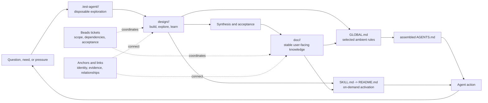

<a id="doc-constitution"></a>
# Self-Explaining Documentation Constitution

Documentation here is not inert output. It is the durable substrate through
which a workspace learns, explains itself, activates specialized behavior, and
preserves enough history to learn again.

The unit is a **self-explaining knowledge module**. A module keeps one canonical
body for humans and agents, may expose that body as an on-demand skill, and may
contribute a small operating fragment to global agent context. Questions and
evidence can mature through `design/` into stable `doc/` knowledge without
losing the argument that produced them. Tickets coordinate the work around the
knowledge. Semantic anchors and links give it durable addresses.

The compact promise is:

> **Edit locally. Assemble globally. Load selectively. Cite durably.
> Coordinate deliberately.**

<a id="doc-constitution-scope"></a>
## Scope And Normative Language

This constitution is the workspace default for new knowledge work. Existing
documents are grandfathered; adoption is prospective rather than a demand to
rewrite the corpus. A project MAY document a local deviation while preserving
the underlying contracts of honest identity, navigable evidence, and stable
references.

This constitution governs deliberate knowledge modules, not every temporary
Markdown file. Scratch notes, transcripts, generated reports, and small local
explanations need only acquire the machinery that their audience and lifetime
justify.

`MUST`, `MUST NOT`, `SHOULD`, `SHOULD NOT`, and `MAY` identify requirements,
recommendations, cautions, and permissions. A document's `status` remains
authoritative: this constitution is draft until the human torch-pass recorded
by `rekon-doc-constitution-torch` is complete.

<a id="doc-constitution-flow"></a>
# Knowledge Flow

The system joins memory, activation, and work coordination without making any
one representation do all three jobs.



Promotion is not mandatory or one-way. Stable knowledge may begin directly in
`doc/`; valuable inquiry may remain in `design/`; new evidence may send a stable
account back through design. The flow names changes in knowledge posture, not a
graduation ritual.

<a id="doc-constitution-principles"></a>
## Governing Principles

| Principle | Consequence |
|---|---|
| One body, several exposures | `README.md` is canonical; skill and global exposure do not create competing prose authorities. |
| Context is a budget | Ambient rules are short, frequent, and costly to miss; depth stays one skill load away. |
| Current truth and historical evidence both matter | Canonical READMEs stay coherent while exact drafts preserve how conclusions formed. |
| Durable identity outranks current layout | Semantic anchors survive heading text, numbering, and reasonable reorganization. |
| Tickets coordinate; documents explain | Work state and acceptance live in tickets; concepts, evidence, and durable guidance live in files. |
| Process is proportional | Strong research protocols are available without burdening every note or user guide. |
| Local differences stay local | Shared mechanics do not universalize one project's registry, dispatch plan, or directory exception. |

<a id="doc-constitution-module"></a>
# The Knowledge Module

A knowledge module is a domain-grouped directory with a deliberate landing
page. The full shape is:

```text
design/<topic>/ or doc/<topic>/
  README.md                 canonical body and landing page
  SKILL.md -> README.md     optional on-demand exposure
  GLOBAL.md                 optional ambient contribution
  log.md                    optional concise update history
  index.md                  optional artifact listing
  <supporting artifacts>    waves, evidence, experiments, guides, decisions
```

Only `README.md` is required for the directory to become a module. `SKILL.md`
and `GLOBAL.md` are capabilities a module earns when it has knowledge worth
delivering through those channels.

<a id="doc-constitution-module-readme"></a>
## `README.md`: Canonical Knowledge

`README.md` is the maintained answer to: what is this topic, what should a
reader understand or do now, and where does the detail live?

It MUST be the single current authority for the module. Supporting files may
own detailed evidence, one historical argument, examples, or specialized
procedures. The README links to those files rather than duplicating them.

A module README SHOULD carry trustworthy OKF-style frontmatter that states its
identity, scope, status, authorship or generation, and sources actually
consulted. It MUST NOT claim verification merely because its author reread it.

If the module is skill-exposed, the same frontmatter also serves skill routing:

- `name` identifies the skill;
- `description` says when to load it and what branches it serves;
- `status` makes unstable design knowledge visible;
- the body supplies the understanding and operating procedure.

The description is a routing surface, not a miniature copy of the document.

Canonical does not mean undifferentiated. The
[Diataxis reference](file:///home/rektide/archive/doc/diataxis.md) distinguishes
tutorial, how-to, reference, and explanation because each serves a different
reader need. A README SHOULD orient and route among those modes; when they need
different shapes, support documents should own them rather than letting one
landing page blur all four.

<a id="doc-constitution-skill"></a>
## `SKILL.md`: Exact On-Demand Exposure

When a module should be loadable as a skill, `SKILL.md` MUST be a relative
symlink to its canonical README:

```text
SKILL.md -> README.md
```

It is not a wrapper, summary, generated copy, or second editorial surface.
Humans arriving through repository navigation and agents arriving through
skill routing receive the same body. Progressive disclosure happens through
descriptive links to support documents, not by forking authority.

A skill-shaped directory still needs discovery or installation by the agent
system. The symlink states the knowledge contract; it does not by itself promise
that every harness scans every project directory.

<a id="doc-constitution-global"></a>
## `GLOBAL.md`: A Claim On Ambient Attention

`GLOBAL.md` is the concise fragment a module contributes to an assembled
`AGENTS.md`. It is a curated operational projection, not a README summary and
not a symlink.

Every global line imposes repeated context cost on agents that may never need
the topic. A fragment therefore SHOULD point to its README for rationale,
exceptions, examples, and maintenance. Verbatim overlap is allowed only when a
rule must stand alone before skill discovery; that small duplication remains
owned and reviewable beside its module.

An ambient contribution MUST remain traceable to its module. Assembly tooling
must preserve source identity and either preserve, rewrite, or reject links
whose meaning would change outside the source directory.

<a id="doc-constitution-module-support"></a>
## Supporting Artifacts

Support documents are first-class parts of the module. They may hold research,
longer write-ups, worked examples, fixtures, adversarial reviews, operational
tips, or skill-maintenance notes. Context pointers in the README should say
when and why to load them.

`index.md` is reserved for progressive-disclosure listings when the artifact
set becomes large. It does not displace the README as the conceptual entry
point. `log.md` is reserved for concise dated changes, newest first. Version
control remains the complete file history.

<a id="doc-constitution-lifecycle"></a>
# Design And Documentation

`design/` and `doc/` describe epistemic and audience posture, not quality.
Both are durable, citable, and capable of becoming skills.

| Location | Posture | Reader promise |
|---|---|---|
| `design/<topic>/` | Build, explore, learn, compare, falsify, and decide | The live argument, alternatives, evidence, and uncertainty are visible. |
| `doc/<topic>/` | Explain maintained current knowledge to users and implementers | This is the supported account to trust first; remaining uncertainty is explicit. |

<a id="doc-constitution-lifecycle-design"></a>
## Design Is The Learning Surface

A design module may begin with a README that frames the situation and open
questions. It may grow independent model drafts, experiments, adversarial
reviews, syntheses, decisions, and prototypes. Its README explains the current
state of the inquiry without pretending its supporting artifacts agree.

Design knowledge MAY be exposed as a skill when agents need the active method
or corpus on demand. Its frontmatter must state that it is draft. It MAY
contribute global context, but volatile knowledge faces a higher stability bar:
ambient context must not become a live transcript of an unsettled design.

<a id="doc-constitution-lifecycle-doc"></a>
## Documentation Is The Stable User Surface

A documentation module owns the maintained explanation a user or implementer
should trust first. It states scope, current contract or guidance, examples,
limits, and material relationships. Stable means supported and coherently
maintained, not final forever.

Changes integrate into the current account without erasing design provenance.
Old semantic anchors are never silently reassigned to unrelated meaning.

<a id="doc-constitution-lifecycle-promotion"></a>
## Promotion Is Synthesis, Not Movement

Promotion SHOULD:

1. Identify accepted claims, guidance, audience, and confidence boundaries.
2. Reconcile competing design artifacts rather than copying one by default.
3. Preserve unresolved questions honestly.
4. Establish durable anchors and explained cross-references.
5. Cite exact design evidence and leave it in place.
6. Update navigation in both directions when useful.
7. Decide skill exposure and global contribution separately.

The result is a new or updated `doc/<topic>/README.md`, not relocated evidence.
The stable document is a synthesis with a new knowledge contract.

<a id="doc-constitution-lifecycle-existing"></a>
## Prospective Adoption And Existing Files

Existing `doc/` and `design/` trees predate this distinction. Their location
does not retroactively certify stability or conformance. Apply the constitution
when creating a new module or materially reworking an old one; repair broken or
misleading identity deliberately, without churn for stylistic compliance.

For example, [`/doc/log2.md`](/doc/log2.md) says it replaces
[`/doc/log.md`](/doc/log.md), but no module landing page yet owns that current
tip. This is a migration candidate that illustrates the ambiguity; it is not a
reason to rewrite those documents as part of this constitution.

This repository also uses some top-level topic directories. That is a
rekon-specific composition choice to be documented by
`rekon-doc-constitution-rekon-skill`, not a general recommendation.

<a id="doc-constitution-references"></a>
# Durable Referentiability

The workspace should behave like a plain-Markdown wiki. A reader can cite a
section, follow its evidence, understand why another document links to it, and
return later without relying on one renderer's generated heading slug.

<a id="doc-constitution-references-anchors"></a>
## Semantic Anchors

Substantive sections in durable documents SHOULD use an explicit HTML anchor
immediately before the heading:

```markdown
<a id="example-recovery-policy"></a>
## Recovery Policy
```

An anchor ID SHOULD:

- use lowercase ASCII words, digits, and hyphens;
- describe durable meaning rather than display numbering;
- begin with the module's local root ID and refine it semantically;
- remain stable when heading text or nearby structure changes;
- have one semantic owner among the project's canonical tips.

Once cited outside its file, an anchor becomes a compatibility obligation. If
meaning moves, preserve an alias or a short replacement note at the old target.
Never silently reuse the ID for an unrelated concept.

Display coordinates such as `D4.2` are available for formal corpora, but they
are reading aids rather than identity. Coordinates may renumber; anchors do not.

<a id="doc-constitution-namespace"></a>
# The Shared Ticket And Anchor Namespace

Canonical anchors and beads ticket IDs share one project knowledge namespace.
This lets work reserve knowledge before it exists, lets a section grow into
tracked work without renaming, and removes a mapping table between intent and
explanation.

The project prefix is implicit in local document anchors:

| Form | Example |
|---|---|
| Registered project prefix | `rekon` |
| Local knowledge ID and anchor | `doc-constitution` |
| Qualified knowledge ID | `rekon-doc-constitution` |
| Corresponding beads ticket, when one exists | `rekon-doc-constitution` |
| Resolvable local target | `/doc/README.md#doc-constitution` |

The qualified form is mechanically:

```text
<registered-project-prefix>-<local-anchor>
```

Project prefixes can themselves contain hyphens, so tools must resolve them
against the registered beads prefix rather than split on the first hyphen.
Across projects, use the qualified ID in prose and pair it with a canonical
repository URL plus exact path and anchor. The ID names knowledge globally
within the workspace; the URL resolves it.

<a id="doc-constitution-namespace-induction"></a>
## Inductive Refinement

A child section appends semantic segments to an existing ticket or anchor:

```text
foo-bar                      ticket or root section
foo-bar-baz                  section elaborating baz within foo-bar
acme-foo-bar-baz             globally qualified knowledge ID
```

Thus `doc-constitution-global-assembly` elaborates
`rekon-doc-constitution-global` and ultimately the
`rekon-doc-constitution` epic. Find a section's likely tracking ancestor by
removing trailing segments until a ticket matches. The relationship is
inductive, not mandatory: intermediate headings and tickets need not exist.

Lexical ancestry improves legibility but does not create beads dependency
edges. Parent-child, blocking, superseding, and other operational relationships
must still be recorded in the ticket graph.

<a id="doc-constitution-namespace-ownership"></a>
## Ownership, Drafts, And Renames

At canonical tips, one qualified ID has one semantic owner. Independent wave
files may propose the same anchors while exploring the same topic; exact
file-plus-anchor citations distinguish them. Acceptance assigns canonical
ownership without pretending one independent author read another.

Ticket and anchor identity are related but not mechanically coupled forever.
If a ticket is renamed after its anchor becomes durable, preserve the old
anchor or alias and record the new ticket relation. Do not break knowledge links
merely to mirror work-tracker cleanup.

<a id="doc-constitution-namespace-forward"></a>
## Forward Anchors

A ticket MAY reserve an intended path and anchor before a document exists:

```text
Forward anchor: /doc/example/README.md#example-recovery
```

The ticket must label it as a forward reference and state acceptance criteria
that make the target real and useful. Do not create empty placeholder documents
only to eliminate a deliberate forward reference. Once written, the same name
becomes an ordinary durable reference.

<a id="doc-constitution-references-links"></a>
## Links Carry Relationships

Use standard Markdown links. Prefer bundle-root-relative links inside a
repository and canonical commit-pinned resources for published cross-project
evidence. Absolute `file://` links are acceptable for explicitly local WIP.

A useful cross-reference explains why its target matters. Helpful relationship
words include:

| Relationship | Meaning |
|---|---|
| inherits | Uses a contract without redefining it. |
| implements | Supplies a concrete realization. |
| consumes | Calls, queries, renders, or interprets it. |
| motivates | Explains why this mechanism or decision exists. |
| constrains | Correctness depends on its invariant. |
| contrasts | Intentionally differs in identity, lifetime, or semantics. |
| extends | Adds behavior or state. |
| evidences | Supplies source findings, tests, traces, or measurements. |

This vocabulary sharpens prose; it is not mandatory edge metadata. A truthful
absence of relationship is better than invented cohesion.

<a id="doc-constitution-references-evidence"></a>
## Evidence And Claim Maturity

Source references, knowledge references, and ticket references do different
work:

- sources ground claims in inspected evidence;
- knowledge links connect maintained arguments or contracts;
- tickets connect knowledge to work state, dependencies, and acceptance.

Where confusing maturity would alter a decision, distinguish **Observed**,
**Derived**, **Inference**, **Recommendation**, and **Hypothesis**. Not every
sentence needs a badge. Load-bearing claims need enough exact source identity
for another reader to reproduce the distinction.

Frontmatter is identity and orientation, not claim-level proof. Listing a
source says it was consulted; a ticket records intent and acceptance, not
implementation evidence.

<a id="doc-constitution-tickets"></a>
# Balanced Ticket Coordination

Tickets reveal work surface, dependencies, ownership, lifecycle, blockers, and
acceptance. Documents reveal concepts, evidence, rationale, examples,
contracts, and navigation. They reinforce one another without one-to-one
parity.

One ticket may update several sections. One section may support several
tickets. A document may have no ticket. A ticket may close without producing a
durable document. An anchor may exist before, after, or without a corresponding
ticket.

<a id="doc-constitution-tickets-criteria"></a>
## When Ticketing Helps

| Ticketing is useful when | Ticketing is usually noise when |
|---|---|
| Work spans sessions, agents, or review boundaries. | An edit is obvious, bounded, and immediately verifiable. |
| Dependencies or blockers affect sequence. | A subsection only makes an already-owned explanation readable. |
| Acceptance criteria distinguish done from drafted. | Every heading would receive a mirrored ticket. |
| A planned document needs a forward anchor. | A typo, link repair, or small clarification has no lifecycle. |
| Promotion changes a supported user-facing contract. | Stable reference material has no active work to coordinate. |
| Ownership, risk, or disagreement must outlive chat. | Ticket creation costs more interpretation than the change. |

The test is not "is this documentation?" It is "does explicit lifecycle
coordination make this work safer, more discoverable, or more finishable?"

When a ticket materially shapes a section, link them reciprocally when
practical. The ticket points to the durable path or forward anchor. The document
may name the ticket for history and acceptance context. A stable explanation
must not require the ticket database merely to make sense.

<a id="doc-constitution-context"></a>
# Ambient And On-Demand Context

The existence of a skill does not imply that its entire topic leaves global
context. The existence of a global quick reference does not justify copying the
whole skill into `AGENTS.md`. A module may serve both at appropriate depth.

<a id="doc-constitution-context-ambient"></a>
## The Ambient Cut

A rule earns global load when its expected cost of absence exceeds its repeated
context cost. It SHOULD pass three tests:

1. **Corruption:** missing it can damage work before an agent knows to load
   anything, such as overwriting an independent draft or losing model identity.
2. **Cheapness:** it is concise and actionable without registries or a long
   explanation.
3. **Universality:** it applies across many projects and ordinary sessions.

Frequency, consequence, workspace reach, size, and volatility inform those
tests. The ambient fragment tells an agent what to do at a decision point and
may point to deeper patterns. It does not teach the whole pattern.

<a id="doc-constitution-context-on-demand"></a>
## The On-Demand Body

On-demand knowledge is canonical depth, not secondary truth. A good README
starts with enough orientation for routing, then progressively discloses
method, examples, tradeoffs, validation, maintenance, and sources. Support docs
sit behind context pointers whose wording says when to read them.

The stable [`jj.md`](file:///home/rektide/archive/doc/jj.md) reference is a
concrete example: its command tables, verified absences, traps, and corrected
claims are extremely valuable when jj work activates them and wasteful on
unrelated sessions.

<a id="doc-constitution-global-assembly"></a>
## Assembled `AGENTS.md`

`AGENTS.md` is becoming deterministic build output from declared `GLOBAL.md`
fragments. Modules own and history their source fragments locally; the assembled
surface preserves the existing global symlink chain.

The assembler specified by `rekon-agents-maintenance-assembler` MUST:

- use explicit fragment identity and deterministic domain-grouped order;
- preserve source provenance in generated output;
- reject duplicate identities and unstable ordering;
- mark `AGENTS.md` as generated and detect unassembled hand edits;
- make per-fragment and total context cost visible;
- handle source-relative links without changing their targets;
- update declared output without silently pruning unrelated artifacts.

The exact manifest and metadata syntax belong to that implementation ticket.
Until it exists, `AGENTS.md` remains hand-maintained and `GLOBAL.md` fragments
can land beside it as declared future inputs.

The OpenCode notes expose both sides of this boundary. A proposed
[`!readme` hierarchy](file:///home/rektide/archive/doc/opencode/patches.md)
would make every README from project root to working directory ambient, which
improves discovery but can erase the context budget. The existing plugin model
offers [`skill` transforms and a session-context
hook](file:///home/rektide/archive/doc/opencode/plugins.md) as an extension point
for selective module discovery and activation.

<a id="doc-constitution-history"></a>
# History, Refinement, And Accepted Tips

The system preserves two useful truths at once:

- canonical READMEs are coherent mutable accounts of what to use now;
- exact evidence artifacts preserve what an author argued with the context
  available then.

Independent drafts, materially distinct proposals, and research waves use new
model-suffixed files. A wave file names the actual model, never the harness, and
one author does not overwrite another. Same-wave authors do not read peers when
independence is part of the evidence.

An addendum is useful when the evolution of one artifact's confidence matters.
It is not a requirement to make a stable README accumulate every correction at
the bottom. Accepted conclusions integrate into coherent canonical prose;
design files, source links, tickets, `log.md`, and version control preserve why
the account changed.

Design programs MAY expose a suffix-less accepted-tip symlink while exact
citations retain the model-suffixed file. In `doc/`, `README.md` is normally a
real distilled file with honest frontmatter, not a symlink to one draft.

Scratch is pre-history. Because `.test-agent/` is ignored, evidence that remains
load-bearing at acceptance must be absorbed into the canonical account or
promoted to a committed design location.

<a id="doc-constitution-patterns"></a>
# Available Opt-In Patterns

The cheap module contract is the default. Reach for stronger mechanics when
the problem earns them:

| Pattern | Use it when |
|---|---|
| Independent model-suffixed waves | Useful disagreement or independent coverage matters. |
| Same-wave isolation | Independence is evidence, not merely scheduling. |
| Adversarial and synthesis waves | Drafts must be challenged and reconciled rather than averaged. |
| Assignment manifests and wave seals | A parallel corpus needs reproducible input boundaries. |
| Dependency-gated dispatch | Higher-layer authors must inherit settled lower-layer contracts. |
| Display coordinates and prefix registries | A formal corpus benefits from compact reading coordinates in addition to anchors. |
| Claim-class tables | Fact, derivation, inference, recommendation, and hypothesis are easy to conflate. |
| Inherited/value-add/stop-boundary analysis | A document risks copying prerequisites or absorbing another module's scope. |
| Viability rubrics and comparison axes | Several alternatives need fair repeated evaluation. |
| Corpus validation and doc-pass | Repeated structure and cross-links justify mechanical checks and reciprocal navigation. |

Patterns are composable. None becomes universal ceremony merely because it was
effective in a large research program.

<a id="doc-constitution-evolution"></a>
# Constitutional Evolution

Repeated successful practice SHOULD become a rule; repeated friction SHOULD
trigger a rule or tool change. Significant contested amendments begin as new
model-suffixed work under `design/doc-constitution/`, receive independent or
adversarial review when useful, and integrate into this README after acceptance.

Changes apply prospectively unless correcting a broken reference, factual
error, or materially misleading instruction. Historical artifacts retain the
constitution they actually used. Durable anchors receive compatibility aliases
rather than silent reassignment.

The first constitution remains draft while `rekon-doc-constitution-torch` is
open. Review should resolve or explicitly preserve material tensions; model
agreement alone is not human acceptance.

<a id="doc-constitution-lineage"></a>
# Lineage And Cross-References

- [`is-tree` v1](file:///home/rektide/src/is-tree/.design/research/topic-document-constitution/topic-document-constitution.gpt56t.md)
  **establishes** the root document constitution: model identity, semantic
  anchors, doc-refs, evidence classes, independent work, and refinement.
- [`dolt-rs`](file:///home/rektide/src/dolt-rs/.design/research/constitution/constitution.gpt56t.md)
  **extends** the wiki model with dependency topology, relationship vocabulary,
  inherited/value-add/stop boundaries, agent packets, and mutable tips over
  immutable evidence.
- [`is-tree` v2](file:///home/rektide/src/is-tree/.design/research/topic-document-constitution/topic-document-constitution2.gpt56t.md)
  **reconciles** those lines and asks whether projects should converge on a
  shared constitution while retaining local dispatch rules. This document is
  the workspace-level answer.
- [`draft0.sol56m.md`](/design/doc-constitution/draft0.sol56m.md) **supplies**
  the balanced knowledge-flow architecture, single qualified namespace,
  proportional process, and promotion model.
- [`draft0.glm53m.md`](/design/doc-constitution/draft0.glm53m.md) **supplies**
  the manuscript-to-modules re-spin, ambient admission test, scratch-mortality
  warning, and concrete assembly pressure.
- [`syn0.gpt56t.md`](/design/doc-constitution/syn0.gpt56t.md) **records** the
  cross-comparison, selected choices, and tool questions deliberately deferred.
- [`AGENTS.md`](/AGENTS.md) **contains** the existing operational practice this
  module will progressively own through `GLOBAL.md` and future assembly.
- Beads epic `rekon-doc-constitution` **tracks** acceptance and demonstrates
  child IDs plus forward anchors without demanding ticket parity for prose.
- The [Diataxis reference](file:///home/rektide/archive/doc/diataxis.md)
  **constrains** canonical READMEs to orient and route distinct reader needs
  rather than collapse tutorials, how-to guides, reference, and explanation.
- [`compute-fabric/README.md`](file:///home/rektide/archive/doc/compute-fabric/README.md)
  **evidences** a canonical synthesis that keeps every model-suffixed source in
  its reading map and records reciprocal links for later doc passes.
- [`jj.md`](file:///home/rektide/archive/doc/jj.md) **evidences** how an
  on-demand stable reference can preserve agent provenance, live verification,
  corrected claims, and failure traps without loading globally.
- The retired OpenCode [`plugin.md`](file:///home/rektide/archive/doc/opencode/plugin.md)
  **demonstrates** a compatibility stub that preserves old links while assigning
  one canonical owner to the maintained content.
